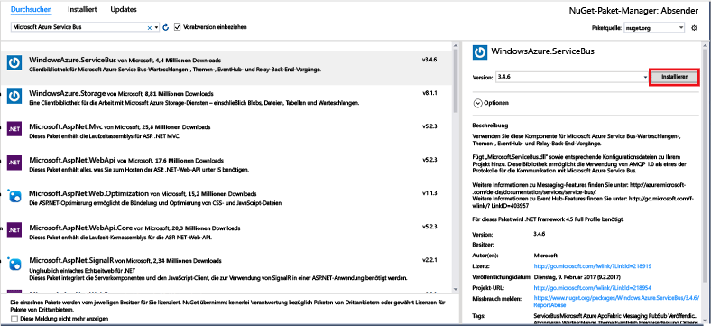

# <a name="send-events-to-azure-event-hubs-using-the-net-framework"></a>Senden von Ereignissen an Azure Event Hubs mithilfe von .NET Framework
Azure Event Hubs ist eine Big Data-Streamingplattform und ein Ereigniserfassungsdienst, der pro Sekunde Millionen von Ereignissen empfangen und verarbeiten kann. Event Hubs kann Ereignisse, Daten oder Telemetriedaten, die von verteilter Software und verteilten Geräten erzeugt wurden, verarbeiten und speichern. An einen Event Hub gesendete Daten können transformiert und mit einem beliebigen Echtzeitanalyse-Anbieter oder Batchverarbeitungs-/Speicheradapter gespeichert werden. Eine ausführliche Übersicht über Event Hubs finden Sie unter [Was ist Azure Event Hubs?](event-hubs-about.md) und unter [Event Hubs-Features im Überblick](event-hubs-features.md).

In diesem Tutorial erfahren Sie auch, wie Sie mithilfe von .NET Framework Ereignisse über eine in C# geschriebene Konsolenanwendung an einen Event Hub senden. 

## <a name="prerequisites"></a>Voraussetzungen
Zum Durchführen dieses Tutorials benötigen Sie Folgendes:

* [Microsoft Visual Studio 2017 oder höher](http://visualstudio.com)

## <a name="create-an-event-hubs-namespace-and-an-event-hub"></a>Erstellen eines Event Hubs-Namespace und eines Event Hubs
Verwenden Sie zunächst das [Azure-Portal](https://portal.azure.com), um einen Namespace vom Typ „Event Hubs“ zu erstellen, und beschaffen Sie die Verwaltungsanmeldeinformationen, die Ihre Anwendung für die Kommunikation mit dem Event Hub benötigt. Folgen Sie dem Ablauf in [diesem Artikel](event-hubs-create.md), um einen Namespace und einen Event Hub zu erstellen, und fahren Sie dann mit den folgenden Schritten in diesem Tutorial fort.

## <a name="create-a-console-application"></a>Erstellen einer Konsolenanwendung

Erstellen Sie in Visual Studio mithilfe der Projektvorlage **Konsolenanwendung** ein neues Visual C#-Desktopanwendungsprojekt. Geben Sie dem Projekt den Namen **Sender**.
   


## <a name="add-the-event-hubs-nuget-package"></a>Hinzufügen des Event Hubs-NuGet-Pakets

1. Klicken Sie im Projektmappen-Explorer mit der rechten Maustaste auf das **Sender**-Projekt, und klicken Sie dann auf **NuGet-Pakete für Projektmappe verwalten**. 
2. Klicken Sie auf die Registerkarte **Durchsuchen**, und suchen Sie nach `WindowsAzure.ServiceBus`. Klicken Sie auf **Installieren**, und akzeptieren Sie die Nutzungsbedingungen. 
   
    
   
    Visual Studio lädt das [NuGet-Paket mit der Azure Service Bus-Bibliothek](https://www.nuget.org/packages/WindowsAzure.ServiceBus)herunter, installiert es und fügt dem Projekt einen Verweis auf das Paket hinzu.

## <a name="write-code-to-send-messages-to-the-event-hub"></a>Schreiben von Code zum Senden von Nachrichten an den Event Hub

1. Fügen Sie am Anfang der Datei **Program.cs** die folgenden `using`-Anweisungen hinzu:
   
      ```csharp
      using System.Threading;
      using Microsoft.ServiceBus.Messaging;
      ```
2. Fügen Sie der **Program**-Klasse die folgenden Felder hinzu, und ersetzen Sie dabei die Platzhalterwerte durch den Namen des im vorigen Abschnitt erstellten Event Hubs und die zuvor gespeicherte Verbindungszeichenfolge auf Namespace-Ebene.
   
        ```csharp
        static string eventHubName = "Your Event Hub name";
        static string connectionString = "namespace connection string";
        ```
3. Fügen Sie der **Program** -Klasse die folgende Methode hinzu:
   
      ```csharp
      static void SendingRandomMessages()
      {
          var eventHubClient = EventHubClient.CreateFromConnectionString(connectionString, eventHubName);
          while (true)
          {
              try
              {
                  var message = Guid.NewGuid().ToString();
                  Console.WriteLine("{0} > Sending message: {1}", DateTime.Now, message);
                  eventHubClient.Send(new EventData(Encoding.UTF8.GetBytes(message)));
              }
              catch (Exception exception)
              {
                  Console.ForegroundColor = ConsoleColor.Red;
                  Console.WriteLine("{0} > Exception: {1}", DateTime.Now, exception.Message);
                  Console.ResetColor();
              }
       
              Thread.Sleep(200);
          }
      }
      ```
   
      Diese Methode sendet kontinuierlich Ereignisse mit einer Verzögerung von 200 ms an den Event Hub.
4. Fügen Sie abschließend der **Main**-Methode die folgenden Zeilen hinzu:
   
      ```csharp
      Console.WriteLine("Press Ctrl-C to stop the sender process");
      Console.WriteLine("Press Enter to start now");
      Console.ReadLine();
      SendingRandomMessages();
      ```
5. Führen Sie das Programm aus, und stellen Sie sicher, dass keine Fehler auftreten.
  
Glückwunsch! Sie haben jetzt Nachrichten an einen Event Hub gesendet.

## <a name="next-steps"></a>Nächste Schritte
In diesem Schnellstart haben Sie Nachrichten mithilfe von .NET Framework an einen Event Hub gesendet. Informationen dazu, wie Sie Ereignisse unter Verwendung von .NET Framework von einem Event Hub empfangen, finden Sie unter [Empfangen von Ereignissen von Event Hub – .NET Framework](event-hubs-dotnet-framework-getstarted-receive-eph.md).

<!-- Images. -->
[19]: ./media/event-hubs-csharp-ephcs-getstarted/create-eh-proj1.png
[20]: ./media/event-hubs-csharp-ephcs-getstarted/create-eh-proj2.png
[21]: ./media/event-hubs-csharp-ephcs-getstarted/run-csharp-ephcs1.png
[22]: ./media/event-hubs-csharp-ephcs-getstarted/run-csharp-ephcs2.png

