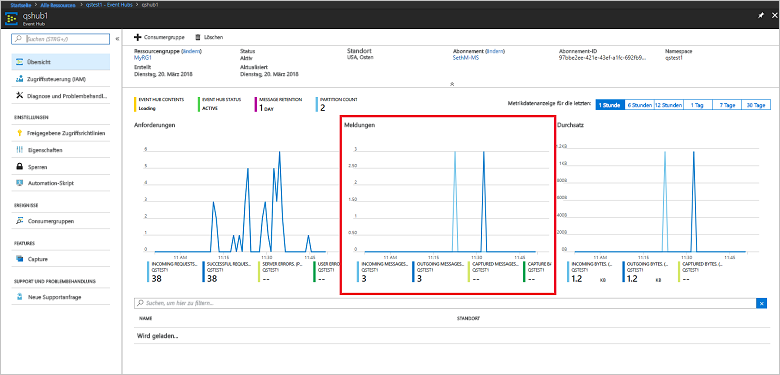

# <a name="quickstart-create-an-event-hub-using-azure-cli"></a>Schnellstart: Erstellen eines Event Hubs mithilfe der Azure CLI

Azure Event Hubs ist eine hochgradig skalierbare Datenstreamingplattform und ein Dienst zur Datenerfassung, der pro Sekunde Millionen von Ereignissen empfangen und verarbeiten kann. In dieser Schnellstartanleitung wird veranschaulicht, wie Sie Event Hubs-Ressourcen per Azure CLI erstellen und dann Ereignisdatenströme über einen Event Hub mit Java-Code senden und empfangen.

Für diese Schnellstartanleitung benötigen Sie ein Azure-Abonnement. Falls Sie kein Abonnement besitzen, können Sie ein [kostenloses Konto erstellen][], bevor Sie beginnen.

## <a name="prerequisites"></a>Voraussetzungen

[!INCLUDE [cloud-shell-try-it.md](../../includes/cloud-shell-try-it.md)]

Wenn Sie die Azure CLI lokal installieren und verwenden möchten, müssen Sie für dieses Tutorial Azure CLI-Version 2.0.4 oder höher ausführen. Führen Sie `az --version` aus, um Ihre Version zu überprüfen. Wenn Sie eine Installation oder ein Upgrade ausführen müssen, finden Sie unter [Installieren von Azure CLI 2.0]( /cli/azure/install-azure-cli) Informationen dazu.

## <a name="log-on-to-azure"></a>Anmelden an Azure

Die folgenden Schritte sind nicht erforderlich, wenn Sie Befehle in Cloud Shell ausführen. Bei lokaler Ausführung der CLI führen Sie die folgenden Schritte aus, um sich an Azure anzumelden und Ihr aktuelles Abonnement festzulegen:

Führen Sie den folgenden Befehl aus, um sich an Azure anzumelden:

```azurecli-interactive
az login
```

Legen Sie den aktuellen Abonnementkontext fest. Ersetzen Sie `MyAzureSub` durch den Namen des Azure-Abonnements, das Sie verwenden möchten:

```azurecli-interactive
az account set --subscription MyAzureSub
``` 

## <a name="provision-resources"></a>Bereitstellen von Ressourcen

Führen Sie die folgenden Befehle aus, um Event Hubs-Ressourcen bereitzustellen. Achten Sie darauf, dass Sie die Platzhalter `myResourceGroup`, `namespaceName`, `eventHubName` und `storageAccountName`durch die entsprechenden Werte ersetzen:

```azurecli-interactive
# Create a resource group
az group create --name myResourceGroup --location eastus

# Create an Event Hubs namespace
az eventhubs namespace create --name namespaceName --resource-group myResourceGroup -l eastus2

# Create an event hub
az eventhubs eventhub create --name eventHubName --resource-group myResourceGroup --namespace-name namespaceName

# Create a general purpose standard storage account
az storage account create --name storageAccountName --resource-group myResourceGroup --location eastus2 --sku Standard_RAGRS --encryption blob

# List the storage account access keys
az storage account keys list --resource-group myResourceGroup --account-name storageAccountName

# Get namespace connection string
az eventhubs namespace authorization-rule keys list --resource-group myResourceGroup --namespace-name namespaceName --name RootManageSharedAccessKey
```

Kopieren Sie die Verbindungszeichenfolge, und fügen Sie sie zur späteren Verwendung an einem temporären Speicherort ein, z.B. in Editor.

## <a name="stream-into-event-hubs"></a>Streamen an Event Hubs

Der nächste Schritt umfasst das Herunterladen des Beispielcodes, mit dem Ereignisse an einen Event Hub gestreamt werden. Diese Ereignisse werden dann über den Ereignisprozessorhost empfangen. Senden Sie zunächst die Nachrichten:

Klonen Sie das [GitHub-Repository „Event Hubs“](https://github.com/Azure/azure-event-hubs), indem Sie den folgenden Befehl ausführen:

```bash
git clone https://github.com/Azure/azure-event-hubs.git
```

Navigieren Sie zum Ordner **SimpleSend**: `\azure-event-hubs\samples\Java\Basic\SimpleSend\src\main\java\com\microsoft\azure\eventhubs\samples\SimpleSend`. Öffnen Sie die Datei „SimpleSend.java“, und ersetzen Sie die Zeichenfolge `"Your Event Hubs namaspace name"` durch den Event Hubs-Namespace, den Sie im Abschnitt „Erstellen eines Event Hubs-Namespace“ dieses Artikels abgerufen haben.

Ersetzen Sie `"Your event hub"` durch den Namen des Event Hubs, den Sie in diesem Namespace erstellt haben, und `"Your policy name"` durch den Namen der SAS-Richtlinie für den Namespace. Wenn Sie keine neue Richtlinie erstellt haben, wird standardmäßig **RootManageSharedAccessKey** verwendet. 

Ersetzen Sie abschließend `"Your primary SAS key"` durch den Wert des SAS-Schlüssels für die Richtlinie im vorherigen Schritt.

### <a name="build-the-application"></a>Erstellen der Anwendung 

Navigieren Sie zurück zum Ordner `\azure-event-hubs\samples\Java\Basic\SimpleSend`, und führen Sie den folgenden Buildbefehl aus:

```shell
mvn clean package -DskipTests
```

### <a name="receive"></a>Empfangen

Laden Sie nun das Ereignisprozessorhost-Beispiel herunter, mit dem die gerade gesendeten Nachrichten empfangen werden. Navigieren Sie zum Ordner **EventProcessorSample**: `\azure-event-hubs\samples\Java\Basic\EventProcessorSample\src\main\java\com\microsoft\azure\eventhubs\samples\eventprocessorsample`.

Ersetzen Sie in der Datei „EventProcessorSample.java“ den Wert `----EventHubsNamespaceName-----` durch den Event Hubs-Namespace, den Sie im Abschnitt „Erstellen eines Event Hubs-Namespace“ dieses Artikels abgerufen haben. 

Ersetzen Sie die anderen Zeichenfolgenwerte in dieser Datei: `----EventHubName-----` durch den Namen des Event Hubs, den Sie in diesem Namespace erstellt haben, und `-----SharedAccessSignatureKeyName-----` durch den Namen der SAS-Richtlinie für den Namespace. Wenn Sie keine neue Richtlinie erstellt haben, wird standardmäßig **RootManageSharedAccessKey** verwendet.

Ersetzen Sie `---SharedAccessSignatureKey----` durch den Wert des SAS-Schlüssels für die Richtlinie aus dem vorherigen Schritt, `----AzureStorageConnectionString----` durch die Verbindungszeichenfolge für das von Ihnen erstellte Speicherkonto und `----StorageContainerName----` durch den Namen des Containers unter dem von Ihnen erstellten Speicherkonto. 

Ersetzen Sie `----HostNamePrefix----` abschließend durch den Namen des Speicherkontos.

### <a name="build-the-receiver"></a>Erstellen des Empfängers 

Navigieren Sie zum Erstellen der empfangenden Anwendung zum Ordner `\azure-event-hubs\samples\Java\Basic\EventProcessorSample`, und führen Sie den folgenden Befehl aus:

```shell
mvn clean package -DskipTests
```

### <a name="run-the-apps"></a>Ausführen der Apps

Wenn die Buildvorgänge erfolgreich abgeschlossen wurden, können Sie Ereignisse senden und empfangen. Führen Sie zuerst die Anwendung **SimpleSend** aus, und verfolgen Sie, wie Ereignisse gesendet werden. Navigieren Sie zum Ausführen des Programms zum Ordner `\azure-event-hubs\samples\Java\Basic\SimpleSend`, und führen Sie den folgenden Befehl aus:

```shell
java -jar ./target/simplesend-1.0.0-jar-with-dependencies.jar
```

Führen Sie als Nächstes die App **EventProcessorSample** aus, und verfolgen Sie, wie die Ereignisse empfangen werden. Navigieren Sie zum Ausführen des Programms zum Ordner `\azure-event-hubs\samples\Java\Basic\EventProcessorSample`, und führen Sie den folgenden Befehl aus:
   
```shell
java -jar ./target/eventprocessorsample-1.0.0-jar-with-dependencies.jar
```

Nach der Ausführung beider Programme können Sie für den Event Hub auf der Übersichtsseite des Azure-Portals nachsehen, wie viele eingehende und ausgehende Nachrichten vorhanden sind:



## <a name="clean-up-resources"></a>Bereinigen von Ressourcen

Führen Sie den folgenden Befehl aus, um die Ressourcengruppe, den Namespace, das Speicherkonto und alle zugehörigen Ressourcen zu entfernen. Ersetzen Sie `myResourceGroup` durch die weiter oben erstellte Ressourcengruppe:

```azurecli
az group delete --resource-group myResourceGroup
```

## <a name="understand-the-sample-code"></a>Grundlagen des Beispielcodes

Dieser Abschnitt enthält weitere Details zur Funktionsweise des Beispielcodes.

### <a name="send"></a>Send

In der Datei „SimpleSend.java“ wird der größte Teil der Arbeit in der main()-Methode durchgeführt. Zuerst wird im Code eine `ConnectionStringBuilder`-Instanz verwendet, um die Verbindungszeichenfolge mit den benutzerdefinierten Werten für den Namespacenamen, Event Hub-Namen, SAS-Schlüsselnamen und den eigentlichen SAS-Schlüssel erstellt:

```java
final ConnectionStringBuilder connStr = new ConnectionStringBuilder()
        .setNamespaceName("Your Event Hubs namespace name")
        .setEventHubName("Your event hub")
        .setSasKeyName("Your policy name")
        .setSasKey("Your primary SAS key");
```

Das Java-Objekt, das die Ereignisnutzlast enthält, wird dann in JSON konvertiert:

```java
final Gson gson = new GsonBuilder().create();

final PayloadEvent payload = new PayloadEvent(1);
byte[] payloadBytes = gson.toJson(payload).getBytes(Charset.defaultCharset());
EventData sendEvent = EventData.create(payloadBytes);  
```

Der Event Hubs-Client wird in dieser Codezeile erstellt:

```java
final EventHubClient ehClient = EventHubClient.createSync(connStr.toString(), executorService);
```

Der try/finally-Block sendet ein Ereignis per Roundrobin-Vorgang an eine nicht angegebene Partition:

```java
try {
    for (int i = 0; i < 100; i++) {

        String payload = "Message " + Integer.toString(i);
        //PayloadEvent payload = new PayloadEvent(i);
        byte[] payloadBytes = gson.toJson(payload).getBytes(Charset.defaultCharset());
        EventData sendEvent = EventData.create(payloadBytes);

        // Send - not tied to any partition
        // Event Hubs service will round-robin the events across all EventHubs partitions.
        // This is the recommended & most reliable way to send to EventHubs.
        ehClient.sendSync(sendEvent);
    }

    System.out.println(Instant.now() + ": Send Complete...");
    System.in.read();
} finally {
    ehClient.closeSync();
    executorService.shutdown();
}
```

### <a name="receive"></a>Empfangen 

Der Empfangsvorgang erfolgt in der Datei „EventProcessorSample.java“. Zuerst werden Konstanten für den Event Hubs-Namespacenamen und andere Anmeldeinformationen deklariert:

```java
String consumerGroupName = "$Default";
String namespaceName = "----NamespaceName----";
String eventHubName = "----EventHubName----";
String sasKeyName = "----SharedAccessSignatureKeyName----";
String sasKey = "----SharedAccessSignatureKey----";
String storageConnectionString = "----AzureStorageConnectionString----";
String storageContainerName = "----StorageContainerName----";
String hostNamePrefix = "----HostNamePrefix----";
```

Ähnlich wie beim SimpleSend-Programm erstellt der Code dann eine ConnectionStringBuilder-Instanz zur Erstellung der Verbindungszeichenfolge:

```java
ConnectionStringBuilder eventHubConnectionString = new ConnectionStringBuilder()
    .setNamespaceName(namespaceName)
    .setEventHubName(eventHubName)
    .setSasKeyName(sasKeyName)
    .setSasKey(sasKey);
```

Der *Ereignisprozessorhost* ist eine Klasse, die das Empfangen von Ereignissen von Event Hubs durch die Verwaltung von permanenten Prüfpunkten und parallelen Empfangsvorgängen von diesen Event Hubs vereinfacht. Der Code erstellt jetzt eine Instanz von `EventProcessorHost`:

```java
EventProcessorHost host = new EventProcessorHost(
    EventProcessorHost.createHostName(hostNamePrefix),
    eventHubName,
    consumerGroupName,
    eventHubConnectionString.toString(),
    storageConnectionString,
    storageContainerName);
```

Nach dem Deklarieren eines Fehlerbehandlungscodes definiert die App dann die `EventProcessor`-Klasse, bei der es sich um eine Implementierung der `IEventProcessor`-Schnittstelle handelt. Diese Klasse verarbeitet der empfangenen Ereignisse:

```java
public static class EventProcessor implements IEventProcessor
{
    private int checkpointBatchingCount = 0;
    ...
```

Die `onEvents()`-Methode wird aufgerufen, wenn Ereignisse für diese Event Hub-Partition empfangen werden:

```java
@Override
public void onEvents(PartitionContext context, Iterable<EventData> events) throws Exception
{
    System.out.println("SAMPLE: Partition " + context.getPartitionId() + " got event batch");
    int eventCount = 0;
    for (EventData data : events)
    {
        try
        {
         System.out.println("SAMPLE (" + context.getPartitionId() + "," + data.getSystemProperties().getOffset() + "," +
                data.getSystemProperties().getSequenceNumber() + "): " + new String(data.getBytes(), "UTF8"));
             eventCount++;
                
         // Checkpointing persists the current position in the event stream for this partition and means that the next
         // time any host opens an event processor on this event hub+consumer group+partition combination, it will start
         // receiving at the event after this one. Checkpointing is usually not a fast operation, so there is a tradeoff
         // between checkpointing frequently (to minimize the number of events that will be reprocessed after a crash, or
         // if the partition lease is stolen) and checkpointing infrequently (to reduce the impact on event processing
         // performance). Checkpointing every five events is an arbitrary choice for this sample.
         this.checkpointBatchingCount++;
         if ((checkpointBatchingCount % 5) == 0)
         {
            System.out.println("SAMPLE: Partition " + context.getPartitionId() + " checkpointing at " +
                    data.getSystemProperties().getOffset() + "," + data.getSystemProperties().getSequenceNumber());
            // Checkpoints are created asynchronously. It is important to wait for the result of checkpointing
            // before exiting onEvents or before creating the next checkpoint, to detect errors and to ensure proper ordering.
            context.checkpoint(data).get();
         }
    }
        catch (Exception e)
        {
            System.out.println("Processing failed for an event: " + e.toString());
        }
    }
    System.out.println("SAMPLE: Partition " + context.getPartitionId() + " batch size was " + eventCount + " for host " + context.getOwner());
}
```

## <a name="next-steps"></a>Nächste Schritte

In diesem Artikel haben Sie den Event Hubs-Namespace und andere Ressourcen erstellt, die zum Senden und Empfangen von Ereignissen von Ihrem Event Hub erforderlich sind. Fahren Sie mit dem folgenden Tutorial fort, um weitere Informationen zu erhalten:

> [!div class="nextstepaction"]
> [Visualisieren von Datenanomalien in Event Hubs-Datenströmen](event-hubs-tutorial-visualize-anomalies.md)

[kostenloses Konto erstellen]: https://azure.microsoft.com/free/?ref=microsoft.com&utm_source=microsoft.com&utm_medium=docs&utm_campaign=visualstudio
[Install Azure CLI 2.0]: /cli/azure/install-azure-cli
[az group create]: /cli/azure/group#az-group-create
[fully qualified domain name]: https://wikipedia.org/wiki/Fully_qualified_domain_name
