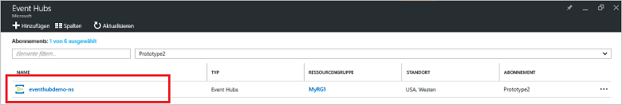
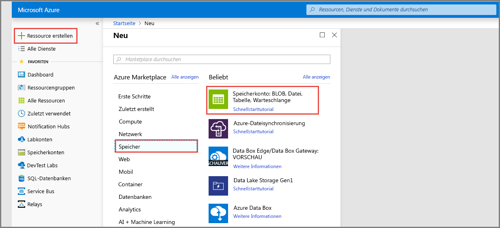
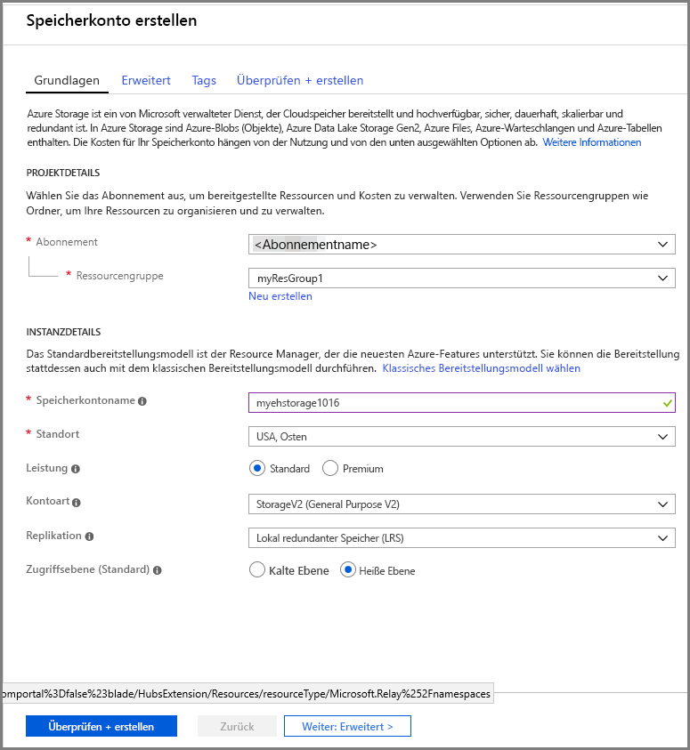
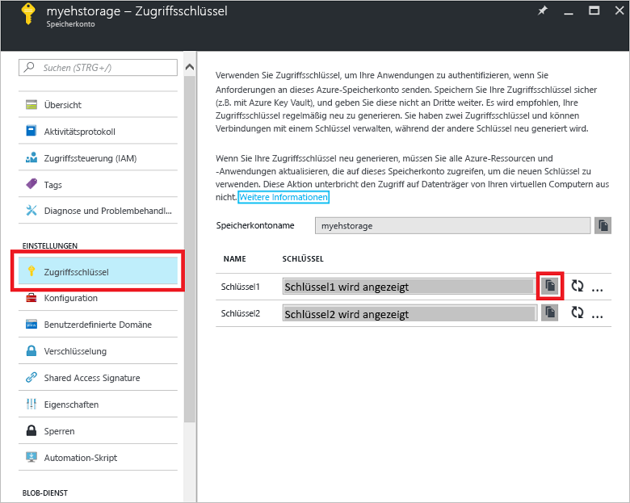

# Schnellstart: Erstellen eines Event Hubs mithilfe des Azure-Portals

Azure Event Hubs ist eine hochgradig skalierbare Datenstreamingplattform und ein Dienst zur Datenerfassung, der pro Sekunde Millionen von Ereignissen empfangen und verarbeiten kann. In dieser Schnellstartanleitung wird veranschaulicht, wie Sie einen Event Hub mit dem [Azure-Portal](https://portal.azure.com) erstellen und das Senden an bzw. Empfangen von einem Event Hub mit dem .NET Standard SDK durchführen.

Für diese Schnellstartanleitung benötigen Sie ein Azure-Abonnement. Falls Sie kein Abonnement besitzen, können Sie ein [kostenloses Konto erstellen][], bevor Sie beginnen.

## Voraussetzungen

Stellen Sie für diese Schnellstartanleitung sicher, dass Sie über Folgendes verfügen:

- [Visual Studio 2017 Update 3 (Version 15.3, 26730.01)](http://www.visualstudio.com/vs) oder höher
- [.NET Standard SDK](https://www.microsoft.com/net/download/windows), Version 2.0 oder höher.

## Erstellen einer Ressourcengruppe

Eine Ressourcengruppe ist eine logische Sammlung mit Azure-Ressourcen. Alle Ressourcen werden in einer Ressourcengruppe bereitgestellt und verwaltet. Gehen Sie wie folgt vor, um eine Ressourcengruppe zu erstellen:

1. Klicken Sie im linken Navigationsbereich auf **Ressourcengruppen**. Klicken Sie anschließend auf **Hinzufügen**.

   ![][1]

2. Geben Sie einen eindeutigen Namen für die Ressourcengruppe ein. Das System überprüft sofort, ob der Name im derzeit ausgewählten Azure-Abonnement verfügbar ist.

3. Klicken Sie unter **Abonnement** auf den Namen des Azure-Abonnements, in dem Sie die Ressourcengruppe erstellen möchten.

4. Wählen Sie einen geografischen Standort für die Ressourcengruppe aus.

5. Klicken Sie auf **Create**.

   ![][2]

## Erstellen eines Event Hubs-Namespace

Ein Event Hubs-Namespace stellt einen eindeutigen Bereichscontainer bereit, auf den über den vollqualifizierten Domänennamen verwiesen wird und in dem Sie mindestens einen Event Hub erstellen. Gehen Sie wie folgt vor, um mit dem Portal einen Namespace in Ihrer Ressourcengruppe zu erstellen:

1. Melden Sie sich am [Azure-Portal][] an, und klicken Sie oben links auf **Ressource erstellen**.

2. Klicken Sie auf **Internet der Dinge**, und klicken Sie dann auf **Event Hubs**.

3. Geben Sie unter **Namespace erstellen** einen Namen für den Namespace ein. Das System überprüft sofort, ob dieser Name verfügbar ist.

   

4. Ist der Name verfügbar, wählen Sie den Tarif („Basic“ oder „Standard“) aus. Wählen Sie außerdem ein Azure-Abonnement, eine Ressourcengruppe und einen Standort, an dem die Ressource erstellt werden soll.
 
5. Klicken Sie auf **Erstellen** , um den Namespace zu erstellen. Möglicherweise müssen Sie ein paar Minuten warten, bis das System die Ressourcen vollständig bereitgestellt hat.

6. Klicken Sie in der Portalliste mit den Namespaces auf den neu erstellten Namespace.

7. Klicken Sie auf **SAS-Richtlinien** und dann auf **RootManageSharedAccessKey**.
    
8. Klicken Sie auf die Kopierschaltfläche, um die Verbindungszeichenfolge **RootManageSharedAccessKey** in die Zwischenablage zu kopieren. Speichern Sie diese Verbindungszeichenfolge zur späteren Verwendung in einem temporären Speicherort, z.B. in Editor.
    
## Erstellen eines Ereignis-Hubs

Gehen Sie wie folgt vor, um im Namespace einen Event Hub zu erstellen:

1. Klicken Sie in der Liste der Event Hubs-Namespaces auf den neu erstellten Namespace.      
   
     

2. Klicken Sie im Namespacefenster auf **Event Hubs**.
   
    

1. Klicken Sie oben im Fenster auf **Event Hub hinzufügen**.
   
    
1. Geben Sie einen Namen für den Event Hub ein, und klicken Sie auf **Erstellen**.
   
    

Glückwunsch! Sie haben das Portal verwendet, um einen Event Hubs-Namespace und einen darin enthaltenen Event Hub zu erstellen.

## Erstellen eines Speicherkontos für den Ereignisprozessorhost

Der Ereignisprozessorhost ist ein intelligenter Agent, mit dem das Empfangen von Ereignissen von Event Hubs vereinfacht wird, indem permanente Prüfpunkte und parallele Empfangsvorgänge verwaltet werden. Für das Setzen von Prüfpunkten benötigt der Ereignisprozessorhost ein Speicherkonto. Im folgenden Beispiel wird veranschaulicht, wie Sie ein Speicherkonto erstellen und die zugehörigen Zugriffsschlüssel beziehen:

1. Melden Sie sich beim [Azure-Portal][Azure-Portal] an, und klicken Sie oben links auf dem Bildschirm auf **Neu**.

2. Klicken Sie auf **Storage** und anschließend auf **Speicherkonto**.
   
    

3. Geben Sie unter **Speicherkonto erstellen** einen Namen für das Speicherkonto ein. Wählen Sie ein Azure-Abonnement, eine Ressourcengruppe und einen Standort, an dem die Ressource erstellt werden soll. Klicken Sie dann auf **Erstellen**.
   
    

4. Klicken Sie in der Liste der Speicherkonten auf das neu erstellte Speicherkonto.

5. Klicken Sie im Speicherkontofenster auf **Zugriffsschlüssel**. Kopieren Sie den Wert von **key1** zur späteren Verwendung.
   
    

## Herunterladen und Ausführen der Beispiele

Der nächste Schritt umfasst das Ausführen des Beispielcodes, mit dem Ereignisse an einen Event Hub gesendet werden. Diese Ereignisse werden dann über den Ereignisprozessorhost empfangen. 

Laden Sie zuerst die Beispiele [SampleSender](https://github.com/Azure/azure-event-hubs/tree/master/samples/DotNet/Microsoft.Azure.EventHubs/SampleSender) und [SampleEphReceiver](https://github.com/Azure/azure-event-hubs/tree/master/samples/DotNet/Microsoft.Azure.EventHubs/SampleEphReceiver) von GitHub herunter, oder klonen Sie das [Repository „azure-event-hubs“](https://github.com/Azure/azure-event-hubs).

### Sender

1. Öffnen Sie Visual Studio, und klicken Sie dann im Menü **Datei** auf **Öffnen** und anschließend auf **Projekt/Projektmappe**.

2. Suchen Sie nach dem Beispielordner **SampleSender**, den Sie weiter oben heruntergeladen haben, und doppelklicken Sie auf die Datei „SampleSender.sln“, um das Projekt in Visual Studio zu laden.

3. Doppelklicken Sie im Projektmappen-Explorer auf die Datei „Program.cs“, um sie im Visual Studio-Editor zu öffnen.

4. Ersetzen Sie den Wert `EventHubConnectionString` durch die Verbindungszeichenfolge, die Sie beim Erstellen des Namespace erhalten haben.

5. Ersetzen Sie `EventHubName` durch den Namen des Event Hub, den Sie in diesem Namespace erstellt haben.

6. Klicken Sie im Menü **Build** auf **Projektmappe erstellen**, um sicherzustellen, dass keine Fehler vorhanden sind.

### Receiver

1. Öffnen Sie Visual Studio, und klicken Sie dann im Menü **Datei** auf **Öffnen** und anschließend auf **Projekt/Projektmappe**.

2. Suchen Sie nach dem Beispielordner **SampleEphReceiver**, den Sie in Schritt 1 heruntergeladen haben, und doppelklicken Sie dann auf die Datei „SampleEphReceiver.sln“, um das Projekt in Visual Studio zu laden.

3. Doppelklicken Sie im Projektmappen-Explorer auf die Datei „Program.cs“, um sie im Visual Studio-Editor zu öffnen.

4. Ersetzen Sie die folgenden Variablenwerte:
    1. `EventHubConnectionString`: Ersetzen Sie diesen Wert durch die Verbindungszeichenfolge, die Sie beim Erstellen des Namespace erhalten haben.
    2. `EventHubName`: Ersetzen Sie diesen Wert durch den Namen des Event Hub, den Sie in diesem Namespace erstellt haben.
    3. `StorageContainerName`: Der Name des Speichercontainers. Geben Sie ihm einen eindeutigen Namen. Der Container wird für Sie erstellt, wenn Sie die App ausführen.
    4. `StorageAccountName`: Der Name des von Ihnen erstellten Speicherkontos.
    5. `StorageAccountKey`: Der Speicherkontoschlüssel, den Sie über das Azure-Portal abgerufen haben.

5. Klicken Sie im Menü **Build** auf **Projektmappe erstellen**, um sicherzustellen, dass keine Fehler vorhanden sind.

### Ausführen der Apps

Führen Sie zuerst die Anwendung **SampleSender** aus, und verfolgen Sie, wie 100 Nachrichten gesendet werden. Drücken Sie die **EINGABETASTE**, um das Programm zu beenden.

![][3]

Führen Sie anschließend die App **SampleEphReceiver** aus, und verfolgen Sie, wie im Ereignisprozessorhost Nachrichten empfangen werden.

![][4]
 
## Bereinigen von Ressourcen

Sie können das Portal verwenden, um das Speicherkonto, den Namespace und den Event Hub zu entfernen. 

1. Klicken Sie im Azure-Portal im linken Bereich auf **Alle Ressourcen**. 
2. Klicken Sie auf das Speicherkonto oder den Namespace, das bzw. den Sie löschen möchten. Beim Löschen des Namespace werden auch alle darin enthaltenen Event Hubs entfernt.
3. Klicken Sie in der Menüleiste oben auf dem Bildschirm auf **Löschen**. Bestätigen Sie den Löschvorgang. 

## Nächste Schritte

In diesem Artikel haben Sie den Event Hubs-Namespace und andere Ressourcen erstellt, die zum Senden und Empfangen von Ereignissen von Ihrem Event Hub erforderlich sind. Fahren Sie mit dem folgenden Tutorial fort, um weitere Informationen zu erhalten:

> [!div class="nextstepaction"]
> [Visualisieren von Datenanomalien in Event Hubs-Datenströmen](event-hubs-tutorial-visualize-anomalies.md)

[kostenloses Konto erstellen]: https://azure.microsoft.com/free/?ref=microsoft.com&utm_source=microsoft.com&utm_medium=docs&utm_campaign=visualstudio
[Azure-Portal]: https://portal.azure.com/
[1]: ./media/event-hubs-quickstart-portal/resource-groups1.png
[2]: ./media/event-hubs-quickstart-portal/resource-groups2.png
[3]: ./media/event-hubs-quickstart-portal/sender1.png
[4]: ./media/event-hubs-quickstart-portal/receiver1.png
