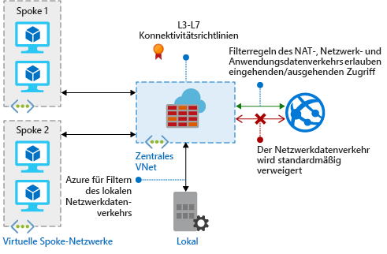

# Was ist Azure Firewall?

Azure Firewall ist ein verwalteter, cloudbasierter Netzwerksicherheitsdienst, der Ihre Azure Virtual Network-Ressourcen schützt. Es ist eine vollständig zustandsbehaftete Firewall als ein Dienst mit integrierter Hochverfügbarkeit und uneingeschränkter Cloudskalierbarkeit. 

[!INCLUDE [firewall-preview-notice](../../includes/firewall-preview-notice.md)]

Sie können Richtlinien zur Anwendungs- und Netzwerkkonnektivität übergreifend für Abonnements und virtuelle Netzwerke zentral erstellen, erzwingen und protokollieren. Azure Firewall verwendet eine statische öffentliche IP-Adresse für Ihre virtuellen Netzwerkressourcen, die es außenstehenden Firewalls ermöglicht, Datenverkehr aus Ihrem virtuellen Netzwerk zu identifizieren.  Der Dienst ist für Protokollierung und Analyse vollständig in Azure Monitor integriert.

## Features

Die Public Preview von Azure Firewall bietet die folgenden Features:

### Integrierte Hochverfügbarkeit
Hochverfügbarkeit ist integriert, sodass keine zusätzlichen Lastenausgleichsmodule erforderlich sind und Sie nichts konfigurieren müssen.

### Uneingeschränkte Cloudskalierbarkeit 
Azure Firewall kann entsprechend Ihren Anforderungen zentral hochskaliert werden, um einem sich ändernden Netzwerkdatenverkehr zu entsprechen, sodass Sie nicht für Ihre Spitzenlasten budgetieren müssen.

### FQDN-Filterung 
Sie können den ausgehenden HTTP/S-Datenverkehr auf eine angegebene Liste vollständig qualifizierter Domänennamen (FQDN) einschließlich Platzhalter beschränken. Diese Funktion erfordert keine SSL-Beendigung.

### Filterregeln für den Netzwerkdatenverkehr

Sie können Netzwerkfilterregeln zum *Zulassen* oder *Verweigern* nach Quell- und Ziel-IP-Adresse, Port und Protokoll zentral erstellen. Azure Firewall ist vollständig zustandsbehaftet, sodass zwischen legitimen Paketen für verschiedene Arten von Verbindungen unterschieden werden kann. Regeln werden übergreifend für mehrere Abonnements und virtuelle Netzwerke erzwungen und protokolliert.

### SNAT-Unterstützung für ausgehenden Datenverkehr

Alle IP-Adressen für ausgehenden Datenverkehr des virtuellen Netzwerks werden in die öffentliche IP-Adresse der Azure Firewall übersetzt (Source Network Address Translation). Sie können Datenverkehr aus Ihrem virtuellen Netzwerk an Remoteziele im Internet identifizieren und zulassen.

### Azure Monitor-Protokollierung

Alle Ereignisse sind in Azure Monitor integriert, sodass Sie Protokolle in einem Speicherkonto archivieren sowie Ereignisse an Ihren Event Hub streamen oder an Log Analytics senden können.

## Bekannte Probleme

Die Public Preview von Azure Firewall weist die folgenden bekannten Probleme auf:

|Problem  |Beschreibung  |Lösung  |
|---------|---------|---------|
|Interoperabilität mit NSGs     |Wenn eine Netzwerksicherheitsgruppe (NSG) für das Firewall-Subnetz angewendet wird, blockiert diese möglicherweise ausgehende Internetverbindungen, selbst wenn die NSG für ausgehenden Internetzugriff konfiguriert ist. Ausgehende Internetverbindungen sind so gekennzeichnet, dass sie aus einem VirtualNetwork stammen und das Ziel das Internet ist. Für eine NSG ist VirtualNetwork standardmäßig auf *zulassen* gesetzt, jedoch nicht, wenn das Ziel das Internet ist.|Zur Problembehebung fügen Sie die folgende eingehende Regel zu der NSG hinzu, die auf das Firewall-Subnetz angewendet wird:  Quelle: VirtualNetwork-Quellports: Alle   Ziel: Alle Zielports: Alle   Protokoll: Vollzugriff: Zulassen|
|Konflikt mit Just-in-Time (JIT)-Funktion von Azure Security Center (ASC)|Wenn auf einen virtuellen Computer mithilfe von JIT zugegriffen wird und sich dieser in einem Subnetz mit einer benutzerdefinierten Route befindet, die auf Azure Firewall als ein Standardgateway verweist, funktioniert ASC JIT nicht. Dies ist eine Folge des asymmetrischen Routings: Ein Paket trifft über die öffentliche IP-Adresse des virtuellen Computers ein (JIT hat den Zugriff geöffnet), aber der Rückgabepfad verläuft über die Firewall, die das Paket verwirft, da keine Sitzung in der Firewall erstellt wird.|Um dieses Problem zu umgehen, platzieren Sie die virtuellen JIT-Computer in einem separaten Subnetz, das keine benutzerdefinierte Route zur Firewall aufweist.|
|Hub und Spoke mit globalem Peering funktioniert nicht|Das Hub- und Spoke-Modell, bei dem Hub und Firewall in einer Azure-Region bereitgestellt werden und die Spokes in einer anderen Azure-Region, die mit dem Hub über globales VNet-Peering verbunden ist, wird nicht unterstützt.|Weitere Informationen finden Sie unter [Erstellen, Ändern oder Löschen eines Peerings virtueller Netzwerke](https://docs.microsoft.com/en-us/azure/virtual-network/virtual-network-manage-peering#requirements-and-constraints).|
Netzwerkfilterregeln für andere Protokolle als TCP/UDP (z.B. ICMP) funktionieren nicht für den Internetdatenverkehr|Netzwerkfilterregeln für andere Protokolle als TCP/UDP funktionieren nicht mit SNAT für Ihre öffentliche IP-Adresse. Nicht-TCP/UDP-Protokolle werden zwischen Spoke-Subnetzen und VNets unterstützt.|Azure Firewall verwendet Standard Load Balancer, [das SNAT für IP-Protokolle derzeit nicht unterstützt](https://docs.microsoft.com/en-us/azure/load-balancer/load-balancer-standard-overview#limitations). Wir prüfen Möglichkeiten, um dieses Szenario in einer zukünftigen Version zu unterstützen.

## Nächste Schritte

- [Tutorial: Bereitstellen und Konfigurieren von Azure Firewall über das Azure-Portal](tutorial-firewall-deploy-portal.md)
- [Bereitstellen von Azure Firewall mit einer Vorlage](deploy-template.md)
- [Erstellen einer Azure Firewall-Testumgebung](scripts/sample-create-firewall-test.md)

