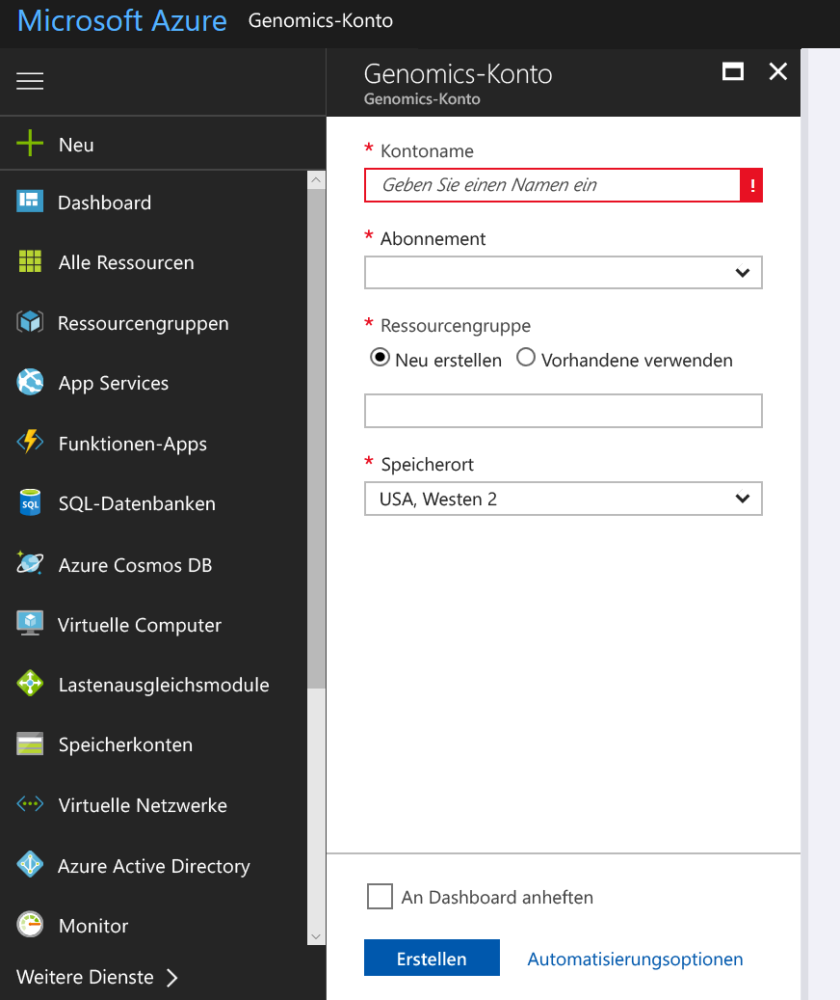
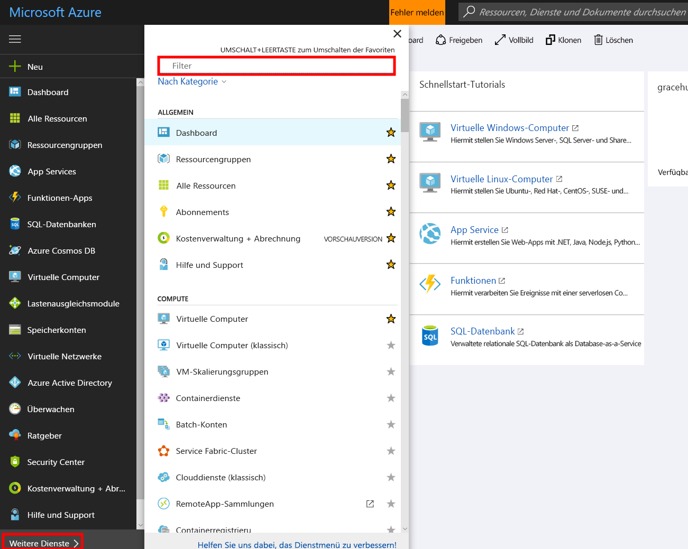
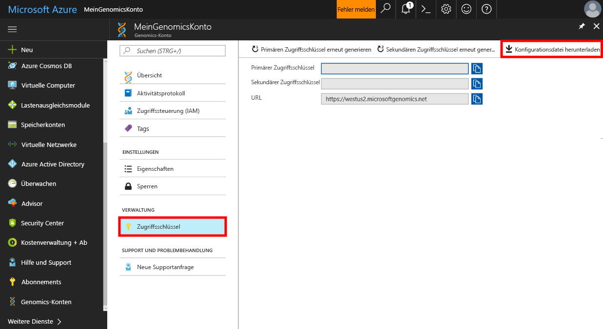

# <a name="quickstart-run-a-workflow-through-the-microsoft-genomics-service"></a>Schnellstartanleitung: Ausführen eines Workflows über den Microsoft Genomics-Dienst

Microsoft Genomics ist ein skalierbarer, sicherer Sekundäranalysedienst für die schnelle Verarbeitung eines Genoms – von unaufbereiteten Abschnitten zu aufbereiteten Abschnitten und Variantendetektierung. Der Einstieg ist ganz einfach: 
1.  Einrichten: Erstellen Sie über das Azure-Portal ein Microsoft Genomics-Konto, und installieren Sie den Microsoft Genomics-Python-Client in Ihrer lokalen Umgebung. 
2.  Hochladen von Eingabedaten: Erstellen Sie über das Azure-Portal ein Microsoft Azure-Speicherkonto, und laden Sie die Eingabedateien hoch. Bei den Eingabedateien muss es sich um Abschnitte mit gepaarten Enden handeln (FASTQ- oder BAM-Dateien).
3.  Ausführen: Verwenden Sie die Befehlszeilenschnittstelle von Microsoft Genomics, um Workflows über den Microsoft Genomics-Dienst auszuführen. 

Weitere Informationen zu Microsoft Genomics finden Sie unter [Was ist Microsoft Genomics?](overview-what-is-genomics.md)

## <a name="set-up-create-a-microsoft-genomics-account-in-the-azure-portal"></a>Einrichten: Erstellen eines Microsoft Genomics-Kontos über das Azure-Portal

Navigieren Sie zum Erstellen eines Microsoft Genomics-Kontos zum [Azure-Portal](https://portal.azure.com/#create/Microsoft.Genomics). Sollten Sie noch nicht über ein Azure-Abonnement verfügen, erstellen Sie zunächst ein Azure-Abonnement und anschließend ein Microsoft Genomics-Kontos. 




Konfigurieren Sie Ihr Genomics-Konto mit den folgenden Informationen, wie in der obigen Abbildung zu sehen: 

 |**Einstellung**          |  **Empfohlener Wert**  | **Feldbeschreibung** |
 |:-------------       |:-------------         |:----------            |
 |Kontoname         | MyGenomicsAccount     |Wählen Sie einen eindeutigen Kontobezeichner. Informationen zu gültigen Namen finden Sie unter [Benennungskonventionen](https://docs.microsoft.com/azure/architecture/best-practices/naming-conventions). |
 |Abonnement         | Ihr Abonnementname|Hierbei handelt es sich um die Abrechnungseinheit für Ihre Azure-Dienste. Ausführliche Informationen zu Ihrem Abonnement finden Sie unter [Abonnements](https://account.azure.com/Subscriptions). |      
 |Ressourcengruppe       | MyResourceGroup       |  Mit Ressourcengruppen können Sie mehrere Azure-Ressourcen (Speicherkonto, Genomics-Konto usw.) zur einfacheren Verwaltung in einer einzelnen Gruppe zusammenfassen. Weitere Informationen finden Sie unter [Ressourcengruppen] (https://docs.microsoft.com/azure/azure-resource-manager/resource-group-overview#resource-groups). Informationen zu gültigen Ressourcengruppennamen finden Sie unter [Benennungskonventionen](https://docs.microsoft.com/azure/architecture/best-practices/naming-conventions). |
 |Speicherort                   | USA, Westen 2                    |    Der Dienst steht an den Standorten „USA, Westen 2“, „Europa, Westen“ und „Asien, Südosten“ zur Verfügung. |


Sie können auf der oberen Menüleiste auf „Benachrichtigungen“ klicken, um den Bereitstellungsprozess zu überwachen.


## <a name="set-up-install-the-microsoft-genomics-python-client"></a>Einrichten: Installieren des Microsoft Genomics-Python-Clients

Benutzer müssen in ihrer lokalen Umgebung sowohl Python als auch den Microsoft Genomics-Python-Client installieren. 

### <a name="install-python"></a>Installieren von Python

Der Microsoft Genomics-Python-Client ist mit Python 2.7 kompatibel. Wir empfehlen, mindestens die Version 2.7.12 zu verwenden (empfohlene Version: 2.7.14). Den Download finden Sie [hier](https://www.python.org/downloads/). 


### <a name="install-the-microsoft-genomics-client"></a>Installieren des Microsoft Genomics-Clients

Verwenden Sie „pip“ von Python, um den Microsoft Genomics-Client (`msgen`) zu installieren. Bei den folgenden Schritten wird vorausgesetzt, dass sich Python bereits in Ihrem Systempfad befindet. Sollte „pip install“ nicht erkannt werden, müssen Sie Python und den Unterordner „scripts“ Ihrem Systempfad hinzufügen.


```
pip install --upgrade --no-deps msgen
pip install msgen
```


Falls Sie `msgen` nicht als systemweite Binärdatei installieren und keine systemweiten Python-Pakete ändern möchten, verwenden Sie `pip` mit dem Flag `–-user`.
Wenn Sie die paketbasierte Installation oder „setup.py“ verwenden, werden alle erforderlichen Pakete installiert. Andernfalls werden folgende grundlegende Pakete für „msgen“ benötigt: 

 * [Azure-storage](https://pypi.python.org/pypi/azure-storage) 
 * [Requests](https://pypi.python.org/pypi/requests) 


Diese Pakete können Sie mithilfe von `pip` oder `easy_install` oder mithilfe von `setup.py`-Standardverfahren installieren. 


### <a name="test-the-microsoft-genomics-client"></a>Testen des Microsoft Genomics-Clients
Laden Sie zum Testen des Microsoft Genomics-Clients die Konfigurationsdatei aus Ihrem Genomics-Konto herunter. Navigieren Sie zu Ihrem Genomics-Konto. Klicken Sie hierzu links unten auf **Weitere Dienste**, und filtern Sie nach Genomics-Konten.





Wählen Sie das kurz zuvor erstellte Genomics-Konto aus, navigieren Sie zu **Zugriffsschlüssel**, und laden Sie die Konfigurationsdatei herunter.




Vergewissern Sie sich mithilfe des folgenden Befehls, dass der Microsoft Genomics-Python-Client funktioniert:


```
msgen list -f “<full path where you saved the config file>”
```

## <a name="create-a-microsoft-azure-storage-account"></a>Erstellen eines Microsoft Azure-Speicherkontos 
Der Microsoft Genomics-Dienst erwartet, dass Eingaben als Blockblobs in einem Azure-Speicherkonto gespeichert werden. Außerdem schreibt er Ausgabedateien als Blockblobs in einen benutzerdefinierten Container in einem Azure-Speicherkonto. Die Eingaben und Ausgaben können sich in unterschiedlichen Speicherkonten befinden.
Wenn sich Ihre Daten bereits in einem Azure-Speicherkonto befinden, müssen Sie sich nur vergewissern, dass es sich am gleichen Standort befindet wie Ihr Genomics-Konto. Andernfalls fallen beim Ausführen des Genomics-Diensts Gebühren für ausgehenden Datenverkehr an. Sollten Sie noch nicht über ein Microsoft Azure Storage-Konto verfügen, müssen Sie eines erstellen und Ihre Daten hochladen. Weitere Informationen zu Azure-Speicherkonten finden Sie [hier](https://docs.microsoft.com/azure/storage/common/storage-create-storage-account). Dort erfahren Sie unter anderem, was ein Speicherkonto ist und was es bietet. Navigieren Sie zum Erstellen eines Microsoft Azure Storage-Kontos zum [Azure-Portal](https://portal.azure.com/#create/Microsoft.StorageAccount-ARM ).  


Konfigurieren Sie Ihr Speicherkonto mit den folgenden Informationen, wie in der obigen Abbildung zu sehen. Geben Sie an, dass es sich um ein Blob Storage-Konto handelt (nicht um ein universelles Konto), und behalten Sie ansonsten die Standardoptionen bei. Blob Storage kann bei Downloads und Uploads zwei- bis fünfmal schneller sein. 


 |**Einstellung**          |  **Empfohlener Wert**  | **Feldbeschreibung** |
 |:-------------------------       |:-------------         |:----------            |
 |NAME         | MyStorageAccount     |Wählen Sie einen eindeutigen Kontobezeichner. Informationen zu gültigen Namen finden Sie unter [Benennungskonventionen](https://docs.microsoft.com/azure/architecture/best-practices/naming-conventions). |
 |Bereitstellungsmodell         | Ressourcen-Manager| „Resource Manager“ ist das empfohlene Bereitstellungsmodell. Weitere Informationen finden Sie unter [Azure Resource Manager-Bereitstellung im Vergleich zur klassischen Bereitstellung: Grundlegendes zu Bereitstellungsmodellen und zum Status von Ressourcen](https://docs.microsoft.com/azure/azure-resource-manager/resource-manager-deployment-model). |      
 |Kontoart       | Blob Storage       |  Im Vergleich zu einem universellen Konto kann Blob Storage bei Downloads und Uploads zwei- bis fünfmal schneller sein. |
 |Leistung                  | Standard                   | Die Standardeinstellung ist „Standard“. Ausführlichere Informationen zu Standard- und Premium-Speicherkonten finden Sie unter [Einführung in Microsoft Azure Storage](https://docs.microsoft.com/azure/storage/common/storage-introduction).    |
 |Replikation                  | Lokal redundanter Speicher                  | Lokal redundanter Speicher repliziert Ihre Daten innerhalb des Datencenters in der Region, in der Sie Ihr Speicherkonto erstellt haben. Weitere Informationen finden Sie unter [Azure Storage-Replikation](https://docs.microsoft.com/azure/storage/common/storage-redundancy).    |
 |Sichere Übertragung erforderlich                  | Deaktiviert                 | Der Standardwert ist deaktiviert. Weitere Informationen zur Sicherheit bei der Datenübertragung finden Sie unter [Vorschreiben einer sicheren Übertragung in Azure Storage](https://docs.microsoft.com/azure/storage/common/storage-require-secure-transfer).    |
 |Zugriffsebene                  | Heiß                   | Heißer Zugriff bedeutet, dass auf Objekte im Speicherkonto häufiger zugegriffen wird.    |
 |Abonnement         | Ihr Azure-Abonnement |Ausführliche Informationen zu Ihrem Abonnement finden Sie unter [Abonnements](https://account.azure.com/Subscriptions). |      
 |Ressourcengruppe       | MyResourceGroup       |  Sie können die gleiche Ressourcengruppe auswählen wie bei Ihrem Genomics-Konto. Informationen zu gültigen Ressourcengruppennamen finden Sie unter [Benennungskonventionen](https://docs.microsoft.com/azure/architecture/best-practices/naming-conventions). |
 |Speicherort                  | USA, Westen 2                  | Verwenden Sie den gleichen Standort wie bei Ihrem Genomics-Konto, um die Gebühren für ausgehenden Datenverkehr und die Wartezeit zu verringern. Der Genomics-Dienst steht an den Standorten „USA, Westen“, „USA, Westen 2“, „Europa, Westen“ und „Asien, Südosten“ zur Verfügung.    |
 |Virtuelle Netzwerke                | Deaktiviert                   | Der Standardwert ist deaktiviert. Weitere Informationen finden Sie unter [Konfigurieren von Firewalls und virtuellen Netzwerken in Azure Storage (Vorschau)](https://docs.microsoft.com/azure/storage/common/storage-network-security).    |


Klicken Sie anschließend auf „Erstellen“, um Ihr Speicherkonto zu erstellen. Genau wie bei der Erstellung Ihres Genomics-Kontos können Sie auch hier auf der oberen Menüleiste auf „Benachrichtigungen“ klicken, um den Bereitstellungsprozess zu überwachen. 


## <a name="upload-input-data-to-your-storage-account"></a>Hochladen von Eingabedaten in Ihr Speicherkonto

Der Microsoft Genomics-Dienst erwartet Abschnitte mit gepaarten Enden als Eingabedateien. Sie können entweder eigene Daten hochladen oder mit öffentlich verfügbaren Beispieldaten experimentieren. Die öffentlich verfügbaren Beispieldaten finden Sie hier:


[https://msgensampledata.blob.core.windows.net/small/chr21_1.fq.gz](https://msgensampledata.blob.core.windows.net/small/chr21_1.fq.gz)
[https://msgensampledata.blob.core.windows.net/small/chr21_2.fq.gz](https://msgensampledata.blob.core.windows.net/small/chr21_2.fq.gz)


In Ihrem Speicherkonto müssen Sie einen Blobcontainer für Ihre Eingabedaten und einen zweiten Blobcontainer für Ihre Ausgabedaten erstellen.  Laden Sie die Eingabedaten in den entsprechenden Blobcontainer hoch. Hierzu können Sie verschiedene Tools verwenden – beispielsweise [Microsoft Azure Storage-Explorer](https://azure.microsoft.com/features/storage-explorer/), [blobporter](https://github.com/Azure/blobporter) oder [AzCopy](https://docs.microsoft.com/azure/storage/common/storage-use-azcopy?toc=%2fazure%2fstorage%2fblobs%2ftoc.json). 


## <a name="run-a-workflow-through-the-microsoft-genomics-service-using-the-python-client"></a>Ausführen eines Workflows über den Microsoft Genomics-Dienst unter Verwendung des Python-Clients 

Wenn Sie einen Workflow über den Microsoft Genomics-Dienst ausführen möchten, geben Sie in der Datei „config.txt“ den Eingabe- und den Ausgabespeichercontainer für Ihre Daten an.
Öffnen Sie die Datei „config.txt“, die Sie aus Ihrem Genomics-Konto heruntergeladen haben. Geben Sie Ihren Abonnementschlüssel und die sechs Elemente am Ende (jeweils Speicherkontoname, Schlüssel und Containername für die Ein- und Ausgabe) an. Diese Informationen können Sie im Portal unter **Zugriffsschlüssel** für Ihr Speicherkonto oder direkt aus über den Azure Storage-Explorer ermitteln.  


### <a name="submit-your-workflow-to-the-microsoft-genomics-service-the-microsoft-genomics-client"></a>Übermitteln des Workflows an den Microsoft-Genomics-Dienst unter Verwendung des Microsoft Genomics-Clients

Verwenden Sie den folgenden Befehl, um Ihren Workflow über den Microsoft Genomics-Python-Client zu übermitteln:


```python
msgen submit -f [full path to your config file] -b1 [name of your first paired end read] -b2 [name of your second paired end read]
```


Den Status Ihres Workflows können Sie mithilfe des folgenden Befehls anzeigen: 
```python
msgen list -f c:\temp\config.txt 
```


Nach Abschluss des Workflows können Sie die Ausgabedateien im konfigurierten Ausgabecontainer Ihres Azure-Speicherkontos anzeigen. 


## <a name="next-steps"></a>Nächste Schritte
In diesem Artikel haben Sie Beispieleingabedaten in Azure Storage hochgeladen und einen Workflow über den `msgen`-Python-Client an den Microsoft Genomics-Dienst übermittelt. Weitere Informationen zu anderen Eingabedateitypen für den Microsoft Genomics-Dienst finden Sie auf den folgenden Seiten: [FASTQ-Dateipaar](quickstart-input-pair-FASTQ.md) | [BAM-Datei](quickstart-input-BAM.md) | [Mehrere FASTQ- oder BAM-Dateien](quickstart-input-multiple.md) 