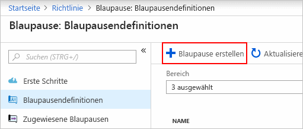
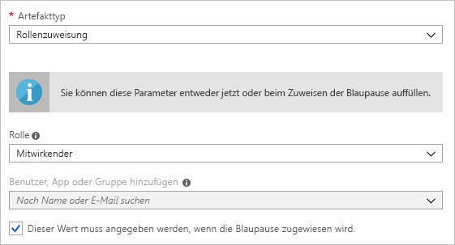
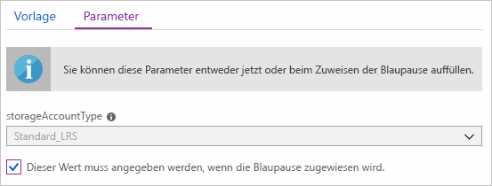
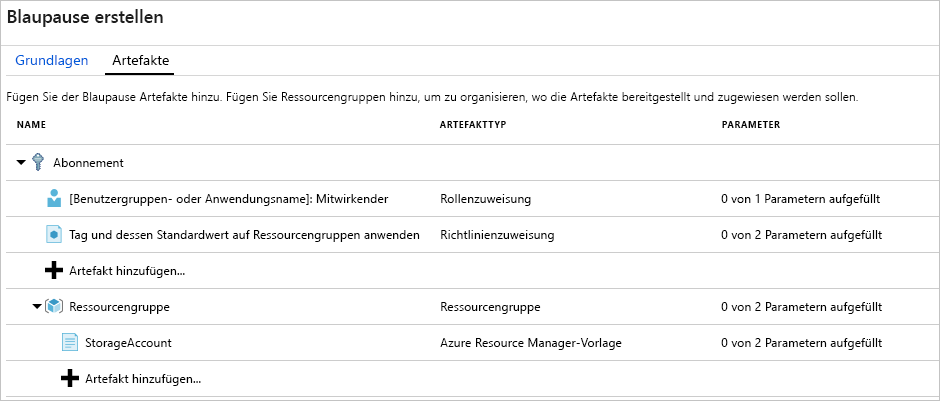
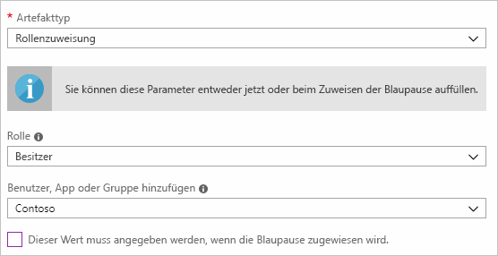
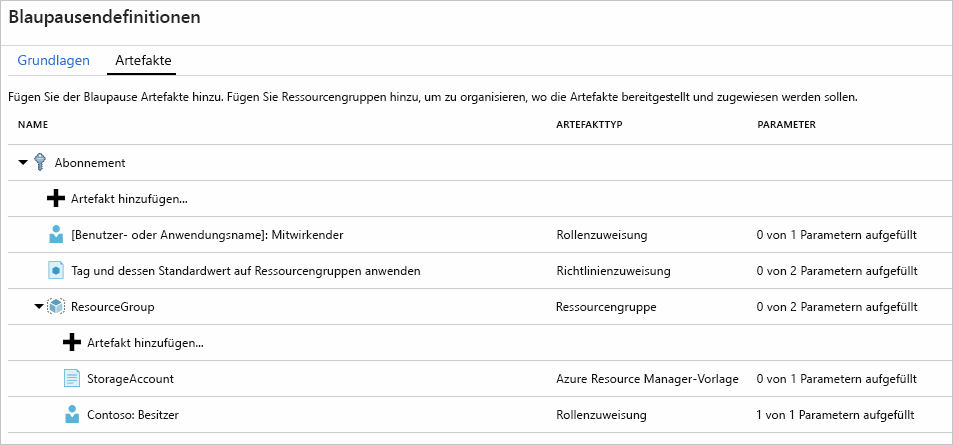
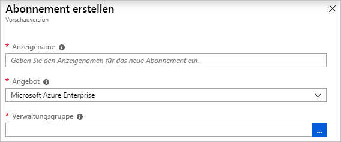
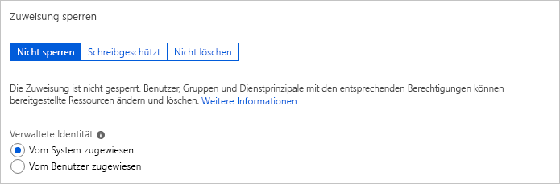
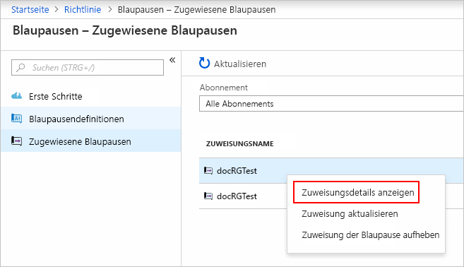

# <a name="quickstart-define-and-assign-a-blueprint-in-the-portal"></a>Schnellstart: Definieren und Zuweisen einer Blaupause im Portal

Wenn Sie sich mit der Erstellung und Zuweisung von Blaupausen vertraut machen, können Sie allgemeine Muster definieren, um wiederverwendbare und schnell bereitstellbare Konfigurationen zu entwickeln, die auf Azure Resource Manager-Vorlagen, Richtlinien, Sicherheit usw. basieren. In diesem Tutorial erfahren Sie, wie Sie mithilfe von Azure Blueprints einige allgemeine Aufgaben im Zusammenhang mit der organisationsweiten Erstellung, Veröffentlichung und Zuweisung einer Blaupause durchführen. Zu diesen Aufgaben zählen:

> [!div class="checklist"]
> - Erstellen einer neuen Blaupause und Hinzufügen verschiedener unterstützter Artefakte
> - Ändern einer vorhandenen Blaupause, die sich noch im **Entwurf** befindet
> - Markieren einer Blaupause als bereit für die Zuweisung mit **Veröffentlicht**
> - Zuweisen einer Blaupause zu einem vorhandenen Abonnement
> - Überprüfen von Status und Fortschritt einer zugewiesenen Blaupause
> - Entfernen einer Blaupause, die einem Abonnement zugewiesen wurde

Wenn Sie kein Azure-Abonnement besitzen, können Sie ein [kostenloses Konto](https://azure.microsoft.com/free) erstellen, bevor Sie beginnen.

## <a name="create-a-blueprint"></a>Erstellen einer Blaupause

Im ersten Schritt beim Definieren eines Standardmusters für die Konformität wird eine Blaupause aus den verfügbaren Ressourcen erstellt. In diesem Beispiel erstellen Sie eine neue Blaupause mit dem Namen **MyBlueprint**, um Rollen- und Richtlinienzuweisungen für das Abonnement zu konfigurieren. Anschließend fügen Sie eine neue Ressourcengruppe hinzu und erstellen eine Resource Manager-Vorlage und eine Rollenzuweisung für die neue Ressourcengruppe.

1. Wählen Sie **Alle Dienste** im linken Bereich aus. Suchen Sie nach **Blaupausen**, und wählen Sie die Option aus.

1. Wählen Sie auf der linken Seite die Option**Blaupausendefinitionen** und dann am oberen Rand der Seite die Schaltfläche **+ Blaupause erstellen**.

   Sie können auch auf der Seite **Erste Schritte** die Option**Erstellen** wählen, um direkt mit dem Erstellen einer Blaupause fortzufahren.

   

1. Geben Sie einen **Namen der Blaupause** an, z. B. **MyBlueprint**. (Sie können maximal 48 Buchstaben und Zahlen verwenden, aber keine Leerzeichen oder Sonderzeichen.) Lassen Sie das Feld **Blaupausenbeschreibung** vorerst leer.

1. Wählen Sie im Feld **Speicherort der Definition** die Auslassungspunkte auf der rechten Seite und dann die [Verwaltungsgruppe](../management-groups/overview.md) oder das Abonnement aus, in der bzw. dem Sie die Blaupause speichern möchten. Wählen Sie anschließend die Option **Auswählen**.

1. Vergewissern Sie sich, dass die Informationen korrekt sind. Die Felder **Name der Blaupause** und **Speicherort der Definition** können später geändert werden. Wählen Sie anschließend **Weiter: Artefakte** oder oben auf der Seite auf die Registerkarte **Artefakte**.

1. Fügen Sie eine Rollenzuweisung auf der Abonnementebene hinzu:

   1. Wählen Sie unter **Abonnement** die Zeile **+ Artefakt hinzufügen** aus. Auf der rechten Seite des Browsers wird das Fenster **Artefakt hinzufügen** geöffnet.

   1. Wählen Sie unter **Artefakttyp** die Option **Rollenzuweisung**.

   1. Wählen Sie unter **Rolle** die Option **Mitwirkender**. Behalten Sie für das Feld **Benutzer, App oder Gruppe hinzufügen** das Kontrollkästchen bei, mit dem ein dynamischer Parameter angegeben wird.

   1. Wählen Sie **Hinzufügen**, um der Blaupause dieses Artefakt hinzuzufügen.

   

   > [!NOTE]
   > Die meisten Artefakte unterstützen Parameter. Ein Parameter, dem während der Erstellung der Blaupause ein Wert zugewiesen wird, ist ein *statischer Parameter*. Wenn der Parameter während der Blaupausenzuweisung zugewiesen wird, ist er ein *dynamischer Parameter*. Weitere Informationen finden Sie unter [Blaupausenparameter](./concepts/parameters.md).

1. Fügen Sie eine Richtlinienzuweisung auf der Abonnementebene hinzu:

   1. Wählen Sie unterhalb des Artefakts für die Rollenzuweisung die Zeile **+ Artefakt hinzufügen** aus.

   1. Wählen Sie **Richtlinienzuweisung** als **Artefakttyp** aus.

   1. Ändern Sie **Typ** in **Integriert**. Geben Sie unter **Suche** den Suchbegriff **tag** ein.

   1. Klicken Sie von **Suche** aus, damit die Filterung ausgeführt wird. Wählen Sie **Tag und dessen Standardwert auf Ressourcengruppen anwenden**.

   1. Wählen Sie **Hinzufügen**, um der Blaupause dieses Artefakt hinzuzufügen.

1. Wählen Sie die Zeile der Richtlinienzuweisung **Tag und dessen Standardwert auf Ressourcengruppen anwenden** aus.

1. Das Fenster zum Bereitstellen von Parametern für das Artefakt als Teil der Blaupausendefinition wird geöffnet und ermöglicht das Festlegen der Parameter für alle Zuweisungen (statische Parameter) basierend auf dieser Blaupause (anstatt während der Zuweisung (dynamische Parameter)). In diesem Beispiel werden bei der Blaupausenzuweisung dynamische Parameter verwendet. Behalten Sie daher die Standardwerte bei, und wählen Sie **Abbrechen**.

1. Fügen Sie eine Ressourcengruppe auf der Abonnementebene hinzu:

   1. Wählen Sie unter **Abonnement** die Zeile **+ Artefakt hinzufügen** aus.

   1. Wählen Sie unter **Artefakttyp** die Option **Ressourcengruppe**.

   1. Lassen Sie die Felder **Anzeigename für Artefakt**, **Ressourcengruppenname** und **Speicherort** leer, aber stellen Sie sicher, dass die Kontrollkästchen aller Eigenschaften aktiviert sind, um sie zu dynamischen Parametern zu machen.

   1. Wählen Sie **Hinzufügen**, um der Blaupause dieses Artefakt hinzuzufügen.

1. Fügen Sie unter der Ressourcengruppe eine Vorlage hinzu:

   1. Wählen Sie unter dem Eintrag **Ressourcengruppe** die Zeile **+ Artefakt hinzufügen** aus.

   1. Wählen Sie unter **Artefakttyp** die Option **Azure Resource Manager-Vorlage**, legen Sie für **Anzeigename für Artefakt** die Option **StorageAccount** fest, und lassen Sie **Beschreibung** leer.

   1. Fügen Sie auf der Registerkarte **Vorlage** im Editorfeld die folgende Resource Manager-Vorlage ein.
      Wählen Sie nach dem Einfügen der Vorlage die Registerkarte **Parameter**. Sie sehen, dass die Vorlagenparameter **storageAccountType** und **location** erkannt wurden. Jeder Parameter wurde automatisch erkannt und aufgefüllt, aber als dynamischer Parameter konfiguriert.

      > [!IMPORTANT]
      > Falls Sie die Vorlage importieren möchten, sollten Sie sicherstellen, dass die Datei nur JSON-Code und keinen HTML-Code enthält. Stellen Sie beim Verweisen auf eine URL in GitHub sicher, dass Sie **RAW** ausgewählt haben, um die reine JSON-Datei und nicht die mit HTML umschlossene Datei für die Anzeige auf GitHub zu erhalten. Wenn die importierte Vorlage kein reiner JSON-Code ist, tritt ein Fehler auf.

      ```json
      {
          "$schema": "https://schema.management.azure.com/schemas/2015-01-01/deploymentTemplate.json#",
          "contentVersion": "1.0.0.0",
          "parameters": {
              "storageAccountType": {
                  "type": "string",
                  "defaultValue": "Standard_LRS",
                  "allowedValues": [
                      "Standard_LRS",
                      "Standard_GRS",
                      "Standard_ZRS",
                      "Premium_LRS"
                  ],
                  "metadata": {
                      "description": "Storage Account type"
                  }
              },
              "location": {
                  "type": "string",
                  "defaultValue": "[resourceGroup().location]",
                  "metadata": {
                      "description": "Location for all resources."
                  }
              }
          },
          "variables": {
              "storageAccountName": "[concat('store', uniquestring(resourceGroup().id))]"
          },
          "resources": [{
              "type": "Microsoft.Storage/storageAccounts",
              "name": "[variables('storageAccountName')]",
              "location": "[parameters('location')]",
              "apiVersion": "2018-07-01",
              "sku": {
                  "name": "[parameters('storageAccountType')]"
              },
              "kind": "StorageV2",
              "properties": {}
          }],
          "outputs": {
              "storageAccountName": {
                  "type": "string",
                  "value": "[variables('storageAccountName')]"
              }
          }
      }
      ```

   1. Deaktivieren Sie das Kontrollkästchen **storageAccountType**, und beachten Sie, dass die Dropdownliste nur Werte enthält, die in der Resource Manager-Vorlage unter **allowedValues** enthalten sind. Aktivieren Sie das Kästchen, um es wieder auf einen dynamischen Parameter zurückzusetzen.

   1. Wählen Sie **Hinzufügen**, um der Blaupause dieses Artefakt hinzuzufügen.

   

1. Ihre abgeschlossene Blaupause sollte wie folgt aussehen. Beachten Sie, dass jedes Artefakt in der Spalte **Parameter** die Angabe **_x_ von _y_ Parametern aufgefüllt** enthält. Die dynamischen Parameter werden jeweils beim Zuweisen der Blaupause festgelegt.

   

1. Alle geplanten Artefakte wurden hinzugefügt. Wählen Sie am unteren Rand der Seite die Option **Entwurf speichern**.

## <a name="edit-a-blueprint"></a>Bearbeiten einer Blaupause

Unter [Erstellen einer Blaupause](#create-a-blueprint) haben Sie keine Beschreibung angegeben und der neuen Ressourcengruppe keine Rollenzuweisung hinzugefügt. Sie können beides nachholen, indem Sie diese Schritte ausführen:

1. Wählen Sie auf der Seite links die Option **Blaupausendefinitionen**.

1. Klicken Sie in der Liste mit den Blaupausen mit der rechten Maustaste auf Ihren zuvor erstellten Eintrag, und wählen Sie **Blaupause bearbeiten**.

1. Geben Sie in der **Blaupausenbeschreibung** einige Informationen über die Blaupause und die Artefakte an, aus denen sie besteht. Geben Sie in diesem Fall etwa Folgendes ein: **Diese Blaupause legt die Richtlinien- und Rollenzuweisung für das Abonnement fest, erstellt eine Ressourcengruppe und stellt eine Ressourcenvorlage und Rollenzuweisung für diese Ressourcengruppe bereit.**

1. Wählen Sie **Weiter: Artefakte** oder oben auf der Seite auf die Registerkarte **Artefakte**.

1. Fügen Sie eine Rollenzuweisung unter der Ressourcengruppe hinzu:

   1. Wählen Sie direkt unter dem Eintrag **Ressourcengruppe** die Zeile **+ Artefakt hinzufügen** aus.

   1. Wählen Sie unter **Artefakttyp** die Option **Rollenzuweisung**.

   1. Wählen Sie unter **Rolle** die Option **Besitzer**, und deaktivieren Sie das Kontrollkästchen unterhalb des Felds **Benutzer, App oder Gruppe hinzufügen**.

   1. Suchen Sie nach einem Benutzer, einer App oder einer Gruppe, und wählen Sie den Eintrag aus, der hinzugefügt werden soll. Dieses Artefakt verwendet einen statischen Parameter, der in jeder Zuordnung dieser Blaupause auf den gleichen Wert festgelegt wird.

   e. Wählen Sie **Hinzufügen**, um der Blaupause dieses Artefakt hinzuzufügen.

   

1. Ihre abgeschlossene Blaupause sollte wie folgt aussehen. Beachten Sie, dass für die neu hinzugefügte Rollenzuweisung **1 von 1 Parametern aufgefüllt** angezeigt wird. Dies bedeutet, dass es sich um einen statischen Parameter handelt.

   

1. Wählen Sie **Entwurf speichern**, da nun die Aktualisierung durchgeführt wurde.

## <a name="publish-a-blueprint"></a>Veröffentlichen einer Blaupause

Nach dem Hinzufügen der geplanten Artefakte kann die Blaupause veröffentlicht werden.
Durch die Veröffentlichung kann die Blaupause einem Abonnement zugewiesen werden.

1. Wählen Sie auf der Seite links die Option **Blaupausendefinitionen**.

1. Klicken Sie in der Liste mit den Blaupausen mit der rechten Maustaste auf Ihren zuvor erstellten Eintrag, und wählen Sie **Blaupause veröffentlichen**.

1. Geben Sie im Bereich, der geöffnet wird, eine **Version** ein (Buchstaben, Zahlen und Bindestriche und eine maximale Länge von 20 Zeichen), z. B. **v1**. Geben Sie unter **Änderungshinweise** optional Text ein, z. B. **Erste Veröffentlichung**.

1. Wählen Sie unten auf der Seite die Option **Veröffentlichen**.

## <a name="assign-a-blueprint"></a>Zuweisen einer Blaupause

Nach dem Veröffentlichen einer Blaupause kann sie einem Abonnement zugewiesen werden. Weisen Sie die von Ihnen erstellte Blaupause einem der Abonnements unter Ihrer Verwaltungsgruppenhierarchie zu. Wenn die Blaupause in einem Abonnement gespeichert wird, kann sie nur diesem Abonnement zugewiesen werden.

1. Wählen Sie auf der Seite links die Option **Blaupausendefinitionen**.

1. Klicken Sie in der Liste mit den Blaupausen mit der rechten Maustaste auf Ihren zuvor erstellten Eintrag (oder wählen Sie die Auslassungspunkte), und wählen Sie **Blaupause zuweisen**.

1. Wählen Sie auf der Seite **Blaupause zuweisen** in der Dropdownliste **Abonnement** die Abonnements aus, für die Sie diese Blaupause bereitstellen möchten.

   Falls unterstützte Enterprise-Angebote der [Azure-Abrechnungsverwaltung](../../billing/index.md) vorhanden sind, wird unter dem Feld **Abonnement** der Link **Neu erstellen** aktiviert. Folgen Sie diesen Schritten:

   1. Wählen Sie den Link **Neu erstellen**, um ein neues Abonnement zu erstellen (anstatt ein vorhandenes auszuwählen).

   1. Geben Sie einen **Anzeigenamen** für das neue Abonnement an.

   1. Wählen Sie in der Dropdownliste das verfügbare **Angebot** aus.

   1. Verwenden Sie die Auslassungspunkte zum Auswählen der [Verwaltungsgruppe](../management-groups/index.md), der das Abonnement untergeordnet werden soll.

   1. Wählen Sie am unteren Rand der Seite die Option **Erstellen**.

   

   > [!IMPORTANT]
   > Das neue Abonnement wird sofort erstellt, nachdem Sie **Erstellen** gewählt haben.

   > [!NOTE]
   > Eine Zuweisung wird für jedes Abonnement erstellt, das Sie ausgewählt haben. Sie können zu einem späteren Zeitpunkt Änderungen an einer einzelnen Abonnementzuweisung vornehmen, ohne dass Änderungen für die restlichen ausgewählten Abonnements erzwungen werden.

1. Geben Sie für **Zuweisungsname** einen eindeutigen Namen an.

1. Wählen Sie unter **Standort** eine Region aus, in der die verwaltete Identität und das Abonnementbereitstellungsobjekt erstellt werden sollen. Azure Blueprint verwendet diese verwaltete Identität zum Bereitstellen aller Artefakte in der zugewiesenen Blaupause. Weitere Informationen finden Sie unter [What is managed identities for Azure resources?](../../active-directory/managed-identities-azure-resources/overview.md) (Worum handelt es sich bei verwalteten Identitäten für Azure-Ressourcen?).

1. Behalten Sie in der Dropdownliste **Version der Blaupausendefinition** die Auswahl von **Veröffentlicht** für den Eintrag **v1** bei. (Der Standardwert ist die zuletzt veröffentlichte Version.)

1. Behalten Sie für **Zuweisung der Sperre** den Standardwert **Nicht sperren** bei. Weitere Informationen finden Sie unter [Grundlegendes zur Ressourcensperre in Azure Blueprint](./concepts/resource-locking.md).

   

1. Behalten Sie unter **Verwaltete Identität** die Standardeinstellung **Vom System zugewiesen** bei.

1. Suchen Sie für die Rollenzuweisung auf Abonnementebene **[Benutzergruppen- oder Anwendungsname]: Mitwirkender** nach einem Benutzer, einer App oder einer Gruppe, und wählen Sie diese(n) aus.

1. Legen Sie für die Richtlinienzuweisung auf Abonnementebene die Option **Tagname** auf **CostCenter** und **Tagwert** auf **ContosoIT** fest.

1. Geben Sie für **ResourceGroup** unter **Name** den Namen **StorageAccount** und unter **Standort** den Standort **USA, Osten 2** aus der Dropdownliste ein.

   > [!NOTE]
   > Jedes Artefakt, das Sie während der Blaupausendefinition unter der Ressourcengruppe hinzugefügt haben, wird eingerückt, um es an der Ressourcengruppe oder dem Objekt auszurichten, mit der bzw. dem Sie es bereitstellen.
   > Artefakte, die entweder keine Parameter verwenden oder für die bei der Zuweisung keine Parameter definiert werden, werden lediglich als Kontextinformationen aufgelistet.

1. Wählen Sie in der Azure Resource Manager-Vorlage **StorageAccount** für den Parameter **storageAccountType** die Option **Standard_GRS**.

1. Lesen Sie sich die Informationen im Feld am unteren Rand der Seite durch, und wählen Sie dann die Option **Zuweisen**.

## <a name="track-deployment-of-a-blueprint"></a>Nachverfolgen der Bereitstellung einer Blaupause

Wenn mindestens einem Abonnement eine Blaupause zugewiesen wurde, passieren zwei Dinge:

- Die Blaupause wird der Seite **Zugewiesene Blaupausen** für jedes Abonnement hinzugefügt.
- Der Prozess der Bereitstellung aller von der Blaupause definierten Artefakte beginnt.

Überprüfen Sie den Status der Bereitstellung, nachdem die Blaupause nun einem Abonnement zugewiesen wurde:

1. Wählen Sie auf der Seite links die Option **Zugewiesene Blaupausen**.

1. Klicken Sie in der Liste mit den Blaupausen mit der rechten Maustaste auf Ihre zuvor zugewiesene Blaupause, und wählen Sie **Zuweisungsdetails anzeigen**.

   

1. Überprüfen Sie auf der Seite **Blaupausenzuweisung**, ob alle Artefakte erfolgreich bereitgestellt wurden und während der Bereitstellung keine Fehler aufgetreten sind. Ermitteln Sie anhand der Schritte unter [Problembehandlung mit Azure Blueprints](./troubleshoot/general.md), was nicht funktioniert hat, falls es zu Fehlern gekommen ist.

## <a name="unassign-a-blueprint"></a>Aufheben der Zuweisung einer Blaupause

Entfernen Sie eine Blaupausenzuweisung aus einem Abonnement, wenn Sie sie nicht mehr benötigen. Unter Umständen wurde die Blaupause durch eine neuere Blaupause mit aktualisierten Mustern, Richtlinien und Entwürfen ersetzt. Wenn eine Blaupause entfernt wird, werden die als Teil der Blaupause zugewiesenen Artefakte beibehalten. Gehen Sie zum Entfernen einer Blaupausenzuweisung wie folgt vor:

1. Wählen Sie auf der Seite links die Option **Zugewiesene Blaupausen**.

1. Wählen Sie in der Liste mit den Blaupausen den Eintrag aus, für den Sie die Zuweisung aufheben möchten. Wählen Sie anschließend oben auf der Seite die Schaltfläche **Zuweisung der Blaupause aufheben**.

1. Lesen Sie die Bestätigungsmeldung, und wählen Sie anschließend **OK**.

## <a name="delete-a-blueprint"></a>Löschen einer Blaupause

1. Wählen Sie auf der Seite links die Option **Blaupausendefinitionen**.

1. Klicken Sie mit der rechten Maustaste auf die Blaupause, die Sie löschen möchten, und wählen Sie **Blaupause löschen**. Wählen Sie anschließend im Bestätigungsdialogfeld die Option **Ja**.

> [!NOTE]
> Wenn eine Blaupause auf diese Weise gelöscht wird, werden auch alle veröffentlichten Versionen der ausgewählten Blaupause gelöscht.
> Öffnen Sie zum Löschen einer einzelnen Version die Blaupause, wählen Sie die Registerkarte **Veröffentlichte Versionen**, und wählen Sie die gewünschte Version aus. Wählen Sie dann die Option **Diese Version löschen**. Eine Blaupause kann außerdem erst gelöscht werden, nachdem Sie alle Blaupausenzuweisungen der betreffenden Blaupausendefinition gelöscht haben.

## <a name="next-steps"></a>Nächste Schritte

- Erfahren Sie mehr über den [Lebenszyklus von Blaupausen](./concepts/lifecycle.md).
- Machen Sie sich mit der Verwendung [statischer und dynamischer Parameter](./concepts/parameters.md) vertraut.
- Erfahren Sie, wie Sie die [Abfolge von Blaupausen](./concepts/sequencing-order.md) anpassen können.
- Erfahren Sie, wie Sie [Ressourcen in Blaupausen sperren](./concepts/resource-locking.md) können.
- Lernen Sie, wie Sie [vorhandene Zuweisungen aktualisieren](./how-to/update-existing-assignments.md).
- Beheben Sie Probleme bei der Blaupausenzuweisung mithilfe des [allgemeinen Leitfadens zur Problembehandlung](./troubleshoot/general.md).