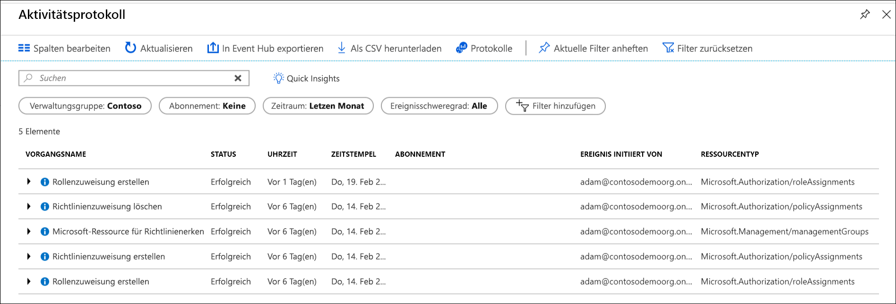

# <a name="manage-your-resources-with-management-groups"></a>Verwalten von Ressourcen mit Verwaltungsgruppen

Wenn Ihre Organisation über viele Abonnements verfügt, benötigen Sie möglicherweise eine Möglichkeit zur effizienten Verwaltung von Zugriff, Richtlinien und Konformität für diese Abonnements. Azure-Verwaltungsgruppen stellen einen abonnementübergreifenden Bereich dar. Sie organisieren Abonnements in Containern, die als „Verwaltungsgruppen“ bezeichnet werden, und wenden Ihre Governancebedingungen auf die Verwaltungsgruppen an. Alle Abonnements in einer Verwaltungsgruppe erben automatisch die auf die Verwaltungsgruppe angewendeten Bedingungen.

Verwaltungsgruppen ermöglichen Ihnen – unabhängig von den Arten Ihrer Abonnements – die unternehmenstaugliche Verwaltung in großem Umfang.  Weitere Informationen zu Verwaltungsgruppen finden Sie unter [Organize your resources with Azure Management Groups](overview.md) (Organisieren von Ressourcen mit Azure-Verwaltungsgruppen).

[!INCLUDE [GDPR-related guidance](../../../includes/gdpr-intro-sentence.md)]

[!INCLUDE [az-powershell-update](../../../includes/updated-for-az.md)]

## <a name="change-the-name-of-a-management-group"></a>Ändern des Namens einer Verwaltungsgruppe

Der Name einer Verwaltungsgruppe kann über das Portal, mithilfe von PowerShell oder mithilfe der Azure CLI geändert werden.

### <a name="change-the-name-in-the-portal"></a>Ändern des Namens im Portal

1. Melden Sie sich beim [Azure-Portal](https://portal.azure.com) an.

1. Klicken Sie auf **Alle Dienste** > **Verwaltungsgruppen**.

1. Wählen Sie die Verwaltungsgruppe aus, die Sie umbenennen möchten.

1. Wählen Sie **Details** aus.

1. Klicken Sie oben auf der Seite auf die Option **Gruppe umbenennen**.

   

1. Wenn das Menü geöffnet wird, geben Sie den neuen Namen ein, der angezeigt werden soll.

   

1. Wählen Sie **Speichern** aus.

### <a name="change-the-name-in-powershell"></a>Ändern des Namens in PowerShell

Verwenden Sie zum Aktualisieren des Anzeigenamens den Befehl **Update-AzManagementGroup**. Wenn Sie beispielsweise den Anzeigenamen einer Verwaltungsgruppe von „Contoso IT“ in „Contoso Group“ ändern möchten, führen Sie den folgenden Befehl aus:

```azurepowershell-interactive
Update-AzManagementGroup -GroupName 'ContosoIt' -DisplayName 'Contoso Group'
```

### <a name="change-the-name-in-azure-cli"></a>Ändern des Namens über die Azure CLI

Verwenden Sie für die Azure CLI den Aktualisierungsbefehl.

```azurecli-interactive
az account management-group update --name 'Contoso' --display-name 'Contoso Group'
```

## <a name="delete-a-management-group"></a>Löschen einer Verwaltungsgruppe

Um eine Verwaltungsgruppe zu löschen, müssen die folgenden Anforderungen erfüllt sein:

1. Unter der Verwaltungsgruppe gibt es keine untergeordneten Verwaltungsgruppen oder Abonnements.

   - Informationen zum Verschieben eines Abonnements aus einer Verwaltungsgruppe finden Sie unter [Verschieben eines Abonnements in eine andere Verwaltungsgruppe](#move-subscriptions-in-the-hierarchy).

   - Informationen zum Verschieben einer Verwaltungsgruppe in eine andere Verwaltungsgruppe finden Sie unter [Verschieben von Verwaltungsgruppen in der Hierarchie](#move-management-groups-in-the-hierarchy).

1. Sie haben Schreibzugriff auf die Verwaltungsgruppe (Rolle „Besitzer“, „Mitwirkender“ oder „Verwaltungsgruppenmitwirkender“). Wählen Sie zum Anzeigen der Ihnen zugewiesenen Berechtigungen die Verwaltungsgruppe aus, und klicken Sie dann auf **IAM**. Weitere Informationen zu RBAC-Rollen finden Sie unter [Erste Schritte mit der rollenbasierten Zugriffssteuerung im Azure-Portal](../../role-based-access-control/overview.md).  

### <a name="delete-in-the-portal"></a>Löschen im Portal

1. Melden Sie sich beim [Azure-Portal](https://portal.azure.com) an.

1. Klicken Sie auf **Alle Dienste** > **Verwaltungsgruppen**.

1. Wählen Sie die zu löschende Verwaltungsgruppe aus.

1. Wählen Sie **Details** aus.

1. Wählen Sie **Löschen** aus.

    > [!TIP]
    > Wenn das Symbol abgeblendet ist, zeigen Sie mit der Maus darauf, um den Grund dafür anzuzeigen.

   

1. Ein Fenster wird geöffnet, in dem Sie das Löschen der Verwaltungsgruppe bestätigen müssen.

   

1. Wählen Sie **Ja** aus.

### <a name="delete-in-powershell"></a>Löschen in PowerShell

Verwenden Sie zum Löschen von Verwaltungsgruppen in PowerShell den Befehl **Remove-AzManagementGroup**.

```azurepowershell-interactive
Remove-AzManagementGroup -GroupName 'Contoso'
```

### <a name="delete-in-azure-cli"></a>Löschen über die Azure-Befehlszeilenschnittstelle

Verwenden Sie bei der Azure CLI den Befehl „az account management-group delete“.

```azurecli-interactive
az account management-group delete --name 'Contoso'
```

## <a name="view-management-groups"></a>Anzeigen von Verwaltungsgruppen

Sie können jede Verwaltungsgruppe anzeigen, für die Sie eine direkte oder geerbte RBAC-Rolle besitzen.  

### <a name="view-in-the-portal"></a>Anzeigen im Portal

1. Melden Sie sich beim [Azure-Portal](https://portal.azure.com) an.

1. Klicken Sie auf **Alle Dienste** > **Verwaltungsgruppen**.

1. Die Seite mit der Hierarchie der Verwaltungsgruppe wird geladen. Hier können Sie alle Verwaltungsgruppen und Abonnements untersuchen, auf die Sie Zugriff haben. Durch Auswahl des Gruppennamens gelangen Sie eine Ebene in der Hierarchie nach unten. Die Navigation funktioniert genauso wie im Datei-Explorer.

1. Um die Details der Verwaltungsgruppe zu sehen, wählen Sie den Link **(Details)** neben dem Titel der Verwaltungsgruppe. Wenn dieser Link nicht verfügbar ist, sind Sie zum Anzeigen dieser Verwaltungsgruppe nicht berechtigt.

   

### <a name="view-in-powershell"></a>Anzeigen in PowerShell

Mit dem Befehl „Get-AzManagementGroup“ rufen Sie alle Gruppen ab.  Im Modul [Az.Resources](/powershell/module/az.resources/Get-AzManagementGroup) finden Sie die vollständige Liste der GET-Befehle in Powershell für Verwaltungsgruppen.  

```azurepowershell-interactive
Get-AzManagementGroup
```

Verwenden Sie den Parameter „-GroupName“, um die Informationen einer einzelnen Verwaltungsgruppe anzuzeigen.

```azurepowershell-interactive
Get-AzManagementGroup -GroupName 'Contoso'
```

Verwenden Sie die Parameter **-Expand** und **-Recurse**, um eine bestimmte Verwaltungsgruppe und die untergeordnete Hierarchie mit allen Ebenen zurückzugeben.  

```azurepowershell-interactive
PS C:\> $response = Get-AzManagementGroup -GroupName TestGroupParent -Expand -Recurse
PS C:\> $response

Id                : /providers/Microsoft.Management/managementGroups/TestGroupParent
Type              : /providers/Microsoft.Management/managementGroups
Name              : TestGroupParent
TenantId          : 00000000-0000-0000-0000-000000000000
DisplayName       : TestGroupParent
UpdatedTime       : 2/1/2018 11:15:46 AM
UpdatedBy         : 00000000-0000-0000-0000-000000000000
ParentId          : /providers/Microsoft.Management/managementGroups/00000000-0000-0000-0000-000000000000
ParentName        : 00000000-0000-0000-0000-000000000000
ParentDisplayName : 00000000-0000-0000-0000-000000000000
Children          : {TestGroup1DisplayName, TestGroup2DisplayName}

PS C:\> $response.Children[0]

Type        : /managementGroup
Id          : /providers/Microsoft.Management/managementGroups/TestGroup1
Name        : TestGroup1
DisplayName : TestGroup1DisplayName
Children    : {TestRecurseChild}

PS C:\> $response.Children[0].Children[0]

Type        : /managementGroup
Id          : /providers/Microsoft.Management/managementGroups/TestRecurseChild
Name        : TestRecurseChild
DisplayName : TestRecurseChild
Children    :
```

### <a name="view-in-azure-cli"></a>Anzeigen in der Azure CLI

Verwenden Sie den Befehl „list“, um alle Gruppen abzurufen.  

```azurecli-interactive
az account management-group list
```

Verwenden Sie den Befehl „show“, um die Informationen einer einzelnen Verwaltungsgruppe anzuzeigen.

```azurecli-interactive
az account management-group show --name 'Contoso'
```

Verwenden Sie die Parameter **-Expand** und **-Recurse**, um eine bestimmte Verwaltungsgruppe und die untergeordnete Hierarchie mit allen Ebenen zurückzugeben.

```azurecli-interactive
az account management-group show --name 'Contoso' -e -r
```

## <a name="move-subscriptions-in-the-hierarchy"></a>Verschieben von Abonnements in der Hierarchie

Ein Grund zum Erstellen einer Verwaltungsgruppe ist das Bündeln von Abonnements. Nur Verwaltungsgruppen und Abonnements können als untergeordnete Elemente einer anderen Verwaltungsgruppe festgelegt werden. Ein Abonnement, das in eine Verwaltungsgruppe verschoben wird, erbt den gesamten Benutzerzugriff und alle Richtlinien von der übergeordneten Verwaltungsgruppe.

Zum Verschieben des Abonnements müssen alle folgenden RBAC-Berechtigungen vorliegen:

- Die Rolle „Besitzer“ für das untergeordnete Abonnement
- Die Rolle „Besitzer“, „Mitwirkender“ oder „Verwaltungsgruppenmitwirkender“ für die übergeordnete Zielverwaltungsgruppe*
- Die Rolle „Besitzer“, „Mitwirkender“ oder „Verwaltungsgruppenmitwirkender“ für die vorhandene übergeordnete Verwaltungsgruppe*

*: Gilt, wenn die Zielverwaltungsgruppe oder die vorhandene übergeordnete Verwaltungsgruppe nicht die Stammverwaltungsgruppe ist. Da die Stammverwaltungsgruppe die standardmäßige Landing-Gruppe für alle neuen Verwaltungsgruppen und Abonnements ist, benötigen Benutzer keine Berechtigungen für diese Gruppe, wenn ein Element hierhin verschoben werden soll.

Wählen Sie zum Anzeigen Ihrer Berechtigungen im Azure-Portal die Verwaltungsgruppe und dann **IAM** aus. Weitere Informationen zu RBAC-Rollen finden Sie unter [Erste Schritte mit der rollenbasierten Zugriffssteuerung im Azure-Portal](../../role-based-access-control/overview.md).

### <a name="move-subscriptions-in-the-portal"></a>Verschieben von Abonnements im Portal

#### <a name="add-an-existing-subscription-to-a-management-group"></a>Hinzufügen eines vorhandenen Abonnements zu einer Verwaltungsgruppe

1. Melden Sie sich beim [Azure-Portal](https://portal.azure.com) an.

1. Klicken Sie auf **Alle Dienste** > **Verwaltungsgruppen**.

1. Wählen Sie die Verwaltungsgruppe aus, die als übergeordnete Gruppe festgelegt werden soll.

1. Klicken Sie am oberen Rand der Seite auf **Abonnement hinzufügen**.

1. Wählen Sie in der Liste das Abonnement mit der richtigen ID aus.

   

1. Wählen Sie „Speichern“ aus.

#### <a name="remove-a-subscription-from-a-management-group"></a>Entfernen eines Abonnements aus einer Verwaltungsgruppe

1. Melden Sie sich beim [Azure-Portal](https://portal.azure.com) an.

1. Klicken Sie auf **Alle Dienste** > **Verwaltungsgruppen**.

1. Wählen Sie die geplante Verwaltungsgruppe aus. Hierbei handelt es sich um die aktuelle übergeordnete Gruppe.  

1. Klicken Sie in der Liste am Ende der Zeile des zu verschiebenden Abonnements auf die Ellipse.

   

1. Klicken Sie auf **Verschieben**.

1. Klicken Sie im angezeigten Menü auf **Übergeordnete Verwaltungsgruppe**.

   

1. Wählen Sie **Speichern** aus.

### <a name="move-subscriptions-in-powershell"></a>Verschieben von Abonnements in PowerShell

Verschieben Sie Abonnements in PowerShell mit dem Befehl „New-AzManagementGroupSubscription“.  

```azurepowershell-interactive
New-AzManagementGroupSubscription -GroupName 'Contoso' -SubscriptionId '12345678-1234-1234-1234-123456789012'
```

Verwenden Sie zum Entfernen der Verknüpfung zwischen dem Abonnement und der Verwaltungsgruppe den Befehl „Remove-AzManagementGroupSubscription“.

```azurepowershell-interactive
Remove-AzManagementGroupSubscription -GroupName 'Contoso' -SubscriptionId '12345678-1234-1234-1234-123456789012'
```

### <a name="move-subscriptions-in-azure-cli"></a>Verschieben von Abonnements in der Azure CLI

Verwenden Sie zum Verschieben eines Abonnements in der CLI den Befehl „add“.

```azurecli-interactive
az account management-group subscription add --name 'Contoso' --subscription '12345678-1234-1234-1234-123456789012'
```

Verwenden Sie zum Entfernen des Abonnements aus der Verwaltungsgruppe den Befehl „remove“.  

```azurecli-interactive
az account management-group subscription remove --name 'Contoso' --subscription '12345678-1234-1234-1234-123456789012'
```

## <a name="move-management-groups-in-the-hierarchy"></a>Verschieben von Verwaltungsgruppen in der Hierarchie  

Wenn Sie eine übergeordnete Verwaltungsgruppe verschieben, wird die untergeordnete Hierarchie ebenfalls verschoben.

### <a name="move-management-groups-in-the-portal"></a>Verschieben von Verwaltungsgruppen im Portal

1. Melden Sie sich beim [Azure-Portal](https://portal.azure.com) an.

1. Klicken Sie auf **Alle Dienste** > **Verwaltungsgruppen**.

1. Wählen Sie die Verwaltungsgruppe aus, die als übergeordnete Gruppe festgelegt werden soll.

1. Klicken Sie am oberen Rand der Seite auf **Verwaltungsgruppe hinzufügen**.

1. Ein Menü wird geöffnet, in dem Sie auswählen, ob Sie eine neue oder vorhandene Verwaltungsgruppe verwenden möchten.

   - Durch die Auswahl von „Neu“ wird eine neue Verwaltungsgruppe erstellt.
   - Wenn Sie eine vorhandene Verwaltungsgruppe auswählen, wird eine Dropdownliste mit allen Verwaltungsgruppen angezeigt, die Sie in diese Verwaltungsgruppe verschieben können.  

   

1. Wählen Sie **Speichern** aus.

### <a name="move-management-groups-in-powershell"></a>Verschieben von Verwaltungsgruppen in PowerShell

Verwenden Sie den Befehl „Update-AzureRmManagementGroup“ in PowerShell, um eine Verwaltungsgruppe in eine andere Gruppe zu verschieben.

```azurepowershell-interactive
$parentGroup = Get-AzManagementGroup -GroupName ContosoIT
Update-AzManagementGroup -GroupName 'Contoso' -ParentId $parentGroup.id
```  

### <a name="move-management-groups-in-azure-cli"></a>Verschieben von Verwaltungsgruppen in der Azure CLI

Verwenden Sie den Befehl „update“, um eine Verwaltungsgruppe mit der Azure CLI zu verschieben.

```azurecli-interactive
az account management-group update --name 'Contoso' --parent ContosoIT
```

## <a name="audit-management-groups-using-activity-logs"></a>Überwachen von Verwaltungsgruppen mithilfe von Aktivitätsprotokollen

Verwaltungsgruppen werden im [Azure-Aktivitätsprotokoll](../../azure-monitor/platform/activity-logs-overview.md) unterstützt. Alle Ereignisse, die für eine Verwaltungsgruppe auftreten, können am gleichen zentralen Ort wie bei anderen Azure-Ressourcen abgefragt werden.  Sie können beispielsweise alle Änderungen an Rollen- oder Richtlinienzuweisungen anzeigen, die für eine bestimmte Verwaltungsgruppe vorgenommen wurden.



Wenn Sie Verwaltungsgruppen außerhalb des Azure-Portals abfragen möchten, sieht der Zielbereich für Verwaltungsgruppen wie folgt aus: **"/providers/Microsoft.Management/managementGroups/{yourMgID}"**.

## <a name="referencing-management-groups-from-other-resource-providers"></a>Verweisen auf Verwaltungsgruppen von anderen Ressourcenanbietern

Wenn Sie von den Aktionen eines anderen Ressourcenanbieters auf Verwaltungsgruppen verweisen, verwenden Sie den folgenden Pfad als Bereich. Dieser Pfad wird sowohl in PowerShell, als auch an der Azure-Befehlszeilenschnittstelle (CLI) und in REST-APIs verwendet.  

>„/providers/Microsoft.Management/managementGroups/{IhreVerwaltungsgruppenID}“

Das Zuweisen einer neuen Rollenzuweisung für eine Verwaltungsgruppe in PowerShell ist ein Beispiel für die Verwendung dieses Pfads.

```azurepowershell-interactive
New-AzRoleAssignment -Scope "/providers/Microsoft.Management/managementGroups/Contoso"
```

Der gleiche Bereichspfad wird verwendet, wenn Sie eine Richtliniendefinition in einer Verwaltungsgruppe abrufen.

```http
GET https://management.azure.com/providers/Microsoft.Management/managementgroups/MyManagementGroup/providers/Microsoft.Authorization/policyDefinitions/ResourceNaming?api-version=2018-05-01
```

## <a name="next-steps"></a>Nächste Schritte

Weitere Informationen zu Verwaltungsgruppen finden Sie unter folgenden Links:

- [Erstellen von Verwaltungsgruppen zum Organisieren von Azure-Ressourcen](create.md)
- [Ändern, Löschen oder Verwalten Ihrer Verwaltungsgruppen](manage.md)
- [Überprüfen von Verwaltungsgruppen im Azure PowerShell-Ressourcenmodul](/powershell/module/az.resources#resources)
- [Überprüfen von Verwaltungsgruppen in der REST-API](/rest/api/resources/managementgroups)
- [Überprüfen von Verwaltungsgruppen in der Azure CLI](/cli/azure/account/management-group)