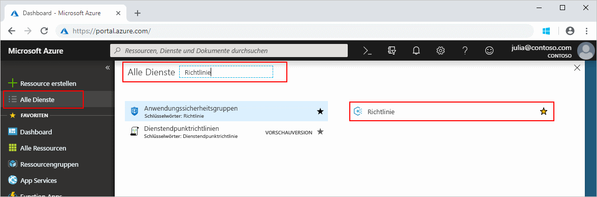
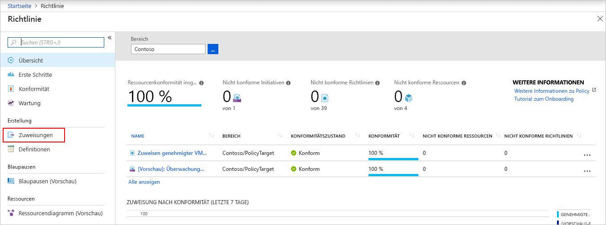
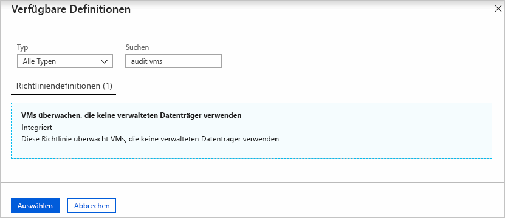
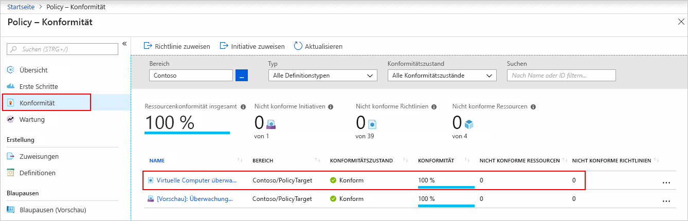
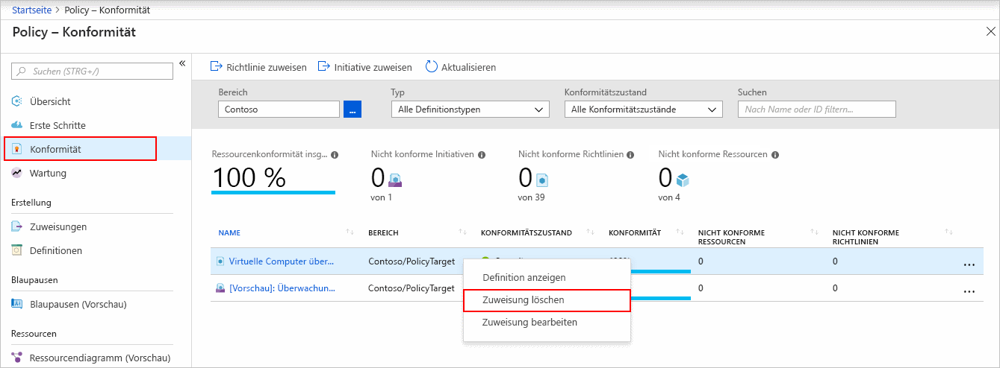

# Schnellstart: Erstellen einer Richtlinienzuweisung zum Identifizieren nicht konformer Ressourcen

Zum Verständnis der Konformität in Azure müssen Sie zunächst wissen, wie Sie den Status Ihrer Ressourcen ermitteln.
Diese Schnellstartanleitung führt Sie schrittweise durch die Erstellung einer Richtlinienzuweisung zur Identifizierung von virtuellen Computern, die keine verwalteten Datenträger verwenden.

Am Ende dieses Prozesses können Sie erfolgreich virtuelle Computer identifizieren, die keine verwalteten Datenträger verwenden. Sie sind mit der Richtlinienzuweisung *nicht konform*.

Wenn Sie kein Azure-Abonnement besitzen, können Sie ein [kostenloses Konto](https://azure.microsoft.com/free/) erstellen, bevor Sie beginnen.

## Erstellen einer Richtlinienzuweisung

In dieser Schnellstartanleitung erstellen Sie eine Richtlinienzuweisung und weisen die Richtliniendefinition *Virtuelle Computer überwachen, die keine verwalteten Datenträger verwenden* zu.

1. Starten Sie den Azure Policy-Dienst über das Azure-Portal, indem Sie auf **Alle Dienste** klicken und dann nach **Richtlinie** suchen und die entsprechende Option auswählen.

   

1. Wählen Sie links auf der Seite „Azure Policy“ die Option **Zuweisungen**. Eine Zuweisung ist eine zugewiesene Richtlinie, die innerhalb eines bestimmten Bereichs angewendet werden soll.

   

1. Wählen Sie im oberen Bereich der Seite **Richtlinien – Zuweisungen** die Option **Richtlinie zuweisen**.

   

1. Wählen Sie auf der Seite **Richtlinie zuweisen** den **Bereich** aus, indem Sie auf die Auslassungspunkte klicken und entweder eine Verwaltungsgruppe oder ein Abonnement auswählen. Wählen Sie optional eine Ressourcengruppe aus. Ein Bereich bestimmt, für welche Ressourcen oder Ressourcengruppe die Richtlinienzuweisung erzwungen wird. Klicken Sie dann unten im Abschnitt der Seite **Bereich** auf **Auswählen**.

   In diesem Beispiel wird das Abonnement **Contoso** verwendet. Ihr Abonnement wird sich davon unterscheiden.

1. Ressourcen können basierend auf dem **Bereich** ausgeschlossen werden. **Ausschlüsse** beginnen auf einer Ebene unterhalb der Ebene des **Bereichs**. **Ausschlüsse** sind optional, lassen Sie sie daher vorerst leer.

1. Wählen Sie die **Richtliniendefinition** mit den Auslassungspunkten, um die Liste der verfügbaren Definitionen zu öffnen. Azure Policy umfasst integrierte Richtliniendefinitionen, die Sie verwenden können. Zu den vielen verfügbaren Definitionen zählen z.B.:

   - Enforce tag and its value (Tag und zugehörigen Wert erzwingen)
   - Apply tag and its value (Tag und zugehörigen Wert anwenden)
   - Require SQL Server version 12.0 (SQL Server-Version 12.0 fordern)

   Eine Liste mit einem Teil der verfügbaren integrierten Richtlinien finden Sie unter [Azure Policy-Beispiele](./samples/index.md).

1. Durchsuchen Sie die Liste der Richtliniendefinitionen nach der Definition *Überwachen Sie die virtuellen Computer, die nicht verwaltete Datenträger verwenden*. Klicken Sie auf diese Richtlinie und anschließend auf **Auswählen**.

   

1. Der **Zuweisungsname** wird automatisch mit dem ausgewählten Richtliniennamen gefüllt, kann aber geändert werden. In diesem Fall wird *Überwachen Sie die virtuellen Computer, die nicht verwaltete Datenträger verwenden* übernommen. Geben Sie ggf. auch eine **Beschreibung** ein. Die Beschreibung enthält Details zu dieser Richtlinienzuweisung.
   Über **Zugewiesen von** werden die Daten abhängig vom angemeldeten Benutzer automatisch ausgefüllt. Dieses Feld ist optional. Daher können auch benutzerdefinierte Werte eingegeben werden.

1. Lassen Sie **Verwaltete Identität erstellen** deaktiviert. Dieses Feld _muss_ aktiviert werden, wenn die Richtlinie oder Initiative eine Richtlinie mit dem Effekt [deployIfNotExists](./concepts/effects.md#deployifnotexists) enthält. Da dies bei der für diesen Schnellstart verwendeten Richtlinie nicht der Fall ist, lassen Sie es deaktiviert. Weitere Informationen finden Sie unter [Verwaltete Identitäten](../../active-directory/managed-identities-azure-resources/overview.md) und [Funktionsweise der Wiederherstellungssicherheit](./how-to/remediate-resources.md#how-remediation-security-works).

1. Klicken Sie auf **Zuweisen**.

Sie können nun nicht konforme Ressourcen identifizieren, um den Konformitätszustand Ihrer Umgebung nachzuvollziehen.

## Identifizieren nicht konformer Ressourcen

Wählen Sie links auf der Seite die Option **Konformität** aus. Suchen Sie dann die von Ihnen erstellte Richtlinienzuweisung **Überwachen Sie die virtuellen Computer, die nicht verwaltete Datenträger verwenden**.

Falls Ressourcen vorhanden sind, die mit dieser neuen Zuweisung nicht konform sind, werden diese unter **Nicht konforme Ressourcen** angezeigt.

Wenn eine Bedingung für einige Ihrer vorhandenen Ressourcen als erfüllt ausgewertet wird, werden diese Ressourcen als nicht mit der Richtlinie konform markiert. Die folgende Tabelle gibt Aufschluss über das Zusammenspiel zwischen den verschiedenen Richtlinienauswirkungen, der Bedingungsauswertung und dem resultierenden Konformitätszustand. Die Auswertungslogik wird zwar im Azure-Portal nicht angezeigt, Sie sehen aber die Ergebnisse für den Konformitätszustand. Das Ergebnis für den Konformitätszustand ist entweder „konform“ oder „nicht konform“.

| **Ressourcenzustand** | **Auswirkung** | **Richtlinienauswertung** | **Konformitätszustand** |
| --- | --- | --- | --- |
| Exists | Deny, Audit, Append\*, DeployIfNotExist\*, AuditIfNotExist\* | True | Nicht konform |
| Exists | Deny, Audit, Append\*, DeployIfNotExist\*, AuditIfNotExist\* | False | Konform |
| Neu | Audit, AuditIfNotExist\* | True | Nicht konform |
| Neu | Audit, AuditIfNotExist\* | False | Konform |

\* Für die Auswirkungen „Append“, „DeployIfNotExist“ und „AuditIfNotExist“ muss die IF-Anweisung auf TRUE festgelegt sein.
Für die Auswirkungen muss die Existenzbedingung außerdem auf FALSE festgelegt sein, damit sie nicht konform sind. Bei TRUE löst die IF-Bedingung die Auswertung der Existenzbedingung für die zugehörigen Ressourcen aus.

## Bereinigen von Ressourcen

Um die erstellte Zuweisung zu entfernen, gehen Sie folgendermaßen vor:

1. Wählen Sie links auf der Seite „Azure Policy“ **Konformität** (oder **Zuweisungen**), und suchen Sie die von Ihnen erstellte Richtlinienzuweisung **Überwachen Sie die virtuellen Computer, die nicht verwaltete Datenträger verwenden**.

1. Klicken Sie mit der rechten Maustaste auf die Richtlinienzuweisung **Überwachen Sie die virtuellen Computer, die nicht verwaltete Datenträger verwenden**, und wählen Sie **Zuweisung löschen**.

   

## Nächste Schritte

In dieser Schnellstartanleitung haben Sie einem Bereich eine Richtliniendefinition zugewiesen und deren Konformitätsbericht ausgewertet.
Die Richtliniendefinition überprüft, ob alle Ressourcen im Bereich konform sind, und identifiziert die Ressourcen, die nicht konform sind.

Weitere Informationen zum Zuweisen von Richtlinien, die die Konformität neuer Ressourcen überprüfen, finden Sie im folgenden Tutorial:

> [!div class="nextstepaction"]
> [Erstellen und Verwalten von Richtlinien](./tutorials/create-and-manage.md)