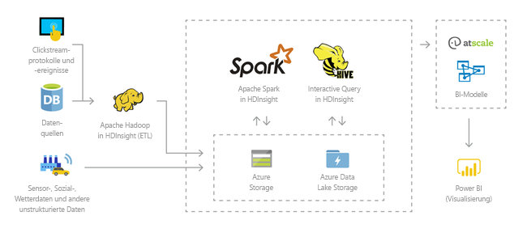
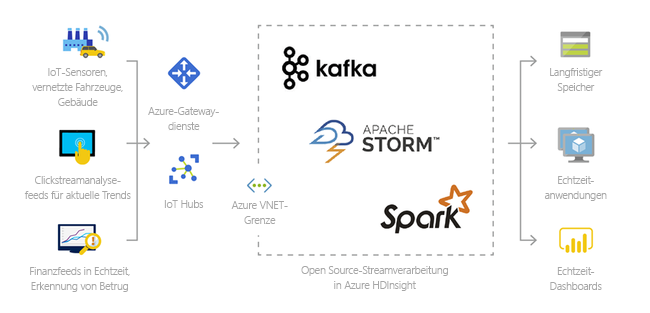
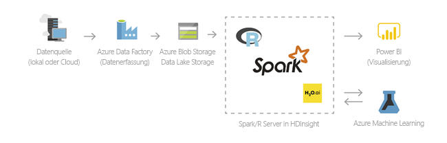
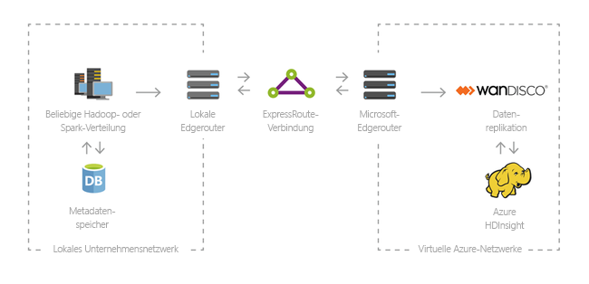

# Was sind Azure HDInsight und der Hadoop-Technologiestapel?

Dieser Artikel enthält eine Einführung in Apache Hadoop auf Azure HDInsight. Azure HDInsight ist ein umfassender, vollständig verwalteter Open Source-Analysedienst für Unternehmen. Sie können Open Source-Frameworks wie Hadoop, Spark, Hive, LLAP, Kafka, Storm, R und andere verwenden. 

[!INCLUDE [hdinsight-price-change](../../../includes/hdinsight-enhancements.md)]

## Was sind HDInsight und der Hadoop-Technologiestapel?

[Apache Hadoop](http://hadoop.apache.org/) war ursprünglich ein Open Source-Framework für die verteilte Verarbeitung und Analyse umfangreicher Datasets in Clustern. Der Hadoop-Technologiestapel umfasst verwandte Software und Hilfsprogramme, einschließlich Apache Hive, HBase, Spark, Kafka und viele andere.

Azure HDInsight ist eine Clouddistribution der Hadoop-Komponenten von [Hortonworks Data Platform (HDP)](https://hortonworks.com/products/data-center/hdp/). Azure HDInsight ermöglicht die einfache, schnelle und kostengünstige Verarbeitung umfangreicher Datenmengen. Sie können die beliebtesten Open-Source-Frameworks wie Hadoop, Spark, Hive, LLAP, Kafka, Storm, R usw. verwenden. Mit diesen Frameworks können Sie einen weiten Bereich von Szenarien ermöglichen, z.B. Extrahieren, Transformieren und Laden (ETL), Data Warehousing, Machine Learning und IoT.

Informationen zu verfügbare Komponenten des Hadoop-Technologiestapels für HDInsight finden Sie unter [Welche Hadoop-Komponenten und -Versionen sind in HDInsight verfügbar?][component-versioning]. Weitere Informationen zu Hadoop in HDInsight finden Sie auf der Seite mit [Azure-Features für HDInsight](https://azure.microsoft.com/services/hdinsight/).

## Was versteht man unter "Big Data"?

Große Datenmengen, also „Big Data“, werden in immer größeren Mengen, mit immer höherer Geschwindigkeit und in immer mehr Formaten als jemals zuvor erfasst. Dabei kann es sich um Verlaufsdaten (also gespeicherte Daten) oder um Echtzeitdaten (von der Quelle gestreamt) handeln. Informationen zu den gängigsten Anwendungsfällen für Big Data finden Sie unter [Verwendungsszenarien für HDInsight](#scenarios-for-using-hdinsight).

## Argumente für die Verwendung von Hadoop auf HDInsight

In diesem Abschnitt werden die Funktionen von Azure HDInsight aufgeführt.

|Funktion  |BESCHREIBUNG  |
|---------|---------|
|Cloudbasiert     |     Mit Azure HDInsight können Sie optimierte Cluster für [Hadoop](apache-hadoop-linux-tutorial-get-started.md), [Spark](../spark/apache-spark-jupyter-spark-sql.md), [Interactive Query (LLAP)](../interactive-query/apache-interactive-query-get-started.md), [Kafka](../kafka/apache-kafka-get-started.md), [Storm](../storm/apache-storm-tutorial-get-started-linux.md), [HBase](../hbase/apache-hbase-tutorial-get-started-linux.md) und  [ML Services](../r-server/r-server-get-started.md) in Azure erstellen. Darüber hinaus bietet HDInsight eine End-to-End-SLA für alle Ihre Produktionsworkloads.  |
|Kostengünstig und skalierbar     | Mit HDInsight können Sie Workloads [zentral hoch- und herunterskalieren](../hdinsight-administer-use-portal-linux.md) . Durch das  [Erstellen bedarfsgesteuerter Cluster](../hdinsight-hadoop-create-linux-clusters-adf.md)  können Sie Ihre Kosten senken, indem Sie nur für das bezahlen, was Sie tatsächlich nutzen. Außerdem können Sie Datenpipelines für die Operationalisierung Ihrer Aufträge erstellen. Die Entkoppelung von Compute und Speicher sorgt für bessere Leistung und mehr Flexibilität. |
|Sicher und konform    | Mit HDInsight können Sie die Datenressourcen Ihres Unternehmens durch die Verwendung von [Azure Virtual Network](../hdinsight-extend-hadoop-virtual-network.md), [Verschlüsselung](../hdinsight-hadoop-create-linux-clusters-with-secure-transfer-storage.md) und Integration von [Azure Active Directory](../domain-joined/apache-domain-joined-introduction.md) schützen. Darüber hinaus erfüllt HDInsight die gängigsten branchen- und behördenspezifischen [Compliancestandards](https://azure.microsoft.com/overview/trusted-cloud).        |
|Überwachung    | Dank [Azure Log Analytics](../hdinsight-hadoop-oms-log-analytics-tutorial.md)-Integration bietet Azure HDInsight eine zentrale Oberfläche für die Überwachung Ihrer gesamten Cluster.        |
|Globale Verfügbarkeit | HDInsight ist in mehr  [Regionen](https://azure.microsoft.com/regions/services/)  verfügbar als jede andere Big Data-Analyselösung. Zudem steht Azure HDInsight für Azure Government, China und Deutschland zur Verfügung, was die Erfüllung geschäftlicher Anforderungen in zentralen unabhängigen Bereichen ermöglicht. |  
|Produktivität     |  Mit Azure HDInsight können Sie umfangreiche Produktivitätstools für Hadoop und Spark in Ihrer bevorzugten Entwicklungsumgebung nutzen. Zu diesen Entwicklungsumgebungen gehören [Visual Studio](apache-hadoop-visual-studio-tools-get-started.md), [VSCode](../hdinsight-for-vscode.md), [Eclipse](../spark/apache-spark-eclipse-tool-plugin.md) und [IntelliJ](../spark/apache-spark-intellij-tool-plugin.md) für die Unterstützung von Scala, Python, R, Java und .NET. Datenanalysten können zudem über gängige Notebooks wie [Jupyter](../spark/apache-spark-jupyter-notebook-kernels.md) und [Zeppelin](../spark/apache-spark-zeppelin-notebook.md) zusammenarbeiten.    |
|Erweiterbarkeit     |  Sie können die HDInsight-Cluster um installierte Komponenten erweitern (z.B. Hue, Presto usw.), indem Sie [Skriptaktionen](../hdinsight-hadoop-customize-cluster-linux.md) verwenden, [Edgeknoten hinzufügen](../hdinsight-apps-use-edge-node.md) oder [andere, für Big Data zertifizierte Anwendungen integrieren](../hdinsight-apps-install-applications.md). HDInsight lässt sich mittels [One-Click-Bereitstellung](https://azure.microsoft.com/services/hdinsight/partner-ecosystem/) nahtlos in die gängigsten Big Data-Lösungen integrieren.|

## Verwendungsszenarien für HDInsight

Azure HDInsight kann im Rahmen verschiedenster Szenarien für die Big Data-Verarbeitung verwendet werden. Dabei kann es sich um Verlaufsdaten (Daten, die bereits erfasst und gespeichert wurden) oder um Echtzeitdaten (Daten, die direkt von der Quelle gestreamt werden) handeln. Die Szenarien für die Verarbeitung dieser Daten lassen sich in folgende Kategorien unterteilen: 

### Batchverarbeitung (ETL)

Extrahieren, Transformieren und Laden (ETL) ist ein Prozess, bei dem nicht strukturierte und strukturierte Daten aus heterogenen Datenquellen extrahiert werden. Anschließend werden sie in ein strukturiertes Format transformiert und in einen Datenspeicher geladen. Sie können die transformierten Daten für Data Science- oder Data Warehousing-Zwecke verwenden.

### Data Warehousing

Mit HDInsight können Sie interaktive Abfragen für Petabytes von strukturierten oder unstrukturierten Daten in einem beliebigen Format durchführen. Darüber hinaus können Sie Modelle für die Verknüpfung mit BI-Tools erstellen. Weitere Informationen finden Sie in [diesem Kundenbericht](https://customers.microsoft.com/story/milliman). 

### Internet der Dinge (IoT, Internet of Things)

Mit HDInsight können Sie Streamingdaten verarbeiten, die in Echtzeit von vielen verschiedenen Geräten empfangen werden. Weitere Informationen finden Sie in [diesem Azure-Blog, in dem die öffentliche Vorschauversion von Apache Kafka unter HDInsight mit Azure Managed Disks angekündigt wird](https://azure.microsoft.com/blog/announcing-public-preview-of-apache-kafka-on-hdinsight-with-azure-managed-disks/).

 

### Data Science

Mit HDInsight können Sie Anwendungen erstellen, die wichtige Erkenntnisse aus Daten extrahieren. Zusätzlich können Sie mithilfe von Azure Machine Learning zukünftige Trends für Ihr Unternehmen prognostizieren. Weitere Informationen finden Sie in [diesem Kundenbericht](https://customers.microsoft.com/story/pros).

### Hybrid

Mit HDInsight können Sie Ihre vorhandene lokale Big Data-Infrastruktur auf Azure ausdehnen und von den erweiterten Analysefunktionen der Cloud profitieren.

## Clustertypen in HDInsight
HDInsight umfasst bestimmte Clustertypen und Clusteranpassungsfunktionen, z.B. die Möglichkeit zum Hinzufügen von Komponenten, Hilfsprogrammen und Sprachen. HDInsight bietet die folgenden Clustertypen:

* **[Apache Hadoop](https://wiki.apache.org/hadoop)**: Ein Framework, das Hadoop Distributed File System, die YARN-Ressourcenverwaltung und ein einfaches MapReduce-Programmiermodell zum parallelen Verarbeiten und Analysieren von Batchdaten nutzt.

* **[Apache Spark](http://spark.apache.org/)**: Ein Open-Source-Framework für die Parallelverarbeitung, das die arbeitsspeicherinterne Verarbeitung unterstützt, um die Leistung von Anwendungen zur Analyse von großen Datenmengen zu steigern. Siehe [Was ist Apache Spark in HDInsight?](../spark/apache-spark-overview.md)

* **[Apache HBase](http://hbase.apache.org/)**: Eine auf Hadoop basierende NoSQL-Datenbank, die wahlfreien Zugriff und starke Konsistenz für große Mengen unstrukturierter und teilstrukturierter Daten bietet – potenziell Milliarden von Zeilen multipliziert mit Millionen von Spalten. Siehe [Was ist HBase in HDInsight?](../hbase/apache-hbase-overview.md)

* **[ML Services](https://msdn.microsoft.com/microsoft-r/rserver)**: Ein Server zum Hosten und Verwalten von parallelen, verteilten R-Prozessen. Diese Funktion ermöglicht Datenanalysten, Statistikern und R-Programmierern bei Bedarf den Zugriff auf skalierbare, verteilte Analysemethoden in HDInsight. Siehe [Einführung in R Server und Open-Source-R-Funktionen in HDInsight](../r-server/r-server-overview.md).

* **[Apache Storm](https://storm.incubator.apache.org/)**: Ein verteiltes Echtzeitberechnungssystem für die schnelle Verarbeitung großer Datenströme. Storm wird als verwalteter Cluster in HDInsight angeboten. Siehe [Analysieren von Echtzeit-Sensordaten mit Storm und Hadoop](../storm/apache-storm-sensor-data-analysis.md).

* **[Apache Interactive Query-Vorschau (auch bekannt als „Live Long and Process“, LLAP)](https://cwiki.apache.org/confluence/display/Hive/LLAP)**: In-Memory-Zwischenspeicherung für interaktive und schnellere Hive-Abfragen. Siehe [Use Interactive Query in HDInsight](../interactive-query/apache-interactive-query-get-started.md) (Verwenden von Interactive Query in HDInsight).

* **[Apache Kafka](https://kafka.apache.org/)**: Eine Open-Source-Plattform zum Erstellen von Streamingdatenpipelines und -anwendungen. Kafka bietet auch eine Nachrichtenwarteschlangenfunktion, die Ihnen das Veröffentlichen und Abonnieren von Datenströmen ermöglicht. Siehe [Introduction to Apache Kafka on HDInsight](../kafka/apache-kafka-introduction.md) (Einführung in Apache Kafka in HDInsight).

## Open-Source-Komponenten in HDInsight

Azure HDInsight ermöglicht die Erstellung von Clustern mit Open-Source-Frameworks wie Hadoop, Spark, Hive, LLAP, Kafka, Storm, HBase und R. Diese Cluster verfügen standardmäßig über weitere Open-Source-Komponenten wie [Ambari](https://github.com/apache/ambari/blob/trunk/ambari-server/docs/api/v1/index.md), [Avro](http://avro.apache.org/docs/current/spec.html), [Hive](http://hive.apache.org), [HCatalog](https://cwiki.apache.org/confluence/display/Hive/HCatalog/), [Mahout](https://mahout.apache.org/), [MapReduce](http://wiki.apache.org/hadoop/MapReduce), [YARN](http://hadoop.apache.org/docs/current/hadoop-yarn/hadoop-yarn-site/YARN.html), [Phoenix](http://phoenix.apache.org/), [Pig](http://pig.apache.org/), [Sqoop](http://sqoop.apache.org/), [Tez](http://tez.apache.org/), [Oozie](http://oozie.apache.org/) und [ZooKeeper](http://zookeeper.apache.org/).  

## Programmiersprachen in HDInsight
HDInsight-Cluster, z.B. Spark, HBase, Kafka, Hadoop und andere, unterstützen viele Programmiersprachen. Einige Programmiersprachen werden nicht standardmäßig installiert. [Verwenden Sie eine Skriptaktion](../hdinsight-hadoop-script-actions-linux.md), um Bibliotheken, Module oder Pakete zu installieren, die standardmäßig nicht installiert sind.

|Programmiersprache  |Information  |
|---------|---------|
|Standardmäßige Unterstützung für Programmiersprachen     | Standardmäßig unterstützen HDInsight-Cluster folgende Sprachen:<ul><li>Java</li><li>Python</li></ul> Sie können zusätzliche Sprachen installieren, indem Sie [Skriptaktionen](../hdinsight-hadoop-script-actions-linux.md) verwenden.       |
|JVM-Sprachen (Java Virtual Machine)     | Auf einer Java Virtual Machine (JVM) können neben Java auch viele andere Sprachen ausgeführt werden. Bei der Ausführung von einigen dieser Sprachen müssen Sie im Cluster unter Umständen aber zusätzliche Komponenten installieren. Die folgenden JVM-basierten Sprachen werden in HDInsight-Clustern unterstützt: <ul><li>Clojure</li><li>Jython (Python für Java)</li><li>Scala</li></ul>     |
|Hadoop-spezifische Sprachen     | HDInsight-Cluster bieten Unterstützung für die folgenden Sprachen, die für den Hadoop-Technologiestapel spezifisch sind: <ul><li>Pig Latin für Pig-Aufträge</li><li>HiveQL für Hive-Aufträge und SparkSQL</li></ul>        |
 

## Business Intelligence in HDInsight
Bekannte Business Intelligence-Tools (BI) rufen Daten, die in HDInsight integriert sind, entweder über das Power Query-Add-In oder den Microsoft Hive ODBC-Treiber ab, analysieren sie und erstellen Berichte:

* [Apache Spark BI mit Datenvisualisierungstools unter Azure HDInsight](../spark/apache-spark-use-bi-tools.md)

* [Visualisieren von Hive-Daten mit Microsoft Power BI in Azure HDInsight](apache-hadoop-connect-hive-power-bi.md) 

* [Visualize Interactive Query Hive data with Microsoft Power BI using direct query in Azure HDInsight](../interactive-query/apache-hadoop-connect-hive-power-bi-directquery.md) (Visualisieren von Interactive Query-Hive-Daten mit Microsoft Power BI mittels direkter Abfrage in Azure HDInsight)

* [Verbinden von Excel mit Hadoop mithilfe von Power Query](apache-hadoop-connect-excel-power-query.md) (setzt Windows voraus) 

* [Verbinden von Excel über den Microsoft Hive ODBC-Treiber mit Hadoop](apache-hadoop-connect-excel-hive-odbc-driver.md) (setzt Windows voraus) 

* [Verwenden von SQL Server Analysis Services mit HDInsight](https://msdn.microsoft.com/library/dn749857.aspx)

* [Verwenden von SQL Server Reporting Services mit HDInsight](https://msdn.microsoft.com/library/dn749856.aspx)

## Nächste Schritte

In diesem Artikel haben Sie Azure HDInsight kennengelernt und erfahren, wie HDInsight Hadoop und andere Clustertypen in Azure bereitstellt. Fahren Sie mit dem nächsten Artikel fort, um zu erfahren, wie Sie einen Apache Hadoop-Cluster in HDInsight erstellen.

> [!div class="nextstepaction"]
> [Erstellen eines Hadoop-Clusters in HDInsight](apache-hadoop-linux-create-cluster-get-started-portal.md)

[component-versioning]: ../hdinsight-component-versioning.md
[zookeeper]: http://zookeeper.apache.org/
