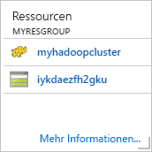

# Schnellstart: Erste Schritte mit Hadoop und Hive in Azure HDInsight mit der Resource Manager-Vorlage

In diesem Artikel erfahren Sie, wie Sie mit der Resource Manager-Vorlage [Hadoop](http://hadoop.apache.org/)-Cluster in HDInsight erstellen und dann Hive-Aufträge in HDInsight ausführen. Die meisten Hadoop-Aufträge sind Batchaufträge. Sie erstellen einen Cluster, führen einige Aufträge aus und löschen dann den Cluster. In diesem Artikel führen Sie alle drei Aufgaben durch.

In diesem Schnellstarttutorial verwenden Sie eine Resource Manager-Vorlage, um einen HDInsight-Hadoop-Cluster zu erstellen. Sie können einen Cluster auch im [Azure-Portal](apache-hadoop-linux-create-cluster-get-started-portal.md) erstellen.

Zurzeit stehen in HDInsight [sieben verschiedene Clustertypen](./apache-hadoop-introduction.md#cluster-types-in-hdinsight) zur Verfügung. Jeder Clustertyp unterstützt eine andere Gruppe von Komponenten. Alle Clustertypen unterstützen Hive. Eine Liste mit den unterstützten Komponenten in HDInsight finden Sie unter [Neuheiten in den von HDInsight bereitgestellten Hadoop-Clusterversionen](../hdinsight-component-versioning.md)  

Wenn Sie kein Azure-Abonnement besitzen, können Sie ein [kostenloses Konto](https://azure.microsoft.com/free/) erstellen, bevor Sie beginnen.

## Erstellen eines Hadoop-Clusters

In diesem Abschnitt erstellen Sie einen Hadoop-Cluster in HDInsight mit einer Azure Resource Manager-Vorlage. Für diesen Artikel ist keine Erfahrung mit Resource Manager-Vorlagen erforderlich. 

1. Klicken Sie unten auf die Schaltfläche **Bereitstellung in Azure**, um sich bei Azure anzumelden und die Resource Manager-Vorlage im Azure-Portal zu öffnen. 
   
    

2. Geben Sie die Werte wie im folgenden Screenshot vorgeschlagen ein, oder wählen Sie sie aus:

    > [!NOTE]
    > Die Werte, die Sie angeben, müssen eindeutig sein und sollten den Benennungsrichtlinien folgen. Die Vorlage führt keine Überprüfungen durch. Wenn die Werte, die Sie angeben, bereits verwendet werden oder nicht den Richtlinien entsprechen, erhalten Sie eine Fehlermeldung, nachdem Sie die Vorlage übermittelt haben.       
    > 
    >
    
    

    Geben Sie folgende Werte ein bzw. wählen diese aus:
    
    |Eigenschaft  |BESCHREIBUNG  |
    |---------|---------|
    |**Abonnement**     |  Wählen Sie Ihr Azure-Abonnement. |
    |**Ressourcengruppe**     | Erstellen Sie eine Ressourcengruppe, oder wählen Sie eine vorhandene Ressourcengruppe aus.  Bei einer Ressourcengruppe handelt es sich um einen Container mit Azure-Komponenten.  In diesem Fall enthält die Ressourcengruppe den HDInsight-Cluster und das abhängige Azure Storage-Konto. |
    |**Location**     | Wählen Sie den Azure-Speicherort aus, wo Sie Ihren Cluster erstellen möchten.  Je näher der Standort, desto besser die Leistung. |
    |**Clustertyp**     | Wählen Sie **hadoop** aus. |
    |**Clustername**     | Geben Sie einen Namen für den Hadoop-Cluster ein. Da für alle Cluster in HDInsight gemeinsam derselbe DNS-Namespace genutzt wird, muss dieser Name eindeutig sein. Der Name kann aus bis zu 59 Zeichen mit Buchstaben, Zahlen und Bindestrichen bestehen. Das erste und das letzte Zeichen des Namens dürfen keine Bindestriche sein. |
    |**Clusteranmeldename und Kennwort**     | Der Standardanmeldename lautet **admin**. Das Kennwort muss mindestens zehn Zeichen lang sein und mindestens eine Ziffer, einen Groß- und einen Kleinbuchstaben sowie ein nicht alphanumerisches Zeichen enthalten (mit Ausnahme folgender Zeichen: ' " ` \)). Stellen Sie sicher, dass Sie **keine** häufig verwendeten Kennwörter wie „Pass@word1“ angeben.|
    |**SSH-Benutzername und Kennwort**     | Der Standardbenutzername lautet **sshuser**.  Sie können den SSH-Benutzernamen umbenennen.  Für das SSH-Benutzerkennwort gelten die gleichen Anforderungen wie für das Clusteranmeldekennwort.|
       
    Einige Eigenschaften wurden in der Vorlage hartcodiert.  Diese Werte können über die Vorlage konfiguriert werden. Eine ausführlichere Erläuterung dieser Eigenschaften finden Sie unter [Erstellen von Linux-basierten Hadoop-Clustern in HDInsight](../hdinsight-hadoop-provision-linux-clusters.md).

3. Aktivieren Sie die Optionen **Ich stimme den oben genannten Geschäftsbedingungen zu** und **An Dashboard anheften**, und wählen Sie anschließend **Kaufen** aus. Im Portal-Dashboard wird die neue Kachel **Bereitstellung wird übermittelt** angezeigt. Das Erstellen eines Clusters dauert ca. 20 Minuten.

    

4. Nachdem der Cluster erstellt wurde, wird die Beschriftung der Kachel in den von Ihnen angegebenen Ressourcengruppennamen geändert. Die Kachel listet auch den HDInsight-Cluster auf, der innerhalb der Ressourcengruppe erstellt wird. 
   
    
    
5. Die Kachel listet auch den mit dem Cluster verbundenen Standardspeicher auf. Jeder Cluster verfügt über eine Abhängigkeit von einem [Azure Storage-Konto](../hdinsight-hadoop-use-blob-storage.md) oder einem [Azure Data Lake-Konto](../hdinsight-hadoop-use-data-lake-store.md). Es wird als Standardspeicherkonto bezeichnet. Der HDInsight-Cluster und das dazugehörige Speicherkonto müssen sich in derselben Azure-Region befinden. Beim Löschen von Clustern wird das Speicherkonto nicht gelöscht.
    

> [!NOTE]
> Andere Methoden zur Erstellung von Clustern und Informationen zu den in diesem Tutorial verwendeten Eigenschaften finden Sie unter [Erstellen von HDInsight-Clustern](../hdinsight-hadoop-provision-linux-clusters.md).       
> 
>

## Ausführen von Hive-Abfragen

[Apache Hive](hdinsight-use-hive.md) ist die am häufigsten in HDInsight verwendete Komponente. Es gibt viele Verfahren zum Ausführen von Hive-Aufträgen in HDInsight. In diesem Tutorial verwenden Sie die Ambari Hive-Ansicht aus dem Portal. Andere Methoden zum Übermitteln von Hive-Aufträgen finden Sie unter [Verwenden von Hive in HDInsight](hdinsight-use-hive.md).

1. Um Ambari zu öffnen, wählen Sie im vorherigen Screenshot **Clusterdashboard** aus.  Sie können auch zu **https://&lt;Clustername>.azurehdinsight.net** navigieren, wobei „&lt;Clustername>“ der Cluster ist, den Sie im letzten Abschnitt erstellt haben.

    

2. Geben Sie den Hadoop-Benutzernamen, den Sie beim Erstellen des Clusters angegeben haben, und das dazugehörige Kennwort ein. Der Standard-Benutzername lautet **admin**.

3. Öffnen Sie die **Hive-Ansicht** wie im folgenden Screenshot dargestellt:
   
    

4. Fügen Sie auf der Registerkarte **ABFRAGE** die folgenden HiveQL-Anweisungen in das Arbeitsblatt ein:
   
        SHOW TABLES;

    
   
   > [!NOTE]
   > Für Hive ist ein Semikolon erforderlich.       
   > 
   > 

5. Wählen Sie **Execute**(Ausführen). Die Registerkarte **ERGEBNISSE** wird unterhalb der Registerkarte **ABFRAGE** angezeigt und enthält Informationen zum Auftrag. 
   
    Nach Abschluss der Abfrage werden auf der Registerkarte **ABFRAGE** die Ergebnisse des Vorgangs angezeigt. Sie sehen eine Tabelle mit dem Namen **hivesampletable**. Die ist eine Hive-Beispieltabelle mit allen HDInsight-Clustern.
   
    

6. Wiederholen Sie die Schritte 4 und 5, um die folgende Abfrage ausführen:
   
        SELECT * FROM hivesampletable;
   
7. Sie können die Ergebnisse der Abfrage auch speichern. Wählen Sie die Menüschaltfläche rechts aus, und geben Sie an, ob Sie die Ergebnisse als CSV-Datei herunterladen oder in dem Speicherkonto speichern möchten, das dem Cluster zugeordnet ist.

    

Nachdem Sie einen Hive-Auftrag abgeschlossen haben, können Sie die [Ergebnisse in eine Azure SQL-Datenbank oder eine SQL Server-Datenbank](apache-hadoop-use-sqoop-mac-linux.md) exportieren und die [Abfrageergebnisse mithilfe von Excel visualisieren](apache-hadoop-connect-excel-power-query.md). Weitere Informationen zum Verwenden von Hive in HDInsight finden Sie unter [Verwenden von Hive und HiveQL mit Hadoop in HDInsight zum Analysieren einer Apache Log4j-Beispieldatei](hdinsight-use-hive.md).

## Problembehandlung

Falls beim Erstellen von HDInsight-Clustern Probleme auftreten, sehen Sie sich die [Voraussetzungen für die Zugriffssteuerung](../hdinsight-administer-use-portal-linux.md#create-clusters) an.

## Bereinigen von Ressourcen
Nach Abschluss des Artikels kann es ratsam sein, den Cluster zu löschen. Mit HDInsight werden Ihre Daten im Azure-Speicher gespeichert, sodass Sie einen Cluster problemlos löschen können, wenn er nicht verwendet wird. Für einen HDInsight-Cluster fallen auch dann Gebühren an, wenn er nicht verwendet wird. Da die Gebühren für den Cluster erheblich höher sind als die Kosten für den Speicher, ist es sinnvoll, nicht verwendete Cluster zu löschen. 

> [!NOTE]
> Wenn Sie *sofort* mit dem nächsten Tutorial fortfahren, um zu erfahren, wie Sie ETL-Vorgänge mithilfe von Hadoop in HDInsight ausführen, können Sie den Cluster weiterhin ausführen. Ansonsten müssen Sie in diesem Tutorial erneut einen Hadoop-Cluster erstellen. Wenn Sie jedoch nicht direkt mit dem nächsten Tutorial fortfahren, sollten Sie den Cluster jetzt löschen.
> 
> 

**So löschen Sie den Cluster bzw. das Standardspeicherkonto**

1. Wechseln Sie zurück zur Browserregisterkarte für das Azure-Portal. Die Seite mit der Clusterübersicht sollte angezeigt werden. Klicken Sie auf **Löschen**, wenn Sie nur den Cluster löschen, aber das Standardspeicherkonto behalten möchten.

    

2. Wenn Sie sowohl den Cluster als auch das Standardspeicherkonto löschen möchten, wählen Sie den Ressourcengruppennamen (im vorherigen Screenshot markiert) aus, um die Seite für die Ressourcengruppe zu öffnen.

3. Klicken Sie auf **Ressourcengruppe löschen**, um die Ressourcengruppe zu löschen, die den Cluster und das Standardspeicherkonto enthält. Beachten Sie, dass das Speicherkonto beim Löschen der Ressourcengruppe ebenfalls gelöscht wird. Wenn Sie das Speicherkonto beibehalten möchten, müssen Sie auswählen, dass nur der Cluster gelöscht werden soll.

## Nächste Schritte
In diesem Artikel haben Sie erfahren, wie Sie mithilfe einer Resource Manager-Vorlage einen Linux-basierten HDInsight-Cluster erstellen und einfache Hive-Abfragen ausführen. Im nächsten Artikel erfahren Sie, wie Sie mithilfe von Hadoop in HDInsight einen ETL-Vorgang zum Extrahieren, Transformieren und Laden von Daten ausführen.

> [!div class="nextstepaction"]
>[Extrahieren, Transformieren und Laden von Daten mithilfe von Apache Hive in HDInsight](../hdinsight-analyze-flight-delay-data-linux.md)

Wenn Sie mit eigenen Daten arbeiten und mehr darüber wissen möchten, wie Daten in HDInsight gespeichert oder verwendet werden, finden Sie weitere Informationen in folgenden Artikeln:

* Informationen zur Verwendung von Azure Storage durch HDInsight finden Sie unter [Verwenden von Azure Storage mit HDInsight](../hdinsight-hadoop-use-blob-storage.md).
* Informationen zum Hochladen von Daten in HDInsight finden Sie im Artikel zum [Hochladen von Daten für Hadoop-Aufträge in HDInsight](../hdinsight-upload-data.md).

Weitere Informationen zur Datenanalyse mit HDInsight finden Sie in den folgenden Artikeln:

* Weitere Informationen zum Verwenden von Hive mit HDInsight (etwa zum Ausführen von Hive-Abfragen in Visual Studio) finden Sie im Artikel zum [Verwenden von Hive mit HDInsight](hdinsight-use-hive.md).
* Informationen zu Pig (eine Sprache zum Transformieren von Daten) finden Sie im Artikel zum [Verwenden von Pig mit HDInsight](hdinsight-use-pig.md).
* Informationen zu MapReduce (einer Möglichkeit zum Schreiben von Programmen, die Daten in Hadoop verarbeiten) finden Sie im Artikel zum [Verwenden von MapReduce mit HDInsight](hdinsight-use-mapreduce.md).
* Informationen zur Verwendung der HDInsight-Tools für Visual Studio zum Analysieren von Daten in HDInsight finden Sie unter [Erste Schritte bei der Verwendung von Hadoop-Tools für Visual Studio für HDInsight](apache-hadoop-visual-studio-tools-get-started.md).

Weitere Informationen zum Erstellen und Verwalten von HDInsight-Clustern finden Sie in folgenden Artikeln:

* Informationen zum Verwalten eines Linux-basierten HDInsight-Clusters finden Sie unter [Verwalten von HDInsight-Clustern mit Ambari](../hdinsight-hadoop-manage-ambari.md).
* Informationen zu den Optionen, die Sie beim Erstellen eines HDInsight-Clusters auswählen können, finden Sie unter [Erstellen von HDInsight unter Linux mit benutzerdefinierten Optionen](../hdinsight-hadoop-provision-linux-clusters.md).

[1]: ../HDInsight/apache-hadoop-visual-studio-tools-get-started.md

[hdinsight-provision]: hdinsight-provision-linux-clusters.md
[hdinsight-upload-data]: hdinsight-upload-data.md
[hdinsight-use-hive]: hdinsight-use-hive.md
[hdinsight-use-pig]: hdinsight-use-pig.md

