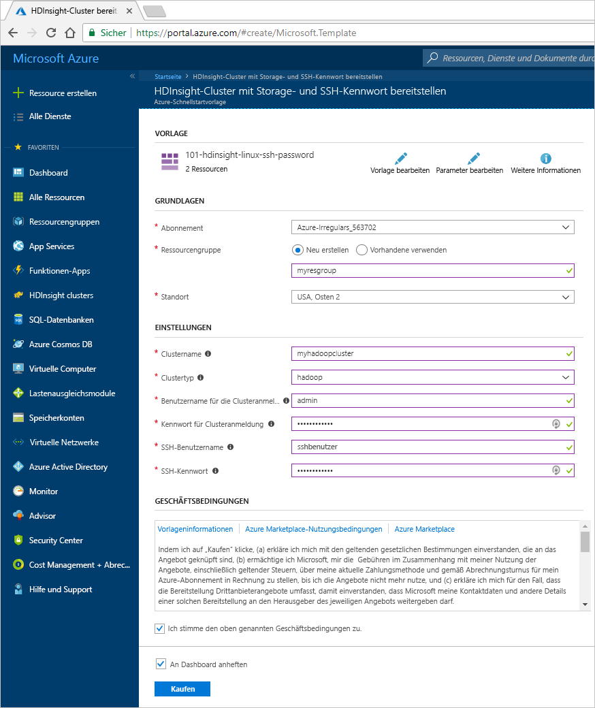
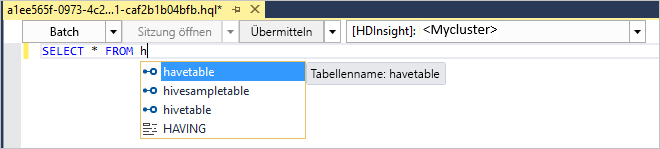
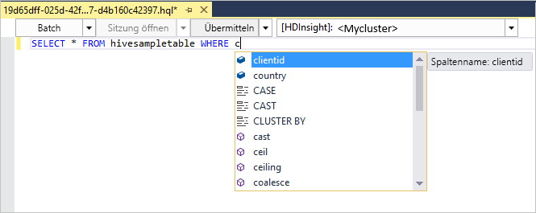
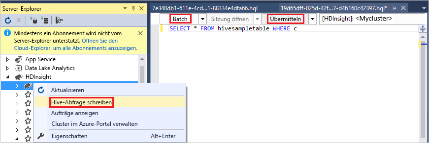
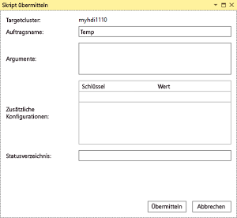
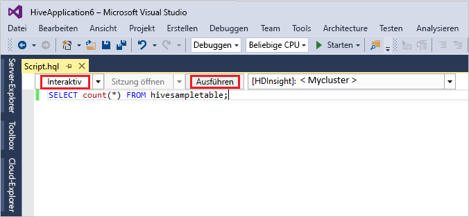
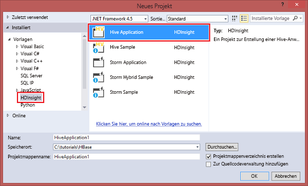
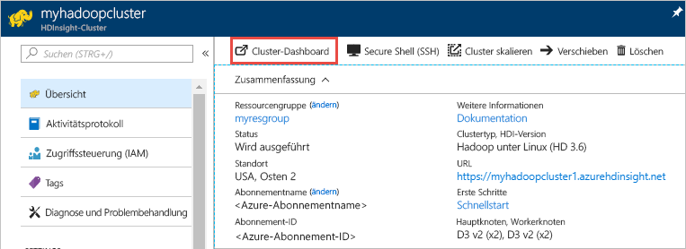
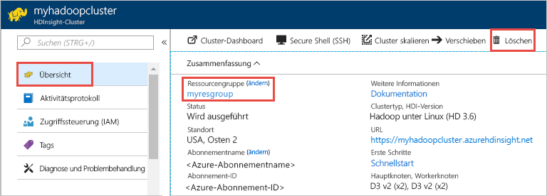

# <a name="quickstart-get-started-with-apache-hadoop-and-apache-hive-in-azure-hdinsight-using-resource-manager-template"></a>Schnellstart: Erste Schritte mit Apache Hadoop und Apache Hive in Azure HDInsight mit einer Resource Manager-Vorlage

In diesem Artikel erfahren Sie, wie Sie mit einer Resource Manager-Vorlage [Apache Hadoop](https://hadoop.apache.org/)-Cluster in HDInsight erstellen und dann Hive-Aufträge in HDInsight ausführen. Die meisten Hadoop-Aufträge sind Batchaufträge. Sie erstellen einen Cluster, führen einige Aufträge aus und löschen dann den Cluster. In diesem Artikel führen Sie alle drei Aufgaben durch.

In diesem Schnellstarttutorial verwenden Sie eine Resource Manager-Vorlage, um einen HDInsight-Hadoop-Cluster zu erstellen. Sie können einen Cluster auch im [Azure-Portal](apache-hadoop-linux-create-cluster-get-started-portal.md) erstellen.  Ähnliche Vorlagen finden Sie unter [Azure-Schnellstartvorlagen](https://azure.microsoft.com/resources/templates/?resourceType=Microsoft.Hdinsight&pageNumber=1&sort=Popular). Die Vorlagenreferenz finden Sie [hier](https://docs.microsoft.com/azure/templates/microsoft.hdinsight/allversions).

Zurzeit stehen in HDInsight [sieben verschiedene Clustertypen](./apache-hadoop-introduction.md#cluster-types-in-hdinsight) zur Verfügung. Jeder Clustertyp unterstützt eine andere Gruppe von Komponenten. Alle Clustertypen unterstützen Hive. Eine Liste mit den unterstützten Komponenten in HDInsight finden Sie unter [Neuheiten in den von HDInsight bereitgestellten Hadoop-Clusterversionen](../hdinsight-component-versioning.md)  

Wenn Sie kein Azure-Abonnement besitzen, können Sie ein [kostenloses Konto](https://azure.microsoft.com/free/) erstellen, bevor Sie beginnen.

<a name="create-cluster"></a>
## <a name="create-a-hadoop-cluster"></a>Erstellen eines Hadoop-Clusters

In diesem Abschnitt erstellen Sie einen Hadoop-Cluster in HDInsight mit einer Azure Resource Manager-Vorlage. Für diesen Artikel ist keine Erfahrung mit Resource Manager-Vorlagen erforderlich. 

1. Klicken Sie unten auf die Schaltfläche **Bereitstellung in Azure**, um sich bei Azure anzumelden und die Resource Manager-Vorlage im Azure-Portal zu öffnen. 
   
    <a href="https://portal.azure.com/#create/Microsoft.Template/uri/https%3A%2F%2Fraw.githubusercontent.com%2FAzure%2Fazure-quickstart-templates%2Fmaster%2F101-hdinsight-linux-ssh-password%2Fazuredeploy.json" target="_blank"></a>

2. Geben Sie die Werte wie im folgenden Screenshot vorgeschlagen ein, oder wählen Sie sie aus:

    > [!NOTE]  
    > Die Werte, die Sie angeben, müssen eindeutig sein und sollten den Benennungsrichtlinien folgen. Die Vorlage führt keine Überprüfungen durch. Wenn die Werte, die Sie angeben, bereits verwendet werden oder nicht den Richtlinien entsprechen, erhalten Sie eine Fehlermeldung, nachdem Sie die Vorlage übermittelt haben.    
    
    

    Geben Sie folgende Werte ein bzw. wählen diese aus:
    
    |Eigenschaft  |BESCHREIBUNG  |
    |---------|---------|
    |**Abonnement**     |  Wählen Sie Ihr Azure-Abonnement. |
    |**Ressourcengruppe**     | Erstellen Sie eine Ressourcengruppe, oder wählen Sie eine vorhandene Ressourcengruppe aus.  Bei einer Ressourcengruppe handelt es sich um einen Container mit Azure-Komponenten.  In diesem Fall enthält die Ressourcengruppe den HDInsight-Cluster und das abhängige Azure Storage-Konto. |
    |**Location**     | Wählen Sie den Azure-Speicherort aus, wo Sie Ihren Cluster erstellen möchten.  Je näher der Standort, desto besser die Leistung. |
    |**Clustername**     | Geben Sie einen Namen für den Hadoop-Cluster ein. Da für alle Cluster in HDInsight gemeinsam derselbe DNS-Namespace genutzt wird, muss dieser Name eindeutig sein. Der Name darf nur Kleinbuchstaben, Ziffern und Bindestriche enthalten und muss mit einem Buchstaben beginnen.  Vor und nach jedem Bindestrich muss ein Zeichen stehen, das kein Bindestrich ist.  Der Name muss außerdem zwischen 3 und 59 Zeichen lang sein. |
    |**Clustertyp**     | Wählen Sie **hadoop** aus. |
    |**Clusteranmeldename und Kennwort**     | Der Standardanmeldename lautet **admin**. Das Kennwort muss mindestens zehn Zeichen lang sein und mindestens eine Ziffer, einen Groß- und einen Kleinbuchstaben sowie ein nicht alphanumerisches Zeichen enthalten (mit Ausnahme folgender Zeichen: ' " ` \)). Stellen Sie sicher, dass Sie **keine** häufig verwendeten Kennwörter wie „Pass@word1“ angeben.|
    |**SSH-Benutzername und Kennwort**     | Der Standardbenutzername lautet **sshuser**.  Sie können den SSH-Benutzernamen umbenennen.  Für das SSH-Benutzerkennwort gelten die gleichen Anforderungen wie für das Clusteranmeldekennwort.|
       
    Einige Eigenschaften wurden in der Vorlage hartcodiert.  Diese Werte können über die Vorlage konfiguriert werden. Eine ausführlichere Erläuterung dieser Eigenschaften finden Sie unter [Erstellen von Linux-basierten Apache Hadoop-Clustern in HDInsight](../hdinsight-hadoop-provision-linux-clusters.md).

3. Wählen Sie **Ich stimme den oben genannten Geschäftsbedingungen zu**, und wählen Sie anschließend **Kaufen** aus. Sie erhalten eine Benachrichtigung, dass die Bereitstellung aktuell ausgeführt wird.  Das Erstellen eines Clusters dauert ca. 20 Minuten.

4. Nachdem der Cluster erstellt wurde, erhalten Sie eine Benachrichtigung **Bereitstellung erfolgreich** mit einem Link **Zu Ressourcengruppe navigieren**.  Ihre Seite **Ressourcengruppe** listet den neuen HDInsight-Cluster und den mit dem Cluster verbundenen Standardspeicher auf. Jeder Cluster verfügt über eine Abhängigkeit von einem [Azure Storage-Konto](../hdinsight-hadoop-use-blob-storage.md) oder einem [Azure Data Lake Storage-Konto](../hdinsight-hadoop-use-data-lake-store.md). Es wird als Standardspeicherkonto bezeichnet. Der HDInsight-Cluster und das zugehörige Speicherkonto müssen sich in derselben Azure-Region befinden. Beim Löschen von Clustern wird das Speicherkonto nicht gelöscht.

> [!NOTE]  
> Andere Methoden zur Erstellung von Clustern und Informationen zu den in diesem Tutorial verwendeten Eigenschaften finden Sie unter [Erstellen von HDInsight-Clustern](../hdinsight-hadoop-provision-linux-clusters.md).       


## <a name="use-vscode-to-run-hive-queries"></a>Ausführen von Hive-Abfragen mithilfe von VS Code

Informationen zur Verwendung von HDInsight Tools in VS Code finden Sie unter [Verwenden von Azure HDInsight Tools for Visual Studio Code](../hdinsight-for-vscode.md).

### <a name="submit-interactive-hive-queries"></a>Übermitteln interaktiver Hive-Abfragen

Mit HDInsight Tools for Visual Studio Code können Sie interaktive Hive-Abfragen an HDInsight Interactive Query-Cluster übermitteln.

1. Erstellen Sie einen neuen Arbeitsordner und eine neue Hive-Skriptdatei, falls Sie über keine verfügen.

2. Stellen Sie eine Verbindung mit Ihrem Azure-Konto her, und konfigurieren Sie anschließend den Standardcluster, sofern Sie diese Schritte noch nicht ausgeführt haben.

3. Kopieren Sie den folgenden Code, fügen Sie ihn in Ihre Hive-Datei ein, und speichern Sie sie.

    ```hiveql
    SELECT * FROM hivesampletable;
    ```
4. Klicken Sie mit der rechten Maustaste auf den Skript-Editor, und wählen Sie anschließend **HDInsight: Hive Interactive** aus, um die Abfrage zu übermitteln. Über das Kontextmenü können Sie anstelle der gesamten Skriptdatei auch einen Codeblock übermitteln. Das Abfrageergebnis wird kurz darauf auf einer neuen Registerkarte angezeigt.

   

    - Bereich **ERGEBNISSE**: Sie können das gesamte Ergebnis als CSV-, JSON- oder Excel-Datei in einem lokalen Pfad speichern oder einfach mehrere Zeilen auswählen.

    - Bereich **MELDUNGEN**: Wenn Sie auf die **Zeilennummer** klicken, gelangen Sie zur ersten Zeile des derzeit ausgeführten Skripts.

Verglichen mit dem [Ausführen eines Apache Hive-Batchauftrags](#submit-hive-batch-scripts) nimmt die interaktive Abfrage deutlich weniger Zeit in Anspruch.

### <a name="submit-hive-batch-scripts"></a>Übermitteln von Hive-Batchskripts

1. Erstellen Sie einen neuen Arbeitsordner und eine neue Hive-Skriptdatei, falls Sie über keine verfügen.

2. Stellen Sie eine Verbindung mit Ihrem Azure-Konto her, und konfigurieren Sie anschließend den Standardcluster, sofern Sie diese Schritte noch nicht ausgeführt haben.

3. Kopieren Sie den folgenden Code, fügen Sie ihn in Ihre Hive-Datei ein, und speichern Sie sie.

    ```hiveql
    SELECT * FROM hivesampletable;
    ```
4. Klicken Sie mit der rechten Maustaste auf den Skript-Editor, und wählen Sie anschließend **HDInsight: Hive Batch** aus, um einen Hive-Auftrag zu übermitteln. 

5. Wählen Sie den gewünschten Zielcluster für die Übermittlung aus.  

    Nach der Übermittlung eines Hive-Auftrags werden die Informationen zur erfolgreichen Übermittlung und die Auftrags-ID im Bereich **AUSGABE** angezeigt. Der Hive-Auftrag öffnet auch den **Webbrowser**, in dem die Auftragsprotokolle und der Status in Echtzeit angezeigt werden.

   

Das [Übermitteln interaktiver Apache Hive-Abfragen](#submit-interactive-hive-queries) nimmt deutlich weniger Zeit in Anspruch als das Übermitteln eines Batchauftrags.

## <a name="use-visualstudio-to-run-hive-queries"></a>Ausführen von Hive-Abfragen mithilfe von Visual Studio

Informationen zur Verwendung von HDInsight Tools in Visual Studio finden Sie unter [Herstellen einer Verbindung mit Azure HDInsight und Ausführen von Hive-Abfragen mithilfe von Data Lake Tools für Visual Studio](./apache-hadoop-visual-studio-tools-get-started.md).

### <a name="run-hive-queries"></a>Ausführen von Hive-Abfragen

Zum Erstellen und Ausführen von Hive-Abfragen stehen Ihnen zwei Möglichkeiten zur Auswahl:

* Erstellen von Ad-hoc-Abfragen
* Erstellen einer Hive-Anwendung

So können Sie Ad-hoc-Abfragen erstellen und ausführen:

1. Klicken Sie im **Server-Explorer** auf **Azure** > **HDInsight-Cluster**.

2. Klicken Sie mit der rechten Maustaste auf den Cluster, in dem Sie die Abfrage ausführen möchten, und wählen Sie dann **Write a Hive Query** (Hive-Abfrage schreiben) aus.  

3. Geben Sie die Hive-Abfragen ein. 

    Der Hive-Editor unterstützt IntelliSense. Data Lake Tools für Visual Studio unterstützt das Laden von Remotemetadaten, wenn Sie Ihr Hive-Skript bearbeiten. Wenn Sie beispielsweise **SELECT * FROM** eingeben, listet IntelliSense alle vorgeschlagenen Tabellennamen auf. Wird ein Tabellenname angegeben, listet IntelliSense die Spaltennamen auf. Die Tools unterstützen die meisten Hive-DML-Anweisungen, Unterabfragen und integrierte UDFs.
   
    
   
    
   
   > [!NOTE]  
   > IntelliSense schlägt nur die Metadaten des Clusters vor, der auf der HDInsight-Symbolleiste ausgewählt ist.
   > 
   
4. Klicken Sie auf **Submit** (Senden) oder **Submit (Advanced)** (Erweitertes Senden). 
   
    

   Wenn Sie die Option für erweitertes Senden auswählen, konfigurieren Sie den **Auftragsnamen**, **Argumente**, **zusätzliche Konfigurationen** und das **Statusverzeichnis** für das Skript:

    

   Ausführen interaktiver Hive-Abfragen

   * Klicken Sie auf den Abwärtspfeil, und wählen Sie **Interaktiv** aus. 
   
   * Klicken Sie auf **Ausführen**.

   

So erstellen Sie eine Hive-Lösung und führen Sie sie aus:

1. Klicken Sie im Menü **Datei** auf **Neu** und anschließend auf **Projekt**.
2. Wählen Sie im linken Bereich **HDInsight** aus. Wählen Sie im mittleren Bereich **Hive Application** (Hive-Anwendung) aus. Geben Sie die Eigenschaften ein, und klicken Sie dann auf **OK**.
   
    
3. Doppelklicken Sie im **Projektmappen-Explorer** auf **Script.hql**, um das Skript zu öffnen.
4. Geben Sie die Hive-Abfragen ein, und klicken Sie auf „Übermitteln“. (Schritte 3 und 4 weiter oben)  


## <a name="run-hive-queries"></a>Ausführen von Hive-Abfragen

[Apache Hive](hdinsight-use-hive.md) ist die am häufigsten in HDInsight verwendete Komponente. Es gibt viele Verfahren zum Ausführen von Hive-Aufträgen in HDInsight. In diesem Tutorial verwenden Sie die Ambari Hive-Ansicht aus dem Portal. Andere Methoden zum Übermitteln von Hive-Aufträgen finden Sie unter [Verwenden von Apache Hive in HDInsight](hdinsight-use-hive.md).

1. Um Ambari zu öffnen, wählen Sie auf der Kachel **Clusterdashboards** die Option **Ambari-Ansichten** aus.  Sie können auch zu **https://&lt;Clustername&gt;.azurehdinsight.net** navigieren, wobei &lt;Clustername&gt; der Cluster ist, den Sie im letzten Abschnitt erstellt haben.

    

2. Geben Sie den Hadoop-Benutzernamen, den Sie beim Erstellen des Clusters angegeben haben, und das dazugehörige Kennwort ein. Der Standard-Benutzername lautet **admin**.

3. Wählen Sie **Hive View 2.0** wie im folgenden Screenshot dargestellt aus:
   
    

4. Fügen Sie auf der Registerkarte **ABFRAGE** die folgenden HiveQL-Anweisungen in das Arbeitsblatt ein:
   
        SHOW TABLES;

    
   
   > [!NOTE]  
   > Für Hive ist ein Semikolon erforderlich.       


5. Wählen Sie **Execute**(Ausführen). Die Registerkarte **ERGEBNISSE** wird unterhalb der Registerkarte **ABFRAGE** angezeigt und enthält Informationen zum Auftrag. 
   
    Nach Abschluss der Abfrage werden auf der Registerkarte **ABFRAGE** die Ergebnisse des Vorgangs angezeigt. Sie sehen eine Tabelle mit dem Namen **hivesampletable**. Die ist eine Hive-Beispieltabelle mit allen HDInsight-Clustern.
   
    

6. Wiederholen Sie die Schritte 4 und 5, um die folgende Abfrage ausführen:
   
        SELECT * FROM hivesampletable;
   
7. Sie können die Ergebnisse der Abfrage auch speichern. Wählen Sie die Menüschaltfläche rechts aus, und geben Sie an, ob Sie die Ergebnisse als CSV-Datei herunterladen oder in dem Speicherkonto speichern möchten, das dem Cluster zugeordnet ist.

    

Nachdem Sie einen Hive-Auftrag abgeschlossen haben, können Sie die [Ergebnisse in eine Azure SQL-Datenbank oder eine SQL Server-Datenbank](apache-hadoop-use-sqoop-mac-linux.md) exportieren und die [Abfrageergebnisse mithilfe von Excel visualisieren](apache-hadoop-connect-excel-power-query.md). Weitere Informationen zum Verwenden von Hive in HDInsight finden Sie unter [Verwenden von Apache Hive und HiveQL mit Apache Hadoop in HDInsight zum Analysieren einer Apache Log4j-Beispieldatei](hdinsight-use-hive.md).

## <a name="troubleshoot"></a>Problembehandlung

Falls beim Erstellen von HDInsight-Clustern Probleme auftreten, sehen Sie sich die [Voraussetzungen für die Zugriffssteuerung](../hdinsight-hadoop-create-linux-clusters-portal.md) an.

## <a name="clean-up-resources"></a>Bereinigen von Ressourcen
Nach Abschluss des Artikels kann es ratsam sein, den Cluster zu löschen. Mit HDInsight werden Ihre Daten im Azure-Speicher gespeichert, sodass Sie einen Cluster problemlos löschen können, wenn er nicht verwendet wird. Für einen HDInsight-Cluster fallen auch dann Gebühren an, wenn er nicht verwendet wird. Da die Gebühren für den Cluster erheblich höher sind als die Kosten für den Speicher, ist es sinnvoll, nicht verwendete Cluster zu löschen. 

> [!NOTE]  
> Wenn Sie *sofort* mit dem nächsten Tutorial fortfahren, um zu erfahren, wie Sie ETL-Vorgänge mithilfe von Hadoop in HDInsight ausführen, können Sie den Cluster weiterhin ausführen. Ansonsten müssen Sie in diesem Tutorial erneut einen Hadoop-Cluster erstellen. Wenn Sie jedoch nicht direkt mit dem nächsten Tutorial fortfahren, sollten Sie den Cluster jetzt löschen.

**So löschen Sie den Cluster bzw. das Standardspeicherkonto**

1. Wechseln Sie zurück zur Browserregisterkarte für das Azure-Portal. Die Seite mit der Clusterübersicht sollte angezeigt werden. Klicken Sie auf **Löschen**, wenn Sie nur den Cluster löschen, aber das Standardspeicherkonto behalten möchten.

    

2. Wenn Sie sowohl den Cluster als auch das Standardspeicherkonto löschen möchten, wählen Sie den Ressourcengruppennamen (im vorherigen Screenshot markiert) aus, um die Seite für die Ressourcengruppe zu öffnen.

3. Klicken Sie auf **Ressourcengruppe löschen**, um die Ressourcengruppe zu löschen, die den Cluster und das Standardspeicherkonto enthält. Beachten Sie, dass das Speicherkonto beim Löschen der Ressourcengruppe ebenfalls gelöscht wird. Wenn Sie das Speicherkonto beibehalten möchten, müssen Sie auswählen, dass nur der Cluster gelöscht werden soll.

## <a name="next-steps"></a>Nächste Schritte
In diesem Artikel haben Sie erfahren, wie Sie mithilfe einer Resource Manager-Vorlage einen Linux-basierten HDInsight-Cluster erstellen und einfache Hive-Abfragen ausführen. Im nächsten Artikel erfahren Sie, wie Sie mithilfe von Hadoop in HDInsight einen ETL-Vorgang zum Extrahieren, Transformieren und Laden von Daten ausführen.

> [!div class="nextstepaction"]
>[Extrahieren, Transformieren und Laden von Daten mithilfe von Apache Hive in HDInsight](../hdinsight-analyze-flight-delay-data-linux.md)

Wenn Sie mit eigenen Daten arbeiten und mehr darüber wissen möchten, wie Daten in HDInsight gespeichert oder verwendet werden, finden Sie weitere Informationen in folgenden Artikeln:

* Informationen zur Verwendung von Azure Storage durch HDInsight finden Sie unter [Verwenden von Azure Storage mit HDInsight](../hdinsight-hadoop-use-blob-storage.md).
* Informationen zum Erstellen eines HDInsight-Clusters mit Data Lake Storage finden Sie unter [Schnellstart: Einrichten von Clustern in HDInsight](../../storage/data-lake-storage/quickstart-create-connect-hdi-cluster.md)
* Informationen zum Hochladen von Daten in HDInsight finden Sie im Artikel zum [Hochladen von Daten für Hadoop-Aufträge in HDInsight](../hdinsight-upload-data.md).
* [Verwenden von Azure Data Lake Storage Gen2 mit Azure HDInsight-Clustern](../hdinsight-hadoop-use-data-lake-storage-gen2.md)

Weitere Informationen zur Datenanalyse mit HDInsight finden Sie in den folgenden Artikeln:

* Weitere Informationen zum Verwenden von Hive mit HDInsight (etwa zum Ausführen von Hive-Abfragen in Visual Studio) finden Sie unter [Verwenden von Apache Hive mit HDInsight](hdinsight-use-hive.md).
* Informationen zu Pig (einer Sprache zum Transformieren von Daten) finden Sie unter [Verwenden von Apache Pig mit HDInsight](hdinsight-use-pig.md).
* Informationen zu MapReduce (einer Möglichkeit zum Schreiben von Programmen, die Daten in Hadoop verarbeiten) finden Sie im Artikel zum [Verwenden von MapReduce mit HDInsight](hdinsight-use-mapreduce.md).
* Informationen zur Verwendung der HDInsight-Tools für Visual Studio zum Analysieren von Daten in HDInsight finden Sie unter [Erste Schritte bei der Verwendung von Hadoop-Tools für Visual Studio für HDInsight](apache-hadoop-visual-studio-tools-get-started.md).
* Informationen zum Analysieren von Daten in HDInsight unter Verwendung von HDInsight Tools for Visual Studio Code finden Sie unter [Verwenden von Azure HDInsight Tools for Visual Studio Code](../hdinsight-for-vscode.md).


Weitere Informationen zum Erstellen und Verwalten von HDInsight-Clustern finden Sie in folgenden Artikeln:

* Informationen zum Verwalten eines Linux-basierten HDInsight-Clusters finden Sie unter [Verwalten von HDInsight-Clustern mit Apache Ambari](../hdinsight-hadoop-manage-ambari.md).
* Informationen zu den Optionen, die Sie beim Erstellen eines HDInsight-Clusters auswählen können, finden Sie unter [Erstellen von HDInsight unter Linux mit benutzerdefinierten Optionen](../hdinsight-hadoop-provision-linux-clusters.md).

Weitere Informationen zum Erstellen von HDinsight-Clustern mithilfe von Azure Resource Manager-Vorlagen finden Sie unter:

* [Azure-Schnellstartvorlagen](https://azure.microsoft.com/resources/templates/?resourceType=Microsoft.Hdinsight&pageNumber=1&sort=Popular).
* [Azure-Vorlagenreferenz](https://docs.microsoft.com/azure/templates/microsoft.hdinsight/allversions).

[1]: ../HDInsight/apache-hadoop-visual-studio-tools-get-started.md

[hdinsight-provision]: hdinsight-provision-linux-clusters.md
[hdinsight-upload-data]: hdinsight-upload-data.md
[hdinsight-use-hive]: hdinsight-use-hive.md
[hdinsight-use-pig]: hdinsight-use-pig.md
