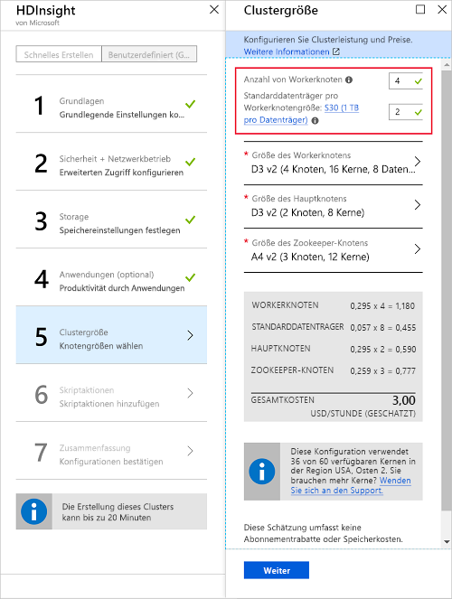

# <a name="start-with-apache-kafka-on-hdinsight"></a>Einstieg in Apache Kafka in HDInsight

Erfahren Sie, wie Sie ein [Apache Kafka](https://kafka.apache.org)-Cluster in Azure HDInsight erstellen und verwenden. Kafka ist eine verteilte Open Source-Streamingplattform, die für HDInsight verfügbar ist. Diese wird häufig als Nachrichtenbroker eingesetzt, da sie eine ähnliche Funktionalität wie eine Veröffentlichen-Abonnieren-Nachrichtenwarteschlange aufweist. Kafka wird häufig mit Apache Spark und Apache Storm für Messaging, Aktivitätsüberwachung, Streamaggregation oder Datentransformation verwendet.

[!INCLUDE [delete-cluster-warning](../../../includes/hdinsight-delete-cluster-warning.md)]

## <a name="create-a-kafka-cluster"></a>Erstellen eines Kafka-Clusters

Gehen Sie wie folgt vor, um einen Cluster vom Typ „Kafka in HDInsight“ zu erstellen:

1. Klicken Sie im [Azure-Portal](https://portal.azure.com) auf **+ Ressource erstellen**, **Daten + Analysen** und anschließend auf **HDInsight**.
   
    

2. Geben Sie unter **Grundlagen** Folgendes ein:

    * **Clustername**: Der Name des HDInsight-Clusters. Dieser Name muss eindeutig sein.
    * **Abonnement**: Wählen Sie das zu verwendende Abonnement aus.
    * **Clustertyp**: Wählen Sie diesen Eintrag aus, und legen Sie dann unter **Clusterkonfiguration** die folgenden Werte fest:

        * **Clustertyp**: Kafka
        * **Version**: Kafka 0.10.0 (HDI 3.6)

        Klicken Sie auf die Schaltfläche **Auswählen**, um die Clustertypeinstellungen zu speichern.

        

    * **Benutzername für Clusteranmeldung** und **Kennwort für Clusteranmeldung**: Die Anmeldung beim Zugriff auf den Cluster über HTTPS. Sie verwenden diese Anmeldeinformationen für den Zugriff auf Dienste wie z.B. die Ambari-Webbenutzeroberfläche oder die REST-API.
    * **Secure Shell (SSH)-Benutzername**: Die für den Clusterzugriff über SSH verwendete Anmeldung. Das Kennwort ist standardmäßig mit dem Kennwort für die Clusteranmeldung identisch.
    * **Ressourcengruppe**: Die Ressourcengruppe, in der der Cluster erstellt wird.
    * **Standort**: Die Azure-Region, in der der Cluster erstellt werden soll.

        > [!IMPORTANT]
        > Für Hochverfügbarkeit von Daten empfiehlt sich die Wahl eines Standorts (Region) mit __drei Fehlerdomänen__. Weitere Informationen finden Sie im Abschnitt [Hochverfügbarkeit von Daten](#data-high-availability).
   
 

3. Schließen Sie mit der Schaltfläche __Weiter__ die grundlegende Konfiguration ab.

4. Wählen Sie unter **Speicher** ein Speicherkonto aus, oder erstellen Sie eines. Behalten Sie für die Schritte in diesem Dokument für die weiteren Felder die Standardwerte bei. Speichern Sie mit der Schaltfläche __Weiter__ die Speicherkonfiguration.

    

5. Wählen Sie unter __Anwendungen (optional)__ zum Fortfahren __Weiter__ aus. Für dieses Beispiel sind keine Anwendungen erforderlich.

6. Wählen Sie unter __Clustergröße__ zum Fortfahren die Option __Weiter__ aus.

    > [!WARNING]
    > Um die Verfügbarkeit von Kafka in HDInsight zu gewährleisten, muss der Cluster mindestens drei Workerknoten enthalten. Weitere Informationen finden Sie im Abschnitt [Hochverfügbarkeit von Daten](#data-high-availability).

    

    > [!IMPORTANT]
    > Der Eintrag für **Datenträger pro Workerknoten** konfiguriert die Skalierbarkeit von Kafka in HDInsight. Kafka in HDInsight verwendet den lokalen Datenträger der virtuellen Computer im Cluster. Da Kafka sehr E/A-intensiv ist, wird [Azure Managed Disks](../../virtual-machines/windows/managed-disks-overview.md) verwendet, um einen hohen Durchsatz zu ermöglichen und mehr Speicher pro Knoten bereitzustellen. Der Typ des verwalteten Datenträgers kann entweder __Standard__ (HDD) oder __Premium__ (SSD) sein. Premium-Datenträger werden mit virtuellen Computern der DS- und GS-Serie verwendet. Alle anderen virtuellen Computertypen verwenden den Standardtyp.

7. Wählen Sie unter __Erweiterte Einstellungen__ die Option __Weiter__ aus, um fortzufahren.

8. Überprüfen Sie unter **Zusammenfassung** die Konfiguration für den Cluster. Ändern Sie ggf. falsche Einstellungen mithilfe der Link zum __Bearbeiten__. Verwenden Sie abschließend die Schaltfläche__Erstellen__, um den Cluster zu erstellen.
   
    
   
    > [!NOTE]
    > Das Erstellen des Clusters kann bis zu 20 Minuten dauern.

## <a name="connect-to-the-cluster"></a>Verbinden mit dem Cluster

> [!IMPORTANT]
> Für die folgenden Schritte muss ein SSH-Client verwendet werden. Weitere Informationen finden Sie im Dokument [Herstellen einer Verbindung mit HDInsight (Hadoop) per SSH](../hdinsight-hadoop-linux-use-ssh-unix.md).

Geben Sie den SSH-Benutzerkontonamen und den Namen Ihres Clusters an, um eine SSH-Verbindung mit dem Cluster herzustellen. Ersetzen Sie im folgenden Beispiel `sshuser` und `clustername` durch den Namen Ihres Kontos bzw. durch den Namen Ihres Clusters:

```ssh sshuser@clustername-ssh.azurehdinsight.net```

Geben Sie bei Aufforderung das Kennwort ein, das Sie für das SSH-Konto verwendet haben.

Informationen hierzu finden Sie unter [Verwenden von SSH mit Linux-basiertem Hadoop in HDInsight unter Linux, Unix oder OS X](../hdinsight-hadoop-linux-use-ssh-unix.md).

## <a id="getkafkainfo"></a>Beschaffen der Zookeeper- und Broker-Hostinformationen

Bei Verwendung von Kafka müssen Ihnen die *Zookeeper*-Hosts und die *Broker*-Hosts bekannt sein. Diese Hosts werden zusammen mit der Kafka-API und vielen Hilfsprogrammen verwendet, die in Kafka enthalten sind.

Gehen Sie wie folgt vor, um die Umgebungsvariablen mit den Hostinformationen zu erstellen:

1. Verwenden Sie für eine SSH-Verbindung mit dem Cluster den folgenden Befehl, um das Hilfsprogramm `jq` zu installieren. Dieses Hilfsprogramm wird verwendet, um JSON-Dokumente zu analysieren, und es ist beim Beschaffen der Broker-Hostinformationen hilfreich:
   
    ```bash
    sudo apt -y install jq
    ```

2. Verwenden Sie den folgenden Befehl, um eine Umgebungsvariable auf den Namen des Clusters festzulegen:

    ```bash
    read -p "Enter the HDInsight cluster name: " CLUSTERNAME
    ```

3. Verwenden Sie den folgenden Befehl, um eine Umgebungsvariable mit Zookeeper-Hostinformationen festzulegen:

    ```bash
    export KAFKAZKHOSTS=`curl -sS -u admin -G https://$CLUSTERNAME.azurehdinsight.net/api/v1/clusters/$CLUSTERNAME/services/ZOOKEEPER/components/ZOOKEEPER_SERVER | jq -r '["\(.host_components[].HostRoles.host_name):2181"] | join(",")' | cut -d',' -f1,2`
    ```

    Geben Sie das Kennwort des Anmeldekontos für den Cluster (admin) ein, wenn Sie dazu aufgefordert werden.

4. Vergewissern Sie sich mithilfe des folgenden Befehls, dass die Umgebungsvariable korrekt festgelegt ist:

    ```bash
     echo '$KAFKAZKHOSTS='$KAFKAZKHOSTS
    ```

    Die Ausgabe dieses Befehls sieht in etwa wie folgt aus:

    `zk0-kafka.eahjefxxp1netdbyklgqj5y1ud.ex.internal.cloudapp.net:2181,zk2-kafka.eahjefxxp1netdbyklgqj5y1ud.ex.internal.cloudapp.net:2181`

5. Verwenden Sie den folgenden Befehl, um eine Umgebungsvariable mit Kafka-Brokerhostinformationen festzulegen:

    ```bash
    export KAFKABROKERS=`curl -sS -u admin -G https://$CLUSTERNAME.azurehdinsight.net/api/v1/clusters/$CLUSTERNAME/services/KAFKA/components/KAFKA_BROKER | jq -r '["\(.host_components[].HostRoles.host_name):9092"] | join(",")' | cut -d',' -f1,2`
    ```

    Geben Sie das Kennwort des Anmeldekontos für den Cluster (admin) ein, wenn Sie dazu aufgefordert werden.

6. Vergewissern Sie sich mithilfe des folgenden Befehls, dass die Umgebungsvariable korrekt festgelegt ist:

    ```bash   
    echo '$KAFKABROKERS='$KAFKABROKERS
    ```

    Die Ausgabe dieses Befehls sieht in etwa wie folgt aus:
   
    `wn1-kafka.eahjefxxp1netdbyklgqj5y1ud.cx.internal.cloudapp.net:9092,wn0-kafka.eahjefxxp1netdbyklgqj5y1ud.cx.internal.cloudapp.net:9092`
   
> [!WARNING]
> Verlassen Sie sich bei den Informationen, die bei dieser Sitzung zurückgegeben werden, nicht ohne Prüfung darauf, dass sie immer korrekt sind. Wenn Sie den Cluster skalieren, werden neue Broker hinzugefügt oder entfernt. Wenn ein Fehler auftritt und ein Knoten ersetzt wird, kann sich der Hostname für den Knoten ändern.
>
> Es empfiehlt sich, die Zookeeper- und Brokerhostinformationen kurz vor ihrer Verwendung abzurufen, um sicherzustellen, dass Sie über gültige Informationen verfügen.

## <a name="create-a-topic"></a>Erstellen eines Themas

Kafka speichert Datenströme in Kategorien, die als *Themen* bezeichnet werden. Verwenden Sie für eine SSH-Verbindung mit einem Clusterhauptknoten ein in Kafka enthaltenes Skript, um ein Thema zu erstellen:

```bash
/usr/hdp/current/kafka-broker/bin/kafka-topics.sh --create --replication-factor 3 --partitions 8 --topic test --zookeeper $KAFKAZKHOSTS
```

Mit diesem Befehl wird unter Verwendung der in `$KAFKAZKHOSTS` gespeicherten Informationen eine Verbindung mit Zookeeper hergestellt. Anschließend wird ein Kafka-Thema mit dem Namen **test** erstellt. Sie können überprüfen, ob das Thema erstellt wurde, indem Sie das folgende Skript zum Auflisten von Themen verwenden:

```bash
/usr/hdp/current/kafka-broker/bin/kafka-topics.sh --list --zookeeper $KAFKAZKHOSTS
```

In der Ausgabe dieses Befehls werden die Kafka-Themen im Cluster aufgelistet.

## <a name="produce-and-consume-records"></a>Erstellen und Nutzen von Datensätzen

Bei Kafka werden *Datensätze* in Themen gespeichert. Datensätze werden von *Producern* erstellt und von *Consumern* genutzt. Producer erzeugen Datensätze in Kafka-*Brokern*. Jeder Workerknoten in Ihrem HDInsight-Cluster ist ein Kafka-Broker.

Gehen Sie wie folgt vor, um Datensätze im zuvor erstellten Testthema zu speichern und sie anschließend mithilfe eines Consumers zu lesen:

1. Verwenden Sie in der SSH-Sitzung ein in Kafka enthaltenes Skript, um Datensätze in das Thema zu schreiben:
   
    ```bash
    /usr/hdp/current/kafka-broker/bin/kafka-console-producer.sh --broker-list $KAFKABROKERS --topic test
    ```
   
    Nach diesem Befehl erreichen Sie eine leere Zeile.

2. Geben Sie eine Textnachricht in die leere Zeile ein, und drücken Sie die EINGABETASTE. Geben Sie auf diese Weise mehrere Nachrichten ein, und drücken Sie anschließend **STRG+C**, um zur normalen Eingabeaufforderung zurückzukehren. Die einzelnen Zeilen werden jeweils als separater Datensatz an das Kafka-Thema gesendet.

3. Verwenden Sie ein in Kafka enthaltenes Skript, um Datensätze aus dem Thema zu lesen:
   
    ```bash
    /usr/hdp/current/kafka-broker/bin/kafka-console-consumer.sh --bootstrap-server $KAFKABROKERS --topic test --from-beginning
    ```
   
    Die Datensätze werden mit dem Befehl aus dem Thema abgerufen und angezeigt. Mit `--from-beginning` wird der Consumer angewiesen, am Anfang des Datenstroms zu beginnen, damit alle Datensätze abgerufen werden.

    > [!NOTE]
    > Falls Sie eine ältere Version von Kafka verwenden, ersetzen Sie `--bootstrap-server $KAFKABROKERS` durch `--zookeeper $KAFKAZKHOSTS`.

4. Drücken Sie __STRG+C__, um den Consumer zu beenden.

Sie können Producer und Consumer auch programmgesteuert erstellen. Ein Beispiel für die Verwendung dieser API finden Sie im Dokument [Apache Kafka Producer and Consumer APIs](apache-kafka-producer-consumer-api.md) (Apache Kafka – Producer- und Consumer-APIs).

## <a name="data-high-availability"></a>Hochverfügbarkeit von Daten

Jede Azure-Region (Standort) verfügt über _Fehlerdomänen_. Eine Fehlerdomäne ist eine logische Gruppierung von zugrundeliegender Hardware in einem Azure-Rechenzentrum. Jede Fehlerdomäne verwendet eine Stromquelle und einen Netzwerkswitch gemeinsam. Die virtuellen Computer und verwalteten Datenträger, die die Knoten innerhalb eines HDInsight-Clusters implementieren, werden auf diese Fehlerdomänen verteilt. Diese Architektur schränkt die potenziellen Auswirkungen physischer Hardwarefehler ein.

Informationen zur Anzahl von Fehlerdomänen in einer Region finden Sie im Dokument [Verwalten der Verfügbarkeit virtueller Linux-Computer](../../virtual-machines/windows/manage-availability.md#use-managed-disks-for-vms-in-an-availability-set).

> [!IMPORTANT]
> Verwenden Sie nach Möglichkeit eine Azure-Region mit drei Fehlerdomänen, und erstellen Sie Themen mit dem Replikationsfaktor 3.

Verwenden Sie bei Verwendung einer Region mit nur zwei Fehlerdomänen den Replikationsfaktor 4, um die Replikate gleichmäßig auf die beiden Fehlerdomänen zu verteilen.

### <a name="kafka-and-fault-domains"></a>Kafka und Fehlerdomänen

Fehlerdomänen sind Kafka nicht bekannt. Beim Erstellen von Partitionsreplikaten für Themen kann es daher vorkommen, dass die Replikate nicht ordnungsgemäß für Hochverfügbarkeit verteilt werden. Verwenden Sie das [Tool zum Ausgleichen von Kafka-Partitionen](https://github.com/hdinsight/hdinsight-kafka-tools), um Hochverfügbarkeit zu gewährleisten. Dieses Tool muss über eine SSH-Sitzung für den Hauptknoten des Kafka-Clusters ausgeführt werden.

Um die höchste Verfügbarkeit Ihrer Kafka-Daten sicherzustellen, sollten Sie die Partitionsreplikate für Ihr Thema in folgenden Fällen ausgleichen:

* Wenn ein neues Thema oder eine neue Partition erstellt wird

* Wenn Sie einen Cluster zentral hochskalieren

## <a name="delete-the-cluster"></a>Löschen des Clusters

[!INCLUDE [delete-cluster-warning](../../../includes/hdinsight-delete-cluster-warning.md)]

## <a name="troubleshoot"></a>Problembehandlung

Falls beim Erstellen von HDInsight-Clustern Probleme auftreten, sehen Sie sich die [Voraussetzungen für die Zugriffssteuerung](../hdinsight-administer-use-portal-linux.md#create-clusters) an.

## <a name="next-steps"></a>Nächste Schritte

In diesem Dokument wurden die Grundlagen der Arbeit mit Apache Kafka in HDInsight beschrieben. Verwenden Sie Folgendes, um weitere Informationen zur Verwendung von Kafka zu erhalten:

* [Analysieren von Kafka-Protokollen](apache-kafka-log-analytics-operations-management.md)
* [Replizieren von Daten zwischen Kafka-Clustern](apache-kafka-mirroring.md)
* [Kafka Producer- und Consumer-APIs mit HDInsight](apache-kafka-producer-consumer-api.md)
* [Kafka Streams-API mit HDInsight](apache-kafka-streams-api.md)
* [Verwenden von Apache Spark-Streaming (DStream) mit Kafka in HDInsight](../hdinsight-apache-spark-with-kafka.md)
* [Verwenden von strukturiertem Spark-Streaming mit Kafka in HDInsight](../hdinsight-apache-kafka-spark-structured-streaming.md)
* [Verwenden von strukturiertem Apache Spark-Streaming zum Verschieben von Daten aus Kafka in HDInsight nach Cosmos DB](../apache-kafka-spark-structured-streaming-cosmosdb.md)
* [Verwenden von Apache Storm mit Kafka in HDInsight](../hdinsight-apache-storm-with-kafka.md)
* [Herstellen einer Verbindung mit Kafka über eine Azure Virtual Network-Instanz](apache-kafka-connect-vpn-gateway.md)
* [Verwenden von Kafka mit Azure Container Service](apache-kafka-azure-container-services.md)
* [Use Kafka on HDInsight from an Azure Function app](apache-kafka-azure-functions.md) (Verwenden von Kafka in HDInsight über eine Azure-Funktionen-App)
