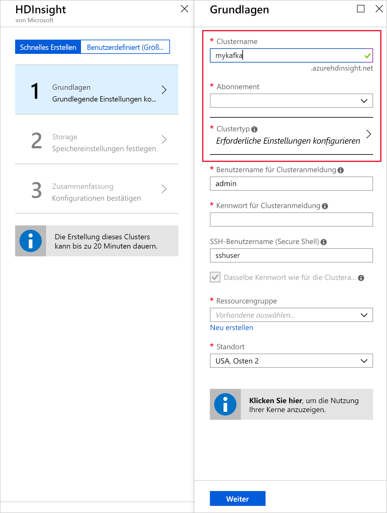
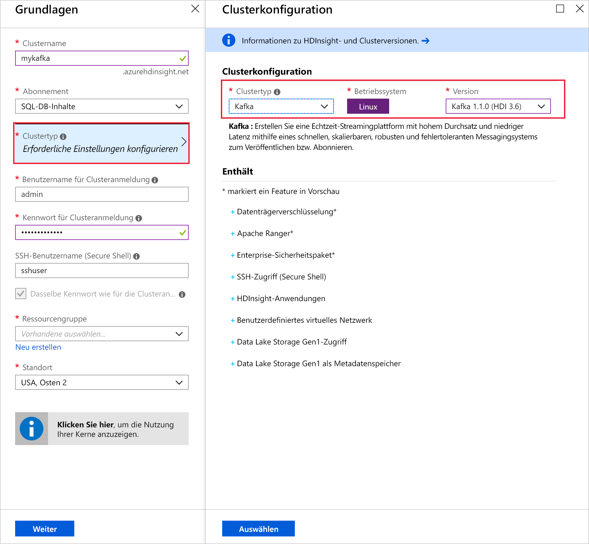
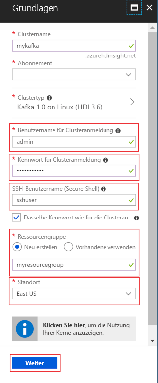
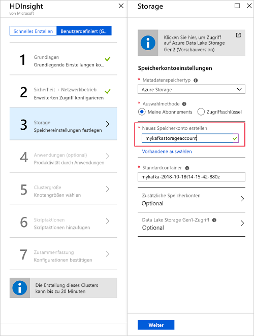
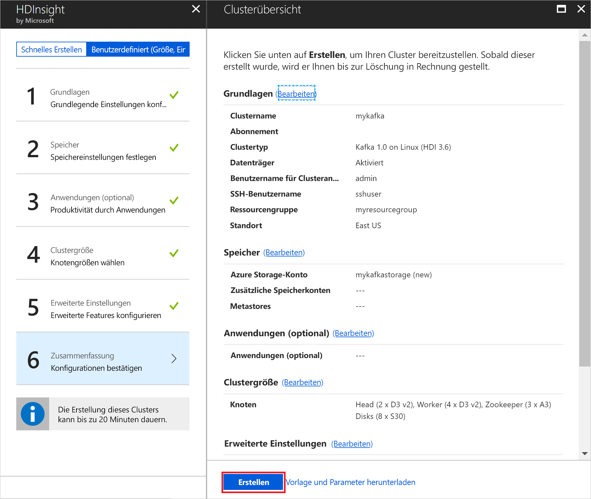

# <a name="quickstart-create-a-kafka-on-hdinsight-cluster"></a>Schnellstart: Erstellen eines Kafka-Clusters in HDInsight

Kafka ist eine verteilte Open Source-Streamingplattform. Sie wird häufig als Nachrichtenbroker eingesetzt, da sie eine ähnliche Funktionalität wie eine Veröffentlichen-Abonnieren-Nachrichtenwarteschlange aufweist. 

In dieser Schnellstartanleitung lernen Sie, wie Sie mithilfe des Azure-Portals einen [Apache Kafka](https://kafka.apache.org)-Cluster erstellen. Außerdem erfahren Sie, wie Sie mithilfe von enthaltenen Hilfsprogrammen Nachrichten mit Kafka senden und empfangen.

[!INCLUDE [delete-cluster-warning](../../../includes/hdinsight-delete-cluster-warning.md)]

> [!IMPORTANT]
> Auf die Kafka-API kann nur von Ressourcen im gleichen virtuellen Netzwerk zugegriffen werden. In dieser Schnellstartanleitung greifen Sie über SSH direkt auf den Cluster zu. Wenn Sie eine Verbindung zwischen anderen Diensten, Netzwerken und virtuellen Computern und Kafka herstellen möchten, müssen Sie zunächst ein virtuelles Netzwerk und anschließend die Ressourcen in diesem Netzwerk erstellen.
>
> Weitere Informationen finden Sie im Dokument [Herstellen einer Verbindung mit Kafka in HDInsight über ein virtuelles Azure-Netzwerk](apache-kafka-connect-vpn-gateway.md).

## <a name="prerequisites"></a>Voraussetzungen

* Ein Azure-Abonnement. Wenn Sie kein Azure-Abonnement besitzen, können Sie ein [kostenloses Konto](https://azure.microsoft.com/free/?WT.mc_id=A261C142F) erstellen, bevor Sie beginnen.

* Einen SSH-Client. Bei den Schritten in diesem Dokument wird SSH für die Verbindungsherstellung mit dem Cluster verwendet.

    Der Befehl `ssh` wird auf Linux-, Unix- und macOS-Systemen standardmäßig bereitgestellt. Verwenden Sie unter Windows 10 eine der folgenden Methoden zum Installieren des `ssh`-Befehls:

    * Verwenden Sie [Azure Cloud Shell](https://docs.microsoft.com/azure/cloud-shell/quickstart). Cloud Shell stellt den `ssh`-Befehl bereit und kann für die Verwendung von Bash oder PowerShell als Shell-Umgebung konfiguriert werden.

    * [Installieren Sie das Windows-Subsystem für Linux](https://docs.microsoft.com/windows/wsl/install-win10). Die über den Microsoft Store verfügbaren Linux-Distributionen stellen den `ssh`-Befehl bereit.

    > [!IMPORTANT]
    > Bei den Schritten in diesem Dokument wird davon ausgegangen, dass Sie einen der oben genannten SSH-Clients verwenden. Wenn Sie einen anderen SSH-Client verwenden und Probleme feststellen, finden Sie weitere Informationen in der Dokumentation zu Ihrem SSH-Client.
    >
    > Weitere Informationen finden Sie im Dokument [Herstellen einer Verbindung mit HDInsight (Hadoop) per SSH](../hdinsight-hadoop-linux-use-ssh-unix.md).

## <a name="create-a-kafka-cluster"></a>Erstellen eines Kafka-Clusters

Gehen Sie wie folgt vor, um einen Cluster vom Typ „Kafka in HDInsight“ zu erstellen:

1. Klicken Sie im [Azure-Portal](https://portal.azure.com) auf **+ Ressource erstellen**, **Daten + Analysen** und anschließend auf **HDInsight**.
   
    

2. Geben Sie unter **Grundlagen** folgende Informationen ein, bzw. wählen Sie sie aus:

    | Einstellung | Wert |
    | --- | --- |
    | Clustername | Einen eindeutigen Namen für den HDInsight-Cluster. |
    | Abonnement | Wählen Sie Ihr Abonnement aus. |
    
    Wählen Sie __Clustertyp__ aus, um die **Clusterkonfiguration** zu öffnen.

    

3. Wählen Sie unter __Clusterkonfiguration__ die folgenden Werte aus:

    | Einstellung | Wert |
    | --- | --- |
    | Clustertyp | Kafka |
    | Version | Kafka 1.0.0 (HDI 3.6) |

    Klicken Sie auf die Schaltfläche **Auswählen**, um die Clustertypeinstellungen zu speichern und zu __Grundlagen__ zurückzukehren.

    

4. Geben Sie unter __Grundlagen__ folgende Informationen ein, bzw. wählen Sie sie aus:

    | Einstellung | Wert |
    | --- | --- |
    | Benutzername für Clusteranmeldung | Der Anmeldename für den Zugriff auf Webdienste oder REST-APIs, die im Cluster gehostet werden. Behalten Sie den Standardwert (admin) bei. |
    | Kennwort für Clusteranmeldung | Das Anmeldekennwort für den Zugriff auf Webdienste oder REST-APIs, die im Cluster gehostet werden. |
    | SSH-Benutzername (Secure Shell) | Die für den Clusterzugriff über SSH verwendete Anmeldung. Das Kennwort ist standardmäßig mit dem Kennwort für die Clusteranmeldung identisch. |
    | Ressourcengruppe | Die Ressourcengruppe, in der der Cluster erstellt wird. |
    | Speicherort | Die Azure-Region, in der der Cluster erstellt werden soll. |

    > [!TIP]
    > Jede Azure-Region (Standort) verfügt über _Fehlerdomänen_. Eine Fehlerdomäne ist eine logische Gruppierung von zugrundeliegender Hardware in einem Azure-Rechenzentrum. Jede Fehlerdomäne verwendet eine Stromquelle und einen Netzwerkswitch gemeinsam. Die virtuellen Computer und verwalteten Datenträger, die die Knoten innerhalb eines HDInsight-Clusters implementieren, werden auf diese Fehlerdomänen verteilt. Diese Architektur schränkt die potenziellen Auswirkungen physischer Hardwarefehler ein.
    >
    > Für Hochverfügbarkeit von Daten wählen Sie eine Region (Speicherort) mit __drei Fehlerdomänen__. Informationen zur Anzahl von Fehlerdomänen in einer Region finden Sie im Dokument [Verwalten der Verfügbarkeit virtueller Linux-Computer](../../virtual-machines/windows/manage-availability.md#use-managed-disks-for-vms-in-an-availability-set).

    

    Schließen Sie mit der Schaltfläche __Weiter__ die grundlegende Konfiguration ab.

5. Wählen Sie unter **Speicher** ein Speicherkonto aus, oder erstellen Sie eines. Behalten Sie für die Schritte in diesem Dokument für die weiteren Felder die Standardwerte bei. Speichern Sie mit der Schaltfläche __Weiter__ die Speicherkonfiguration. Weitere Informationen zur Verwendung von Data Lake Storage Gen2 finden Sie unter [Schnellstart: Einrichten von Hadoop-Clustern in HDInsight](../../storage/data-lake-storage/quickstart-create-connect-hdi-cluster.md).

    

6. Wählen Sie unter __Anwendungen (optional)__ zum Fortfahren mit den Standardeinstellungen __Weiter__ aus.

7. Wählen Sie unter __Clustergröße__ zum Fortfahren mit den Standardeinstellungen __Weiter__ aus.

    > [!IMPORTANT]
    > Um die Verfügbarkeit von Kafka in HDInsight zu gewährleisten, muss der Eintrag __Anzahl von Workerknoten__ mindestens auf 3 festgelegt werden. Der Standardwert ist 4.
    
    > [!TIP]
    > Der Eintrag für **Datenträger pro Workerknoten** konfiguriert die Skalierbarkeit von Kafka in HDInsight. Kafka in HDInsight verwendet den lokalen Datenträger der virtuellen Computer im Cluster, um Daten zu speichern. Da Kafka sehr E/A-intensiv ist, wird [Azure Managed Disks](../../virtual-machines/windows/managed-disks-overview.md) verwendet, um einen hohen Durchsatz zu ermöglichen und mehr Speicher pro Knoten bereitzustellen. Der Typ des verwalteten Datenträgers kann entweder __Standard__ (HDD) oder __Premium__ (SSD) sein. Der Typ des Datenträgers hängt von der VM-Größe ab, die von den Workerknoten (Kafka-Broker) verwendet werden. Premium-Datenträger werden automatisch mit virtuellen Computern der DS- und GS-Serie verwendet. Alle anderen virtuellen Computertypen verwenden den Standardtyp.

    

8. Wählen Sie unter __Erweiterte Einstellungen__ zum Fortfahren mit den Standardeinstellungen __Weiter__ aus.

9. Überprüfen Sie unter **Zusammenfassung** die Konfiguration für den Cluster. Ändern Sie ggf. falsche Einstellungen mithilfe der Link zum __Bearbeiten__. Verwenden Sie abschließend die Schaltfläche__Erstellen__, um den Cluster zu erstellen.
   
    
   
    > [!NOTE]
    > Das Erstellen des Clusters kann bis zu 20 Minuten dauern.

## <a name="connect-to-the-cluster"></a>Verbinden mit dem Cluster

1. Verwenden Sie zum Herstellen einer Verbindung mit dem primären Hauptknoten des Kafka-Clusters den folgenden Befehl. Ersetzen Sie `sshuser` durch den SSH-Benutzernamen. Ersetzen Sie `mykafka` durch den Namen des Kafka-Clusters:

    ```bash
    ssh sshuser@mykafka-ssh.azurehdinsight.net
    ```

2. Wenn Sie zum ersten Mal eine Verbindung mit dem Cluster herstellen, zeigt der SSH-Client unter Umständen eine Warnung mit dem Hinweis an, dass die Echtheit des Hosts nicht bestätigt werden kann. Geben Sie in diesem Fall __Ja__ ein, und drücken Sie dann die __EINGABETASTE__, um den Host der Liste mit den vertrauenswürdigen Servern des SSH-Clients hinzuzufügen.

3. Geben Sie nach Aufforderung das Kennwort für den SSH-Benutzer ein.

Nach der Verbindungsherstellung sehen die angezeigten Informationen in etwa wie folgt aus:

```text
Authorized uses only. All activity may be monitored and reported.
Welcome to Ubuntu 16.04.4 LTS (GNU/Linux 4.13.0-1011-azure x86_64)

 * Documentation:  https://help.ubuntu.com
 * Management:     https://landscape.canonical.com
 * Support:        https://ubuntu.com/advantage

  Get cloud support with Ubuntu Advantage Cloud Guest:
    http://www.ubuntu.com/business/services/cloud

83 packages can be updated.
37 updates are security updates.


Welcome to Kafka on HDInsight.

Last login: Thu Mar 29 13:25:27 2018 from 108.252.109.241
ssuhuser@hn0-mykafk:~$
```

## <a id="getkafkainfo"></a>Beschaffen der Zookeeper- und Broker-Hostinformationen

Bei der Verwendung von Kafka müssen Ihnen die *Zookeeper*- und die *Broker*-Hosts bekannt sein. Diese Hosts werden zusammen mit der Kafka-API und vielen Hilfsprogrammen verwendet, die in Kafka enthalten sind.

In diesem Abschnitt rufen Sie die Hostinformationen aus der Ambari-REST-API im Cluster ab.

1. Verwenden Sie für die SSH-Verbindung mit dem Cluster den folgenden Befehl, um das Hilfsprogramm `jq` zu installieren. Dieses Hilfsprogramm wird verwendet, um JSON-Dokumente zu analysieren, und es ist beim Beschaffen der Hostinformationen hilfreich:
   
    ```bash
    sudo apt -y install jq
    ```

2. Verwenden Sie den folgenden Befehl, um eine Umgebungsvariable auf den Namen des Clusters festzulegen:

    ```bash
    read -p "Enter the Kafka on HDInsight cluster name: " CLUSTERNAME
    ```

    Geben Sie bei entsprechender Aufforderung den Namen des Kafka-Clusters ein.

3. Verwenden Sie den folgenden Befehl, um eine Umgebungsvariable mit Zookeeper-Hostinformationen festzulegen:
    
    ```bash
    export KAFKAZKHOSTS=`curl -sS -u admin -G http://headnodehost:8080/api/v1/clusters/$CLUSTERNAME/services/ZOOKEEPER/components/ZOOKEEPER_SERVER | jq -r '["\(.host_components[].HostRoles.host_name):2181"] | join(",")' | cut -d',' -f1,2`
    ```

    > [!TIP]
    > Dieser Befehl fragt den Ambari-Dienst auf dem Hauptknoten des Clusters direkt ab. Auf Ambari kann auch über die öffentliche Adresse (`https://$CLUSTERNAME.azurehdinsight.net:80/`) zugegriffen werden. Einige Netzwerkkonfigurationen verhindern unter Umständen den Zugriff auf die öffentliche Adresse. Ein Beispiel wäre etwa die Verwendung von Netzwerksicherheitsgruppen (NSGs), um den Zugriff auf HDInsight in einem virtuellen Netzwerk einzuschränken.

    Geben Sie das Kennwort des Anmeldekontos für den Cluster (nicht des SSH-Kontos) ein, wenn Sie dazu aufgefordert werden.

    > [!NOTE]
    > Dieser Befehl ruft alle Zookeeper-Hosts ab und gibt dann nur die ersten beiden Einträge zurück. Diese Redundanz ist hilfreich, wenn ein Host nicht erreichbar ist.

4. Vergewissern Sie sich mithilfe des folgenden Befehls, dass die Umgebungsvariable korrekt festgelegt ist:

    ```bash
     echo '$KAFKAZKHOSTS='$KAFKAZKHOSTS
    ```

    Die Ausgabe dieses Befehls sieht in etwa wie folgt aus:

    `zk0-kafka.eahjefxxp1netdbyklgqj5y1ud.ex.internal.cloudapp.net:2181,zk2-kafka.eahjefxxp1netdbyklgqj5y1ud.ex.internal.cloudapp.net:2181`

5. Verwenden Sie den folgenden Befehl, um eine Umgebungsvariable mit Kafka-Brokerhostinformationen festzulegen:

    ```bash
    export KAFKABROKERS=`curl -sS -u admin -G http://headnodehost:8080/api/v1/clusters/$CLUSTERNAME/services/KAFKA/components/KAFKA_BROKER | jq -r '["\(.host_components[].HostRoles.host_name):9092"] | join(",")' | cut -d',' -f1,2`
    ```

    Geben Sie das Kennwort des Anmeldekontos für den Cluster (nicht des SSH-Kontos) ein, wenn Sie dazu aufgefordert werden.

6. Vergewissern Sie sich mithilfe des folgenden Befehls, dass die Umgebungsvariable korrekt festgelegt ist:

    ```bash   
    echo '$KAFKABROKERS='$KAFKABROKERS
    ```

    Die Ausgabe dieses Befehls sieht in etwa wie folgt aus:
   
    `wn1-kafka.eahjefxxp1netdbyklgqj5y1ud.cx.internal.cloudapp.net:9092,wn0-kafka.eahjefxxp1netdbyklgqj5y1ud.cx.internal.cloudapp.net:9092`

## <a name="manage-kafka-topics"></a>Verwalten von Kafka-Themen

Kafka speichert Datenströme in *Themen*. Mit dem Hilfsprogramm `kafka-topics.sh` können Sie Themen verwalten.

* Führen Sie folgenden Befehl in der SSH-Verbindung aus, **um ein Thema zu erstellen**:

    ```bash
    /usr/hdp/current/kafka-broker/bin/kafka-topics.sh --create --replication-factor 3 --partitions 8 --topic test --zookeeper $KAFKAZKHOSTS
    ```

    Mit diesem Befehl wird unter Verwendung der in `$KAFKAZKHOSTS` gespeicherten Informationen eine Verbindung mit Zookeeper hergestellt. Anschließend wird ein Kafka-Thema mit dem Namen **test** erstellt. 

    * In diesem Thema gespeicherte Daten werden auf acht Partitionen aufgeteilt.

    * Jede Partition wird auf drei Workerknoten im Cluster repliziert.

        > [!IMPORTANT]
        > Wenn Sie den Cluster in einer Azure-Region mit drei Fehlerdomänen erstellt haben, verwenden Sie den Replikationsfaktor 3. Verwenden Sie andernfalls den Replikationsfaktor 4.
        
        In Regionen mit drei Fehlerdomänen ermöglicht der Replikationsfaktor 3 die Verteilung von Replikaten auf die Fehlerdomänen. In Regionen mit zwei Fehlerdomänen ermöglicht der Replikationsfaktor 4 die gleichmäßige Verteilung von Replikaten auf die Domänen.
        
        Informationen zur Anzahl von Fehlerdomänen in einer Region finden Sie im Dokument [Verwalten der Verfügbarkeit virtueller Linux-Computer](../../virtual-machines/windows/manage-availability.md#use-managed-disks-for-vms-in-an-availability-set).

        > [!IMPORTANT] 
        > Azure-Fehlerdomänen sind Kafka nicht bekannt. Beim Erstellen von Partitionsreplikaten für Themen kann es daher vorkommen, dass die Replikate nicht ordnungsgemäß für Hochverfügbarkeit verteilt werden.

        Verwenden Sie das [Tool zum Ausgleichen von Kafka-Partitionen](https://github.com/hdinsight/hdinsight-kafka-tools), um Hochverfügbarkeit zu gewährleisten. Dieses Tool muss über eine SSH-Verbindung mit dem Hauptknoten des Kafka-Clusters ausgeführt werden.

        Um die höchste Verfügbarkeit Ihrer Kafka-Daten sicherzustellen, sollten Sie in folgenden Fällen die Partitionsreplikate für Ihr Thema ausgleichen:

        * Wenn ein neues Thema oder eine neue Partition erstellt wird

        * Wenn Sie einen Cluster zentral hochskalieren

* Verwenden Sie den folgenden Befehl, **um Themen aufzulisten**:

    ```bash
    /usr/hdp/current/kafka-broker/bin/kafka-topics.sh --list --zookeeper $KAFKAZKHOSTS
    ```

    Dieser Befehl listet die für den Kafka-Cluster verfügbaren Themen auf.

* Verwenden Sie zum **Löschen eines Themas** den folgenden Befehl:

    ```bash
    /usr/hdp/current/kafka-broker/bin/kafka-topics.sh --delete --topic topicname --zookeeper $KAFKAZKHOSTS
    ```

    Dieser Befehl löscht das Thema `topicname`.

    > [!WARNING]
    > Wenn Sie das zuvor erstellte Thema `test` löschen, müssen Sie es neu erstellen. Es wird weiter unten in diesem Dokument verwendet.

Wenn Sie weitere Informationen zu den mit dem Hilfsprogramm `kafka-topics.sh` verfügbaren Befehlen anzeigen möchten, verwenden Sie den folgenden Befehl:

```bash
/usr/hdp/current/kafka-broker/bin/kafka-topics.sh
```

## <a name="produce-and-consume-records"></a>Erstellen und Nutzen von Datensätzen

Bei Kafka werden *Datensätze* in Themen gespeichert. Datensätze werden von *Producern* erstellt und von *Consumern* genutzt. Producer und Consumer kommunizieren mit dem *Kafka-Brokerdienst*. Jeder Workerknoten in Ihrem HDInsight-Cluster ist ein Kafka-Brokerhost.

Gehen Sie wie folgt vor, um Datensätze im zuvor erstellten Testthema zu speichern und sie anschließend mithilfe eines Consumers zu lesen:

1. Verwenden Sie zum Schreiben von Datensätzen in das Thema das Hilfsprogramm `kafka-console-producer.sh` über die SSH-Verbindung:
   
    ```bash
    /usr/hdp/current/kafka-broker/bin/kafka-console-producer.sh --broker-list $KAFKABROKERS --topic test
    ```
   
    Nach diesem Befehl erreichen Sie eine leere Zeile.

2. Geben Sie eine Textnachricht in die leere Zeile ein, und drücken Sie die EINGABETASTE. Geben Sie auf diese Weise mehrere Nachrichten ein, und drücken Sie anschließend **STRG+C**, um zur normalen Eingabeaufforderung zurückzukehren. Die einzelnen Zeilen werden jeweils als separater Datensatz an das Kafka-Thema gesendet.

3. Verwenden Sie zum Lesen von Datensätzen aus dem Thema das Hilfsprogramm `kafka-console-consumer.sh` über die SSH-Verbindung:
   
    ```bash
    /usr/hdp/current/kafka-broker/bin/kafka-console-consumer.sh --bootstrap-server $KAFKABROKERS --topic test --from-beginning
    ```
   
    Die Datensätze werden mit dem Befehl aus dem Thema abgerufen und angezeigt. Mit `--from-beginning` wird der Consumer angewiesen, am Anfang des Datenstroms zu beginnen, damit alle Datensätze abgerufen werden.

    > [!NOTE]
    > Falls Sie eine ältere Version von Kafka verwenden, ersetzen Sie `--bootstrap-server $KAFKABROKERS` durch `--zookeeper $KAFKAZKHOSTS`.

4. Drücken Sie __STRG+C__, um den Consumer zu beenden.

Sie können Producer und Consumer auch programmgesteuert erstellen. Ein Beispiel für die Verwendung dieser API finden Sie im Dokument [Apache Kafka Producer and Consumer APIs](apache-kafka-producer-consumer-api.md) (Apache Kafka – Producer- und Consumer-APIs).

## <a name="clean-up-resources"></a>Bereinigen von Ressourcen

Um die Ressourcen zu bereinigen, die im Rahmen dieser Schnellstartanleitung erstellt wurden, können Sie die Ressourcengruppe löschen. Dadurch werden auch der zugeordnete HDInsight-Cluster sowie alle anderen Ressourcen gelöscht, die der Ressourcengruppe zugeordnet sind.

So entfernen Sie die Ressourcengruppe über das Azure-Portal:

1. Erweitern Sie im Azure-Portal das Menü auf der linken Seite, um das Menü mit den Diensten zu öffnen, und klicken Sie auf __Ressourcengruppen__, um die Liste mit Ihren Ressourcengruppen anzuzeigen.
2. Suchen Sie die zu löschende Ressourcengruppe, und klicken Sie mit der rechten Maustaste rechts neben dem Eintrag auf die Schaltfläche __Mehr__ (...).
3. Klicken Sie auf __Ressourcengruppe löschen__, und bestätigen Sie den Vorgang.

> [!WARNING]
> Die Abrechnung für einen HDInsight-Cluster beginnt, sobald der Cluster erstellt wurde, und endet mit dem Löschen des Clusters. Die Gebühren werden anteilig nach Minuten erhoben. Daher sollten Sie Ihren Cluster immer löschen, wenn Sie ihn nicht mehr verwenden.
> 
> Wenn Sie einen Kafka-Cluster in HDInsight löschen, werden auch alle in Kafka gespeicherten Daten gelöscht.

## <a name="next-steps"></a>Nächste Schritte

> [!div class="nextstepaction"]
> [Verwenden von Apache Spark mit Kafka](../hdinsight-apache-kafka-spark-structured-streaming.md)

