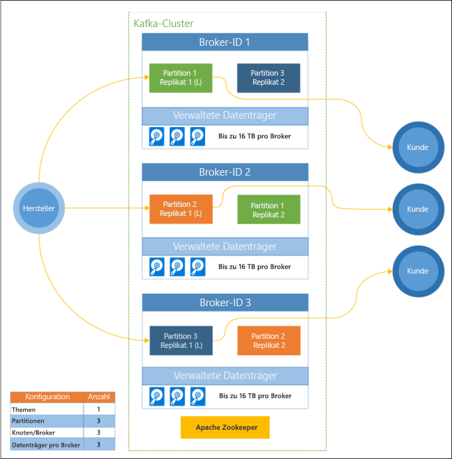

# Was ist Apache Kafka in Azure HDInsight?

[Apache Kafka](https://kafka.apache.org) ist eine verteilte Open Source-Streamingplattform, die zum Erstellen von Datenpipelines und Anwendungen mit Echtzeitstreaming verwendet werden kann. Kafka verfügt auch über Nachrichtenbrokerfunktionen, die einer Nachrichtenwarteschlange ähneln, über die Sie benannte Datenströme veröffentlichen und diese abonnieren können. 

Dies sind spezifische Merkmale von Kafka in HDInsight:

* Es ist ein verwalteter Dienst, der einen vereinfachten Konfigurationsprozess bereitstellt. Das Ergebnis ist eine von Microsoft getestete und unterstützte Konfiguration.

* Microsoft bietet eine 99,9%ige Vereinbarung zum Servicelevel (Service Level Agreement, SLA) für die Kafka-Betriebszeit. Weitere Informationen finden Sie im Dokument [SLA für HDInsight](https://azure.microsoft.com/support/legal/sla/hdinsight/v1_0/).

* Azure Managed Disks werden als Sicherungsspeicher für Kafka verwendet. Managed Disks können bis zu 16 TB Speicher pro Kafka-Broker bieten. Informationen zum Konfigurieren von verwalteten Datenträgern mit Kafka in HDInsight finden Sie unter [Konfigurieren von Speicher und Skalierbarkeit für Apache Kafka in HDInsight](apache-kafka-scalability.md).

    Weitere Informationen zu verwalteten Datenträgern finden Sie unter [Azure Managed Disks](../../virtual-machines/windows/managed-disks-overview.md).

* Kafka wurde mit einer einzelnen dimensionalen Ansicht eines Racks entworfen. Azure trennt ein Rack in zwei Dimensionen – Updatedomänen (UD) und Fehlerdomänen (FD). Microsoft stellt Tools bereit, die Kafka-Partitionen und -Replikate UDs und FDs übergreifend ausgleichen. 

    Weitere Informationen finden Sie unter [Hochverfügbarkeit Ihrer Daten mit Apache Kafka in HDInsight](apache-kafka-high-availability.md).

* Mit HDInsight können Sie die Anzahl von Workerknoten (zum Hosten des Kafka-Brokers) nach der Clustererstellung ändern. Die Skalierung kann über das Azure-Portal, Azure PowerShell und andere Azure-Verwaltungsoberflächen durchgeführt werden. Für Kafka sollten Sie für Partitionsreplikate nach Skalierungsvorgängen einen Ausgleichsvorgang durchführen. Durch das Ausgleichen von Partitionen kann für Kafka die neue Anzahl von Workerknoten genutzt werden.

    Weitere Informationen finden Sie unter [Hochverfügbarkeit Ihrer Daten mit Apache Kafka in HDInsight](apache-kafka-high-availability.md).

* Zur Überwachung von Kafka in HDInsight können Azure Monitor-Protokolle verwendet werden. Azure Monitor-Protokolle enthalten Informationen auf VM-Ebene. Hierzu zählen beispielsweise Datenträger- und NIC-Metriken sowie JMX-Metriken aus Kafka.

    Weitere Informationen finden Sie unter [Analysieren von Protokollen für Apache Kafka in HDInsight](apache-kafka-log-analytics-operations-management.md).

### Architektur von Apache Kafka in HDInsight

Das folgende Diagramm zeigt eine typische Kafka-Konfiguration, für die Consumergruppen, Partitionierung und Replikation verwendet werden, um eine parallele Ablesung von Ereignissen mit Fehlertoleranz zu ermöglichen:

Apache ZooKeeper verwaltet den Zustand des Kafka-Clusters. ZooKeeper ist für gleichzeitige, robuste Transaktionen mit geringer Latenz konzipiert. 

Kafka speichert Datensätze (Daten) in **Themen**. Datensätze werden von **Producern** erstellt und von **Consumern** genutzt. Producer senden Datensätze an Kafka-**Broker**. Jeder Workerknoten in Ihrem HDInsight-Cluster ist ein Kafka-Broker. 

Themen partitionieren Datensätze Broker übergreifend. Bei der Nutzung von Datensätzen können Sie bis zu einen Consumer pro Partition einsetzen, um parallele Verarbeitung der Daten zu erzielen.

Die Replikation wird genutzt, um die Partitionen auf Knoten zu duplizieren und für den Schutz vor Ausfällen von Knoten (Brokern) zu sorgen. Eine Partition, die im Diagramm mit einem *(L)* gekennzeichnet ist, ist jeweils die führende Partition. Producer-Datenverkehr wird an die führende Komponente jedes Knotens weitergeleitet, indem der von ZooKeeper verwaltete Zustand verwendet wird.

## Gründe für Apache Kafka in HDInsight

Im Folgenden sind allgemeine Aufgaben und Muster aufgelistet, die mithilfe von Kafka in HDInsight ausgeführt werden können:

* **Replikation von Apache Kafka-Daten:** Kafka verfügt über das MirrorMaker-Hilfsprogramm, mit dem Daten zwischen Kafka-Clustern repliziert werden.

    Informationen zur Verwendung von MirrorMaker finden Sie unter [Verwenden von MirrorMaker zum Replizieren von Apache Kafka-Themen mit Kafka in HDInsight](apache-kafka-mirroring.md).

* **Veröffentlichen-Abonnieren-Messagingmuster:** Kafka umfasst eine Producer-API zum Veröffentlichen von Datensätzen in einem Kafka-Thema. Die Consumer-API wird verwendet, wenn Sie ein Thema abonnieren.

    Weitere Informationen finden Sie unter [Schnellstart: Erstellen eines Apache Kafka-Clusters in HDInsight](apache-kafka-get-started.md).

* **Streamverarbeitung:** Kafka wird häufig zusammen mit Apache Storm oder Spark für die Echtzeit-Streamverarbeitung eingesetzt. Mit Kafka 0.10.0.0 (HDInsight-Version 3.5 und 3.6) wurde eine Streaming-API eingeführt, mit der Sie Streaminglösungen erstellen können, ohne dass Sie dafür Storm oder Spark benötigen.

    Weitere Informationen finden Sie unter [Schnellstart: Erstellen eines Apache Kafka-Clusters in HDInsight](apache-kafka-get-started.md).

* **Horizontale Skalierung:** Bei Kafka werden Streams über die Knoten im HDInsight-Cluster hinweg partitioniert. Consumerprozesse können einzelnen Partitionen zugeordnet werden, um beim Nutzen von Datensätzen für einen Lastenausgleich zu sorgen.

    Weitere Informationen finden Sie unter [Schnellstart: Erstellen eines Apache Kafka-Clusters in HDInsight](apache-kafka-get-started.md).

* **Geordnete Bereitstellung:** In jeder Partition werden die Datensätze im Stream in der Reihenfolge gespeichert, in der sie empfangen wurden. Indem ein Consumerprozess pro Partition zugeordnet wird, können Sie sicherstellen, dass die Datensätze in der richtigen Reihenfolge verarbeitet werden.

    Weitere Informationen finden Sie unter [Schnellstart: Erstellen eines Apache Kafka-Clusters in HDInsight](apache-kafka-get-started.md).

## Anwendungsfälle

* **Messaging:** Da das Veröffentlichen-Abonnieren-Messagingmuster unterstützt wird, wird Kafka häufig als Nachrichtenbroker genutzt.

* **Aktivitätsüberwachung:** Da Kafka die geordnete Protokollierung von Datensätzen unterstützt, kann die Anwendung zum Nachverfolgen und Neuerstellen von Aktivitäten verwendet werden. Beispiele hierfür sind Benutzeraktionen auf einer Website oder in einer Anwendung.

* **Aggregation**: Mit der Datenstromverarbeitung können Sie Informationen aus unterschiedlichen Datenströmen aggregieren, um die Informationen zu operativen Daten zu kombinieren und zu zentralisieren.

* **Transformation:** Mit der Datenstromverarbeitung können Sie Daten aus mehreren Eingabethemen zu einem oder mehreren Ausgabethemen kombinieren und erweitern.

## Nächste Schritte

Verwenden Sie die folgenden Links, um Informationen zur Verwendung von Apache Kafka unter HDInsight zu erhalten:

* [Schnellstart: Erstellen eines Apache Kafka-Clusters in HDInsight](apache-kafka-get-started.md)

* [Tutorial: Beispiel für Apache Spark-Streaming (DStream) mit Apache Kafka in HDInsight](../hdinsight-apache-spark-with-kafka.md)

* [Tutorial: Verwenden von Apache Storm mit Apache Kafka in HDInsight](../hdinsight-apache-storm-with-kafka.md)
