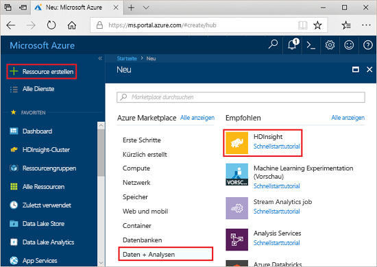
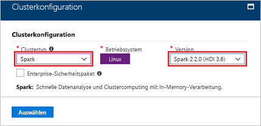
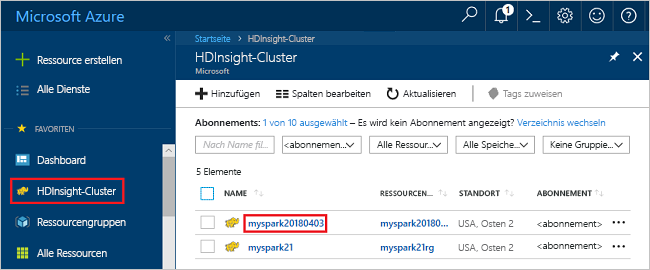
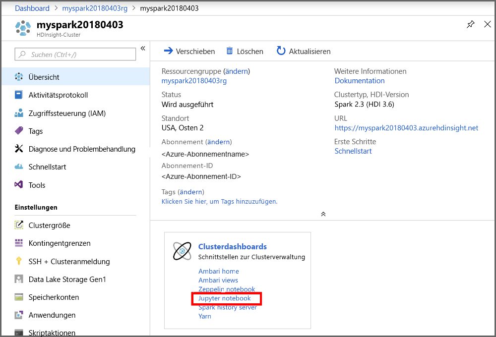
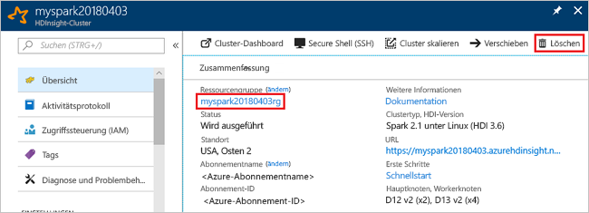

# <a name="quickstart-create-an-apache-spark-cluster-in-hdinsight-using-the-azure-portal"></a>Schnellstart: Erstellen eines Apache Spark-Clusters in HDInsight mithilfe des Azure-Portals
Hier erfahren Sie, wie Sie einen Apache Spark-Cluster in Azure HDInsight erstellen und Spark-SQL-Abfragen für Hive-Tabellen ausführen. Apache Spark ermöglicht schnelle Datenanalysen und Clustercomputing mit In-Memory-Verarbeitung. Informationen zu Spark in HDInsight finden Sie unter [Übersicht: Apache Spark in Azure HDInsight](apache-spark-overview.md).

In dieser Schnellstartanleitung verwenden Sie das Azure-Portal zum Erstellen eines HDInsight Spark-Clusters. Der Cluster verwendet Azure Storage Blob als Clusterspeicher. Weitere Informationen zur Verwendung von Data Lake Storage Gen2 finden Sie unter [Schnellstart: Einrichten von Clustern in HDInsight](../../storage/data-lake-storage/quickstart-create-connect-hdi-cluster.md).

> [!IMPORTANT]  
> Die Abrechnung für die HDInsight-Cluster erfolgt anteilsmäßig auf Minutenbasis und ist unabhängig von der Verwendung. Daher sollten Sie Ihren Cluster nach der Verwendung unbedingt wieder löschen. Weitere Informationen finden Sie im Abschnitt [Bereinigen von Ressourcen](#clean-up-resources) in diesem Artikel.

Wenn Sie kein Azure-Abonnement besitzen, können Sie ein [kostenloses Konto](https://azure.microsoft.com/free/) erstellen, bevor Sie beginnen.

## <a name="create-an-hdinsight-spark-cluster"></a>Erstellen eines HDInsight Spark-Clusters

1. Wählen Sie im Azure-Portal **Ressource erstellen** > **Analysen** > **HDInsight** aus. 

    
2. Geben Sie unter **Grundlagen** die folgenden Werte an:
     
    |Eigenschaft  |BESCHREIBUNG  |
    |---------|---------|
    |**Clustername**     | Geben Sie einen Namen für den HDInsight Spark-Cluster an. Für diese Schnellstartanleitung wird der Clustername **myspark20180403** verwendet.|
    |**Abonnement**     | Wählen Sie im Dropdownmenü ein für diesen Cluster verwendetes Azure-Abonnement aus. Für diesen Cluster wird das Abonnement **&lt;Azure-Abonnement** verwendet. |
    |**Clustertyp**| Erweitern Sie das Element, wählen Sie dann als Clustertyp **Spark** aus, und geben Sie die Spark-Clusterversion an. <br/>  |
    |**Benutzername für Clusteranmeldung**| Geben Sie den Anmeldebenutzernamen für den Cluster ein.  Der Standardname lautet *admin*. Sie verwenden dieses Konto später in dieser Schnellstartanleitung für die Anmeldung bei Jupyter Notebook. |
    |**Kennwort für Clusteranmeldung**| Geben Sie das Kennwort für die Clusteranmeldung ein. |
    |**SSH-Benutzername (Secure Shell)**| Geben Sie den SSH-Benutzernamen ein. Für diesen Schnellstart wird der SSH-Benutzername **sshuser** verwendet. Standardmäßig gilt für dieses Konto dasselbe Kennwort wie für das Konto mit dem *Benutzernamen für die Clusteranmeldung*. |
    |**Ressourcengruppe**     | Geben Sie an, ob Sie eine neue Ressourcengruppe erstellen oder eine vorhandene Ressourcengruppe verwenden möchten. Eine Ressourcengruppe ist ein Container, der verwandte Ressourcen für eine Azure-Lösung enthält. Für diese Schnellstartanleitung wird der Ressourcengruppenname **myspark20180403rg** verwendet. |
    |**Location**     | Wählen Sie einen Speicherort für die Ressourcengruppe aus. Die Vorlage verwendet diesen Standort sowohl für die Erstellung des Clusters als auch für den Standardclusterspeicher. Für diese Schnellstartanleitung wird der Speicherort **USA, Osten 2** verwendet. |

    ")

    Klicken Sie auf **Weiter**, um zur Seite **Speicher** zu gelangen.
3. Geben Sie unter **Speicher** die folgenden Werte an:

    - **Auswählen eines Speicherkontos**: Wählen Sie **Neu erstellen**, und geben Sie dann einen Namen für das neue Speicherkonto ein. Für diese Schnellstartanleitung wird der Speicherkontoname **myspark20180403store** verwendet.

    ")

    > [!NOTE]  
    > Auf dem Screenshot ist **Vorhandenes auswählen** dargestellt. Der Link wechselt zwischen **Neu erstellen** und **Vorhandenes auswählen**.

    Der **Standardcontainer** besitzt einen Standardnamen.  Sie können den Standardnamen bei Bedarf ändern.

    Klicken Sie auf **Weiter**, um zur Seite **Zusammenfassung** zu gelangen. 


3. Klicken Sie auf der Seite **Zusammenfassung** auf **Erstellen**. Das Erstellen des Clusters dauert ca. 20 Minuten. Der Cluster muss erstellt werden, bevor Sie mit dem nächsten Abschnitt fortfahren können.

Sollte bei der HDInsight-Clustererstellung ein Problem auftreten, verfügen Sie unter Umständen nicht über die erforderlichen Berechtigungen. Weitere Informationen finden Sie unter [Voraussetzungen für die Zugriffssteuerung](../hdinsight-hadoop-create-linux-clusters-portal.md).

## <a name="create-a-jupyter-notebook"></a>Erstellen eines Jupyter Notebooks

Jupyter Notebook ist eine interaktive Notebook-Umgebung, die verschiedene Programmiersprachen unterstützt. Das Notebook ermöglicht Ihnen, mit Ihren Daten zu interagieren, Code mit Markdowntext zu kombinieren und einfache Visualisierungen durchzuführen. 

1. Öffnen Sie das [Azure-Portal](https://portal.azure.com).
2. Wählen Sie **HDInsight-Cluster** und dann den von Ihnen erstellten Cluster aus.

    

3. Wählen Sie im Portal **Clusterdashboards** und dann **Jupyter Notebook** aus. Geben Sie die Anmeldeinformationen für den Cluster ein, wenn Sie dazu aufgefordert werden.

   

4. Wählen Sie **Neu** > **PySpark** aus, um ein Notebook zu erstellen. 

   

   Ein neues Notebook mit dem Namen „Untitled“ (Untitled.pynb) wird erstellt und geöffnet.


## <a name="run-spark-sql-statements"></a>Ausführen von Spark SQL-Anweisungen

SQL (Structured Query Language) ist die gängigste und am häufigsten verwendete Sprache zum Abfragen und Definieren von Daten. Spark SQL fungiert als Erweiterung von Apache Spark für die Verarbeitung strukturierter Daten mit der vertrauten SQL-Syntax.

1. Überprüfen Sie, ob der Kernel bereit ist. Der Kernel ist bereit, wenn im Notebook neben dem Kernelnamen ein leerer Kreis angezeigt wird. Ein ausgefüllter Kreis gibt an, dass der Kernel ausgelastet ist.

    

    Wenn Sie das Notebook zum ersten Mal starten, führt der Kernel im Hintergrund einige Aufgaben durch. Warten Sie, bis der Kernel bereit ist. 
2. Fügen Sie den folgenden Code in eine leere Zelle ein, und drücken Sie **UMSCHALT+EINGABE** , um den Code auszuführen. Der Befehl listet die Hive-Tabellen im Cluster auf:

    ```PySpark
    %%sql
    SHOW TABLES
    ```
    Wenn Sie ein Jupyter Notebook mit Ihrem HDInsight Spark-Cluster verwenden, erhalten Sie einen vordefinierten `sqlContext`, den Sie zum Ausführen von Hive-Abfragen mit Spark SQL verwenden können. `%%sql` weist Jupyter Notebook an, den vordefinierten `sqlContext` für die Ausführung der Hive-Abfrage zu verwenden. Die Abfrage ruft die ersten zehn Zeilen aus einer Hive-Tabelle (**hivesampletable**) ab, die standardmäßig in allen HDInsight-Clustern enthalten ist. Es dauert ungefähr 30 Sekunden, bis die Ergebnisse angezeigt werden. Die Ausgabe sieht wie folgt aus: 

    

    Bei jeder Ausführung einer Abfrage in Jupyter wird auf der Titelleiste Ihres Webbrowserfensters neben dem Notebooktitel der Status **(Beschäftigt)** angezeigt. Außerdem sehen Sie in der rechten oberen Ecke einen ausgefüllten Kreis neben dem Text **PySpark**.
    
2. Führen Sie eine weitere Abfrage aus, um die Daten in `hivesampletable` anzuzeigen.

    ```PySpark
    %%sql
    SELECT * FROM hivesampletable LIMIT 10
    ```
    
    Der Bildschirm wird aktualisiert, und die Ausgabe der Abfrage wird angezeigt.

    

2. Wählen Sie im Menü **Datei** des Notebooks die Option **Schließen und Anhalten** aus. Durch Herunterfahren des Notebooks werden die Clusterressourcen freigegeben.

## <a name="clean-up-resources"></a>Bereinigen von Ressourcen
HDInsight speichert Ihre Daten in Azure Storage oder Azure Data Lake Storage, sodass Sie einen Cluster ohne Weiteres löschen können, wenn er nicht verwendet wird. Für einen HDInsight-Cluster fallen auch dann Gebühren an, wenn er nicht verwendet wird. Da die Gebühren für den Cluster erheblich höher sind als die Kosten für den Speicher, ist es sinnvoll, nicht verwendete Cluster zu löschen. Wenn Sie vorhaben, sofort mit dem Tutorial unter [Nächste Schritte](#next-steps) fortzufahren, können Sie den Cluster beibehalten.

Wechseln Sie zurück zum Azure-Portal, und wählen Sie **Löschen** aus.



Sie können auch den Namen der Ressourcengruppe auswählen, um die Seite für die Ressourcengruppe zu öffnen, und dann **Ressourcengruppe löschen** auswählen. Indem Sie die Ressourcengruppe löschen, löschen Sie sowohl den HDInsight Spark-Cluster als auch das Standardspeicherkonto.

## <a name="next-steps"></a>Nächste Schritte 

In diesem Schnellstarttutorial haben Sie erfahren, wie Sie einen HDInsight Spark-Cluster erstellen und eine einfache Spark SQL-Abfrage ausführen. Im nächsten Tutorial erfahren Sie, wie Sie mithilfe eines HDInsight Spark-Clusters interaktive Abfragen für Beispieldaten ausführen.

> [!div class="nextstepaction"]
>[Ausführen von interaktiven Abfragen für Apache Spark](./apache-spark-load-data-run-query.md)

