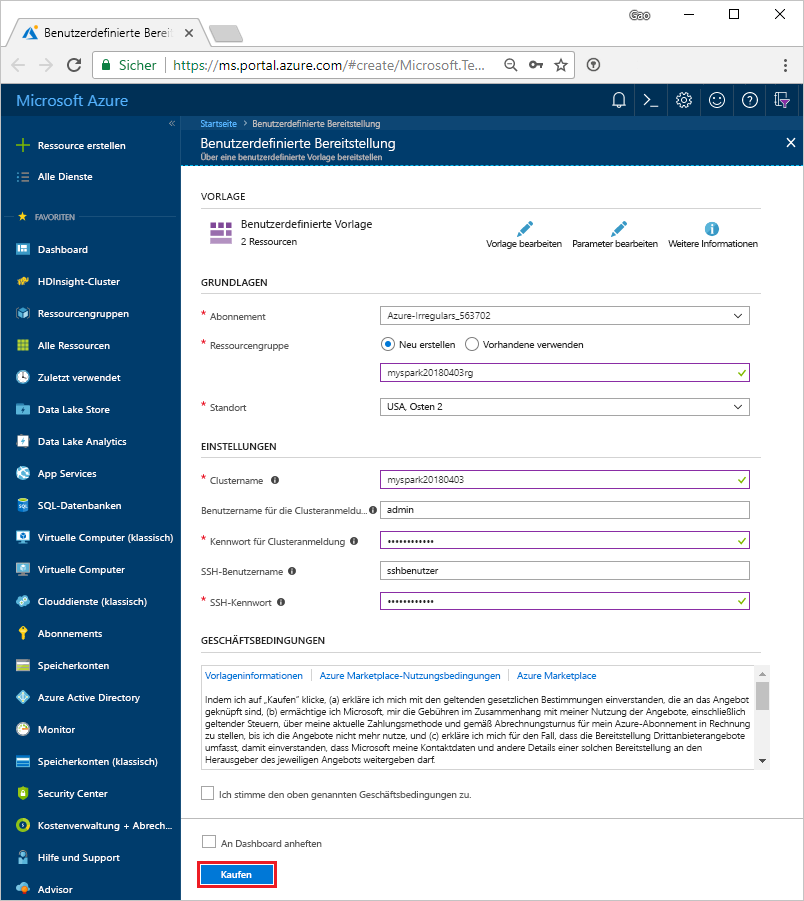

# <a name="quickstart-create-an-apache-spark-cluster-in-hdinsight-using-template"></a>Schnellstart: Erstellen eines Apache Spark-Clusters in HDInsight mithilfe einer Vorlage

Hier erfahren Sie, wie Sie einen [Apache Spark](https://spark.apache.org/)-Cluster in Azure HDInsight erstellen und Spark-SQL-Abfragen für [Apache Hive](https://hive.apache.org/)-Tabellen ausführen. Apache Spark ermöglicht schnelle Datenanalysen und Clustercomputing mit In-Memory-Verarbeitung. Informationen zu Spark in HDInsight finden Sie unter [Übersicht: Apache Spark in Azure HDInsight](apache-spark-overview.md).

In diesem Schnellstarttutorial verwenden Sie eine Resource Manager-Vorlage, um einen HDInsight-Spark-Cluster zu erstellen. Der Cluster verwendet Azure Storage Blob als Clusterspeicher. Weitere Informationen zur Verwendung von Data Lake Storage Gen2 finden Sie unter [Schnellstart: Einrichten von Clustern in HDInsight](../../storage/data-lake-storage/quickstart-create-connect-hdi-cluster.md).

> [!IMPORTANT]  
> Die Abrechnung für die HDInsight-Cluster erfolgt anteilsmäßig auf Minutenbasis und ist unabhängig von der Verwendung. Daher sollten Sie Ihren Cluster nach der Verwendung unbedingt wieder löschen. Weitere Informationen finden Sie im Abschnitt [Bereinigen von Ressourcen](#clean-up-resources) in diesem Artikel.

Wenn Sie kein Azure-Abonnement besitzen, können Sie ein [kostenloses Konto](https://azure.microsoft.com/free/) erstellen, bevor Sie beginnen.

## <a name="create-an-hdinsight-spark-cluster"></a>Erstellen eines HDInsight Spark-Clusters

Erstellen Sie einen HDInsight Spark-Cluster unter Verwendung einer Azure Resource Manager-Vorlage. Die Vorlage finden Sie auf [GitHub](https://azure.microsoft.com/resources/templates/101-hdinsight-spark-linux/). Informationen zur JSON-Syntax und zu den Eigenschaften des Clusters finden Sie unter [Microsoft.HDInsight/clusters](/azure/templates/microsoft.hdinsight/clusters).

1. Wählen Sie den folgenden Link aus, um die Vorlage im Azure-Portal auf einer neuen Browserregisterkarte zu öffnen:

    <a href="https://portal.azure.com/#create/Microsoft.Template/uri/https%3A%2F%2Fraw.githubusercontent.com%2FAzure%2Fazure-quickstart-templates%2Fmaster%2F101-hdinsight-spark-linux%2Fazuredeploy.json" target="_blank">Bereitstellen in Azure</a>

2. Geben Sie die folgenden Werte ein:

    | Eigenschaft | Wert |
    |---|---|
    |**Abonnement**|Wählen Sie Ihr Azure-Abonnement für die Erstellung des Clusters aus. Für diesen Cluster wird das Abonnement **&lt;Azure-Abonnementname>** verwendet. |
    | **Ressourcengruppe**|Erstellen Sie eine Ressourcengruppe, oder wählen Sie eine vorhandene aus. Die Ressourcengruppe wird verwendet, um Azure-Ressourcen für Ihre Projekte zu verwalten. Für diesen Schnellstart wird der neue Ressourcengruppenname **myspark20180403rg** verwendet.|
    | **Location**|Wählen Sie einen Speicherort für die Ressourcengruppe aus. Die Vorlage verwendet diesen Standort sowohl für die Erstellung des Clusters als auch für den Standardclusterspeicher. Für diese Schnellstartanleitung wird der Speicherort **USA, Osten 2** verwendet.|
    | **ClusterName**|Geben Sie einen Namen für den HDInsight-Cluster ein, den Sie erstellen möchten. Für diesen Schnellstart wird der neue Clustername **myspark20180403** verwendet.|
    | **Clusteranmeldename und Kennwort**|Der Standardanmeldename lautet „admin“. Legen Sie ein Kennwort für die Clusteranmeldung fest. Für diesen Schnellstart wird der Anmeldename **admin** verwendet.|
    | **SSH-Benutzername und -Kennwort**|Legen Sie ein Kennwort für den SSH-Benutzer fest. Für diesen Schnellstart wird der SSH-Benutzername **sshuser** verwendet.|

    

3. Wählen Sie **Ich stimme den oben genannten Geschäftsbedingungen zu**, **An Dashboard anheften** und anschließend **Kaufen** aus. Es wird eine neue Kachel mit dem Titel **Deploying Template deployment** (Vorlagenbereitstellung bereitstellen) angezeigt. Das Erstellen des Clusters dauert ca. 20 Minuten. Der Cluster muss erstellt werden, bevor Sie mit dem nächsten Abschnitt fortfahren können.

Sollte bei der HDInsight-Clustererstellung ein Problem auftreten, verfügen Sie unter Umständen nicht über die erforderlichen Berechtigungen. Weitere Informationen finden Sie unter [Voraussetzungen für die Zugriffssteuerung](../hdinsight-hadoop-create-linux-clusters-portal.md).

## <a name="install-intellijeclipse-for-spark-application"></a>Installieren von IntelliJ/Eclipse für Spark-Anwendungen
Verwenden Sie das Plug-In „Azure-Toolkit für IntelliJ“/„Azure-Toolkit für Eclipse“, um in [Scala](https://www.scala-lang.org/) geschriebene Spark-Anwendungen zu entwickeln und diese dann direkt aus der IntelliJ-/Eclipse-IDE (Integrated Development Environment, integrierte Entwicklungsumgebung) an einen Azure HDInsight Spark-Cluster zu senden. Weitere Informationen finden Sie unter [Erstellen von Spark-Anwendungen für einen HDInsight-Cluster mit dem Azure Toolkit für IntelliJ](./apache-spark-intellij-tool-plugin.md) bzw. unter [Erstellen von Spark-Anwendungen für HDInsight-Cluster mit dem Azure-Toolkit für Eclipse](./apache-spark-eclipse-tool-plugin.md).

## <a name="install-vscode-for-pysparkhive-applications"></a>Installieren von VS Code für PySpark-/Hive-Anwendungen
Hier erfahren Sie, wie Sie Azure HDInsight Tools for Visual Studio Code (VS Code) verwenden, um Hive-Batchaufträge, interaktive Hive-Abfragen, einen PySpark-Batch und interaktive PySpark-Skripts zu erstellen und zu übermitteln. Azure HDInsight Tools kann auf den von VS Code unterstützten Plattformen installiert werden. Hierzu zählen Windows, Linux und macOS. Weitere Informationen finden Sie unter [Verwenden von Azure HDInsight Tools for Visual Studio Code](../hdinsight-for-vscode.md).

## <a name="create-a-jupyter-notebook"></a>Erstellen eines Jupyter Notebooks

[Jupyter Notebook](https://jupyter.org/) ist eine interaktive Notebook-Umgebung, die verschiedene Programmiersprachen unterstützt. Das Notebook ermöglicht Ihnen, mit Ihren Daten zu interagieren, Code mit Markdowntext zu kombinieren und einfache Visualisierungen durchzuführen.

1. Öffnen Sie das [Azure-Portal](https://portal.azure.com).
2. Wählen Sie **HDInsight-Cluster** und dann den von Ihnen erstellten Cluster aus.

    

3. Klicken Sie im Portal im Abschnitt **Clusterdashboards** auf **Jupyter-Notebook**. Geben Sie die Anmeldeinformationen für den Cluster ein, wenn Sie dazu aufgefordert werden.

   

4. Wählen Sie **Neu** > **PySpark** aus, um ein Notebook zu erstellen.

   

   Ein neues Notebook mit dem Namen „Untitled“ (Untitled.pynb) wird erstellt und geöffnet.


## <a name="run-spark-sql-statements"></a>Ausführen von Spark SQL-Anweisungen

SQL (Structured Query Language) ist die gängigste und am häufigsten verwendete Sprache zum Abfragen und Transformieren von Daten. Spark SQL fungiert als Erweiterung von Apache Spark für die Verarbeitung strukturierter Daten mit der vertrauten SQL-Syntax.

1. Überprüfen Sie, ob der Kernel bereit ist. Der Kernel ist bereit, wenn im Notebook neben dem Kernelnamen ein leerer Kreis angezeigt wird. Ein ausgefüllter Kreis gibt an, dass der Kernel ausgelastet ist.

    

    Wenn Sie das Notebook zum ersten Mal starten, führt der Kernel im Hintergrund einige Aufgaben durch. Warten Sie, bis der Kernel bereit ist.
2. Fügen Sie den folgenden Code in eine leere Zelle ein, und drücken Sie **UMSCHALT+EINGABE** , um den Code auszuführen. Der Befehl listet die Hive-Tabellen im Cluster auf:

    ```sql
    %%sql
    SHOW TABLES
    ```
    Wenn Sie eine Jupyter Notebook-Instanz mit Ihrem HDInsight Spark-Cluster verwenden, erhalten Sie eine vordefinierte `spark`-Sitzung, den Sie zum Ausführen von Hive-Abfragen mit Spark SQL verwenden können. `%%sql` weist Jupyter Notebook an, die vordefinierte `spark`-Sitzung für die Ausführung der Hive-Abfrage zu verwenden. Die Abfrage ruft die ersten zehn Zeilen aus einer Hive-Tabelle (**hivesampletable**) ab, die standardmäßig in allen HDInsight-Clustern enthalten ist. Wenn Sie die Abfrage erstmals übermitteln, erstellt Jupyter eine Spark-Anwendung für das Notebook. Dieser Vorgang dauert ungefähr 30 Sekunden. Sobald die Spark-Anwendung bereit ist, wird die Abfrage innerhalb etwa einer Sekunde ausgeführt, und die Ergebnisse werden zurückgegeben. Die Ausgabe sieht wie folgt aus:

    

    Bei jeder Ausführung einer Abfrage in Jupyter wird auf der Titelleiste Ihres Webbrowserfensters neben dem Notebooktitel der Status **(Beschäftigt)** angezeigt. Außerdem sehen Sie in der rechten oberen Ecke einen ausgefüllten Kreis neben dem Text **PySpark**.

2. Führen Sie eine weitere Abfrage aus, um die Daten in `hivesampletable` anzuzeigen.

    ```sql
    %%sql
    SELECT * FROM hivesampletable LIMIT 10
    ```
    
    Der Bildschirm wird aktualisiert, und die Ausgabe der Abfrage wird angezeigt.

    

2. Wählen Sie im Menü **Datei** des Notebooks die Option **Schließen und Anhalten** aus. Durch Herunterfahren des Notebooks werden die Clusterressourcen freigegeben (einschließlich der Spark-Anwendung).

## <a name="clean-up-resources"></a>Bereinigen von Ressourcen
HDInsight speichert Ihre Daten und Jupyter-Notebooks in Azure Storage oder Azure Data Lake Store, sodass Sie einen Cluster problemlos löschen können, wenn er nicht verwendet wird. Für einen HDInsight-Cluster fallen auch dann Gebühren an, wenn er nicht verwendet wird. Da die Gebühren für den Cluster erheblich höher sind als die Kosten für den Speicher, ist es sinnvoll, nicht verwendete Cluster zu löschen. Wenn Sie vorhaben, sofort mit dem Tutorial unter [Nächste Schritte](#next-steps) fortzufahren, können Sie den Cluster beibehalten.

Wechseln Sie zurück zum Azure-Portal, und wählen Sie **Löschen** aus.


Sie können auch den Namen der Ressourcengruppe auswählen, um die Seite für die Ressourcengruppe zu öffnen, und dann **Ressourcengruppe löschen** auswählen. Indem Sie die Ressourcengruppe löschen, löschen Sie sowohl den HDInsight Spark-Cluster als auch das Standardspeicherkonto.

## <a name="next-steps"></a>Nächste Schritte

In diesem Schnellstarttutorial haben Sie erfahren, wie Sie einen HDInsight Spark-Cluster erstellen und eine einfache Spark SQL-Abfrage ausführen. Im nächsten Tutorial erfahren Sie, wie Sie mithilfe eines HDInsight Spark-Clusters interaktive Abfragen für Beispieldaten ausführen.

> [!div class="nextstepaction"]
>[Ausführen von interaktiven Abfragen für Apache Spark](./apache-spark-load-data-run-query.md)


