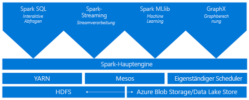
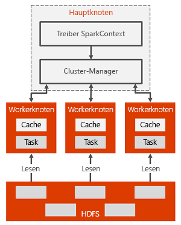

# Was ist Apache Spark in Azure HDInsight?

*Apache Spark* ist ein Framework für die Parallelverarbeitung, das die In-Memory-Verarbeitung unterstützt, um die Leistung von Anwendungen für die Analyse großer Datenmengen zu steigern. Apache Spark in Azure HDInsight ist die Microsoft-Implementierung von Apache Spark in der Cloud. HDInsight vereinfacht das Erstellen und Konfigurieren eines Spark-Clusters in Azure. Spark-Cluster in HDInsight sind mit Azure Storage und mit Azure Data Lake Store kompatibel. Dadurch können Sie HDInsight Spark-Cluster für die Verarbeitung Ihrer in Azure gespeicherten Daten verwenden. Informationen zu den Komponenten und Versionen finden Sie unter [Welche Apache Hadoop-Komponenten und -Versionen sind in HDInsight verfügbar?](../hdinsight-component-versioning.md).

## Was ist Spark?

Spark stellt Primitive für das In-Memory-Clustercomputing bereit. Bei einem Spark-Auftrag können Daten in den Arbeitsspeicher geladen, zwischengespeichert und dann wiederholt abgefragt werden. In-Memory-Computing ist deutlich schneller als datenträgerbasierte Anwendungen wie Hadoop, die Daten über HDFS freigeben. Spark kann auch in die Scala-Programmiersprache integriert werden, damit Sie verteilte Datasets (etwa lokale Sammlungen) bearbeiten können. Es ist nicht erforderlich, alles in Form von Mapper- und Reducer-Vorgängen zu strukturieren.

Spark-Cluster in HDInsight bieten einen vollständig verwalteten Spark-Dienst. Im Anschluss sind die Vorteile der Erstellung eines Spark-Clusters in HDInsight aufgeführt.

| Feature | BESCHREIBUNG |
| --- | --- |
| Einfache Erstellung |Über das Azure-Portal, mithilfe von Azure PowerShell oder über das HDInsight .NET SDK können Sie in wenigen Minuten einen neuen Spark-Cluster in HDInsight erstellen. Weitere Informationen finden Sie unter [Erste Schritte mit Spark-Clustern in HDInsight](apache-spark-jupyter-spark-sql.md) |
| Einfache Bedienung |Spark-Cluster in HDInsight enthalten Jupyter und Zeppelin Notebooks. Diese Notebooks können Sie für die interaktive Datenverarbeitung und -visualisierung verwenden.|
| REST-APIs |Spark-Cluster in HDInsight beinhalten [Apache Livy](https://github.com/cloudera/hue/tree/master/apps/spark/java#welcome-to-livy-the-rest-spark-server), einen auf der REST-API basierenden Spark-Auftragsserver für die Remoteübermittlung und -überwachung von Aufträgen. |
| Unterstützung für Azure Data Lake-Speicher | Spark-Cluster in HDInsight können Azure Data Lake Store als primären oder zusätzlichen Speicher verwenden. Weitere Informationen zum Data Lake-Speicher finden Sie unter [Übersicht über Azure Data Lake-Speicher](../../data-lake-store/data-lake-store-overview.md). |
| Integration in Azure-Dienste |Ein Spark-Cluster in HDInsight verfügt über einen Connector für Azure Event Hubs. Sie können Streaminganwendungen unter Verwendung von Event Hubs erstellen. Dies ist eine Alternative zur Option [Apache Kafka](http://kafka.apache.org/), die als Teil von Spark bereits verfügbar ist. |
| Unterstützung für ML Server | Die Unterstützung für ML Server in HDInsight wird unter dem Clustertyp **ML Services** bereitgestellt. Sie können einen ML Services-Cluster einrichten, um verteilte R-Berechnungen mit den für einen Spark-Cluster garantierten Geschwindigkeiten auszuführen. Weitere Informationen finden Sie unter [Erste Schritte mit einem R Server-Cluster in Azure HDInsight](../r-server/r-server-get-started.md). |
| Integration in Drittanbieter-IDEs | HDInsight bietet mehrere hilfreiche IDE-Plug-Ins für die Erstellung von Anwendungen und deren Übermittlung an einen HDInsight Spark-Cluster. Weitere Informationen finden Sie unter [Verwenden des Azure-Toolkits für IntelliJ IDEA](apache-spark-intellij-tool-plugin.md), [Verwenden von Azure HDInsight Tools for Visual Studio Code](../hdinsight-for-vscode.md) und [Verwenden des Azure-Toolkits für Eclipse](apache-spark-eclipse-tool-plugin.md).|
| Gleichzeitige Abfragen |Spark-Cluster in HDInsight unterstützen gleichzeitige Abfragen. Dank dieser Funktion können mehrere Abfragen von einem Benutzer oder mehrere Abfragen von unterschiedlichen Benutzern und Anwendungen die gleichen Clusterressourcen verwenden. |
| Zwischenspeicherung auf SSDs |Sie können Daten entweder im Arbeitsspeicher oder auf SSDs zwischenspeichern, die an die Clusterknoten angefügt sind. Das Zwischenspeichern im Arbeitsspeicher liefert die beste Abfrageleistung, kann aber teuer sein. Das Zwischenspeichern auf SSDs ist eine hervorragende Möglichkeit zur Verbesserung der Abfrageleistung, ohne dass ein Cluster mit einer Größe erstellt werden muss, die für das Einfügen des gesamten Datasets in den Arbeitsspeicher ausreicht. |
| Integration in BI-Tools |Spark-Cluster in HDInsight enthalten Connectors für BI-Tools wie [Power BI](http://www.powerbi.com/) für die Datenanalyse. |
| Vorinstallierte Anaconda-Bibliotheken |Für Spark-Cluster in HDInsight sind Anaconda-Bibliotheken vorinstalliert. [Anaconda](http://docs.continuum.io/anaconda/) bietet ca. 200 Bibliotheken für Machine Learning, Datenanalyse, Visualisierung usw. |
| Skalierbarkeit | HDInsight ermöglicht das Ändern der Anzahl von Clusterknoten. Darüber hinaus können Spark-Cluster ohne Datenverlust verworfen werden, da alle Daten in Azure Storage oder Data Lake Store gespeichert werden. |
| SLA |Für Spark-Cluster in HDInsight ist rund um die Uhr Support verfügbar, und in der SLA ist eine Betriebszeit von 99,9 Prozent angegeben. |

Apache Spark-Cluster in HDInsight enthalten die folgenden Komponenten, die standardmäßig in den Clustern verfügbar sind:

* [Spark Core](https://spark.apache.org/docs/1.5.1/). Umfasst Spark Core, Spark SQL, Spark-Streaming-APIs, GraphX und MLlib.
* [Anaconda](http://docs.continuum.io/anaconda/)
* [Apache Livy](https://github.com/cloudera/hue/tree/master/apps/spark/java#welcome-to-livy-the-rest-spark-server)
* [Jupyter-Notebook](https://jupyter.org)
* [Apache Zeppelin-Notebook](http://zeppelin-project.org/)

Spark-Cluster in HDInsight verfügen auch über einen [ODBC-Treiber](https://go.microsoft.com/fwlink/?LinkId=616229) für die Konnektivität mit Spark-Clustern in HDInsight über BI-Tools wie Microsoft Power BI.

## Spark-Clusterarchitektur

Die Komponenten von Spark können Sie ganz einfach verstehen, wenn Sie sich mit der Ausführung von Spark in HDInsight-Clustern vertraut machen.

Spark-Anwendungen werden als unabhängige Gruppen von Prozessen in einem Cluster ausgeführt und vom SparkContext-Objekt in Ihrem Hauptprogramm (dem so genannten Treiberprogramm) koordiniert.

Das SparkContext-Objekt kann eine Verbindung mit mehreren Arten von Cluster-Managern herstellen, die anwendungsübergreifend Ressourcen zuteilen. Zu diesen Cluster-Managern zählen unter anderem [Apache Mesos](http://mesos.apache.org/), [Apache Hadoop YARN](https://hadoop.apache.org/docs/current/hadoop-yarn/hadoop-yarn-site/YARN.html) sowie der Spark-Cluster-Manager. In HDInsight wird Spark über den YARN-Cluster-Manager ausgeführt. Nach der Verbindungsherstellung ruft Spark Executors für Workerknoten im Cluster ab. Dabei handelt es sich um Prozesse, die Berechnungen ausführen und Daten für Ihre Anwendung speichern. Als Nächstes wird Ihr Anwendungscode (definiert durch JAR- oder Python-Dateien, die an SparkContext übergeben werden) an die Executors gesendet. Abschließend sendet SparkContext Aufgaben zur Ausführung an die Executors.

Das SparkContext-Objekt führt die main-Funktion des Benutzers und dann die verschiedenen parallelen Vorgänge auf den Workerknoten aus. Anschließend sammelt es die Ergebnisse der Vorgänge. Die Workerknoten lesen und schreiben Daten aus dem und in das Hadoop Distributed File System (HDFS). Außerdem speichern die Workerknoten transformierte Daten im Arbeitsspeicher als RDDs (Resilient Distributed Datasets).

Das SparkContext-Objekt stellt eine Verbindung mit dem Spark-Master her und ist für die Konvertierung einer Anwendung in einen gerichteten Graphen (DAG) mit einzelnen Aufgaben verantwortlich, die auf den Workerknoten in einem Executor-Prozess ausgeführt werden. Jede Anwendung erhält ihre eigenen Executor-Prozesse, die über die gesamte Anwendungsdauer aktiv bleiben und Aufgaben in mehreren Threads ausführen.

## Anwendungsfälle für Spark in HDInsight

Spark-Cluster in HDInsight ermöglichen die folgenden Schlüsselszenarien:

- Interaktive Datenanalyse und BI

    Apache Spark in HDInsight speichert Daten in Azure Storage oder Azure Data Lake Store. Experten und Entscheidungsträger in Unternehmen können diese Daten analysieren und Berichte damit erstellen und Microsoft Power BI verwenden, um aus den analysierten Daten interaktive Berichte anzufertigen. Analysten können mit unstrukturierten oder teilweise strukturierten Daten im Clusterspeicher beginnen, mit Notebooks ein Schema für die Daten definieren und dann mit Microsoft Power BI Datenmodelle erstellen. Spark-Cluster in HDInsight unterstützen auch eine Reihe von BI-Drittanbietertools (beispielsweise Tableau) und machen dadurch Datenanalysten, Unternehmensexperten und Entscheidungsträgern das Leben leichter.

    Tutorial: [Analyze Spark data using Power BI in HDInsight](apache-spark-use-bi-tools.md) (Analysieren von Spark-Daten mithilfe von Power BI)
- Spark Machine Learning

    Apache Spark verfügt über [MLlib](http://spark.apache.org/mllib/), eine Machine Learning-Bibliothek, die auf Spark aufbaut und die Sie über ein Spark-Cluster in HDInsight verwenden können. Zu Spark-Clustern in HDInsight gehört auch Anaconda – eine Python-Distribution mit verschiedensten Paketen für Machine Learning. In Kombination mit der integrierten Unterstützung für Jupyter und Zeppelin Notebooks erhalten Sie eine Umgebung zur Erstellung von Machine Learning-Anwendungen.

    Tutorials: [Vorhersage von Gebäudetemperaturen mithilfe von HVAC-Daten](apache-spark-ipython-notebook-machine-learning.md) und [Vorhersagen des Ergebnisses einer Lebensmittelüberwachung](apache-spark-machine-learning-mllib-ipython.md)    
- Streaming und Echtzeit-Datenanalysen mit Spark

    Spark-Cluster in HDInsight bieten umfassende Unterstützung für die Erstellung von Echtzeit-Analyselösungen. Spark verfügt zwar bereits über Connectors zum Erfassen von Daten aus den unterschiedlichsten Quellen, z. B. Kafka, Flume, Twitter, ZeroMQ oder TCP-Sockets, aber mit Spark in HDInsight wird zusätzlich noch die erstklassige Unterstützung für das Erfassen von Daten aus Azure Event Hubs hinzugefügt. Event Hubs ist der Warteschlangendienst, der in Azure am häufigsten verwendet wird. Da Event Hubs standardmäßig unterstützt wird, sind Spark-Cluster in HDInsight eine ideale Plattform zum Erstellen einer Echtzeit-Analysepipeline.
    
## Wo beginne ich?

Die folgenden Artikel enthalten weitere Informationen zu Apache Spark in HDInsight:

- [Schnellstart: Erstellen eines Spark-Clusters in HDInsight mithilfe einer Vorlage](./apache-spark-jupyter-spark-sql.md)
- [Tutorial: Laden von Daten und Ausführen von Abfragen auf einem Apache Spark-Cluster in Azure HDInsight](./apache-spark-load-data-run-query.md)
- [Tutorial: Analyze Spark data using Power BI in HDInsight](./apache-spark-use-bi-tools.md) (Analysieren von Spark-Daten unter Verwendung von Power BI in HDInsight)
- [Tutorial: Erstellen einer Spark-Machine Learning-Anwendung in HDInsight](./apache-spark-ipython-notebook-machine-learning.md)
- [Tutorial: create a Scala Maven application for Spark in HDInsight using IntelliJ](./apache-spark-create-standalone-application.md) (Tutorial: Erstellen einer Scala Maven-Anwendung unter Verwendung von IntelliJ)

## Nächste Schritte

In dieser Übersicht haben Sie einige grundlegende Informationen zu Apache Spark in Azure HDInsight erhalten. Im nächsten Artikel erfahren Sie, wie Sie einen HDInsight Spark-Cluster erstellen und einige Spark-SQL-Abfragen ausführen:

- [Erstellen von Linux-basierten Clustern in HDInsight mithilfe des Azure-Portals](./apache-spark-jupyter-spark-sql.md)

