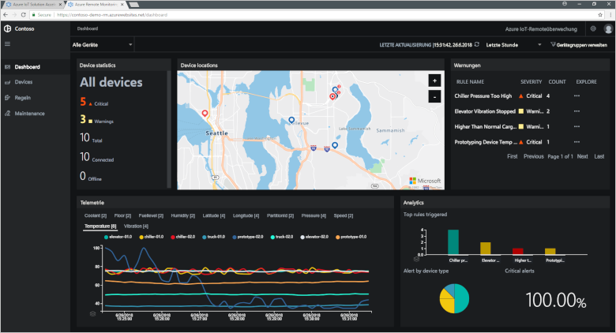

# Was sind Azure IoT Solution Accelerators?

Für eine cloudbasierte IoT-Lösung werden normalerweise benutzerdefinierter Code und mehrere Clouddienste verwendet, um die Gerätekonnektivität, die Datenverarbeitung und -analyse und die Darstellung zu verwalten.

Bei IoT Solution Accelerators handelt es sich um eine Sammlung mit vollständigen IoT-Lösungen, die fertig für die Bereitstellung sind und mit denen häufige IoT-Szenarien implementiert werden, z.B. Remoteüberwachung, Verbundene Factory und Predictive Maintenance. Wenn Sie einen Solution Accelerator bereitstellen, enthält die Bereitstellung alle erforderlichen cloudbasierten Dienste sowie den gesamten erforderlichen Anwendungscode.

Die Solution Accelerators sind Ausgangspunkte für Ihre eigenen IoT-Lösungen. Der Quellcode für alle Solution Accelerators ist Open-Source-Code und auf GitHub verfügbar. Wir empfehlen Ihnen, die Solution Accelerators herunterzuladen und [anzupassen](iot-accelerators-remote-monitoring-customize.md), damit sie Ihre Anforderungen erfüllen.

Sie können die Solution Accelerators auch als Lerntools verwenden, bevor Sie eine benutzerdefinierte IoT-Lösung selbst neu erstellen. Mit den Solution Accelerators werden bewährte Methoden für cloudbasierte IoT-Lösungen implementiert, an die Sie sich halten können.

Der Anwendungscode in den einzelnen Solution Accelerators enthält ein Dashboard, mit dem Sie den Solution Accelerator verwalten können. Beispielsweise können Sie ein Dashboard verwenden, um die Telemetriedaten Ihrer verbundenen Geräte anzuzeigen, neue Geräte bereitzustellen oder die Firmware auf Ihren verbundenen Geräten zu aktualisieren:

## Unterstützte IoT-Szenarien

Derzeit sind vier Solution Accelerators verfügbar, die Sie bereitstellen können:

### Remoteüberwachung

Verwenden Sie diesen Solution Accelerator, um Telemetriedaten von mehreren Remotegeräten zu erfassen und zu steuern. Beispiele für Geräte sind Kühlsysteme, die beim Kunden installiert sind, oder Ventile in abgelegenen Pumpstationen.

### Verbundene Factory

Verwenden Sie diesen Solution Accelerator, um Telemetriedaten von Industrieanlagen mit einer Schnittstelle vom Typ [OPC Unified Architecture](https://opcfoundation.org/about/opc-technologies/opc-ua/) zu erfassen und zu steuern. Beispiele für Industrieanlagen sind Montage- und Teststationen einer Fertigungsstrecke.

### Predictive Maintenance

Verwenden Sie diesen Solution Accelerator, um vorherzusagen, wann ein Remotegerät voraussichtlich ausfällt. Sie können dann eine Wartung durchführen, bevor der vorhergesagte Fehler auftritt. Für diesen Solution Accelerator werden Machine Learning-Algorithmen genutzt, um über die Gerätetelemetrie Fehler vorherzusagen. Beispiele für Geräte sind Flugzeugtriebwerke oder Aufzüge.

### Gerätesimulation

Verwenden Sie diesen Solution Accelerator, um mehrere simulierte Geräte auszuführen, die realistische Telemetriedaten generieren. Sie können diesen Solution Accelerator nutzen, um das Verhalten der anderen Solution Accelerators oder Ihre eigenen benutzerdefinierten IoT-Lösungen zu testen.

## Entwurfsprinzipien

Alle Solution Accelerators basieren auf den gleichen Entwurfsprinzipien und -zielen. Sie sind wie folgt konzipiert:

* **Skalierbar**: Sie können Millionen von verbundenen Geräten verknüpfen und verwalten.
* **Erweiterbar**: Sie können Anpassungen vornehmen, um Ihre Anforderungen zu erfüllen.
* **Verständlich**: Sie können leicht verstehen, wie sie funktionieren und implementiert werden.
* **Modular**: Sie können Dienste gegen Alternativen austauschen.
* **Sicher**: Sie können die Azure-Sicherheit mit integrierten Features für Konnektivität und Gerätesicherheit kombinieren.

## Architekturen und Sprachen

Die ursprünglichen Solution Accelerators wurden mit .NET geschrieben, indem eine MVC-Architektur (Model-View-Controller) verwendet wurde. Microsoft führt für die Solution Accelerators die Aktualisierung auf eine neue Microservice-Architektur durch. Auf GitHub ist jeweils sowohl eine [Java](https://github.com/Azure/azure-iot-pcs-remote-monitoring-java)- als auch eine [.NET](https://github.com/Azure/azure-iot-pcs-remote-monitoring-dotnet)-Version jedes Microservice verfügbar. Die folgende Tabelle zeigt den aktuellen Status der Solution Accelerators:

| Solution Accelerator   | Architecture  | Sprachen     |
| ---------------------- | ------------- | ------------- |
| Remoteüberwachung      | Microservices | Java und .NET |
| Predictive Maintenance | MVC           | .NET          |
| Verbundene Factory      | MVC           | .NET          |

Weitere Informationen zu Microservice-Architekturen finden Sie unter [.NET Application Architecture](https://www.microsoft.com/net/learn/architecture) (.NET-Anwendungsarchitektur) und [Microservices: An application revolution powered by the cloud](https://azure.microsoft.com/blog/microservices-an-application-revolution-powered-by-the-cloud/) (Microservices: Eine Anwendungsrevolution auf Cloudbasis).

## Bereitstellungsoptionen

Sie können die auf Microservices basierenden Solution Accelerators in den folgenden Konfigurationen bereitstellen:

* **Standard:** Erweiterte Infrastrukturbereitstellung zum Entwickeln einer Produktionsbereitstellung. Der Azure Container Service stellt die Microservices auf mehreren virtuellen Azure-Computern bereit. Kubernetes orchestriert die Docker-Container, die die einzelnen Microservices hosten.
* **Basic:** Kostengünstigere Version für Demonstrationszwecke oder zum Testen einer Bereitstellung. Alle Microservices werden auf einem einzelnen virtuellen Azure-Computer bereitgestellt.
* **Lokal:** Lokale Computerbereitstellung für das Testen und die Entwicklung. Bei diesem Ansatz werden die Microservices in einem lokalen Docker-Container bereitgestellt, und die Verbindung mit IoT Hub-, Azure Cosmos DB- und Azure-Speicherdiensten in der Cloud wird hergestellt.

Die Kosten für die Ausführung eines Solution Accelerators ergeben sich aus den zusammengefassten [Kosten der zugrunde liegenden Azure-Dienste](https://azure.microsoft.com/pricing). Die Details der verwendeten Azure-Dienste werden angezeigt, wenn Sie Ihre Bereitstellungsoptionen auswählen.

## Nächste Schritte

Sehen Sie sich die Schnellstartanleitung [Bereitstellen einer cloudbasierten Lösung für die Remoteüberwachung](quickstart-remote-monitoring-deploy.md) an, um einen IoT Solution Accelerator auszuprobieren.
