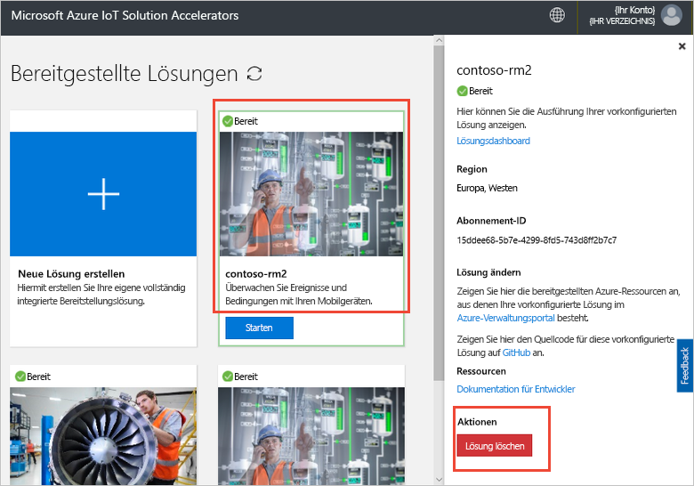

# Verbinden eines IoT DevKit-Geräts mit dem Solution Accelerator für die Remoteüberwachung

[!INCLUDE [iot-suite-selector-connecting](../../includes/iot-suite-selector-connecting.md)]

In dieser Schrittanleitung wird gezeigt, wie Sie eine Beispielanwendung auf Ihrem IoT DevKit-Gerät ausführen. Der Beispielcode sendet Telemetriedaten von den Sensoren auf dem DevKit-Gerät an Ihren Solution Accelerator.

Das [MXChip IoT DevKit](https://aka.ms/iot-devkit) ist ein mit Arduino kompatibles All-in-One-Board mit umfangreichen Peripheriegeräten und Sensoren. Mit den Erweiterungspaketen [Azure IoT Device Workbench](https://aka.ms/iot-workbench) und [Azure IoT Tools](https://aka.ms/azure-iot-tools) können Sie in Visual Studio Code dafür entwickeln. Der [Projektkatalog](https://microsoft.github.io/azure-iot-developer-kit/docs/projects/) enthält Beispielanwendungen, die Sie beim Erstellen von Prototypen für IoT-Lösungen unterstützen.

## Voraussetzungen

Um die Schritte in diesem Tutorial auszuführen, erledigen Sie zuerst die folgenden Aufgaben:

* Bereiten Sie Ihr DevKit vor, indem Sie die in [Verbinden von IoT DevKit AZ3166 mit Azure IoT Hub in der Cloud](/azure/iot-hub/iot-hub-arduino-iot-devkit-az3166-get-started) beschriebenen Schritte ausführen.

## Öffnen eines Beispielprojekts

So öffnen Sie das Remoteüberwachungsbeispiel in VS Code:

1. Stellen Sie sicher, dass Ihr IoT DevKit nicht mit Ihrem Computer verbunden ist. Starten Sie zuerst Visual Studio Code, und stellen Sie dann eine Verbindung von DevKit mit Ihrem Computer her.

1. Drücken Sie `F1`, um die Befehlspalette zu öffnen, und geben Sie **Azure IoT Device Workbench: Open Examples...** (Azure IoT Device Workbench: Beispiele öffnen) ein. Wählen Sie dann **IoT DevKit** als Board aus.

1. Suchen Sie **Remoteüberwachung**, und klicken Sie auf **Beispiel öffnen**. Daraufhin wird ein neues VS Code-Fenster mit dem Projektordner geöffnet:

   

## Konfigurieren des Geräts

So konfigurieren Sie die Verbindungszeichenfolge des IoT Hub-Geräts auf Ihrem DevKit-Gerät:

1. Versetzen Sie das IoT DevKit in den **Konfigurationsmodus**:

    * Halten Sie die Taste **A** gedrückt.
    * Drücken Sie gleichzeitig einmal die **Reset**-Taste.

1. Auf dem Bildschirm werden die DevKit-ID und `Configuration` angezeigt.

    

1. Drücken Sie **F1**, um die Befehlspalette zu öffnen, geben Sie **Azure IoT Device Workbench: Configure Device Settings > Config Device Connection String** (Azure IoT Device Workbenche: Geräteeinstellungen konfigurieren > Geräte-Verbindungszeichenfolge konfigurieren) ein, und wählen Sie den angezeigten Befehl aus.

1. Fügen Sie die zuvor kopierte Verbindungszeichenfolge ein, und drücken Sie die **EINGABETASTE**, um das Gerät zu konfigurieren.

## Erstellen des Codes

So erstellen Sie den Gerätecode und laden ihn hoch:

1. Drücken Sie `F1`, um die Befehlspalette zu öffnen, geben Sie **Azure IoT Device Workbench: Upload Device Code** (Azure IoT Device Workbench: Gerätecode hochladen) ein, und wählen Sie den angezeigten Befehl aus.

1. VS Code kompiliert und lädt den Code auf Ihr DevKit-Gerät hoch:

    

1. Das DevKit-Gerät wird neu gestartet und führt den Code aus, den Sie hochgeladen haben.

## Testen des Beispiels

Um sicherzustellen, dass die auf das DevKit-Gerät hochgeladene Beispielanwendung funktioniert, führen Sie die folgenden Schritte aus:

### Anzeigen der Telemetriedaten, die an die Remoteüberwachungslösung gesendet wurden

Wenn die Beispiel-App ausgeführt wird, sendet das DevKit-Gerät Telemetriedaten von den Sensoren über das WLAN an Ihren Solution Accelerator. So zeigen Sie die Telemetriedaten an:

1. Wechseln Sie zu Ihrem Lösungsdashboard, und klicken Sie auf **Geräte-Explorer**.

1. Klicken Sie auf den Gerätenamen Ihres DevKit-Geräts. Auf der Registerkarte rechts sind die Telemetriedaten aus dem DevKit in Echtzeit zu sehen:

    

### Steuern des DevKit-Geräts

Mithilfe des Solution Accelerators für die Remoteüberwachung können Sie Ihr Gerät remote steuern. Durch den Beispielcode werden drei Methoden implementiert, die Sie im Abschnitt **Methode** sehen, wenn Sie das Gerät auf der Seite **Geräte-Explorer** auswählen:

So ändern Sie die Farbe einer der DevKit-LEDs mithilfe der Methode **LedColor**:

1. Wählen Sie den Gerätenamen aus der Geräteliste aus, und klicken Sie auf die **Aufträge**:

    

1. Konfigurieren Sie die Aufträge mithilfe der folgenden Werte, und klicken Sie auf **Anwenden**:

   * Auftrag auswählen: **Run-Methode**
   * Methodenname: **LedColor**
   * Auftragsname: **ChangeLedColor**

     

1. Innerhalb weniger Sekunden ändert sich die Farbe der RGB-LED an Ihrem DevKit (unterhalb der A-Taste):

    

## Bereinigen von Ressourcen

Wenn Sie mit den Tutorials fortfahren möchten, können Sie die Bereitstellung des Solution Accelerators für die Remoteüberwachung beibehalten.

Falls Sie den Solution Accelerator nicht mehr benötigen, können Sie ihn auf der Seite „Bereitgestellte Lösungen“ löschen, indem Sie ihn auswählen und dann auf „Lösung löschen“ klicken:

## Probleme und Feedback

Wenn Probleme auftreten, lesen Sie die [häufig gestellten Fragen zum IoT DevKit](https://microsoft.github.io/azure-iot-developer-kit/docs/faq/), oder wenden Sie sich über folgende Kanäle an uns:

* [Gitter.im](https://gitter.im/Microsoft/azure-iot-developer-kit)
* [Stack Overflow](https://stackoverflow.com/questions/tagged/iot-devkit)

## Nächste Schritte

Nachdem Sie nun erfahren haben, wie Sie die Verbindung eines DevKit-Geräts mit dem Solution Accelerator für die Remoteüberwachung herstellen, werden die folgenden nächsten Schritte empfohlen:

* [Was sind die IoT Solution Accelerators?](https://docs.microsoft.com/azure/iot-accelerators/)
* [Anpassen der Benutzeroberfläche](iot-accelerators-remote-monitoring-customize.md)
* [Herstellen einer Verbindung zwischen IoT DevKit und Ihrer Azure IoT Central-Anwendung](../iot-central/howto-connect-devkit.md)