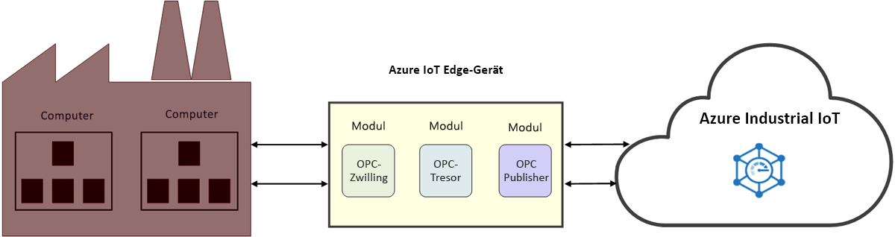

# Was ist Industrial IoT (IIoT)?

IIoT ist das Internet der Dinge für die Industrie. IIoT ermöglicht die Verbesserung der Effizienz durch den Einsatz von IoT in der Fertigungsindustrie. 

## Verbessern der Effizienz in der Industrie

Steigern Sie die Produktivität und Wirtschaftlichkeit Ihres Unternehmens mit einem Connected Factory-Solution Accelerator. Verbinden und überwachen Sie Ihre Industriemaschinen und -geräte in der Cloud – einschließlich Ihrer Computer, die bereits im Fertigungsbereich betrieben werden. Analysieren Sie Ihre IoT-Daten, um zu ermitteln, wie sich die Fertigungsleistung insgesamt verbessern lässt.

Beschleunigen Sie den Zugriff auf Computer im Fertigungsbereich mit OPC Twin, und konzentrieren Sie sich auf die Entwicklung von IIoT-Lösungen. Optimieren Sie die Zertifikatverwaltung sowie die Integration von Industrieanlagen mit OPC Vault, um die Konnektivität Ihrer Anlagen zu gewährleisten. Diese Microservices bieten neben [Azure Industrial IoT-Komponenten](https://github.com/Azure/azure-iiot-opc-ua) auch eine REST-ähnliche API. Die Dienst-API ermöglicht die Steuerung von Edgemodulfunktionen. 

> [!NOTE]
> Weitere Informationen zu Azure Industrial IoT-Diensten finden Sie im [GitHub-Repository](https://github.com/Azure/azure-iiot-services).
Sollten Sie noch nicht mit der Funktionsweise von Azure IoT Edge-Modulen vertraut sein, lesen Sie zunächst folgende Artikel:
- [About Azure IoT Edge (Informationen zu Azure IoT Edge)](../iot-edge/about-iot-edge.md)
- [Grundlegendes zu Azure IoT Edge-Modulen](../iot-edge/iot-edge-modules.md)

## Verbundene Factory

[Connected Factory](../iot-accelerators/iot-accelerators-connected-factory-features.md) ist eine Implementierung der Azure Industrial IoT-Referenzarchitektur von Microsoft, die an die individuellen Anforderungen Ihres Unternehmens angepasst werden kann. Der gesamte Lösungscode ist Open Source und steht im GitHub-Repository für den Connected Factory-Solution Accelerator zur Verfügung. Sie können ihn als Ausgangspunkt für ein kommerzielles Produkt verwenden und innerhalb weniger Minuten eine vorgefertigte Lösung in Ihrem Azure-Abonnement bereitstellen. 

## Konnektivität im Fertigungsbereich

OPC Twin ist eine IIoT-Komponente zur Automatisierung der Geräteermittlung und -registrierung, mit der Sie industrielle Geräte über REST-APIs fernsteuern können. OPC Twin nutzt Azure IoT Edge und IoT Hub, um eine Verbindung zwischen Cloud und Fabriknetzwerk herzustellen. Mit OPC Twin können sich IIoT-Entwickler auf die Entwicklung von IIoT-Anwendung konzentrieren, ohne sich Gedanken über den sicheren Zugriff auf die lokalen Computer machen zu müssen.

## Sicherheit

OPC Vault ist eine Implementierung von OPC UA GDS (Global Discovery Server) und dient zum Konfigurieren, Registrieren und Verwalten des Zertifikatlebenszyklus für OPC UA-Server- und -Clientanwendungen in der Cloud. OPC Vault vereinfacht die Implementierung und Wartung einer sicheren Anlagenkonnektivität im Industriebereich. Durch die Automatisierung der Zertifikatverwaltung sorgt OPC Vault dafür, dass sich Bediener nicht mehr um die manuellen und komplexen Prozesse im Zusammenhang mit Konnektivität und Zertifikatverwaltung kümmern müssen.

## Nächste Schritte

Nach dieser Einführung in Industrial IoT und die dazugehörigen Komponenten können Sie mit dem nächsten Thema fortfahren:

> [!div class="nextstepaction"]
> [Was ist ein OPC-Zwilling?](overview-opc-twin.md)
