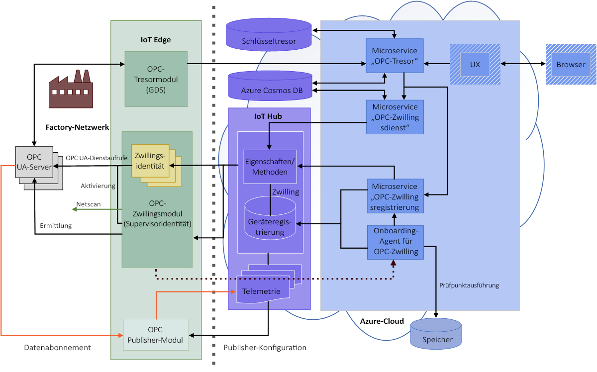

# Was ist OPC Vault?

OPC Vault ist ein Microservice, mit dem der Zertifikatlebenszyklus für OPC UA-Server- und -Clientanwendungen in der Cloud konfiguriert, registriert und verwaltet werden kann. In diesem Artikel werden einfache Anwendungsfälle für OPC Vault beschrieben.

## Zertifikatverwaltung

Es kann beispielsweise sein, dass ein Fertigungsunternehmen seinen OPC UA-Servercomputer mit einer neu entwickelten Clientanwendung verbinden muss. Wenn das Fertigungsunternehmen zum ersten Mal auf den Servercomputer zugreift, wird in der OPC UA-Serveranwendung sofort eine Fehlermeldung angezeigt, um darauf hinzuweisen, dass die Clientanwendung nicht sicher ist. Dieser Mechanismus ist in den OPC UA-Servercomputer integriert, um den unberechtigten Zugriff auf die Anwendung und somit gefährliches Hacking in der Fertigung zu verhindern.

## Verwaltung der Anwendungssicherheit
Ein Sicherheitsexperte nutzt den OPC Vault-Microservice zum einfachen Aktivieren des OPC UA-Servers für die Kommunikation mit einer beliebigen Clientanwendung, da OPC Vault über alle Funktionen für die Zertifikatregistrierung, Speicherung und Lebenszyklusverwaltung verfügt. Nachdem der OPC UA-Server nun auf sichere Weise verbunden wurde, kann er mit der neu entwickelten Clientanwendung kommunizieren.

## Vollständige OPC Vault-Architektur
Im folgenden Diagramm ist die gesamte OPC Vault-Architektur dargestellt.

