# Schnellstart: Testen einer cloudbasierten Lösung zum Verwalten von industriellen IoT-Geräten

In dieser Schnellstartanleitung erfahren Sie, wie Sie den Azure IoT Solution Accelerator für verbundene Factorys bereitstellen, um eine cloudbasierte Überwachungs- und Verwaltungssimulation für industrielle IoT-Geräte auszuführen. Wenn Sie den Solution Accelerator für verbundene Factorys bereitstellen, verfügt dieser bereits über simulierte Ressourcen, mit denen Sie ein allgemeines industrielles IoT-Szenario durchlaufen können. Mehrere simulierte Werke (Factorys) werden mit der Lösung verbunden und melden die Datenwerte, die zum Berechnen der Gesamtanlageneffektivität (Overall Equipment Effectiveness, OEE) und der Key Performance Indicators (KPIs) erforderlich sind. In dieser Schnellstartanleitung erfahren Sie, wie Sie mit dem Lösungsdashboard folgende Aufgaben ausführen:

* Überwachen von Werk, Fertigungsstrecken, OEE von Stationen und KPI-Werten.
* Analysieren der Telemetriedaten, die über diese Geräte generiert werden.
* Reagieren auf Alarme.

Für diese Schnellstartanleitung benötigen Sie ein aktives Azure-Abonnement.

Wenn Sie kein Azure-Abonnement besitzen, können Sie ein [kostenloses Konto](https://azure.microsoft.com/free/?WT.mc_id=A261C142F) erstellen, bevor Sie beginnen.

## Bereitstellen der Lösung

Beim Bereitstellen des Solution Accelerators in Ihrem Azure-Abonnement müssen Sie einige Konfigurationsoptionen festlegen.

Melden Sie sich mit Ihren Azure-Kontoanmeldeinformationen an [azureiotsolutions.com](https://www.azureiotsolutions.com/Accelerators) an.

Klicken Sie auf der Kachel **Verbundene Factory** auf **Jetzt testen**.

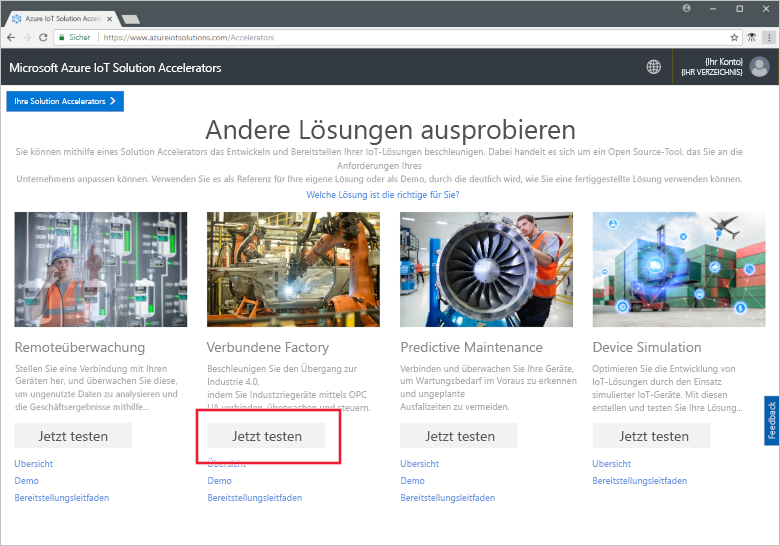

Geben Sie auf der Seite **Lösung für verbundene Factorys erstellen** einen eindeutigen **Lösungsnamen** für Ihren Solution Accelerator für verbundene Factorys ein. Dieser Name bezeichnet die Azure-Ressourcengruppe, die alle Solution Accelerator-Ressourcen enthält. In dieser Schnellstartanleitung haben wir den Namen **MyDemoConnectedFactory** verwendet.

Wählen Sie die gewünschten Angaben für **Abonnement** und **Region**, um den Solution Accelerator bereitzustellen. Normalerweise wählen Sie die Region, die Ihnen am nächsten liegt. In dieser Schnellstartanleitung haben wir **Visual Studio Enterprise** und **USA, Osten** gewählt. Sie müssen ein [globaler Administrator oder Benutzer](iot-accelerators-permissions.md) des Abonnements sein.

Klicken Sie auf **Lösung erstellen**, um mit der Bereitstellung zu beginnen. Dieser Prozess dauert mindestens fünf Minuten:

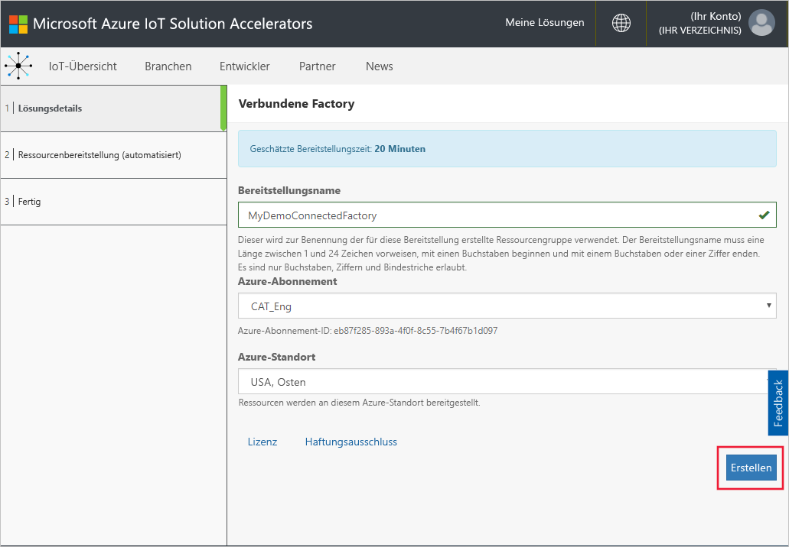

## Anmelden bei der Lösung

Wenn die Bereitstellung in Ihrem Azure-Abonnement abgeschlossen ist, wird auf der Kachel der Lösung ein grünes Häkchen und **Bereit** angezeigt. Jetzt können Sie sich beim Dashboard für den Solution Accelerator für verbundene Factorys anmelden.

Klicken Sie auf der Seite **Bereitgestellte Lösungen** auf Ihren Solution Accelerator für die neue verbundene Factory:

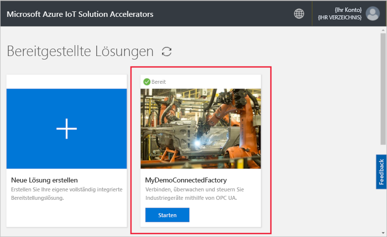

Im angezeigten Panel sehen Sie Informationen zum Solution Accelerator für Ihre verbundene Factory. Wählen Sie **Lösungsdashboard** aus, um den Solution Accelerator für Ihre verbundene Factory anzuzeigen:

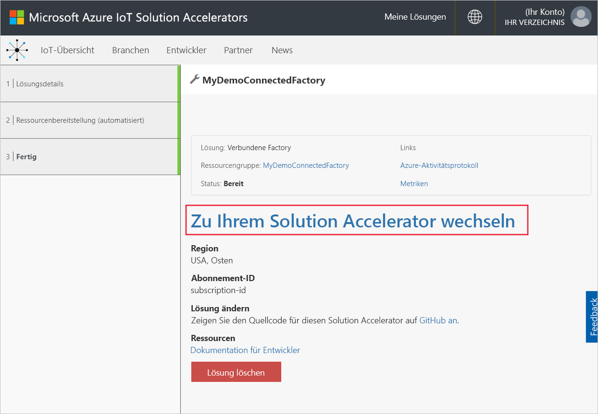

Klicken Sie auf **Akzeptieren**, um die Zustimmungsanforderung zu akzeptieren, die im Lösungsdashboard für verbundene Factorys im Browser angezeigt wird. Es wird eine Reihe simulierter Werke, Fertigungsstrecken und Stationen angezeigt.

## Anzeigen des Dashboards

Die Standardansicht ist das *Dashboard*. Über das Menü auf der linken Seite gelangen Sie zu anderen Bereichen des Portals:

[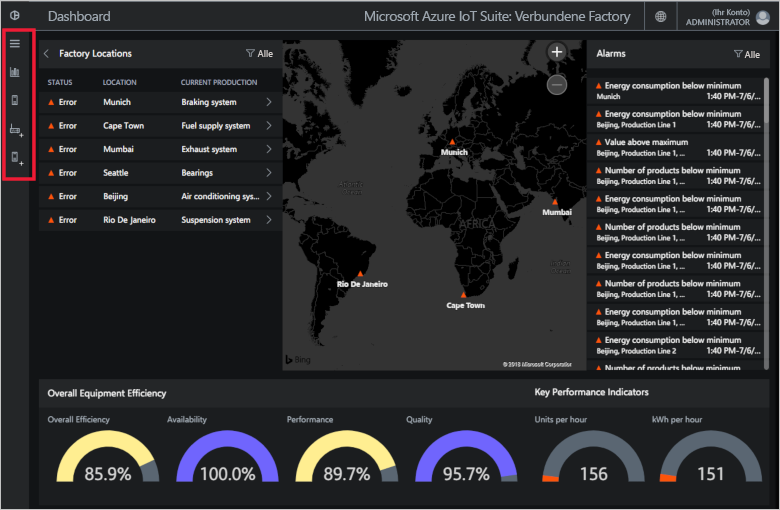](./media/quickstart-connected-factory-deploy/dashboard-expanded.png#lightbox)

Verwenden Sie das Dashboard, um Ihre industriellen IoT-Geräte zu verwalten. Die verbundene Factory verwendet eine Hierarchie zum Anzeigen einer globalen Factorykonfiguration. Auf der obersten Ebene der Hierarchie befindet sich das Unternehmen, das eine oder mehrere Werke (Factorys) enthält, jedes Werk enthält Fertigungsstrecken und jede Fertigungsstrecken besteht aus Stationen. Auf jeder Ebene können Sie OEE und KPIs anzeigen, neue Knoten für Telemetriedaten veröffentlichen und auf Alarme reagieren.

Auf dem Dashboard wird Folgendes angezeigt:

## Geräteeffizienz gesamt

Im Bereich **Overall Equipment Effectiveness** werden die OEE-Werte für das gesamte Unternehmen oder das jeweils angezeigte Werk, die Fertigungsstrecke oder die Station angegeben. Dieser Wert wird über die Stationsansicht auf Unternehmensebene aggregiert. Der OEE-Wert und die Elemente, aus denen dieser Wert besteht, können weiter analysiert werden.

[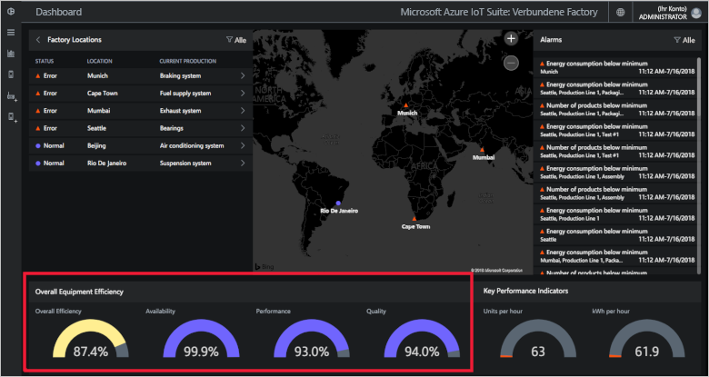](./media/quickstart-connected-factory-deploy/oee-expanded.png#lightbox)

Mit dem OEE-Wert wird die Effizienz des Fertigungsprozesses bewertet, indem produktionsbezogene Betriebsparameter verwendet werden. OEE ist in der Industrie eine standardmäßige Kennzahl. Sie wird berechnet, indem der Verfügbarkeitsfaktor, der Leistungsfaktor und der Qualitätsfaktor miteinander multipliziert werden: OEE = Verfügbarkeit x Leistung x Qualität.

Sie können den OEE-Wert für eine beliebige Ebene in den Hierarchiedaten weiter analysieren. Klicken Sie auf die OEE-, Verfügbarkeits-, Leistungs- oder Qualitätsprozentwahl. Es wird ein Kontextbereich mit Visualisierungen von Daten über verschiedene Zeitskalen angezeigt:

[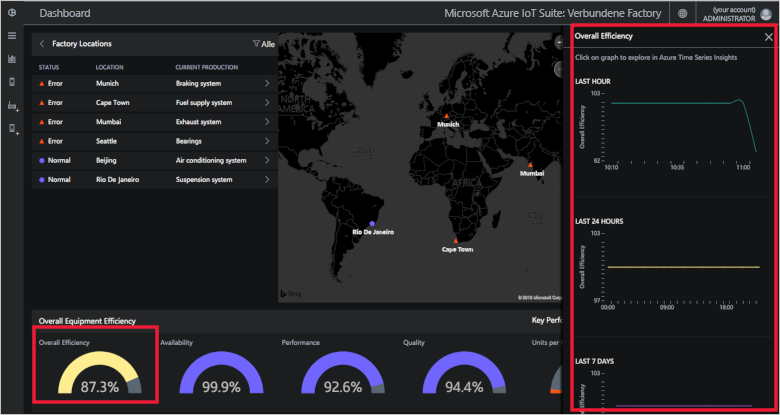](./media/quickstart-connected-factory-deploy/oeedetail-expanded.png#lightbox)

Klicken Sie auf ein Diagramm, wenn Sie die Daten weiter analysieren möchten.

### Key Performance Indicators

Im Bereich **Key Performance Indicators** werden die Anzahl der pro Stunde produzierten Einheiten und der Energieverbrauch des gesamten Unternehmens bzw. des jeweiligen Werks, der Fertigungsstrecke oder der Station angezeigt. Diese Werte werden über eine Stationsansicht auf Unternehmensebene aggregiert.

[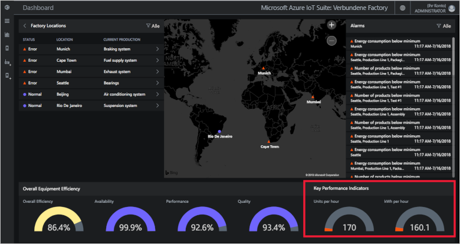](./media/quickstart-connected-factory-deploy/kpis-expanded.png#lightbox)

Sie können die KPIs für eine beliebige Ebene in den Hierarchiedaten weiter analysieren. Klicken Sie auf die OEE-, Verfügbarkeits-, Leistungs- oder Qualitätsprozentwahl. Es wird ein Kontextbereich mit Visualisierungen von Daten über verschiedene Zeitskalen angezeigt:

[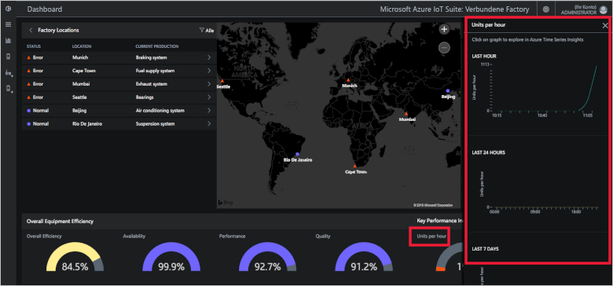](./media/quickstart-connected-factory-deploy/kpidetail-expanded.png#lightbox)

Klicken Sie auf ein Diagramm, wenn Sie die Daten weiter analysieren möchten.

### Factorystandorte

Ein Bereich namens **Factorystandorte**, in dem der Status, der Speicherort und die aktuelle Produktionskonfiguration für die Lösung angezeigt werden. Bei der ersten Ausführung des Solution Accelerators wird im Dashboard ein simulierter Satz von Factorys angezeigt. Jede Fertigungsstreckensimulation besteht aus drei echten OPC UA-Servern (OPC Unified Architecture) zum Durchführen von simulierten Aufgaben und Freigeben von Daten. Weitere Informationen zu OPC UA finden Sie in den [häufig gestellten Fragen zu verbundenen Factorys](iot-accelerators-faq-cf.md):

[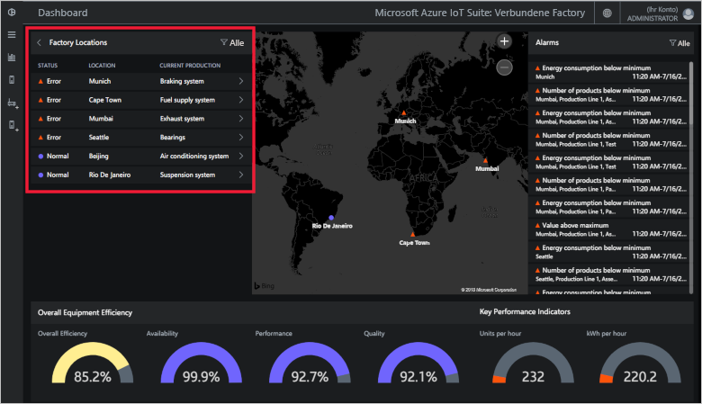](./media/quickstart-connected-factory-deploy/factorylocations-expanded.png#lightbox)

Sie können durch die Lösungshierarchie navigieren und OEE-Werte und KPIs auf jeder Ebene anzeigen:

1. Klicken Sie in **Factorystandorte** auf **Mumbai**. Die Fertigungsstrecken an diesem Standort werden angezeigt.

1. Klicken Sie auf **Fertigungsstrecke 1**. Die Stationen in dieser Fertigungsstrecke werden angezeigt.

1. Klicken Sie auf **Verpacken**. Die von dieser Station veröffentlichten OPC UA-Knoten werden angezeigt.

1. Klicken Sie auf **EnergyConsumption**. Es werden einige Diagramme angezeigt, in denen dieser Wert über verschiedene Zeitskalen gezeichnet wird. Klicken Sie auf ein Diagramm, wenn Sie die Daten weiter analysieren möchten.

[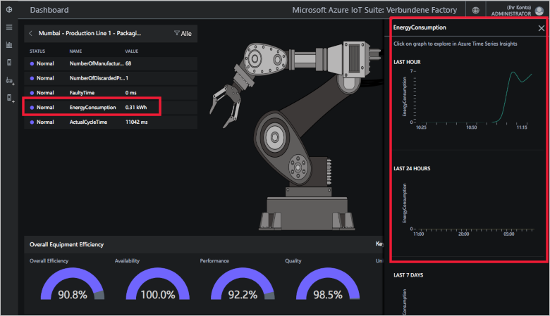](./media/quickstart-connected-factory-deploy/explorelocations-expanded.png#lightbox)

### Map

Wenn für Ihr Abonnement Zugriff auf die [Bing Maps-API](iot-accelerators-faq-cf.md) besteht, werden Ihnen auf der Karte mit den *Werken* der geografische Standort und der Status aller Werke einer Lösung angezeigt. Klicken Sie auf die Standorte, die auf der Karte angezeigt werden, um Details zum jeweiligen Standort anzuzeigen.

[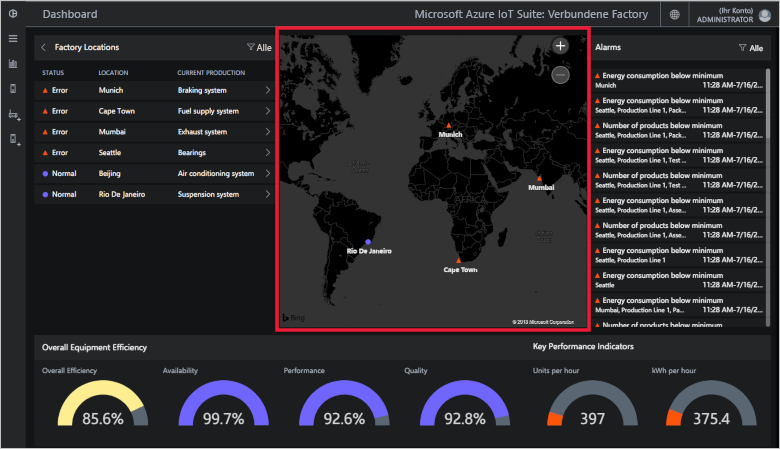](./media/quickstart-connected-factory-deploy/map-expanded.png#lightbox)

### Alarme

Der Bereich **Alarme** enthält Alarme, die generiert werden, wenn ein gemeldeter Wert oder ein berechneter OEE-/KPI-Wert den konfigurierten Schwellenwert übersteigt. In diesem Bereich werden Alarme auf jeder Ebene der Hierarchie angezeigt – von der Stationsebene bis zur Unternehmensebene. Jeder Alarm enthält eine Beschreibung, das Datum, die Uhrzeit, den Standort und die Anzahl von Vorkommen:

[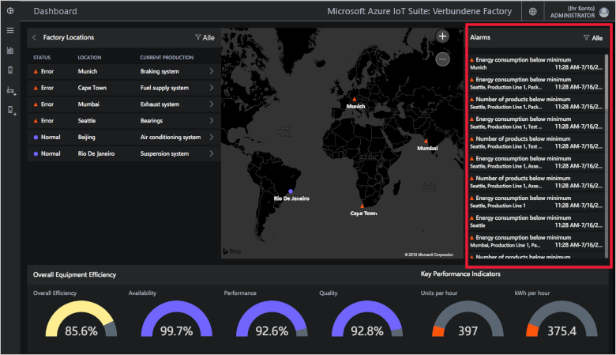](./media/quickstart-connected-factory-deploy/alarms-expanded.png#lightbox)

Sie können über das Dashboard die Daten analysieren, die den Alarm verursacht haben. Als Administrator können Sie für die Alarme beispielsweise folgende Standardaktionen durchführen:

* Schließen des Alarms
* Bestätigen des Alarms

Klicken Sie auf einen der Alarme, wählen Sie in der Dropdownliste **Aktion wählen** die Option **Warnung bestätigen**, und klicken Sie dann auf **Übernehmen**:

[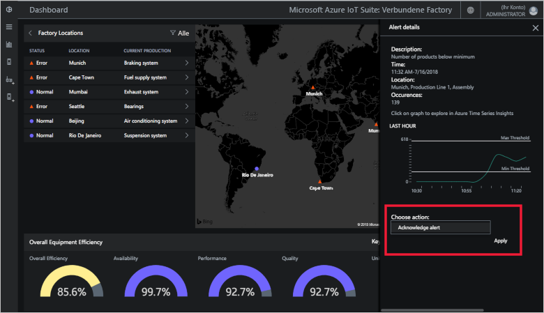](./media/quickstart-connected-factory-deploy/acknowledge-expanded.png#lightbox)

Klicken Sie im Bereich mit den Alarmen auf den Graphen, um die Alarmdaten eingehender zu analysieren.

Diese Alarme werden durch Regeln generiert, die in einer Konfigurationsdatei im Solution Accelerator angegeben werden. Mit diesen Regeln können Alarme generiert werden, wenn die OEE- bzw. KPI-Werte oder die Werte des OPC UA-Knotens den konfigurierten Schwellenwert überschreiten.

## Bereinigen von Ressourcen

Wenn Sie mehr wissen möchten, lassen Sie den Solution Accelerator für verbundene Factorys weiterhin bereitgestellt.

Falls Sie den Solution Accelerator nicht mehr benötigen, können Sie ihn auf der Seite [Bereitgestellte Lösungen](https://www.azureiotsolutions.com/Accelerators#dashboard) löschen, indem Sie ihn markieren und dann auf **Lösung löschen** klicken:

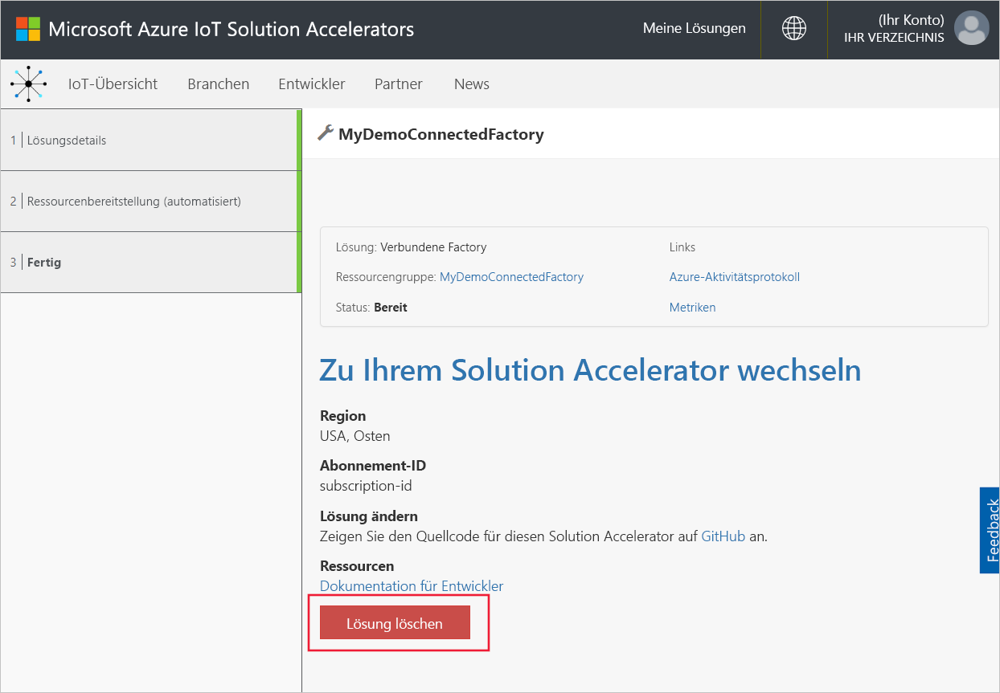

## Nächste Schritte

In dieser Schnellstartanleitung haben Sie den Solution Accelerator für verbundene Factorys bereitgestellt und gelernt, wie Sie durch Ihre Factorys, Fertigungsstrecken und Stationen navigieren. Sie haben außerdem gesehen, wie Sie die OEE- und KPI-Werte auf jeder Ebene der Hierarchie anzeigen und auf Alarme reagieren.

Um zu erfahren, wie Sie andere Features im Dashboard verwenden, um industrielle IoT-Geräte zu verwalten, fahren Sie mit der folgenden Anleitung fort:

> [!div class="nextstepaction"]
> [Verwenden des Dashboards für verbundene Factorys](iot-accelerators-connected-factory-dashboard.md)