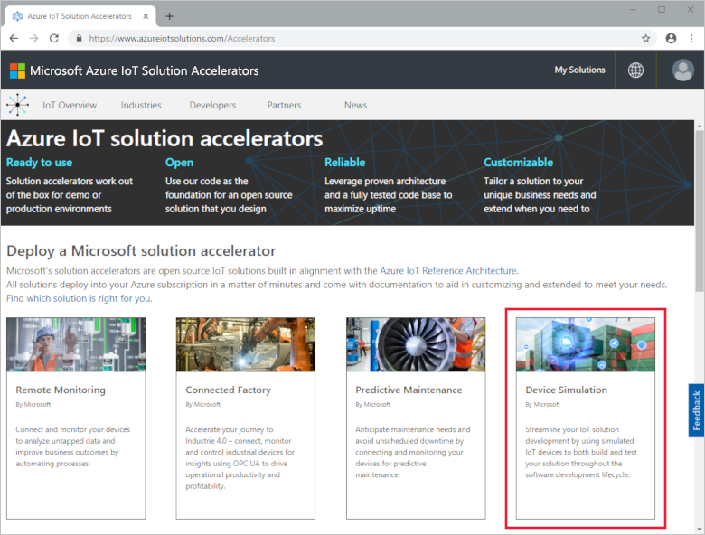
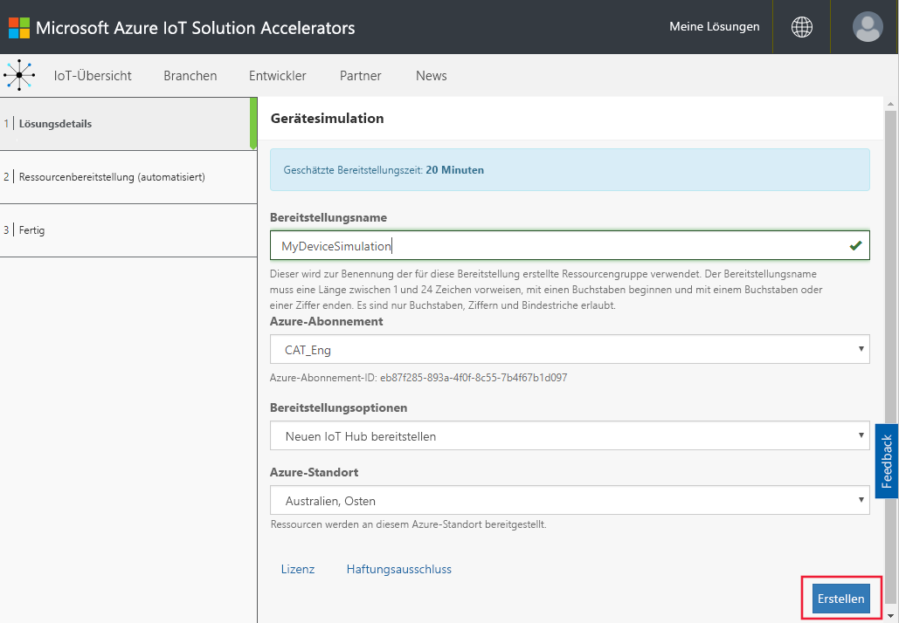
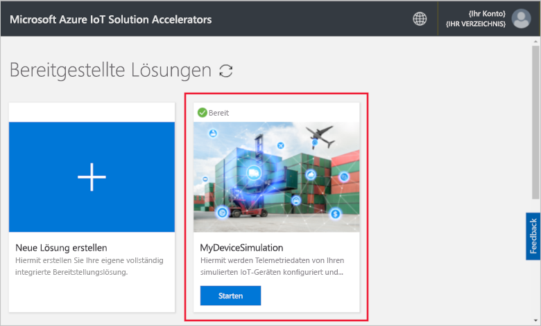
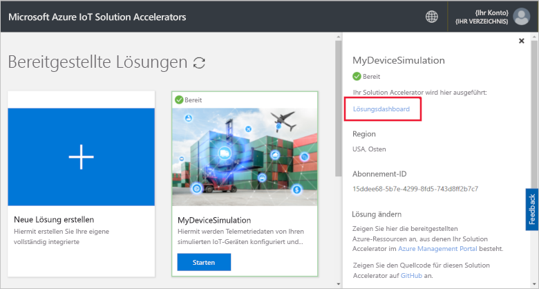
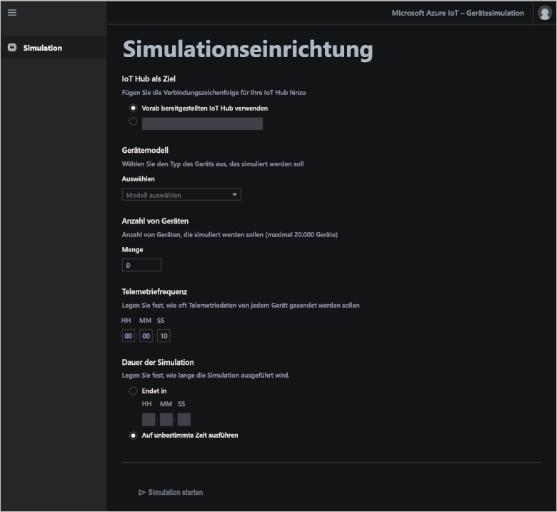
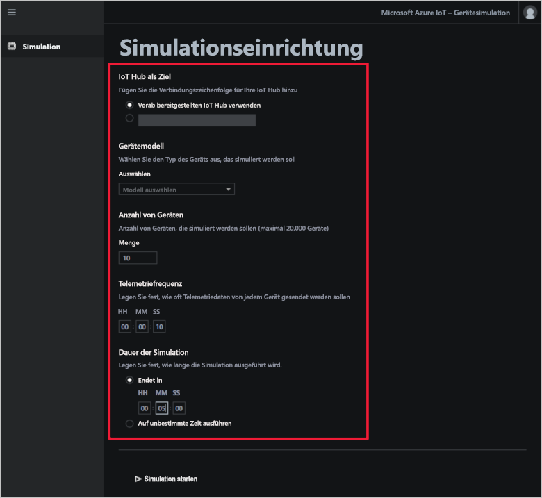
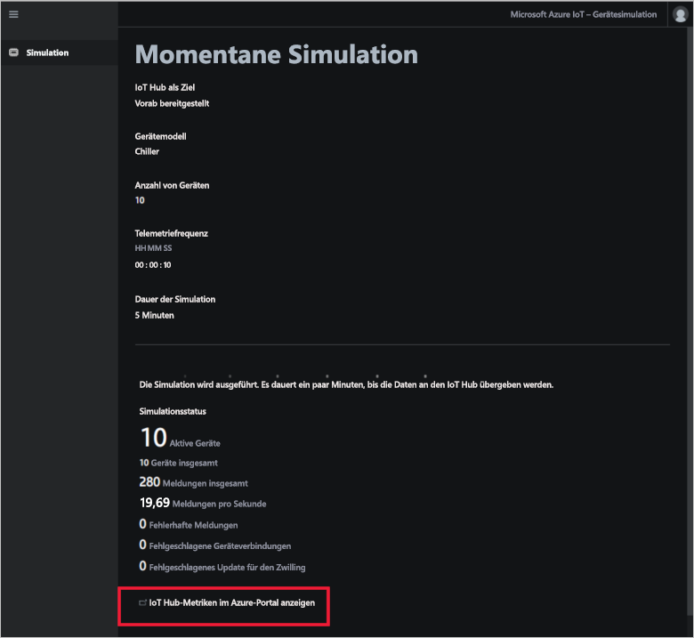
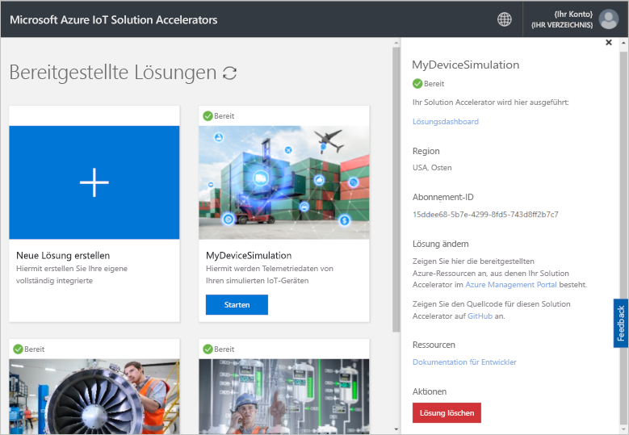

# Schnellstart: Stellen Sie eine cloudbasierte Gerätesimulationslösung bereit, und führen Sie sie aus.

Dieser Schnellstart veranschaulicht, wie Sie den Azure IoT Solution Accelerator für die Gerätesimulation verwenden, um Ihre IoT-Lösung zu testen. Nachdem Sie den Solution Accelerator bereitgestellt haben, verwenden Sie die Seite **Simulation**, um eine Simulation zu erstellen und auszuführen.

Für diese Schnellstartanleitung benötigen Sie ein aktives Azure-Abonnement.

Wenn Sie kein Azure-Abonnement besitzen, können Sie ein [kostenloses Konto](https://azure.microsoft.com/free/?WT.mc_id=A261C142F) erstellen, bevor Sie beginnen.

## Bereitstellen der Lösung

Beim Bereitstellen des Solution Accelerators in Ihrem Azure-Abonnement müssen Sie einige Konfigurationsoptionen festlegen.

Melden Sie sich mit Ihren Azure-Kontoanmeldeinformationen an [azureiotsolutions.com](https://www.azureiotsolutions.com/Accelerators) an.

Klicken Sie auf der Kachel **Gerätesimulation** auf **Jetzt ausprobieren**.

Geben Sie auf der Seite **Create Device Simulation solution** (Gerätesimulationslösung erstellen) einen eindeutigen **Lösungsnamen** ein. Notieren Sie sich Ihren Lösungsnamen. Er bezeichnet die Azure-Ressourcengruppe, die alle Ressourcen der Lösung enthält.

Wählen Sie die gewünschten Angaben für **Abonnement** und **Region**, um den Solution Accelerator bereitzustellen. Normalerweise wählen Sie die Region, die Ihnen am nächsten liegt. Sie müssen ein [globaler Administrator oder Benutzer](iot-accelerators-permissions.md) des Abonnements sein.

Aktivieren Sie das Kontrollkästchen zum Bereitstellen eines IoT Hubs, den Sie mit Ihrer Gerätesimulationslösung verwenden. Sie können den IoT Hub, den Ihre Simulation später verwenden wird, jederzeit ändern.

Klicken Sie auf **Lösung erstellen**, um die Bereitstellung Ihrer Lösung zu beginnen. Dieser Prozess dauert mindestens fünf Minuten:

## Anmelden bei der Lösung

Nach Abschluss der Bereitstellung können Sie sich beim Dashboard Ihres Solution Accelerators für die Gerätesimulation anmelden.

Klicken Sie auf der Seite **Bereitgestellte Lösungen** auf Ihren Solution Accelerator für die neue Gerätesimulation:

Im angezeigten Panel sehen Sie Informationen zum Solution Accelerator für Ihre Gerätesimulation. Wählen Sie **Lösungsdashboard** aus, um den Solution Accelerator für Ihre Gerätesimulation anzuzeigen:

Klicken Sie auf **Akzeptieren**, um die Zustimmungsanforderung zu akzeptieren, die im Dashboard für die Gerätesimulationslösung im Browser angezeigt wird:

## Konfigurieren der Simulation

Sie können eine Simulation über das Dashboard konfigurieren und ausführen. Verwenden Sie die Werte aus der folgenden Tabelle, um Ihre Simulation zu konfigurieren:

| Einstellung             | Wert                       |
| ------------------- | --------------------------- |
| IoT-Zielhub      | Verwenden von vorab bereitgestelltem IoT Hub |
| Gerätemodell        | Kältemaschine                     |
| Anzahl von Geräten   | 10                          |
| Telemetriefrequenz | 10 Sekunden                  |
| Simulationsdauer | 5 Minuten                   |

## Ausführen der Simulation

Klicken Sie auf **Simulation starten**. Die Simulation wird für die von Ihnen ausgewählte Dauer ausgeführt. Sie können die Simulation jederzeit anhalten, indem Sie auf **Simulation beenden** klicken. Die Simulation zeigt Statistiken für die aktuelle Ausführung an. Klicken Sie auf **View IoT Hub metrics in the Azure portal** (IoT Hub-Metriken im Azure-Portal anzeigen), um die vom IoT Hub gemeldeten Metriken anzuzeigen:

Sie können von einer bereitgestellten Instanz des Solution Accelerators nur jeweils eine Simulation ausführen.

## Bereinigen von Ressourcen

Wenn Sie mehr wissen möchten, lassen Sie den Solution Accelerator für die Gerätesimulation weiterhin bereitgestellt.

Falls Sie den Solution Accelerator nicht mehr benötigen, können Sie ihn auf der Seite [Bereitgestellte Lösungen](https://www.azureiotsolutions.com/Accelerators#dashboard) löschen, indem Sie ihn markieren und dann auf **Lösung löschen** klicken:

## Nächste Schritte

In diesem Schnellstart haben Sie den Solution Accelerator für die Gerätesimulation bereitgestellt und eine IoT-Gerätesimulation ausgeführt.

Weitere Informationen dazu, wie Sie einen vorhandenen IoT Hub in einer Simulation verwenden, finden Sie im folgenden Leitfaden:

> [!div class="nextstepaction"]
> [Use an existing IoT hub with the Device Simulation solution accelerator (Verwenden eines vorhandenen IoT Hubs mit dem Solution Accelerator für die Gerätesimulation)](iot-accelerators-device-simulation-choose-hub.md)
