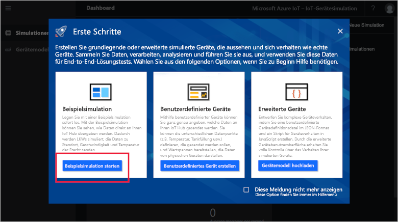
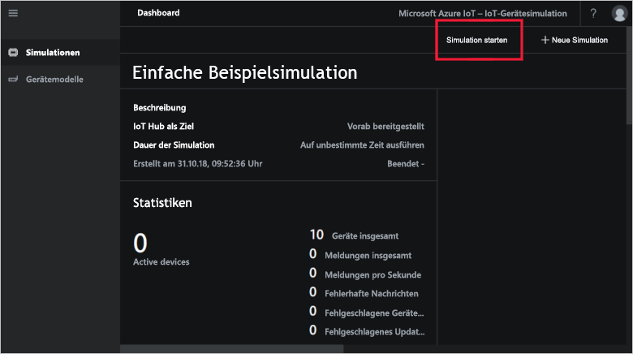

# Schnellstart: Bereitstellen und Ausführen einer IoT-Gerätesimulation in Azure

In dieser Schnellstartanleitung erfahren Sie, wie Sie die Azure IoT-Gerätesimulation bereitstellen, um Ihre IoT-Lösung zu testen. Nachdem Sie den Solution Accelerator bereitgestellt haben, führen Sie zum Einstieg eine Beispielsimulation aus.

Für diese Schnellstartanleitung benötigen Sie ein aktives Azure-Abonnement.

Wenn Sie kein Azure-Abonnement besitzen, können Sie ein [kostenloses Konto](https://azure.microsoft.com/free/?WT.mc_id=A261C142F) erstellen, bevor Sie beginnen.

## Bereitstellen der Gerätesimulation

Wenn Sie die Gerätesimulation in Ihrem Azure-Abonnement bereitstellen, müssen Sie einige Konfigurationsoptionen festlegen.

Melden Sie sich mit Ihren Azure-Kontoanmeldeinformationen an [azureiotsolutions.com](https://www.azureiotsolutions.com/Accelerators) an.

Klicken Sie auf die Kachel **Gerätesimulation**:

Klicken Sie auf der Seite mit der Beschreibung der Gerätesimulation auf **Jetzt ausprobieren**:

Geben Sie auf der Seite **Create Device Simulation solution** (Gerätesimulationslösung erstellen) einen eindeutigen **Lösungsnamen** ein.

Wählen Sie die gewünschten Angaben für **Abonnement** und **Region**, um den Solution Accelerator bereitzustellen. Normalerweise wählen Sie die Region, die Ihnen am nächsten liegt. Sie müssen ein [globaler Administrator oder Benutzer](iot-accelerators-permissions.md) des Abonnements sein.

Aktivieren Sie das Kontrollkästchen zum Bereitstellen eines IoT Hubs, den Sie mit Ihrer Gerätesimulationslösung verwenden. Sie können den IoT Hub, den Ihre Simulation später verwenden wird, jederzeit ändern.

Klicken Sie auf **Lösung erstellen**, um die Bereitstellung Ihrer Lösung zu beginnen. Dieser Prozess dauert mindestens fünf Minuten:

## Anmelden bei der Lösung

Nach Abschluss der Bereitstellung können Sie sich bei Ihrer Instanz der Gerätesimulation anmelden, indem Sie auf die Schaltfläche **Starten** klicken:

Klicken Sie auf **Akzeptieren**, um die Zustimmungsanforderung zu akzeptieren, die im Browser auf dem Dashboard für die Gerätesimulationslösung angezeigt wird.

Wenn Sie das Dashboard für die Gerätesimulation zum ersten Mal öffnen, wird eine**Anleitung** für die ersten Schritte angezeigt. Klicken Sie auf die erste Kachel, um eine Beispielsimulation zu öffnen. Wenn Sie die Anleitung für die ersten **Schritte**schließen, können Sie die einfache **Beispielsimulation**über das Dashboard öffnen, indem Sie auf die entsprechende Kachel klicken:

## Beispielsimulation

Die Beispielsimulation kann nicht bearbeitet werden. Sie ist mit folgenden Einstellungen konfiguriert:

| Einstellung             | Wert                       |
| ------------------- | --------------------------- |
| IoT-Zielhub      | Verwenden von vorab bereitgestelltem IoT Hub |
| Gerätemodell        | LKW                       |
| Anzahl von Geräten   | 10                          |
| Telemetriefrequenz | 10 Sekunden                  |
| Simulationsdauer | Run indefinitely (Unbegrenzt)            |

## Ausführen der Simulation

Klicken Sie auf **Simulation starten**. Die Simulation wird konfigurationsgemäß für unbegrenzte Zeit ausgeführt. Sie können die Simulation jederzeit anhalten, indem Sie auf **Simulation beenden** klicken. Die Simulation zeigt Statistiken für die aktuelle Ausführung an.

Pro Gerätesimulationsinstanz kann immer nur eine einzelne Simulation ausgeführt werden.

## Bereinigen von Ressourcen

Wenn Sie sich ausführlicher mit dieser Materie beschäftigen möchten, behalten Sie die bereitgestellte Gerätesimulation bei.

Falls Sie die Gerätesimulation nicht mehr benötigen, löschen Sie sie über die Seite [Bereitgestellte Lösungen](https://www.azureiotsolutions.com/Accelerators#dashboard), indem Sie auf die entsprechende Kachel und anschließend auf **Lösung löschen** klicken:

## Nächste Schritte

In dieser Schnellstartanleitung haben Sie eine Gerätesimulation bereitgestellt und eine exemplarische IoT-Gerätesimulation ausgeführt.

> [!div class="nextstepaction"]
> [Erstellen einer Simulation mit einem oder mehreren Gerätetypen](iot-accelerators-device-simulation-create-simulation.md)