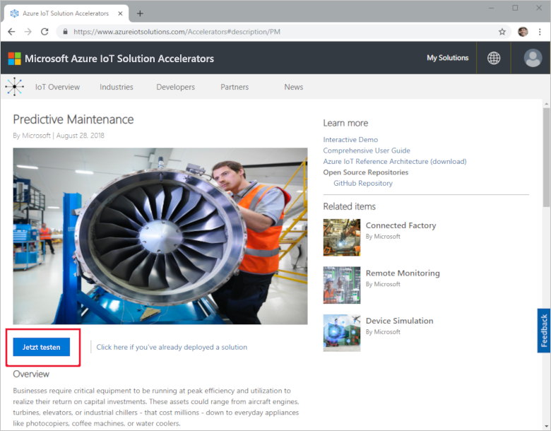
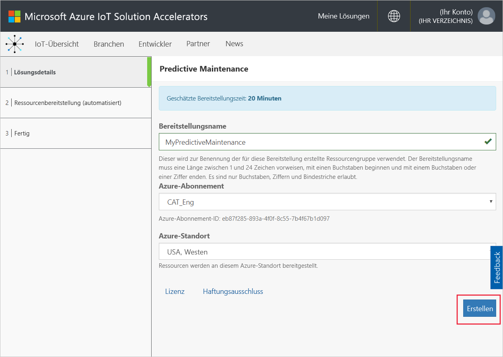
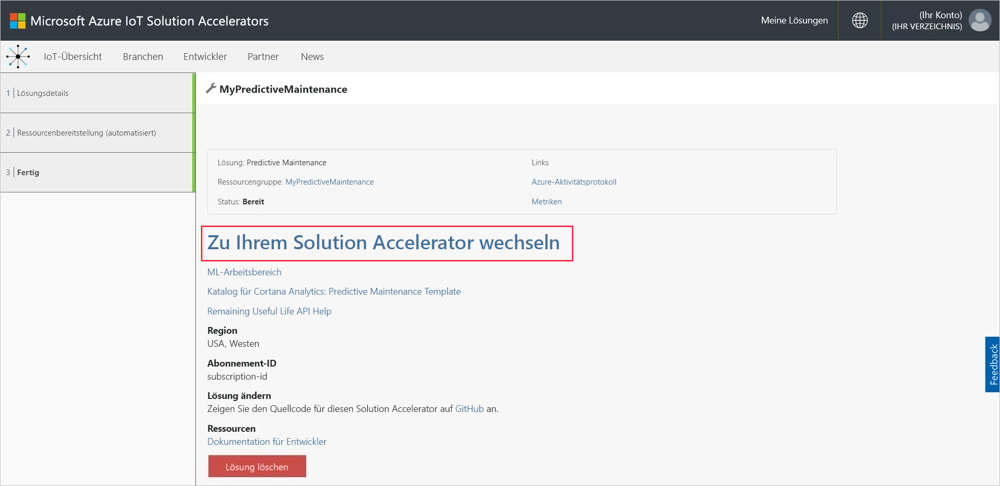
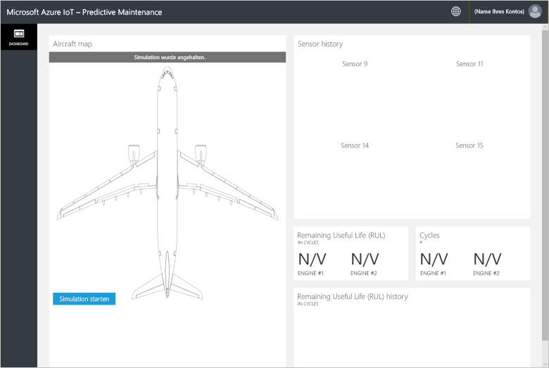
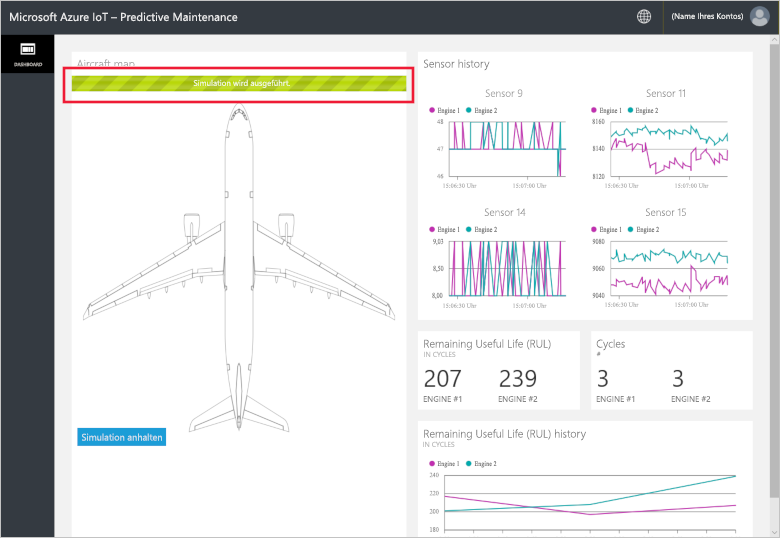
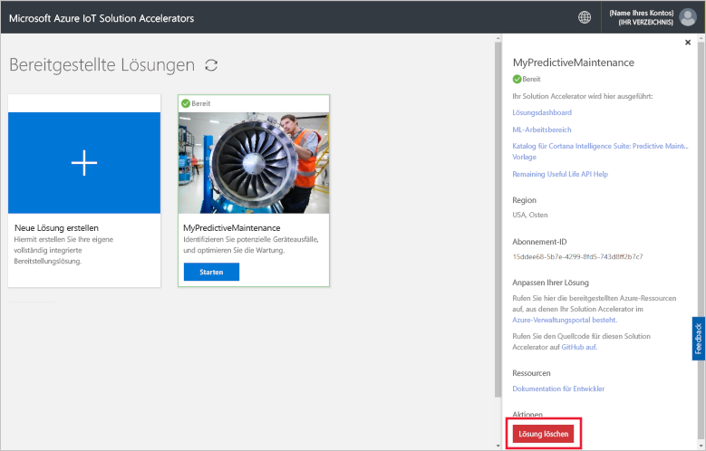

# Schnellstart: Ausprobieren einer cloudbasierten Lösung zum Ausführen einer Predictive Maintenance-Analyse auf meinen verbundenen Geräten

In dieser Schnellstartanleitung erfahren Sie, wie Sie den Azure IoT-Solution Accelerator für Predictive Maintenance verwenden, um eine cloudbasierte Predictive Maintenance-Simulation auszuführen. Nachdem Sie den Solution Accelerator bereitgestellt haben, verwenden Sie die Seite **Dashboard** der Lösung, um eine Predictive Maintenance-Simulation für Daten eines simulierten Flugzeugtriebwerks auszuführen. Dieser Solution Accelerator kann als Ausgangspunkt für Ihre eigene Implementierung sowie als Lernhilfe verwendet werden.

In dieser Simulation ist Fabrikam eine regionale Fluggesellschaft, deren Schwerpunkt auf hoher Kundenzufriedenheit zu wettbewerbsfähigen Preisen liegt. Eine Ursache von Flugverspätungen sind Wartungsprobleme, und insbesondere die Wartung von Flugzeugtriebwerken ist anspruchsvoll. Fabrikam muss unter allen Umständen einen Triebwerksausfall während des Flugs vermeiden. Daher setzt Fabrikam auf eine regelmäßige Inspektion und planmäßige Wartungsarbeiten. Jedes Flugzeugtriebwerk ist jedoch anders. Bisweilen werden unnötige Wartungsarbeiten an Triebwerken durchgeführt. Vor allem können jedoch Umstände auftreten, die ein Flugzeug am Fliegen hindern, bis eine Wartung durchgeführt wird. Dies kann besonders dann teuer sein, wenn sich das Flugzeug an einem Ort befindet, an dem die benötigten Techniker oder Ersatzteile nicht verfügbar sind.

Die Triebwerke der Fabrikam-Flotte sind mit Sensoren ausgestattet, die den Triebwerkszustand während des Flugs erfassen. Fabrikam verfügt für die Triebwerke dank dieser Sensoren über Betriebs- und Fehlerdaten aus vielen Jahren. Die Datenanalysten von Fabrikam haben diese Daten verwendet, um ein Modell zum Vorhersagen der verbleibenden Nutzungsdauer (Remaining Useful Life, RUL) eines Triebwerks zu entwickeln. Das Modell nutzt eine Korrelation zwischen den Daten von vier der Triebwerksensoren und dem Triebwerkverschleiß, der letztlich zum Ausfall führen kann. Fabrikam führt die regelmäßige Sicherheitsinspektion zwar weiterhin durch, aber jetzt kann das Unternehmen anhand der Modelle nach jedem Flug die Restnutzungsdauer für die einzelnen Triebwerke berechnen. Fabrikam kann nun zukünftige Fehlerpunkte vorhersagen und die Wartung planen, um die Zeit zu verringern, die Flugzeuge am Boden verbringen müssen. Mit diesem Prozess werden die Betriebskosten gesenkt, und gleichzeitig wird für die Sicherheit der Passagiere und der Crew gesorgt.

Für diese Schnellstartanleitung benötigen Sie ein aktives Azure-Abonnement.

Wenn Sie kein Azure-Abonnement besitzen, können Sie ein [kostenloses Konto](https://azure.microsoft.com/free/?WT.mc_id=A261C142F) erstellen, bevor Sie beginnen.

## Bereitstellen der Lösung

Beim Bereitstellen des Solution Accelerators in Ihrem Azure-Abonnement müssen Sie einige Konfigurationsoptionen festlegen.

Navigieren Sie zu [Microsoft Azure IoT Solution Accelerators](https://www.azureiotsolutions.com), und melden Sie sich mit den Anmeldeinformationen für Ihr Azure-Konto an.

Klicken Sie auf die Kachel **Predictive Maintenance**. Klicken Sie auf der Seite **Predictive Maintenance** auf **Jetzt testen**:

Geben Sie auf der Seite **Create Predictive Maintenance solution** (Predictive Maintenance-Lösung erstellen) einen eindeutigen **Lösungsnamen** für den Solution Accelerator für Predictive Maintenance ein. Im Rahmen dieser Schnellstartanleitung verwenden wir **MyPredictiveMaintenance**.

Wählen Sie die gewünschten Angaben für **Abonnement** und **Region**, um den Solution Accelerator bereitzustellen. Normalerweise wählen Sie die Region, die Ihnen am nächsten liegt. In dieser Schnellstartanleitung haben wir **Visual Studio Enterprise** und **USA, Osten** gewählt. Sie müssen ein [globaler Administrator oder Benutzer](iot-accelerators-permissions.md) des Abonnements sein.

Klicken Sie auf **Erstellen**, um mit der Bereitstellung zu beginnen. Dieser Prozess dauert mindestens fünf Minuten:

## Anmelden bei der Lösung

Wenn die Bereitstellung in Ihrem Azure-Abonnement abgeschlossen ist, werden auf der Kachel der Lösung ein grünes Häkchen und **Bereit** angezeigt. Nun können Sie sich beim Dashboard für den Solution Accelerator für Predictive Maintenance anmelden.

Klicken Sie auf der Seite **Bereitgestellte Lösungen** auf Ihren neuen Solution Accelerator für Predictive Maintenance.

 Der daraufhin angezeigten Seite können Sie Informationen zum Solution Accelerator entnehmen. Wählen Sie **Go to your Solution Accelerator** (Zum Solution Accelerator wechseln) aus, um den Solution Accelerator für Predictive Maintenance anzuzeigen:

Klicken Sie auf **Akzeptieren**, um die Zustimmungsanforderung zu akzeptieren, die im Lösungsdashboard für Predictive Maintenance im Browser angezeigt wird:

Klicken Sie auf **Simulation starten**, um die Simulation zu starten. Daraufhin füllt sich das Dashboard mit dem Sensorverlauf, der Restlebensdauer, den Zyklen und dem Verlauf der Restlebensdauer:

Wenn der Wert für die Restlebensdauer kleiner als 160 ist (zu Demonstrationszwecken willkürlich gewählter Schwellenwert), erscheint im Lösungsportal neben der Anzeige der Restlebensdauer ein Warnsymbol. Außerdem wird das Flugzeugtriebwerk im Lösungsportal gelb hervorgehoben. Beachten Sie, dass die Werte für die Restlebensdauer im Allgemeinen einen Abwärtstrend aufweisen, aber trotzdem relativ stark variieren. Der Grund für dieses Verhalten sind die variierenden Zykluslängen und die Modellgenauigkeit.

Die vollständige Simulation dauert ca. 35 Minuten, und es werden 148 Zyklen durchgeführt. Der Schwellenwert der Restlebensdauer von 160 wird zum ersten Mal nach ca. fünf Minuten erreicht, und für beide Triebwerke ist der Schwellenwert nach ca. acht Minuten erreicht.

Die Simulation durchläuft das vollständige Dataset für 148 Zyklen, und die endgültigen Werte für die Restlebensdauer und Zyklen werden festgelegt.

Sie können die Simulation jederzeit stoppen. Wenn Sie auf **Simulation starten** klicken, wird die Simulation aber ab dem Anfang des Datasets wiedergegeben.

## Bereinigen von Ressourcen

Wenn Sie mehr wissen möchten, lassen Sie den Solution Accelerator für Predictive Maintenance weiterhin bereitgestellt.

Falls Sie den Solution Accelerator nicht mehr benötigen, können Sie ihn auf der Seite [Bereitgestellte Lösungen](https://www.azureiotsolutions.com/Accelerators#dashboard) löschen, indem Sie ihn markieren und dann auf **Lösung löschen** klicken:

## Nächste Schritte

In dieser Schnellstartanleitung haben Sie den Solution Accelerator für Predictive Maintenance bereitgestellt und eine Simulation ausgeführt.

Weitere Informationen zum Solution Accelerator und zu den simulierten Flugzeugtriebwerken finden Sie im folgenden Artikel:

> [!div class="nextstepaction"]
> [Übersicht über den Solution Accelerator für Predictive Maintenance](iot-accelerators-predictive-walkthrough.md)
