# Schnellstart: Testen einer cloudbasierten Lösung für die Remoteüberwachung

In dieser Schnellstartanleitung wird veranschaulicht, wie Sie den Azure IoT-Solution Accelerator für die Remoteüberwachung bereitstellen. Bei dieser cloudbasierten Lösung verwenden Sie die Seite mit dem **Dashboard**, um simulierte Geräte auf einer Karte zu visualisieren. Auf der Seite **Wartung** reagieren Sie auf eine Druckwarnung eines simulierten Kühlgeräts. Dieser Solution Accelerator kann als Ausgangspunkt für Ihre eigene Implementierung sowie als Lernhilfe verwendet werden.

In der ursprünglichen Bereitstellung wird der Solution Accelerator für ein Unternehmen namens Contoso konfiguriert. Als Bediener bei Contoso verwalten Sie eine Auswahl von unterschiedlichen Gerätetypen, z.B. Kältemaschinen, die in verschiedenen physischen Umgebungen bereitgestellt wurden. Eine Kältemaschine sendet Telemetriedaten zu Temperatur, Luftfeuchtigkeit und Druck an den Solution Accelerator für die Remoteüberwachung.

In dieser Schnellstartanleitung wird zu Test- und Demonstrationszwecken eine **Basisversion** des Solution Accelerators bereitgestellt, um die Kosten zu minimieren. Weitere Informationen zu den verschiedenen Versionen, die Sie bereitstellen können, finden Sie unter [Bereitstellungen vom Typ „Basic“ und „Standard“](iot-accelerators-remote-monitoring-deploy-cli.md#basic-and-standard-deployments).

Für diese Schnellstartanleitung benötigen Sie ein aktives Azure-Abonnement.

Wenn Sie kein Azure-Abonnement besitzen, können Sie ein [kostenloses Konto](https://azure.microsoft.com/free/?WT.mc_id=A261C142F) erstellen, bevor Sie beginnen.

## Bereitstellen der Lösung

Beim Bereitstellen des Solution Accelerators in Ihrem Azure-Abonnement müssen Sie einige Konfigurationsoptionen festlegen.

Melden Sie sich mit Ihren Azure-Kontoanmeldeinformationen an [azureiotsolutions.com](https://www.azureiotsolutions.com/Accelerators) an.

Klicken Sie auf die Kachel **Remoteüberwachung**. Klicken Sie auf der Seite **Remoteüberwachung** auf **Jetzt testen**:

Wählen Sie unter **Bereitstellungsoptionen** die Option **C#-Microservices** aus. Die Java- und C#-Implementierungen verfügen über die gleichen Features.

Geben Sie einen eindeutigen **Lösungsnamen** für den Solution Accelerator für die Remoteüberwachung ein. In dieser Schnellstartanleitung wird der Name **contoso-rm** verwendet.

Wählen Sie die gewünschten Angaben für **Abonnement** und **Region**, um den Solution Accelerator bereitzustellen. Normalerweise wählen Sie die Region, die Ihnen am nächsten liegt. In dieser Schnellstartanleitung wird die Region **USA, Osten** verwendet.
Sie können **Visual Studio Enterprise** auswählen, müssen dazu aber [globaler Administrator oder Benutzer](iot-accelerators-permissions.md) sein.

Klicken Sie auf **Erstellen**, um mit der Bereitstellung zu beginnen. Dieser Prozess dauert mindestens fünf Minuten:

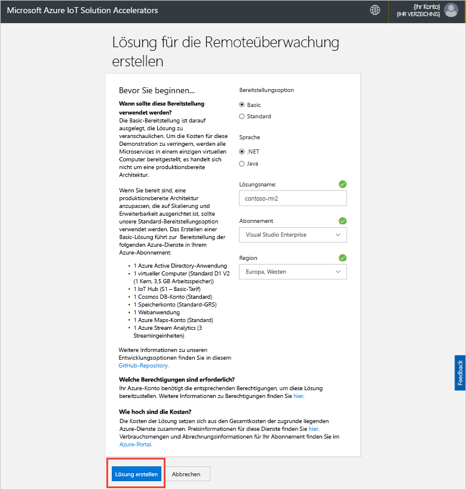

## Anmelden bei der Lösung

Wenn die Bereitstellung in Ihrem Azure-Abonnement abgeschlossen ist, werden auf der Kachel der Lösung ein grünes Häkchen und **Bereit** angezeigt. Nun können Sie sich beim Dashboard für den Solution Accelerator für die Remoteüberwachung anmelden.

Klicken Sie auf der Seite **Bereitgestellte Lösungen** auf Ihren neuen Solution Accelerator für die Remoteüberwachung:

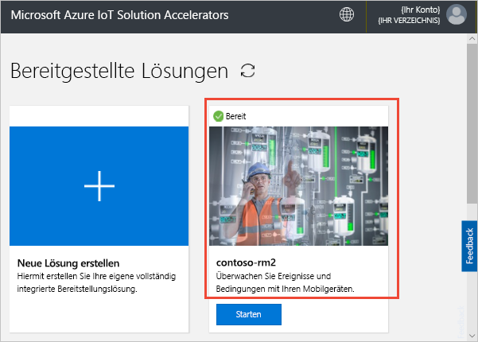

Im daraufhin angezeigten Bereich können Sie Informationen zum Solution Accelerator für die Remoteüberwachung einsehen. Wählen Sie **Go to your Solution Accelerator** (Zum Solution Accelerator wechseln) aus, um Ihren Solution Accelerator die Remoteüberwachung anzuzeigen:

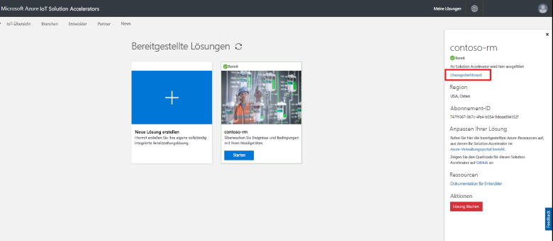

Klicken Sie auf **Akzeptieren**, um die Zustimmungsanforderung zu akzeptieren, die im Dashboard für die Remoteüberwachungslösung im Browser angezeigt wird:

[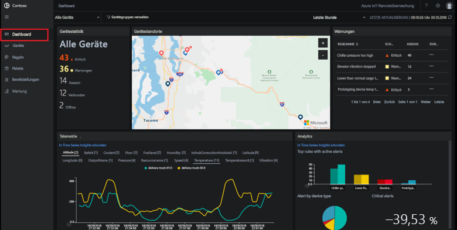](./media/quickstart-remote-monitoring-deploy/solutiondashboard-expanded.png#lightbox)

## Anzeigen von Geräten

Im Lösungsdashboard werden die folgenden Informationen zu den simulierten Geräten von Contoso angezeigt:

* Im Panel **Device statistics** (Gerätestatistik) werden zusammenfassende Informationen zu Warnungen und die Gesamtzahl von Geräten angezeigt. In der Standardbereitstellung verfügt Contoso über zehn simulierte Geräte unterschiedlichen Typs.

* Im Panel **Device locations** (Gerätestandorte) wird angezeigt, wo Ihre Geräte physisch angeordnet sind. Über die Farbe der Nadel wird angegeben, wenn Warnungen für das Gerät vorliegen.

* Im Panel **Alerts** (Warnungen) sind die Details für die Warnungen Ihrer Geräte angegeben.

* Im Panel **Telemetry** (Telemetrie) werden Telemetriedaten für Ihre Geräte angezeigt. Sie können unterschiedliche Telemetriedatenströme anzeigen, indem Sie oben auf einen Telemetrietyp klicken.

* Im Panel **Analytics** (Analyse) werden kombinierte Informationen zu den Warnungen der Geräte angezeigt.

## Reagieren auf eine Warnung

Als Bediener bei Contoso können Sie Ihre Geräte über das Lösungsdashboard überwachen. Im Panel **Device statistics** (Gerätestatistik) wird angezeigt, dass einige kritische Warnungen angefallen sind, und im Panel **Alerts** (Warnungen) ist zu sehen, dass die meisten von einer Kältemaschine stammen. Für die Kältemaschinen von Contoso zeigt ein interner Druck von mehr als 250 PSI an, dass das Gerät nicht richtig funktioniert.

### Identifizieren des Problems

Auf der Seite **Dashboard** im Panel **Alerts** (Warnungen) wird die Warnung **Chiller pressure too high** (Druck der Kältemaschine zu hoch) angezeigt. Für die Kältemaschine ist in der Karte eine rote Nadel vorhanden (ggf. müssen Sie die Karte schwenken oder vergrößern):

[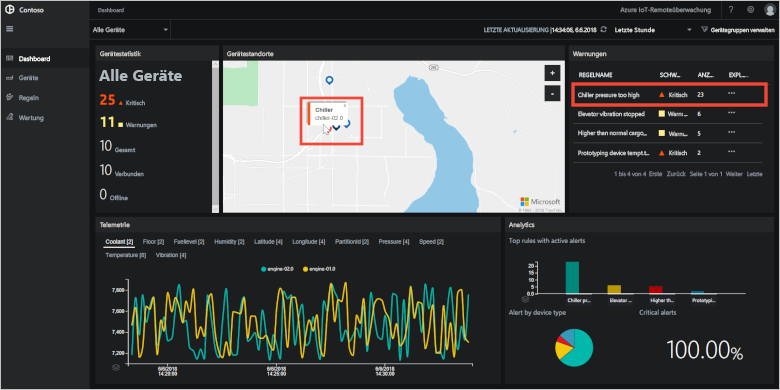](./media/quickstart-remote-monitoring-deploy/dashboardalarm-expanded.png#lightbox)

Klicken Sie im Panel **Alerts** (Warnungen) in der Spalte **Explore** (Durchsuchen) neben der Regel **Chiller pressure too high** (Druck der Kältemaschine zu hoch) auf **...**. Sie gelangen auf die Seite **Maintenance** (Wartung), auf der Sie die Details der Regel anzeigen können, die die Warnung ausgelöst hat.

Auf der Wartungsseite **Chiller pressure too high** (Druck der Kältemaschine zu hoch) werden die Details zu der Regel angezeigt, die die Warnungen ausgelöst hat. Außerdem ist hier angegeben, wann die Warnungen aufgetreten sind und von welchem Gerät sie ausgelöst wurden:

[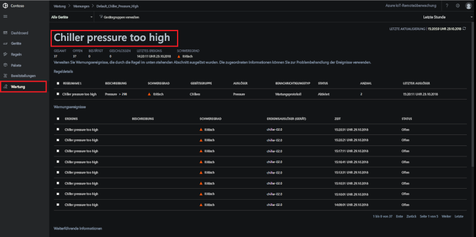](./media/quickstart-remote-monitoring-deploy/maintenancealarmlist-expanded.png#lightbox)

Sie haben nun das Problem und das zugeordnete Gerät identifiziert, für das die Warnung ausgelöst wurde. Für Sie als Bediener sind die nächsten Schritte das Bestätigen der Warnung und das Beheben des Problems.

### Beheben des Problems

Um für andere Bediener anzugeben, dass Sie an der Warnung arbeiten, können Sie sie auswählen und den **Warnungsstatus** in **Bestätigt** ändern:

[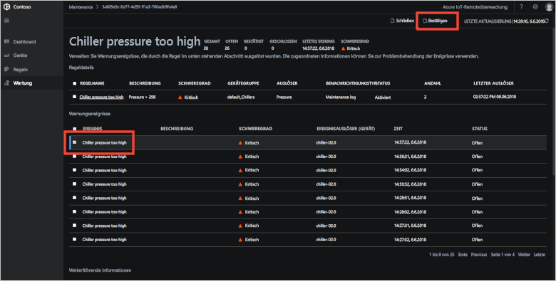](./media/quickstart-remote-monitoring-deploy/maintenanceacknowledge-expanded.png#lightbox)

Der Wert in der Statusspalte ändert sich in **Bestätigt**.

Scrollen Sie nach unten zu **Verwandte Informationen**, wählen Sie die Kältemaschine in der Liste **Alerted devices** (Geräte mit Warnungen) aus, und wählen Sie anschließend **Aufträge**, um mit der Behebung für die Kältemaschine zu beginnen:

[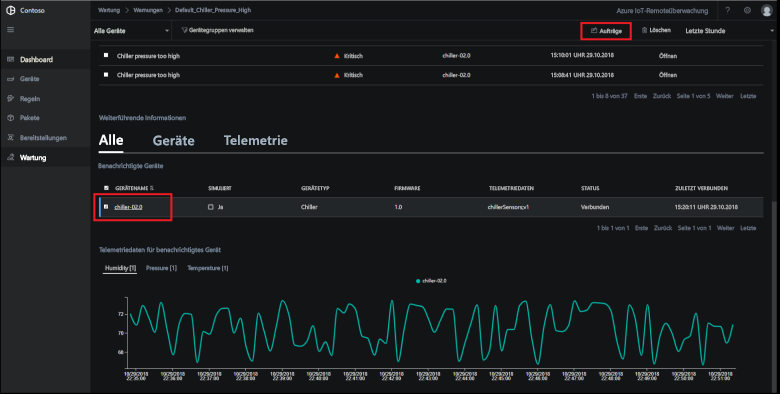](./media/quickstart-remote-monitoring-deploy/maintenanceschedule-expanded.png#lightbox)

Klicken Sie im Bereich **Aufträge** auf **Run method** (Methode ausführen) und anschließend auf die Methode **EmergencyValveRelease**. Fügen Sie den Auftragsnamen **ChillerPressureRelease** hinzu, und klicken Sie auf **Übernehmen**. Mit diesen Einstellungen wird ein Auftrag für Sie erstellt, der sofort ausgeführt wird.

Kehren Sie zum Anzeigen des Auftragsstatus auf die Seite **Wartung** zurück, und zeigen Sie die Liste mit den Aufträgen in der Ansicht **Aufträge** an. Unter Umständen dauert es einige Sekunden, bis Sie sehen, dass der Auftrag ausgeführt wurde:

[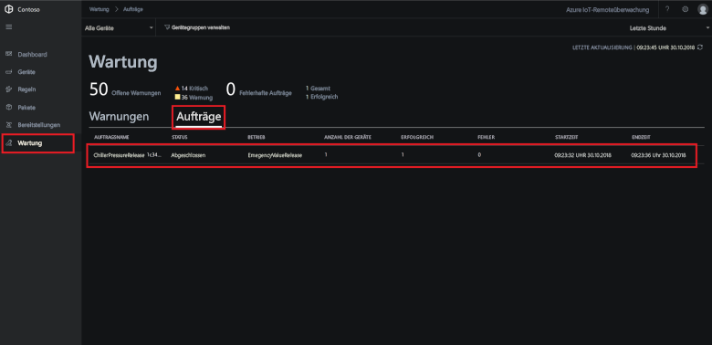](./media/quickstart-remote-monitoring-deploy/maintenancerunningjob-expanded.png#lightbox)

### Sicherstellen des normalen Drucks

Navigieren Sie zum Anzeigen Drucktelemetriedaten für die Kältemaschine zur Seite **Dashboard**, wählen Sie im Telemetriepanel die Option **Druck**, und vergewissern Sie sich, dass der Druck für **chiller-02.0** wieder normal ist:

[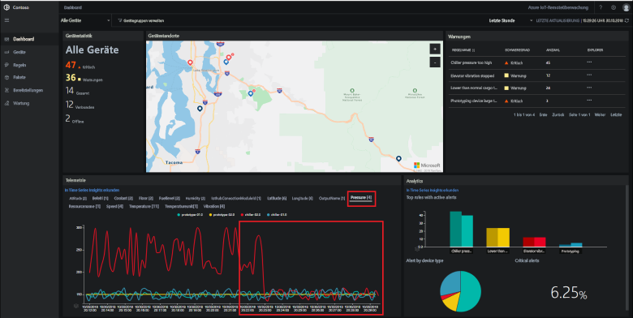](./media/quickstart-remote-monitoring-deploy/pressurenormal-expanded.png#lightbox)

Navigieren Sie zum Schließen des Vorfalls zur Seite **Maintenance** (Wartung), wählen Sie die Warnung aus, und legen Sie den Status auf **Closed** (Geschlossen) fest:

[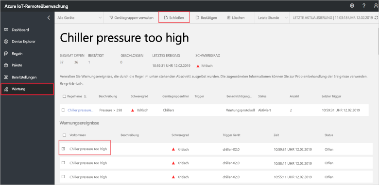](./media/quickstart-remote-monitoring-deploy/maintenanceclose-expanded.png#lightbox)

Der Wert in der Statusspalte ändert sich in **Geschlossen**.

## Bereinigen von Ressourcen

Wenn Sie mit den Tutorials fortfahren möchten, können Sie die Bereitstellung des Solution Accelerators für die Remoteüberwachung beibehalten.

Falls Sie den Solution Accelerator nicht mehr benötigen, können Sie ihn auf der Seite [Bereitgestellte Lösungen](https://www.azureiotsolutions.com/Accelerators#dashboard) löschen, indem Sie ihn markieren und dann auf **Lösung löschen** klicken:

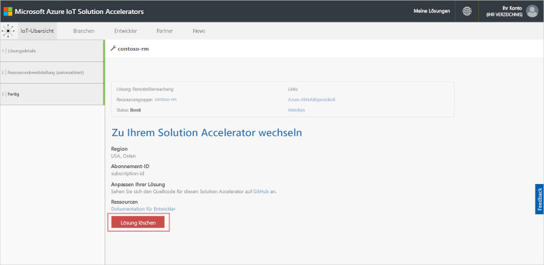

## Nächste Schritte

In dieser Schnellstartanleitung haben Sie den Solution Accelerator für die Remoteüberwachung bereitgestellt und eine Überwachungsaufgabe durchgeführt, indem Sie die simulierten Geräte in der Contoso-Standardbereitstellung verwendet haben.

Weitere Informationen zum Solution Accelerator und zur Verwendung simulierter Geräte finden Sie im folgenden Tutorial:

> [!div class="nextstepaction"]
> [Tutorial: Überwachen Ihrer IoT-Geräte](iot-accelerators-remote-monitoring-monitor.md)