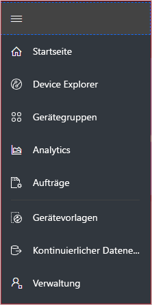
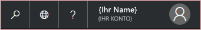
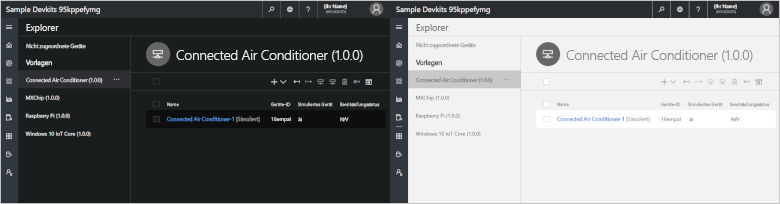
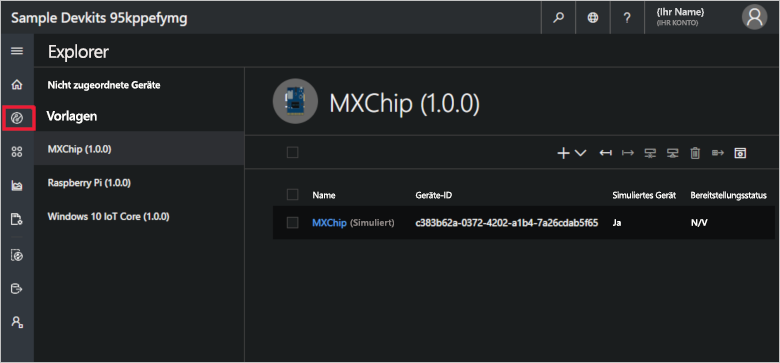
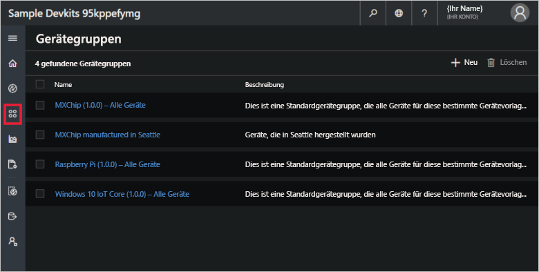
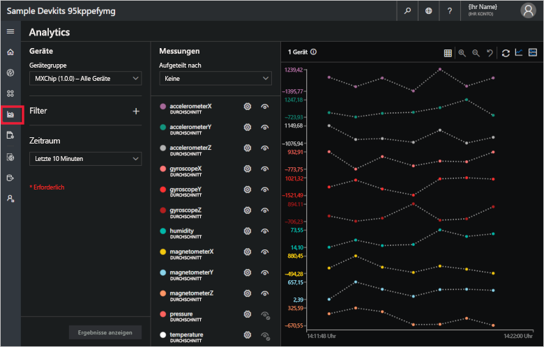
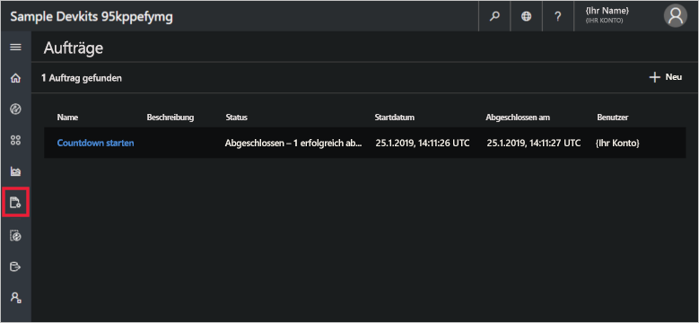
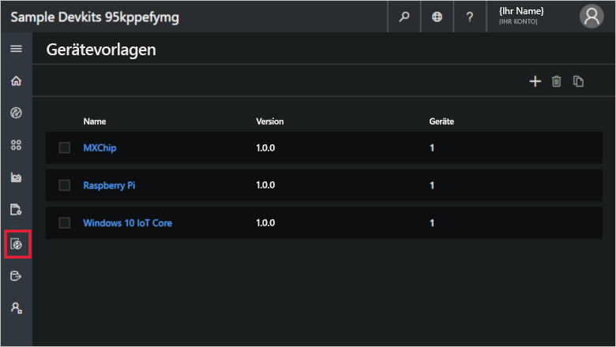
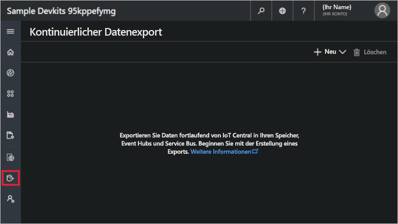
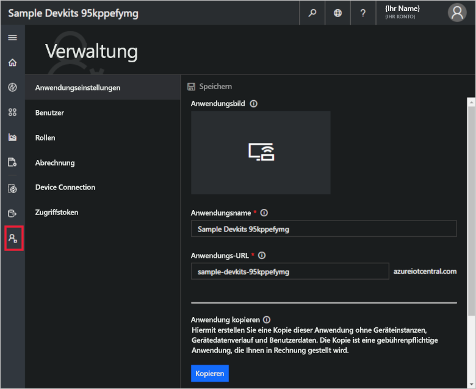

# Kennenlernen der Benutzeroberfläche von Azure IoT Central (neues Benutzeroberflächendesign)

In diesem Artikel wird die Benutzeroberfläche von Microsoft Azure IoT Central vorgestellt. Über die Benutzeroberfläche können Sie Azure IoT Central-Lösungen und die damit verbundenen Geräte erstellen, verwalten und verwenden.

_Ersteller_ verwenden die Benutzeroberfläche von Azure IoT Central, um ihre Azure IoT Central-Lösung zu definieren. Die Benutzeroberfläche bietet folgende Möglichkeiten:

- Definieren der Art von Gerät, das eine Verbindung mit Ihrer Lösung herstellt
- Konfigurieren der Regeln und Aktionen für Ihre Geräte
- Anpassen der Benutzeroberfläche für einen _Bediener_, der Ihre Lösung verwendet

_Bediener_ verwenden die Benutzeroberfläche von Azure IoT Central, um ihre Azure IoT Central-Lösung zu verwalten. Die Benutzeroberfläche bietet folgende Möglichkeiten:

- Überwachen Ihrer Geräte
- Konfigurieren Ihrer Geräte
- Behandeln und Beheben von Problemen mit Ihren Geräten
- Bereitstellen von neuen Geräten

[!INCLUDE [iot-central-experimental-note](../../includes/iot-central-experimental-note.md)]

## Verwenden des linken Navigationsmenüs

Über das linke Navigationsmenü können Sie auf die verschiedenen Bereiche der Anwendung zugreifen:

| Menü | BESCHREIBUNG |
| ---- | ----------- |
|  | <ul><li>Über die Schaltfläche **Startseite** gelangen Sie zur Startseite der Anwendung. Als Ersteller können Sie diese Startseite für die Bediener anpassen.</li><li>Die Schaltfläche **Device Explorer** dient zum Auflisten der simulierten und echten Geräte, die den einzelnen Gerätevorlagen in der Anwendung zugeordnet sind. Bediener verwenden den **Device Explorer**, um ihre verbundenen Geräte zu verwalten.</li><li>Die Schaltfläche **Device Sets** (Gerätegruppen) dient zum Anzeigen und Erstellen von Gerätegruppen. Bediener können Gerätegruppen als logische, durch eine Abfrage angegebene Sammlung von Geräten erstellen.</li><li>Die Schaltfläche **Analytics** dient zum Anzeigen von Analysen, die auf Gerätetelemetriedaten für Geräte und Gerätegruppen basieren. Bediener können benutzerdefinierte Ansichten auf der Grundlage von Gerätedaten erstellen, um basierend auf ihrer Anwendung Erkenntnisse zu gewinnen.</li><li>Die Schaltfläche **Aufträge** ermöglicht eine Geräteverwaltung per Massenvorgang, da Sie Aufträge für Updates in großem Umfang erstellen und ausführen können.</li><li>Über die Schaltfläche **Gerätevorlagen** werden die Tools angezeigt, die ein Ersteller zum Erstellen und Verwalten von Gerätevorlagen verwendet.</li><li>Über die Schaltfläche **Kontinuierlicher Datenexport** kann ein Administrator einen kontinuierlichen Export an andere Azure-Dienste (etwa Speicher und Warteschlangen) konfigurieren.</li><li>Die Schaltfläche **Verwaltung** dient zum Anzeigen der Seiten für die Anwendungsverwaltung, auf denen ein Administrator Anwendungseinstellungen, Benutzer und Rollen verwalten kann.</li></ul> |

## Suche, Hilfe und Support

Das obere Menü wird auf jeder Seite angezeigt:

- Wenn Sie nach Gerätevorlagen und Geräten suchen möchten, klicken Sie auf das Symbol **Suche**.
- Wählen Sie zum Ändern der Benutzeroberflächensprache das Symbol **Sprache** aus.
- Wenn Sie Hilfe oder Unterstützung benötigen, klicken Sie auf das Dropdownmenü **Hilfe**, um eine Liste mit Ressourcen anzuzeigen.
- Über das Symbol **Konto** können Sie das Design der Benutzeroberfläche ändern oder sich von der Anwendung abmelden.

Sie können zwischen einem hellen und einem dunklen Benutzeroberflächendesign wählen:

## Startseite

Nach der Anmeldung bei Ihrer Azure IoT Central-Anwendung wird als Erstes die Startseite angezeigt. Als Ersteller können Sie der Startseite Kacheln hinzufügen und sie so für andere Benutzer der Anwendung anpassen. Weitere Informationen finden Sie im Tutorial [Customize the Azure IoT Central operator's view](tutorial-customize-operator-experimental.md?toc=/azure/iot-central-experimental/toc.json&bc=/azure/iot-central-experimental/breadcrumb/toc.json) (Anpassen der Azure IoT Central-Ansicht für Bediener).

## Device Explorer

Auf der Explorer-Seite werden die _Geräte_ in Ihrer Azure IoT Central-Anwendung angezeigt (gruppiert nach _Gerätevorlage_).

* Eine Gerätevorlage definiert einen Gerätetyp, der eine Verbindung mit Ihrer Anwendung herstellen kann. Weitere Informationen finden Sie unter [Define a new device type in your Azure IoT Central application](tutorial-define-device-type-experimental.md?toc=/azure/iot-central-experimental/toc.json&bc=/azure/iot-central-experimental/breadcrumb/toc.json) (Definieren eines neuen Gerätetyps in Ihrer Azure IoT Central-Anwendung).
* Bei einem Gerät handelt es sich um ein echtes oder simuliertes Gerät in Ihrer Anwendung. Weitere Informationen finden Sie unter [Add a real device to your Azure IoT Central application](tutorial-add-device-experimental.md?toc=/azure/iot-central-experimental/toc.json&bc=/azure/iot-central-experimental/breadcrumb/toc.json) (Hinzufügen eines echten Geräts zu Ihrer Azure IoT Central-Anwendung).

## Gerätegruppen

Auf der Seite _Device Sets_ (Gerätegruppen) werden Gerätegruppen angezeigt, die der Ersteller erstellt hat. Bei einer Gerätegruppe handelt es sich um eine Sammlung verwandter Geräte. Ein Ersteller definiert eine Abfrage, um die in einer Gerätegruppe enthaltenen Geräte zu identifizieren. Gerätegruppen werden verwendet, wenn Sie die Analyse in Ihrer Anwendung anpassen. Weitere Informationen finden Sie im Artikel [Use device sets in your Azure IoT Central application](howto-use-device-sets-experimental.md?toc=/azure/iot-central-experimental/toc.json&bc=/azure/iot-central-experimental/breadcrumb/toc.json) (Definieren von Gerätegruppen in Ihrer Azure IoT Central-Anwendung).

## Analytics

Anhand der Diagramme auf der Analyseseite können Sie das Verhalten der mit Ihrer Anwendung verbundenen Geräte nachvollziehen. Bediener verwenden diese Seite zur Überwachung und Untersuchung von Problemen mit verbundenen Geräten. Der Ersteller kann definieren, welche Diagramme auf dieser Seite angezeigt werden. Weitere Informationen finden Sie im Artikel [How to use analytics to analyze your device data](howto-use-device-sets-experimental.md?toc=/azure/iot-central-experimental/toc.json&bc=/azure/iot-central-experimental/breadcrumb/toc.json) (Analysieren Ihrer Anwendungsdaten mithilfe von Analysen).

## Aufträge

Auf der Seite „Aufträge“ können Sie Massenvorgänge für die Geräteverwaltung auf Ihren Geräten ausführen. Ersteller verwenden diese Seite, um Eigenschaften, Einstellungen und Befehle für Geräte zu aktualisieren. Weitere Informationen finden Sie im Artikel [Ausführen eines Auftrags](howto-run-a-job-experimental.md?toc=/azure/iot-central-experimental/toc.json&bc=/azure/iot-central-experimental/breadcrumb/toc.json).

## Gerätevorlagen

Auf der Seite „Gerätevorlagen“ können Ersteller die Gerätevorlagen in der Anwendung erstellen und verwalten. Weitere Informationen finden Sie im Tutorial [Define a new device type in your Azure IoT Central application](tutorial-define-device-type-experimental.md?toc=/azure/iot-central-experimental/toc.json&bc=/azure/iot-central-experimental/breadcrumb/toc.json) (Definieren eines neuen Gerätetyps in Ihrer Azure IoT Central-Anwendung).

## Kontinuierlicher Datenexport

Auf der Seite „Kontinuierlicher Datenexport“ können Administratoren definieren, wie Daten (beispielsweise Telemetriedaten) aus der Anwendung exportiert werden sollen. Die exportierten Daten können von anderen Diensten gespeichert oder zu Analysezwecken genutzt werden. Weitere Informationen finden Sie im Artikel [Exportieren von Daten in Azure IoT Central](howto-export-data-experimental.md?toc=/azure/iot-central-experimental/toc.json&bc=/azure/iot-central-experimental/breadcrumb/toc.json).

## Verwaltung

Die Verwaltungsseite enthält Links zu den Tools, die ein Administrator verwendet, um beispielsweise Benutzer und Rollen in der Anwendung zu definieren. Weitere Informationen finden Sie im Artikel [How to administer your application](howto-administer-experimental.md?toc=/azure/iot-central-experimental/toc.json&bc=/azure/iot-central-experimental/breadcrumb/toc.json) (Verwalten Ihrer Anwendung).

## Nächste Schritte

Nachdem Sie sich nun einen Überblick über Azure IoT Central verschafft und sich mit dem Layout der Benutzeroberfläche vertraut gemacht haben, empfehlen wir, mit der Schnellstartanleitung zum [Erstellen einer Azure IoT Central-Anwendung](quick-deploy-iot-central-experimental.md?toc=/azure/iot-central-experimental/toc.json&bc=/azure/iot-central-experimental/breadcrumb/toc.json) fortzufahren.