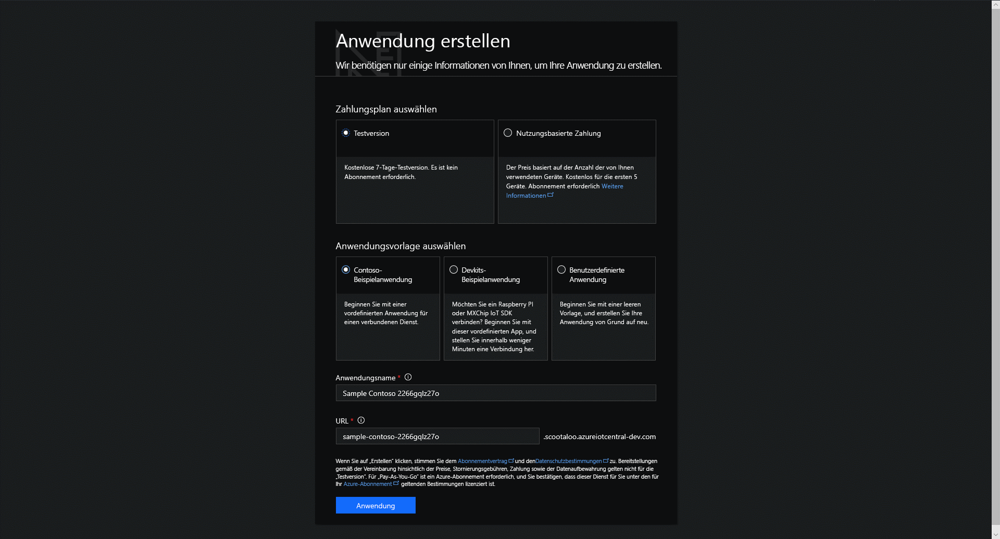

# Erstellen einer Azure IoT Central-Anwendung

Als _Ersteller_ verwenden Sie die Benutzeroberfläche von Azure IoT Central, um Ihre Microsoft Azure IoT Central-Anwendung zu definieren. In dieser Schnellstartanleitung wird gezeigt, wie Sie eine Azure IoT Central-Anwendung mit einer exemplarischen _Gerätevorlage_ und simulierten _Geräten_ erstellen.

## Erstellen einer Anwendung

Navigieren Sie zur Azure IoT Central-Seite [Application Manager](https://aka.ms/iotcentral) (Anwendungs-Manager). Sie müssen sich mit einem persönlichen Konto oder mit einem Geschäfts-, Schul- oder Unikonto anmelden.

Wählen Sie **Neue Anwendung** aus, um mit der Erstellung einer neuen Azure IoT Central-Anwendung zu beginnen. Dadurch gelangen Sie auf die Seite **Anwendung erstellen**.

So erstellen Sie eine neue Azure IoT Central-Anwendung:

1. Wählen Sie einen Zahlungsplan aus:
   - Anwendungen mit einer **Testversion** können sieben Tage kostenlos genutzt werden, bevor die Version abläuft. Bevor das geschieht, können sie jederzeit auf die nutzungsbasierte Zahlung umgestellt werden. Bei der Erstellung einer **Testanwendung** müssen Sie Ihre Kontaktdaten eingeben und auswählen, ob Sie Informationen und Tipps von Microsoft erhalten möchten.
   - Anwendungen mit **nutzungsbasierter Zahlung** werden pro Gerät berechnet, wobei die ersten fünf Geräte kostenlos sind. Wenn Sie eine Anwendung mit **nutzungsbasierter Zahlung** erstellen, müssen Sie Ihr *Verzeichnis*, Ihr *Azure-Abonnement* und Ihre *Region* auswählen:
      - Bei *Verzeichnis* handelt es sich um die Azure Active Directory-Instanz (AD) für die Erstellung Ihrer Anwendung. Es enthält Benutzeridentitäten, Anmeldeinformationen und andere organisatorische Informationen. Falls Sie über keine Azure AD-Instanz verfügen, wird eine erstellt, wenn Sie ein Azure-Abonnement erstellen.
      - Mit einem *Azure-Abonnement* können Sie Instanzen von Azure-Diensten erstellen. IoT Central stellt Ressourcen in Ihrem Abonnement bereit. Wenn Sie kein Azure-Abonnement besitzen, können Sie auf der Seite [Azure-Anmeldeseite](https://aka.ms/createazuresubscription) eins erstellen. Nachdem Sie das Azure-Abonnement erstellt haben, navigieren Sie zurück zur Seite **Anwendung erstellen**. Ihr neues Abonnement wird in der Dropdownliste **Azure-Abonnement** angezeigt.
      - *Region* ist der physische Standort, an dem Sie Ihre Anwendung erstellen möchten. Aus Leistungsgründen empfiehlt es sich in der Regel, die Region auszuwählen, die Ihren Geräten physisch am nächsten ist. Die Regionen, in denen Azure IoT Central verfügbar ist, finden Sie auf der Seite [Verfügbare Produkte nach Region](https://azure.microsoft.com/regions/services/). Sobald Sie eine Region ausgewählt haben, können Sie Ihre Anwendung später nicht mehr in eine andere Region verschieben.

      Weitere Informationen zu den Preisen finden Sie unter [Azure IoT Central – Preise](https://azure.microsoft.com/pricing/details/iot-central/).

1. Wählen Sie einen Anzeigenamen für die Anwendung (beispielsweise **Contoso IoT**). Azure IoT Central generiert automatisch ein eindeutiges URL-Präfix. Dieses URL-Präfix kann in einen einprägsameren Wert geändert werden.

1. Wählen Sie eine Anwendungsvorlage aus. Eine Anwendungsvorlage kann vordefinierte Elemente wie Gerätevorlagen und Dashboards enthalten, die Ihnen den Einstieg erleichtern.

    | Anwendungsvorlage | BESCHREIBUNG |
    | -------------------- | ----------- |
    | Beispiel „Contoso“       | Erstellt eine Anwendung mit einer Gerätevorlage, die bereits für einen gekühlten Verkaufsautomaten erstellt wurde. Verwenden Sie diese Vorlage, um mit der Erkundung von Azure IoT Central zu beginnen. |
    | Beispiel-Entwickler-Kits       | Erstellt eine Anwendung mit Gerätevorlagen, an die Sie ein MXChip- oder Raspberry Pi-Gerät anschließen können. Verwenden Sie diese Vorlage, wenn Sie als Geräteentwickler mit einem dieser Geräte experimentieren. |
    | Benutzerdefinierte Anwendung   | Erstellt eine leere Anwendung, die Sie mit Ihren eigenen Gerätevorlagen und Geräten füllen können. |

1. Klicken Sie auf **Erstellen**.

## Nächste Schritte

In dieser Schnellstartanleitung haben Sie eine IoT Central-Anwendung erstellt. Wir empfehlen, mit dem folgenden Schritt fortzufahren:

> [!div class="nextstepaction"]
> [Take a tour of IoT Central](overview-iot-central-tour.md) (Kennenlernen von IoT Central)
