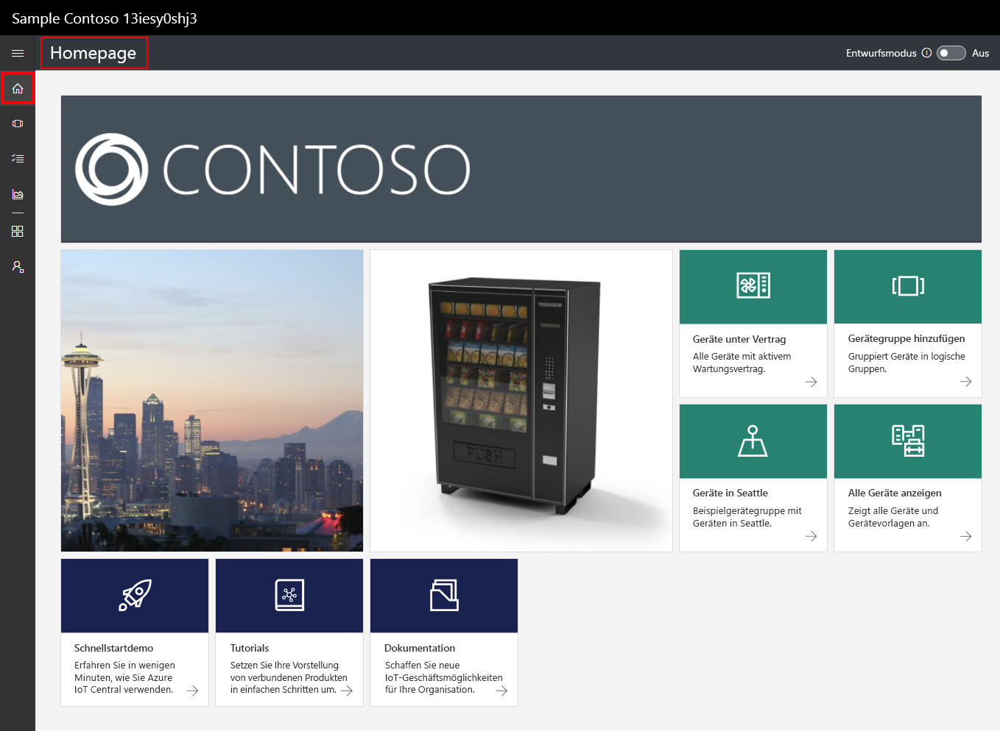
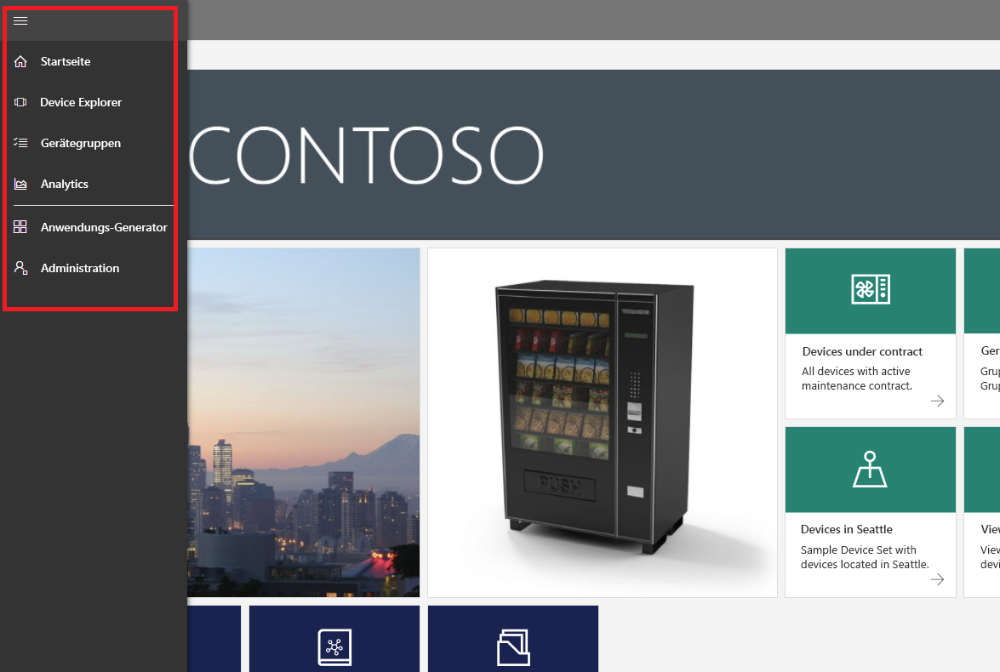
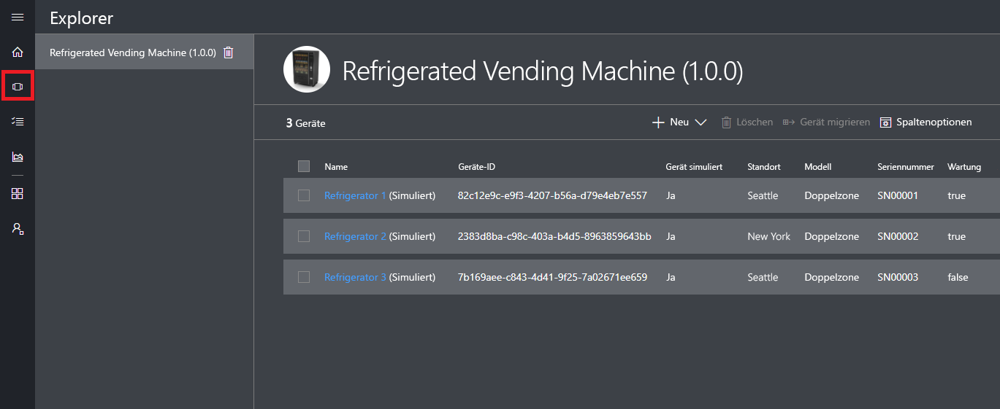
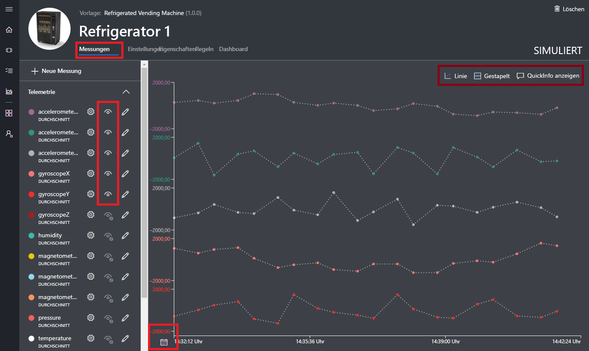
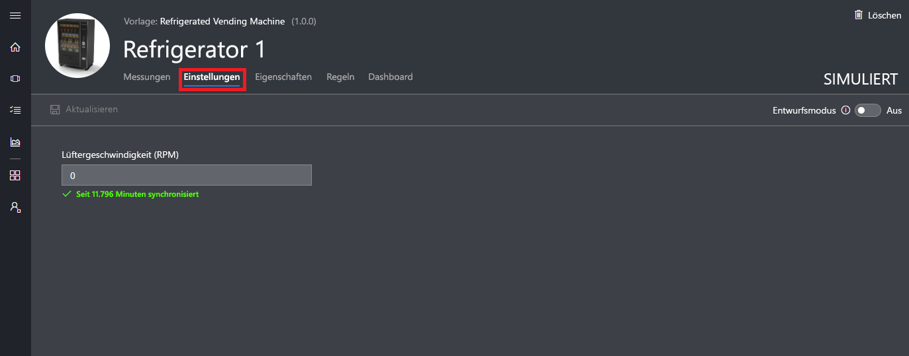
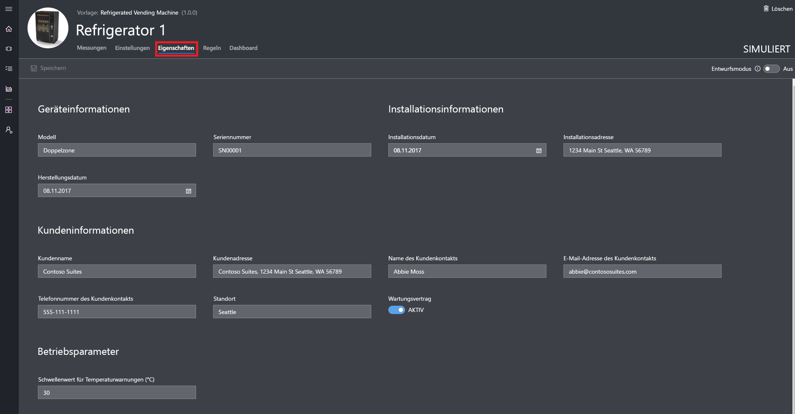
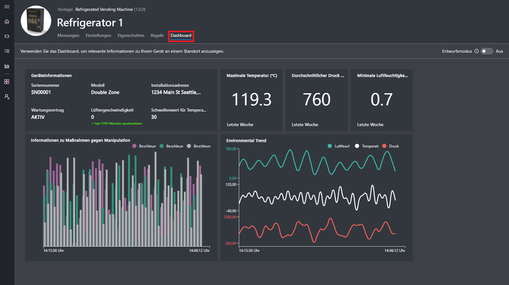
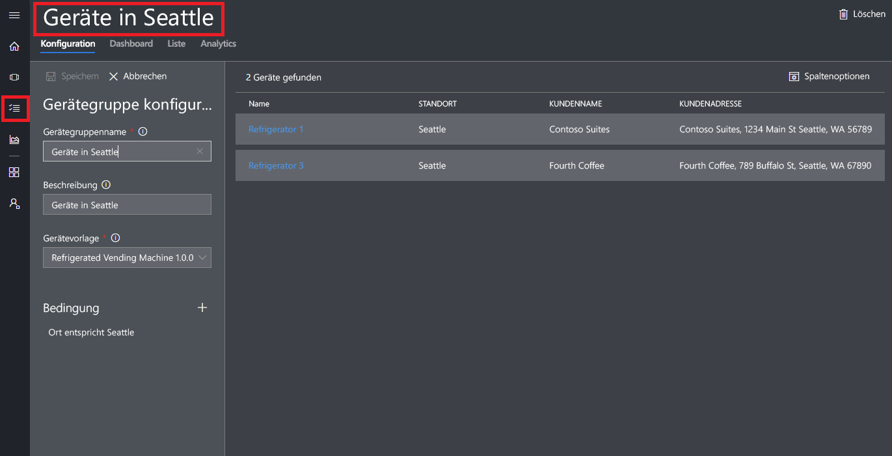
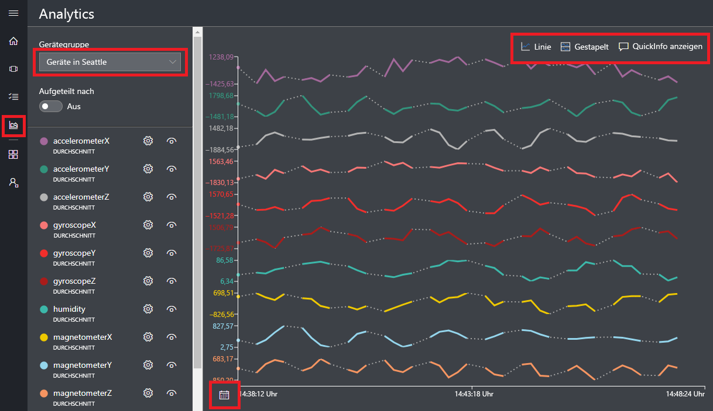

# Erstellen einer Azure IoT Central-Anwendung

Als _Ersteller_ verwenden Sie die Benutzeroberfläche von Azure IoT Central, um Ihre Microsoft Azure IoT Central-Anwendung zu definieren. In dieser Schnellstartanleitung wird Folgendes beschrieben:

- Erstellen einer Azure IoT Central-Anwendung mit einer exemplarischen _Gerätevorlage_ und simulierten _Geräten_
- Anzeigen der Features der Gerätevorlage **Refrigerated Vending Machine** (Gekühlter Verkaufsautomat) in Ihrer Anwendung
- Anzeigen der Telemetriedaten und Analysen Ihrer simulierten **Kühlgeräte**

In dieser Schnellstartanleitung zeigen Sie ein simuliertes **Kühlgerät** an, das auf einer Gerätevorlage basiert. Für das simulierte Gerät gilt Folgendes:

* Es sendet Telemetriedaten wie Temperatur und Druck an Ihre Anwendung.
* Es meldet Geräteeigenschaftswerte (beispielsweise einen Bewegungsalarm) an Ihre Anwendung.
* Es verfügt über Geräteeinstellungen, die Sie in der Anwendung festlegen können (beispielsweise die Lüftergeschwindigkeit).

Wenn Sie auf der Grundlage einer Gerätevorlage in einer Azure IoT Central-Anwendung ein simuliertes Gerät erstellen, können Sie anhand des simulierten Geräts Ihre Anwendung testen, bevor Sie eine Verbindung mit einem echten Gerät herstellen.

## Erstellen der Anwendung

Für diese Schnellstartanleitung müssen Sie eine Azure IoT Central-Anwendung auf der Grundlage der Anwendungsvorlage **Beispiel „Contoso“** erstellen.

Navigieren Sie zur Azure IoT Central-Seite [Application Manager](https://aka.ms/iotcentral) (Anwendungs-Manager). Geben Sie anschließend die E-Mail-Adresse und das Kennwort für den Zugriff auf Ihr Azure-Abonnement ein:

Klicken Sie auf **Neue Anwendung**, um mit der Erstellung einer neuen Azure IoT Central-Anwendung zu beginnen:

So erstellen Sie eine neue Azure IoT Central-Anwendung:

1. Wählen Sie den Zahlungsplan **Free Trial Application** (Kostenlose Testanwendung) aus.
1. Wählen Sie einen Anzeigenamen für die Anwendung (beispielsweise **Contoso IoT**). Azure IoT Central generiert automatisch ein eindeutiges URL-Präfix. Dieses URL-Präfix kann in einen einprägsameren Wert geändert werden.
1. Wählen Sie die Anwendungsvorlage **Beispiel „Contoso“** aus.
1. Wählen Sie dann **Erstellen** aus.

## Navigieren zur Anwendung

Wenn Ihre Anwendung bereit ist, wird die **Startseite** Ihrer Anwendung angezeigt. Sie können rechts oben auf der Seite den _Entwurfsmodus_ aktivieren, um die Startseite zu bearbeiten. Die Anwendungs-URL ist die URL, die Sie im vorherigen Schritt angegeben haben:

Über das _linke Navigationsmenü_ können Sie auf die verschiedenen Bereiche Ihrer neuen Azure IoT Central-Anwendung zugreifen:

Klicken Sie im linken Navigationsmenü auf **Device Explorer**, um die Gerätevorlagen und Geräte in Ihrer Anwendung anzuzeigen. Die Beispielanwendung enthält die Gerätevorlage **Refrigerated Vending Machine**. Auf der Grundlage dieser Gerätevorlage wurden bereits drei simulierte Geräte erstellt:

## Anzeigen der Gerätevorlage und der Geräte

Gehen Sie wie folgt vor, um ein Kühlgerät anzuzeigen, das auf der Grundlage der Gerätevorlage **Refrigerated Vending Machine** erstellt wurde. Eine Gerätevorlage definiert Folgendes:

* _Messungen_, die von einem Gerät gesendet werden (beispielsweise temperaturbezogene Telemetriedaten)
* _Einstellungen_, die die Steuerung des Geräts ermöglichen (beispielsweise die Lüftergeschwindigkeit)
* _Eigenschaften_ zum Speichern von Geräteinformationen (beispielsweise die Seriennummer)
* [Regeln](howto-create-telemetry-rules.md) zum Automatisieren von Aktionen auf der Grundlage des Geräteverhaltens
* Ein anpassbares _Dashboard_ mit Informationen zum Gerät

Auf der Grundlage einer Gerätevorlage können sowohl simulierte als auch echte Geräte erstellt werden.

### Messungen

Die Seite **Measurements** (Messungen) für das Gerät **Refrigerator 1** wird angezeigt. Sie sehen die Liste mit den Messungen, die das simulierte Gerät gesendet hat. Auf der Seite wird außerdem ein anpassbares Diagramm der sichtbaren Messungen angezeigt:

Sie können die Sichtbarkeit für einzelne Elemente ein-/ausschalten und das Diagramm anpassen. Das aktuelle Diagramm zeigt Telemetriedaten eines simulierten Geräts. Sie können der Gerätevorlage neue Messungen hinzufügen, sofern Sie über die entsprechenden Berechtigungen verfügen.

> [!NOTE]
> Unter Umständen dauert es etwas, bis die simulierten Daten im Diagramm angezeigt werden.

### Einstellungen

Klicken Sie auf **Einstellungen**. Auf der Seite **Einstellungen** können Sie das Gerät steuern. So können Sie beispielsweise die Lüftergeschwindigkeit des Kühlgeräts aktualisieren:

Eine Einstellung wird als **synchronisiert** angezeigt, wenn ein Gerät die Änderung bestätigt.

### Eigenschaften

Klicken Sie auf **Eigenschaften**. Auf der Seite **Eigenschaften** haben Sie folgende Möglichkeiten:

* Sie können Informationen zu Ihrem Gerät verwalten (beispielsweise den Kundennamen).
* Sie können vom Gerät gemeldete Eigenschaftswerte anzeigen (beispielsweise einen Bewegungsalarm).

### Dashboard

Klicken Sie auf **Dashboard**. Das Dashboard ist eine anpassbare Ansicht der Informationen zu Ihrem Gerät wie etwa Messungen, Eigenschaften und KPIs:

## Anzeigen von Analysen

Im vorherigen Abschnitt wurde gezeigt, wie Sie Informationen zu einem einzelnen Gerät anzeigen. Mit [Gerätegruppen](howto-use-device-sets.md) und [Analysen](howto-create-analytics.md) können Sie konsolidierte Informationen mehrerer Geräte anzeigen.

Bei einer Gerätegruppe wird mithilfe einer Abfrage dynamisch eine Reihe von Geräten ausgewählt, die ein Kriterium erfüllen. Die Gerätegruppe **Machines in Seattle** (Automaten in Seattle) wählt beispielsweise Kühlgeräte mit dem Standort „Seattle“ aus. Klicken Sie zum Anzeigen der Gerätegruppe **Machines in Seattle** im linken Navigationsmenü auf **Device Sets** (Gerätegruppen), und wählen Sie dann **Machines in Seattle** aus:

Auf der Seite **Analysen** können Analysedaten für die Geräte in einer Gerätegruppe angezeigt werden:

## Nächste Schritte

In dieser Schnellstartanleitung haben Sie eine Azure IoT Central-Anwendung erstellt, die bereits die Gerätevorlage **Refrigerated Vending Machine** und simulierte Geräte enthält. Der Artikel [Definieren eines neuen Gerätetyps in Ihrer Azure IoT Central-Anwendung](tutorial-define-device-type.md) richtet sich an Ersteller und erläutert, wie Sie eigene Gerätevorlagen definieren.
