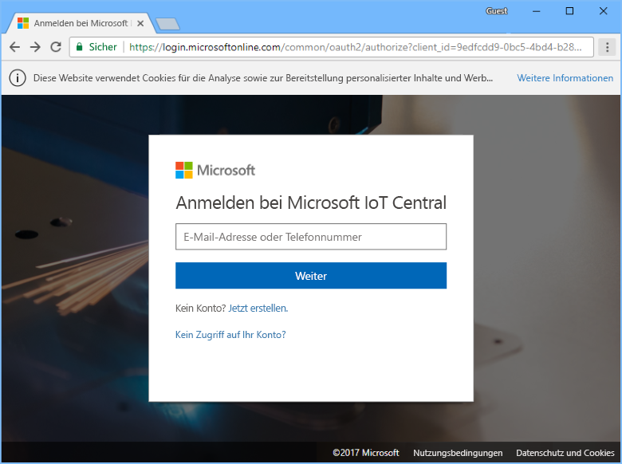
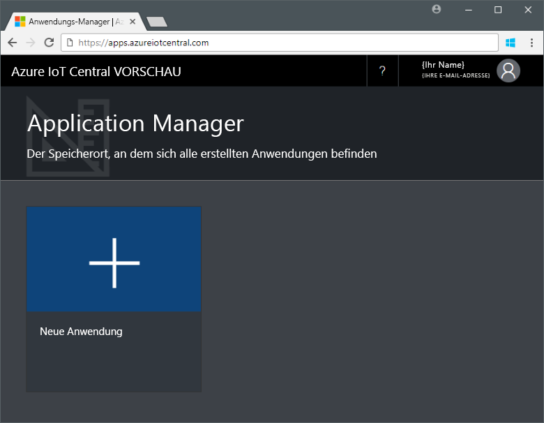

# Erstellen einer Azure IoT Central-Anwendung

Als _Ersteller_ verwenden Sie die Benutzeroberfläche von Azure IoT Central, um Ihre Microsoft Azure IoT Central-Anwendung zu definieren. In dieser Schnellstartanleitung wird gezeigt, wie Sie eine Azure IoT Central-Anwendung mit einer exemplarischen _Gerätevorlage_ und simulierten _Geräten_ erstellen.

## Erstellen der Anwendung

Für diese Schnellstartanleitung müssen Sie eine Azure IoT Central-Anwendung auf der Grundlage der Anwendungsvorlage **Beispiel „Contoso“** erstellen.

Navigieren Sie zur Azure IoT Central-Seite [Application Manager](https://aka.ms/iotcentral) (Anwendungs-Manager). Geben Sie anschließend die E-Mail-Adresse und das Kennwort für den Zugriff auf Ihr Azure-Abonnement ein:

Klicken Sie auf **Neue Anwendung**, um mit der Erstellung einer neuen Azure IoT Central-Anwendung zu beginnen:

So erstellen Sie eine neue Azure IoT Central-Anwendung:

1. Wählen Sie den Zahlungsplan **Free Trial Application** (Kostenlose Testanwendung) aus.
1. Wählen Sie einen Anzeigenamen für die Anwendung (beispielsweise **Contoso IoT**). Azure IoT Central generiert automatisch ein eindeutiges URL-Präfix. Dieses URL-Präfix kann in einen einprägsameren Wert geändert werden.
1. Wählen Sie die Anwendungsvorlage **Beispiel „Contoso“** aus.
1. Wählen Sie dann **Erstellen** aus.

## Nächste Schritte

In dieser Schnellstartanleitung haben Sie eine Azure IoT Central-Anwendung erstellt, die bereits die Gerätevorlage **Refrigerated Vending Machine** und simulierte Geräte enthält. Der Artikel [Definieren eines neuen Gerätetyps in Ihrer Azure IoT Central-Anwendung](tutorial-define-device-type.md) richtet sich an Ersteller und erläutert, wie Sie eigene Gerätevorlagen definieren.
