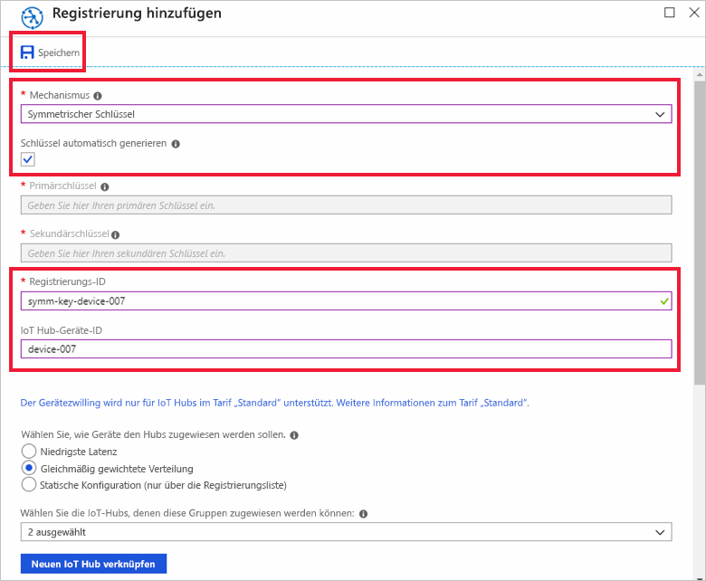

# <a name="quickstart-provision-a-simulated-device-with-symmetric-keys"></a>Schnellstart: Bereitstellen eines simulierten Geräts mit symmetrischen Schlüsseln

In dieser Schnellstartanleitung erfahren Sie, wie Sie einen Gerätesimulator auf einem Windows-Entwicklungscomputer erstellen und ausführen. Sie konfigurieren dieses simulierte Gerät so, dass es zum Authentifizieren bei einer Device Provisioning Service-Instanz einen symmetrischen Schlüssel verwendet und einem IoT Hub zugewiesen wird. Beispielcode aus dem [Azure IoT C SDK](https://github.com/Azure/azure-iot-sdk-c) wird verwendet, um eine Startsequenz für das Gerät zu simulieren, die die Bereitstellung einleitet. Das Gerät wird anhand der individuellen Registrierung bei einer Device Provisioning Service-Instanz erkannt und dem IoT Hub zugeordnet.

In diesem Artikel wird zwar die Bereitstellung mit einer individuellen Registrierung gezeigt, aber Sie können die gleichen Prozeduren mit Registrierungsgruppen verwenden. Der einzige Unterschied ist, dass Sie einen abgeleiteten Geräteschlüssel mit einer eindeutigen Registrierungs-ID für das Gerät verwenden müssen. Mit Registrierungsgruppen wird der symmetrische Schlüssel bei der Registrierung nicht direkt verwendet. Obwohl Registrierungsgruppen mit symmetrischem Schlüssel nicht auf veraltete Geräte begrenzt sind, enthält [Bereitstellen veralteter Geräte mit Nachweis durch symmetrischen Schlüssel](how-to-legacy-device-symm-key.md) ein Beispiel für eine Registrierungsgruppe. Weitere Informationen finden Sie unter [Gruppenregistrierungen für Nachweis des symmetrischen Schlüssels](concepts-symmetric-key-attestation.md#group-enrollments).

Sollten Sie mit der automatischen Bereitstellung nicht vertraut sein, lesen Sie die Informationen unter [Konzepte für die automatische Bereitstellung](concepts-auto-provisioning.md). 

Vergewissern Sie sich außerdem, dass Sie die Schritte unter [Einrichten des IoT Hub Device Provisioning-Diensts über das Azure-Portal](./quick-setup-auto-provision.md) ausgeführt haben, bevor Sie mit dieser Schnellstartanleitung fortfahren. In dieser Schnellstartanleitung wird vorausgesetzt, dass Sie bereits eine Device Provisioning-Instanz erstellt haben.

In diesem Artikel wird eine Windows-Arbeitsstation vorausgesetzt. Allerdings können Sie die Verfahren auch unter Linux ausführen. Ein Beispiel für Linux finden Sie unter [Bereitstellen für Mehrinstanzenfähigkeit](how-to-provision-multitenant.md).


[!INCLUDE [quickstarts-free-trial-note](../../includes/quickstarts-free-trial-note.md)]


## <a name="prerequisites"></a>Voraussetzungen

* [Visual Studio](https://visualstudio.microsoft.com/vs/) 2015 oder höher mit aktivierter Workload [Desktopentwicklung mit C++](https://www.visualstudio.com/vs/support/selecting-workloads-visual-studio-2017/).
* Die neueste Version von [Git](https://git-scm.com/download/) ist installiert.


<a id="setupdevbox"></a>

## <a name="prepare-an-azure-iot-c-sdk-development-environment"></a>Vorbereiten einer Azure IoT C SDK-Entwicklungsumgebung

In diesem Abschnitt bereiten Sie eine Entwicklungsumgebung vor, die zum Erstellen des [Azure IoT C SDK](https://github.com/Azure/azure-iot-sdk-c) verwendet wird. 

Das SDK enthält den Beispielcode für ein simuliertes Gerät. Dieses simulierte Gerät versucht, die Bereitstellung während seiner Startsequenz auszuführen.

1. Laden Sie das [CMake-Buildsystem](https://cmake.org/download/) herunter.

    Wichtig: Die Voraussetzungen für Visual Studio (Visual Studio und die Workload „Desktopentwicklung mit C++“) müssen **vor** Beginn der Installation von `CMake` auf dem Computer installiert sein. Sobald die Voraussetzungen erfüllt sind und der Download überprüft wurde, installieren Sie das CMake-Buildsystem.

2. Öffnen Sie eine Eingabeaufforderung oder die Git Bash-Shell. Führen Sie den folgenden Befehl zum Klonen des Azure IoT C SDK-GitHub-Repositorys aus:
    
    ```cmd/sh
    git clone https://github.com/Azure/azure-iot-sdk-c.git --recursive
    ```
    Sie sollten damit rechnen, dass die Ausführung dieses Vorgangs mehrere Minuten in Anspruch nimmt.


3. Erstellen Sie ein `cmake`-Unterverzeichnis im Stammverzeichnis des Git-Repositorys, und navigieren Sie zu diesem Ordner. 

    ```cmd/sh
    cd azure-iot-sdk-c
    mkdir cmake
    cd cmake
    ```

4. Erstellen Sie mithilfe des folgenden Befehls eine spezifische SDK-Version für Ihre Entwicklungsclientplattform: Im `cmake`-Verzeichnis wird eine Visual Studio-Projektmappe für das simulierte Gerät generiert. 

    ```cmd
    cmake -Dhsm_type_symm_key:BOOL=ON -Duse_prov_client:BOOL=ON  ..
    ```
    
    Falls `cmake` Ihren C++-Compiler nicht findet, treten beim Ausführen des obigen Befehls unter Umständen Buildfehler auf. Führen Sie den Befehl in diesem Fall an der [Visual Studio-Eingabeaufforderung](https://docs.microsoft.com/dotnet/framework/tools/developer-command-prompt-for-vs) aus. 

    Nach erfolgreicher Erstellung ähneln die letzten Ausgabezeilen der folgenden Ausgabe:

    ```cmd/sh
    $ cmake -Dhsm_type_symm_key:BOOL=ON -Duse_prov_client:BOOL=ON  ..
    -- Building for: Visual Studio 15 2017
    -- Selecting Windows SDK version 10.0.16299.0 to target Windows 10.0.17134.
    -- The C compiler identification is MSVC 19.12.25835.0
    -- The CXX compiler identification is MSVC 19.12.25835.0

    ...

    -- Configuring done
    -- Generating done
    -- Build files have been written to: E:/IoT Testing/azure-iot-sdk-c/cmake
    ```


## <a name="create-a-device-enrollment-entry-in-the-portal"></a>Erstellen eines Geräteregistrierungseintrags im Portal

1. Melden Sie sich beim Azure-Portal an, klicken Sie im Menü auf der linken Seite auf die Schaltfläche **Alle Ressourcen**, und öffnen Sie Ihren Device Provisioning-Dienst.

2. Wählen Sie die Registerkarte **Registrierungen verwalten** aus, und klicken Sie dann oben auf die Schaltfläche **Individuelle Registrierung hinzufügen**. 

3. Geben Sie unter **Registrierung hinzufügen** die folgenden Informationen ein, und klicken Sie auf die Schaltfläche **Speichern**.

   - **Mechanismus**: Wählen Sie **Symmetrischer Schlüssel** als *Mechanismus* für den Nachweis der Identität aus.

   - **Schlüssel automatisch generieren**: Aktivieren Sie dieses Kontrollkästchen.

   - **Registrierungs-ID**: Geben Sie eine Registrierungs-ID ein, um die Registrierung zu identifizieren. Verwenden Sie nur Kleinbuchstaben und Bindestriche („-“). Beispiel: `symm-key-device-007`.

   - **IoT Hub-Geräte-ID:** Geben Sie einen Gerätebezeichner ein. Beispiel: **device-007**.

     

4. Nachdem Sie Ihre Registrierung gespeichert haben, werden der **Primärschlüssel** und **Sekundärschlüssel** generiert und dem Registrierungseintrag hinzugefügt. Die Registrierung Ihres Geräts mit symmetrischem Schlüssel wird als **symm-key-device-007** auf der Registerkarte *Individuelle Registrierungen* in der Spalte *Registrierungs-ID* angezeigt. 

    Öffnen Sie die Registrierung, und kopieren Sie den Wert des von Ihnen generierten **Primärschlüssels**.


<a id="firstbootsequence"></a>

## <a name="simulate-first-boot-sequence-for-the-device"></a>Simulieren der ersten Startsequenz für das Gerät

Aktualisieren Sie in diesem Abschnitt den Beispielcode, um die Startsequenz des Geräts an Ihre Instanz des Device Provisioning-Diensts zu senden. Diese Startsequenz bewirkt, dass das Gerät, die erkannt und einem mit der Instanz des Device Provisioning-Diensts verknüpften IoT Hub zugewiesen wird.


1. Navigieren Sie im Azure-Portal zur Registerkarte **Übersicht** für Ihren Device Provisioning Service, und notieren Sie sich den Wert unter **_ID-Bereich_** .

     

2. Öffnen Sie in Visual Studio die Projektmappendatei **azure_iot_sdks.sln**, die zuvor durch das Ausführen von CMake generiert wurde. Die Projektmappendatei befindet sich am folgenden Speicherort:

    ```
    \azure-iot-sdk-c\cmake\azure_iot_sdks.sln
    ```

3. Navigieren Sie im Visual Studio-Fenster *Projektmappen-Explorer* zum Ordner **Provision\_Samples**. Erweitern Sie das Beispielprojekt mit dem Namen **prov\_dev\_client\_sample**. Erweitern Sie **Quelldateien**, und öffnen Sie **prov\_dev\_client\_sample.c**.

4. Suchen Sie die Konstante `id_scope`, und ersetzen Sie den Wert durch Ihren **ID-Bereich**-Wert, den Sie zuvor kopiert haben. 

    ```c
    static const char* id_scope = "0ne00002193";
    ```

5. Suchen Sie die Definition für die Funktion `main()` in der gleichen Datei. Stellen Sie sicher, dass die Variable `hsm_type` wie unten dargestellt auf `SECURE_DEVICE_TYPE_SYMMETRIC_KEY` festgelegt ist:

    ```c
    SECURE_DEVICE_TYPE hsm_type;
    //hsm_type = SECURE_DEVICE_TYPE_TPM;
    //hsm_type = SECURE_DEVICE_TYPE_X509;
    hsm_type = SECURE_DEVICE_TYPE_SYMMETRIC_KEY;
    ```

6. Suchen Sie den Aufruf zum `prov_dev_set_symmetric_key_info()` in **prov\_dev\_client\_sample.c**, der auskommentiert ist.

    ```c
    // Set the symmetric key if using they auth type
    //prov_dev_set_symmetric_key_info("<symm_registration_id>", "<symmetric_Key>");
    ```

    Heben Sie die Auskommentierung für den Funktionsaufruf auf, und ersetzen Sie die Platzhalterwerte (einschließlich der spitzen Klammern) durch Ihre Registrierungs-ID und Primärschlüsselwerte.

    ```c
    // Set the symmetric key if using they auth type
    prov_dev_set_symmetric_key_info("symm-key-device-007", "your primary key here");
    ```
   
    Speichern Sie die Datei .

7. Klicken Sie mit der rechten Maustaste auf das Projekt **prov\_dev\_client\_sample**, und wählen Sie **Als Startprojekt festlegen** aus. 

8. Wählen Sie im Visual Studio-Menü die Option **Debuggen** > **Starten ohne Debugging** aus, um die Projektmappe auszuführen. Klicken Sie in der Eingabeaufforderung zum Neuerstellen des Projekts auf **Ja**, um das Projekt vor der Ausführung neu zu erstellen.

    Die folgende Ausgabe ist ein Beispiel für das erfolgreiche Starten des simulierten Geräts und das Herstellen der Verbindung mit der Provisioning Service-Instanz, die einem IoT Hub zugewiesen werden soll:

    ```cmd
    Provisioning API Version: 1.2.8

    Registering Device

    Provisioning Status: PROV_DEVICE_REG_STATUS_CONNECTED
    Provisioning Status: PROV_DEVICE_REG_STATUS_ASSIGNING
    Provisioning Status: PROV_DEVICE_REG_STATUS_ASSIGNING

    Registration Information received from service: 
    test-docs-hub.azure-devices.net, deviceId: device-007    
    Press enter key to exit:
    ```

9. Navigieren Sie im Portal zu der IoT Hub-Instanz, der Ihr simuliertes Gerät zugewiesen wurde, und klicken Sie auf die Registerkarte **IoT-Geräte**. Nach erfolgreicher Bereitstellung des simulierten Geräts auf dem Hub wird die dazugehörige Geräte-ID auf dem Blatt **IoT-Geräte** angezeigt, und der *STATUS* lautet **Aktiviert**. Unter Umständen müssen Sie oben auf die Schaltfläche **Aktualisieren** klicken. 

     


## <a name="clean-up-resources"></a>Bereinigen von Ressourcen

Wenn Sie das Geräteclientbeispiel weiter verwenden und erkunden möchten, überspringen Sie die Bereinigung der in dieser Schnellstartanleitung erstellten Ressourcen. Falls Sie nicht fortfahren möchten, führen Sie die folgenden Schritte aus, um alle erstellten Ressourcen zu löschen, die im Rahmen dieser Schnellstartanleitung erstellt wurden:

1. Schließen Sie auf Ihrem Computer das Ausgabefenster des Geräteclientbeispiels.
1. Klicken Sie im Azure-Portal im Menü auf der linken Seite auf **Alle Ressourcen**, und wählen Sie Ihren Device Provisioning-Dienst aus. Öffnen Sie **Registrierungen verwalten** für Ihren Dienst, und klicken Sie dann auf die Registerkarte **Individuelle Registrierungen**. Wählen Sie die *REGISTRIERUNGS-ID* des Geräts aus, das Sie mit dieser Schnellstartanleitung registriert haben, und klicken Sie im oberen Bereich auf die Schaltfläche **Löschen**. 
1. Klicken Sie im Azure-Portal im Menü auf der linken Seite auf **Alle Ressourcen**, und wählen Sie Ihre IoT Hub-Instanz aus. Öffnen Sie **IoT-Geräte** für Ihren Hub, wählen Sie die *GERÄTE-ID* des Geräts aus, die Sie in diesem Schnellstart registriert haben, und klicken Sie dann im oberen Bereich auf **Löschen**.

## <a name="next-steps"></a>Nächste Schritte

In dieser Schnellstartanleitung haben Sie auf Ihrem Windows-Computer ein simuliertes Gerät erstellt und es im Portal mit dem symmetrischen Schlüssel mithilfe des Azure IoT Hub Device Provisioning Service für Ihre IoT Hub-Instanz bereitgestellt. Informationen zum programmgesteuerten Registrieren Ihres Geräts finden Sie in der Schnellstartanleitung für die programmgesteuerte Registrierung von X.509-Geräten. 

> [!div class="nextstepaction"]
> [Registrieren von X.509-Geräten für den Azure IoT Hub Device Provisioning-Dienst per Java-Dienst-SDK](quick-enroll-device-x509-java.md)
