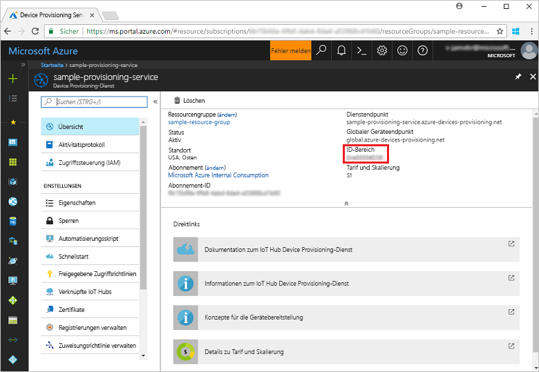
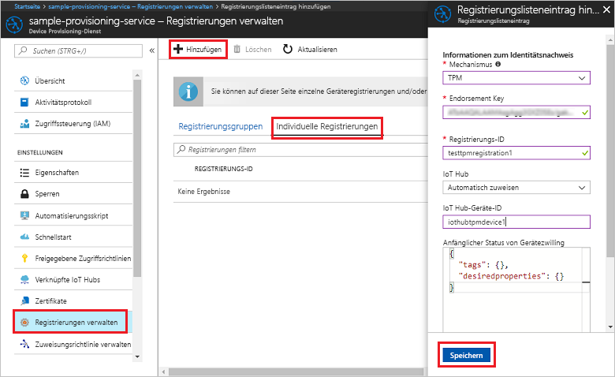
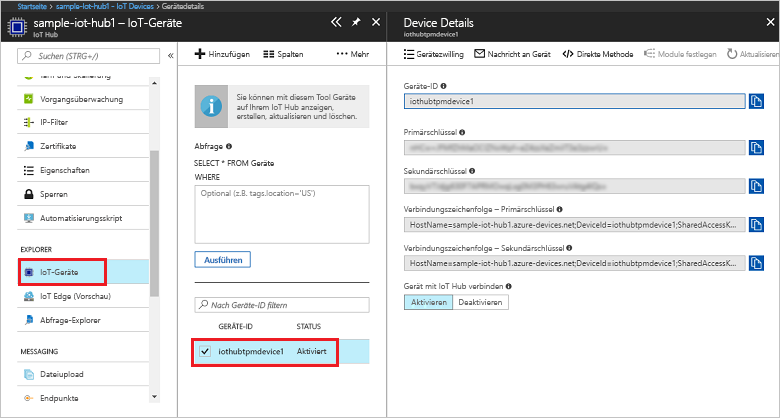

# <a name="create-and-provision-a-simulated-tpm-device-using-c-device-sdk-for-iot-hub-device-provisioning-service"></a>Erstellen und Bereitstellen eines simulierten TPM-Geräts mithilfe des C#-Geräte-SDKs für den IoT Hub Device Provisioning-Dienst

[!INCLUDE [iot-dps-selector-quick-create-simulated-device-tpm](../../includes/iot-dps-selector-quick-create-simulated-device-tpm.md)]

Hier erfahren Sie Schritt für Schritt, wie Sie das Beispiel für ein simuliertes TPM-Gerät mit dem Azure IoT Hub C# SDK auf Ihrem Entwicklungscomputer unter dem Windows-Betriebssystem erstellen und für dieses simulierte Gerät eine Verbindung mit dem Device Provisioning-Dienst und mit Ihrer IoT Hub-Instanz herstellen. In dem Beispielcode wird der Windows-TPM-Simulator als [Hardwaresicherheitsmodul (HSM)](https://azure.microsoft.com/blog/azure-iot-supports-new-security-hardware-to-strengthen-iot-security/) des Geräts verwendet. 

Führen Sie zunächst die Schritte unter [Set up the IoT Hub Device Provisioning Service (preview) with the Azure portal](./quick-setup-auto-provision.md) (Einrichten des IoT Hub Device Provisioning-Diensts (Vorschauversion) über das Azure-Portal) aus, bevor Sie mit diesem Artikel fortfahren.

<a id="setupdevbox"></a>
## <a name="prepare-the-development-environment"></a>Vorbereiten der Entwicklungsumgebung 

1. Vergewissern Sie sich, dass auf Ihrem Computer das [.NET Core SDK](https://www.microsoft.com/net/download/windows) installiert ist. 

1. Vergewissern Sie sich, dass `git` auf Ihrem Computer installiert ist und den Umgebungsvariablen hinzugefügt wurde, auf die das Befehlsfenster Zugriff hat. Unter [Git-Clienttools von Software Freedom Conservancy](https://git-scm.com/download/) finden Sie die neueste Version der zu installierenden `git`-Tools. Hierzu zählt auch die Befehlszeilen-App **Git Bash**, über die Sie mit Ihrem lokalen Git-Repository interagieren können. 

4. Öffnen Sie eine Eingabeaufforderung oder Git Bash. Klonen Sie das GitHub-Repository „Azure IoT SDK for C#“:
    
    ```cmd
    git clone --recursive https://github.com/Azure/azure-iot-sdk-csharp.git
    ```

## <a name="provision-the-simulated-device"></a>Bereitstellen des simulierten Geräts


1. Melden Sie sich beim Azure-Portal an. Klicken Sie im Menü auf der linken Seite auf die Schaltfläche **Alle Ressourcen**, und öffnen Sie Ihren Device Provisioning-Dienst. Notieren Sie sich den auf dem Blatt **Übersicht** angegebenen Wert für **_ID-Bereich_**.

     


2. Wechseln Sie an einer Eingabeaufforderung zum Projektverzeichnis für das TPM-Gerätebereitstellungsbeispiel.

    ```cmd
    cd .\azure-iot-sdk-csharp\provisioning\device\samples\ProvisioningDeviceClientTpm
    ```

2. Geben Sie den folgenden Befehl ein, um das TPM-Gerätebereitstellungsbeispiel zu erstellen und auszuführen. Ersetzen Sie den Wert `<IDScope>` durch den ID-Bereich für Ihren Bereitstellungsdienst. 

    ```cmd
    dotnet run <IDScope>
    ```

1. Im Befehlsfenster werden der **_Endorsement Key_**, die **_Registrierungs-ID_** und eine vorgeschlagene **_Geräte-ID_** für die Geräteregistrierung angezeigt. Notieren Sie sich diese Werte. 
   > [!NOTE]
   > Verwechseln das Fenster mit der Befehlsausgabe nicht mit dem Fenster, das die Ausgabe des TPM-Simulators enthält. Möglicherweise müssen Sie auf das Befehlsfenster klicken, um es im Vordergrund anzuzeigen.

     


4. Wählen Sie im Azure-Portal auf dem Zusammenfassungsblatt des Device Provisioning-Diensts die Option **Registrierungen verwalten** aus. Klicken Sie auf der Registerkarte **Individuelle Registrierungen** im oberen Bereich auf die Schaltfläche **Hinzufügen**. 

5. Geben Sie unter **Registrierungslisteneintrag hinzufügen** folgende Informationen ein:
    - Wählen Sie **TPM** als *Mechanismus* für den Nachweis der Identität.
    - Geben Sie die *Registrierungs-ID* und den *Endorsement Key* für Ihr TPM-Gerät ein. 
    - Wählen Sie optional eine mit Ihrem Bereitstellungsdienst verknüpfte IoT Hub-Instanz aus.
    - Geben Sie eine eindeutige Geräte-ID ein. Sie können entweder die in der Beispielausgabe vorgeschlagene Geräte-ID oder eine eigene Geräte-ID eingeben. Achten Sie bei Verwendung einer eigenen ID darauf, beim Benennen Ihres Geräts keine sensiblen Daten anzugeben. 
    - Aktualisieren Sie **Initial device twin state** (Anfänglicher Gerätezwillingsstatus) mit der gewünschten Anfangskonfiguration für das Gerät.
    - Klicken Sie abschließend auf die Schaltfläche **Speichern**. 

      

   Nach erfolgreicher Registrierung wird die *Registrierungs-ID* Ihres Geräts in der Liste auf der Registerkarte *Individual Enrollments* (Individuelle Registrierungen) angezeigt. 

6. Drücken Sie die EINGABETASTE, um das simulierte Gerät zu registrieren. Beachten Sie die Nachrichten, die den Start und die Verbindungsherstellung des Geräts mit dem Device Provisioning-Dienst simulieren, um Ihre IoT Hub-Informationen abzurufen. 

1. Vergewissern Sie sich, dass das Gerät bereitgestellt wurde. Nachdem das simulierte Gerät erfolgreich für die mit Ihrem Bereitstellungsdienst verknüpfte IoT Hub-Instanz bereitgestellt wurde, wird die Geräte-ID auf dem Blatt **IoT-Geräte** des Hubs angezeigt. 

     

    Wenn Sie den *anfänglichen Gerätezwillingsstatus* im Registrierungseintrag für Ihr Gerät gegenüber dem Standardwert geändert haben, kann der gewünschte Zwillingsstatus vom Hub abgerufen werden, und es können entsprechende Aktionen durchgeführt werden. Weitere Informationen finden Sie unter [Verstehen und Verwenden von Gerätezwillingen in IoT Hub](../iot-hub/iot-hub-devguide-device-twins.md).


## <a name="clean-up-resources"></a>Bereinigen von Ressourcen

Wenn Sie das Geräteclientbeispiel weiter verwenden und erkunden möchten, überspringen Sie die Bereinigung der in dieser Schnellstartanleitung erstellten Ressourcen. Falls Sie nicht fortfahren möchten, führen Sie die folgenden Schritte aus, um alle erstellten Ressourcen zu löschen, die im Rahmen dieser Schnellstartanleitung erstellt wurden:

1. Schließen Sie auf Ihrem Computer das Ausgabefenster des Geräteclientbeispiels.
1. Schließen Sie auf Ihrem Computer das TPM-Simulatorfenster.
1. Klicken Sie im Azure-Portal im Menü auf der linken Seite auf **Alle Ressourcen**, und wählen Sie Ihren Device Provisioning-Dienst aus. Klicken Sie im oberen Bereich des Blatts **Alle Ressourcen** auf **Löschen**.  
1. Klicken Sie im Azure-Portal im Menü auf der linken Seite auf **Alle Ressourcen**, und wählen Sie Ihre IoT Hub-Instanz aus. Klicken Sie im oberen Bereich des Blatts **Alle Ressourcen** auf **Löschen**.  

## <a name="next-steps"></a>Nächste Schritte

In dieser Schnellstartanleitung haben Sie auf Ihrem Computer ein simuliertes TPM-Gerät erstellt und es mithilfe des IoT Hub Device Provisioning-Diensts für Ihre IoT Hub-Instanz bereitgestellt. Informationen zum programmgesteuerten Registrieren Ihres TPM-Geräts finden Sie in der Schnellstartanleitung für die programmgesteuerte Registrierung von TPM-Geräten. 

> [!div class="nextstepaction"]
> [Registrieren eines TPM-Geräts für den IoT Hub Device Provisioning-Dienst per Java-Dienst-SDK](quick-enroll-device-tpm-csharp.md)
