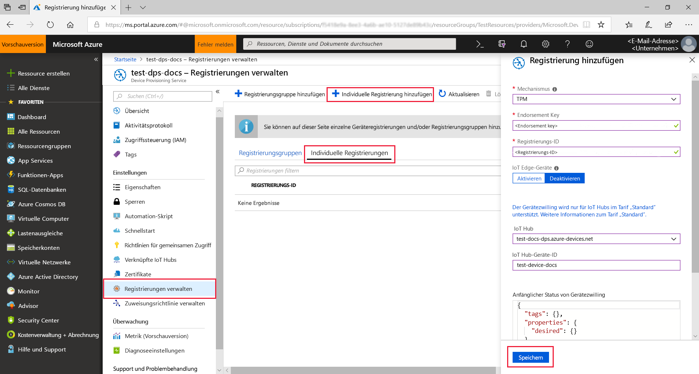
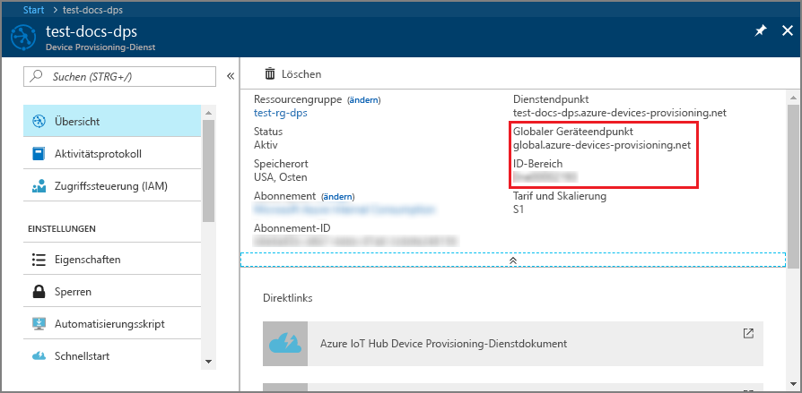
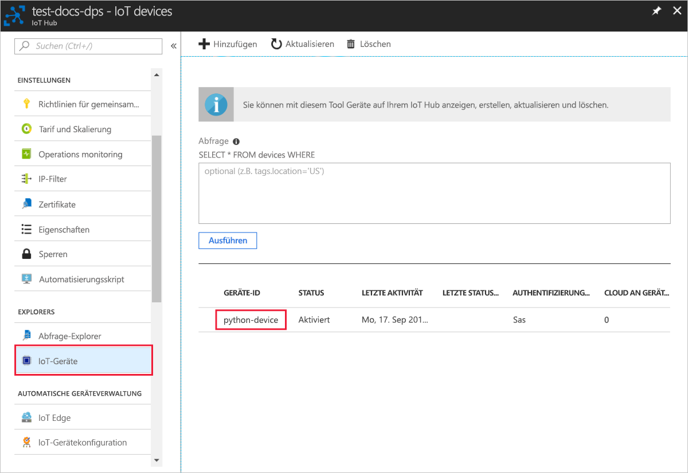

# <a name="create-and-provision-a-simulated-tpm-device-using-python-device-sdk-for-iot-hub-device-provisioning-service"></a>Erstellen und Bereitstellen eines simulierten TPM-Geräts mithilfe des Python-Geräte-SDK für den IoT Hub Device Provisioning-Dienst

[!INCLUDE [iot-dps-selector-quick-create-simulated-device-tpm](../../includes/iot-dps-selector-quick-create-simulated-device-tpm.md)]

Hier erfahren Sie Schritt für Schritt, wie Sie auf Ihrem Entwicklungscomputer unter dem Windows-Betriebssystem ein simuliertes Gerät erstellen, den Windows-TPM-Simulator als [Hardwaresicherheitsmodul (HSM)](https://azure.microsoft.com/blog/azure-iot-supports-new-security-hardware-to-strengthen-iot-security/) des Geräts ausführen und dieses simulierte Gerät mithilfe des Python-Codebeispiels mit dem Device Provisioning-Dienst und Ihrer IoT Hub-Instanz verbinden. 

Sollten Sie mit der automatischen Bereitstellung nicht vertraut sein, lesen Sie auch die Informationen unter [Konzepte für die automatische Bereitstellung](concepts-auto-provisioning.md). Vergewissern Sie sich außerdem, dass Sie die Schritte unter [Einrichten des IoT Hub Device Provisioning-Diensts über das Azure-Portal](./quick-setup-auto-provision.md) ausgeführt haben, bevor Sie fortfahren. 

In Azure IoT Device Provisioning Service werden zwei Registrierungsarten unterstützt:
- [Registrierungsgruppen:](concepts-service.md#enrollment-group) Werden zum Registrieren mehrerer verwandter Geräte verwendet.
- [Individuelle Registrierungen](concepts-service.md#individual-enrollment): Werden zum Registrieren eines einzelnen Geräts verwendet.

In diesem Artikel werden individuelle Registrierungen veranschaulicht.

[!INCLUDE [IoT Device Provisioning Service basic](../../includes/iot-dps-basic.md)]

## <a name="prepare-the-environment"></a>Vorbereiten der Umgebung 

1. Stellen Sie sicher, dass [Visual Studio](https://visualstudio.microsoft.com/vs/) 2015 oder höher installiert und die Workload „Desktopentwicklung mit C++“ für Ihre Visual Studio-Installation aktiviert ist.

1. Laden Sie das [CMake-Buildsystem](https://cmake.org/download/) herunter, und installieren Sie es.

1. Vergewissern Sie sich, dass `git` auf Ihrem Computer installiert ist und den Umgebungsvariablen hinzugefügt wurde, auf die das Befehlsfenster Zugriff hat. Unter [Git-Clienttools von Software Freedom Conservancy](https://git-scm.com/download/) finden Sie die neueste Version der zu installierenden `git`-Tools. Hierzu zählt auch die Befehlszeilen-App **Git Bash**, über die Sie mit Ihrem lokalen Git-Repository interagieren können. 

1. Öffnen Sie eine Eingabeaufforderung oder Git Bash. Klonen Sie das GitHub-Repository mit dem Codebeispiel für die Gerätesimulation:
    
    ```cmd/sh
    git clone https://github.com/Azure/azure-iot-sdk-python.git --recursive
    ```

1. Erstellen Sie in Ihrer lokalen Kopie des GitHub-Repositorys einen Ordner für den CMake-Buildprozess. 

    ```cmd/sh
    cd azure-iot-sdk-python/c
    mkdir cmake
    cd cmake
    ```

1. In dem Codebeispiel wird ein Windows-TPM-Simulator verwendet. Führen Sie den folgenden Befehl aus, um die SAS-Tokenauthentifizierung zu aktivieren. Der Befehl generiert auch eine Visual Studio-Projektmappe für das simulierte Gerät.

    ```cmd/sh
    cmake -Duse_prov_client:BOOL=ON -Duse_tpm_simulator:BOOL=ON ..
    ```

1. Navigieren Sie an einer separaten Eingabeaufforderung zum Ordner mit dem [TPM](https://docs.microsoft.com/windows/device-security/tpm/trusted-platform-module-overview)-Simulator, und führen Sie ihn aus. Klicken Sie auf **Zugriff zulassen**. Dieser lauscht über einen Socket an den Ports 2321 und 2322. Lassen Sie das Befehlsfenster geöffnet. Es wird benötigt, um den Simulator bis zum Ende dieser Schnellstartanleitung auszuführen. 

    ```cmd/sh
    .\azure-iot-sdk-python\c\provisioning_client\deps\utpm\tools\tpm_simulator\Simulator.exe
    ```

    


## <a name="create-a-device-enrollment-entry"></a>Erstellen eines Geräteregistrierungseintrags

1. Öffnen Sie die im Ordner *cmake* generierte Projektmappe `azure_iot_sdks.sln`, und erstellen Sie sie in Visual Studio.

1. Klicken Sie mit der rechten Maustaste auf das Projekt **tpm_device_provision**, und wählen Sie **Als Startprojekt festlegen** aus. Führen Sie die Lösung aus. Im Ausgabefenster werden der **_Endorsement Key_** und die **_Registrierungs-ID_** für die Geräteregistrierung angezeigt. Notieren Sie sich diese Werte. 

    

1. Melden Sie sich beim Azure-Portal an, klicken Sie im Menü auf der linken Seite auf die Schaltfläche **Alle Ressourcen**, und öffnen Sie Ihren Device Provisioning-Dienst.

1. Wählen Sie auf dem Zusammenfassungsblatt des Device Provisioning-Diensts die Option **Registrierungen verwalten** aus. Wählen Sie die Registerkarte **Individuelle Registrierungen** aus, und klicken Sie oben auf die Schaltfläche **Individuelle Registrierung hinzufügen**. 

1. Geben Sie im Bereich **Registrierung hinzufügen** die folgenden Informationen ein:
   - Wählen Sie **TPM** als *Mechanismus* für den Nachweis der Identität.
   - Geben Sie die *Registrierungs-ID* und den *Endorsement Key* für Ihr TPM-Gerät ein. 
   - Wählen Sie einen IoT Hub aus, der mit Ihrem Bereitstellungsdienst verknüpft ist.
   - Geben Sie eine eindeutige Geräte-ID ein. Achten Sie darauf, dass Sie beim Benennen Ihres Geräts keine sensiblen Daten angeben.
   - Aktualisieren Sie **Initial device twin state** (Anfänglicher Gerätezwillingsstatus) mit der gewünschten Anfangskonfiguration für das Gerät.
   - Klicken Sie abschließend auf die Schaltfläche **Speichern**. 

       

   Nach erfolgreicher Registrierung wird die *Registrierungs-ID* Ihres Geräts in der Liste auf der Registerkarte *Individual Enrollments* (Individuelle Registrierungen) angezeigt. 


## <a name="simulate-the-device"></a>Simulieren des Geräts

1. Laden Sie [Python 2.x oder 3.x](https://www.python.org/downloads/) herunter, und installieren Sie es. Stellen Sie je nach Einrichtung sicher, dass die 32-Bit- bzw. die 64-Bit-Installation verwendet wird. Fügen Sie Python Ihren plattformspezifischen Umgebungsvariablen hinzu, wenn Sie während der Installation dazu aufgefordert werden.
    - Bei Verwendung des Windows-Betriebssystems wird das [Visual C++ Redistributable Package](https://www.microsoft.com/download/confirmation.aspx?id=48145) verwendet, um die Verwendung nativer DLLs aus Python zu ermöglichen.

1. Eine Anleitung für die Erstellung der Python-Pakete finden Sie [hier](https://github.com/Azure/azure-iot-sdk-python/blob/master/doc/python-devbox-setup.md).

   > [!NOTE]
   > Verwenden Sie bei Ausführung von `build_client.cmd` das Flag `--use-tpm-simulator`.
   > 
   > [!NOTE]
   > Bei Verwendung von `pip` muss auch das Paket `azure-iot-provisioning-device-client` installiert werden. Beachten Sie, dass die veröffentlichten PIP-Pakete nicht den Simulator, sondern das echte TPM verwenden. Zur Verwendung des Simulators muss bei der Kompilierung der Quelle das Flag `--use-tpm-simulator` verwendet werden.

1. Navigieren Sie zum Beispielordner.

    ```cmd/sh
    cd azure-iot-sdk-python/provisioning_device_client/samples
    ```

1. Bearbeiten Sie mithilfe Ihrer Python-IDE das Python-Skript **provisioning\_device\_client\_sample.py**. Legen Sie die Variablen *GLOBAL\_PROV\_URI* und *ID\_SCOPE* auf die zuvor notierten Werte fest. Stellen Sie außerdem sicher, dass *SECURITY\_DEVICE\_TYPE* auf `ProvisioningSecurityDeviceType.TPM` festgelegt ist.

    ```python
    GLOBAL_PROV_URI = "{globalServiceEndpoint}"
    ID_SCOPE = "{idScope}"
    SECURITY_DEVICE_TYPE = ProvisioningSecurityDeviceType.TPM
    PROTOCOL = ProvisioningTransportProvider.HTTP
    ```

    

1. Führen Sie das Beispiel aus. 

    ```cmd/sh
    python provisioning_device_client_sample.py
    ```

1. Beachten Sie die Nachrichten, die den Start und die Verbindungsherstellung des Geräts mit dem Device Provisioning-Dienst simulieren, um Ihre IoT Hub-Informationen abzurufen. 

    

1. Nachdem das simulierte Gerät erfolgreich für die mit Ihrem Bereitstellungsdienst verknüpfte IoT Hub-Instanz bereitgestellt wurde, wird die Geräte-ID auf dem Blatt **Device Explorer** des Hubs angezeigt.

     

    Wenn Sie den *anfänglichen Gerätezwillingsstatus* im Registrierungseintrag für Ihr Gerät gegenüber dem Standardwert geändert haben, kann der gewünschte Zwillingsstatus vom Hub abgerufen werden, und es können entsprechende Aktionen durchgeführt werden. Weitere Informationen finden Sie unter [Verstehen und Verwenden von Gerätezwillingen in IoT Hub](../iot-hub/iot-hub-devguide-device-twins.md).


## <a name="clean-up-resources"></a>Bereinigen von Ressourcen

Wenn Sie das Geräteclientbeispiel weiter verwenden und erkunden möchten, überspringen Sie die Bereinigung der in dieser Schnellstartanleitung erstellten Ressourcen. Falls Sie nicht fortfahren möchten, führen Sie die folgenden Schritte aus, um alle erstellten Ressourcen zu löschen, die im Rahmen dieser Schnellstartanleitung erstellt wurden:

1. Schließen Sie auf Ihrem Computer das Ausgabefenster des Geräteclientbeispiels.
1. Schließen Sie auf Ihrem Computer das TPM-Simulatorfenster.
1. Klicken Sie im Azure-Portal im Menü auf der linken Seite auf **Alle Ressourcen**, und wählen Sie Ihren Device Provisioning-Dienst aus. Öffnen Sie das Blatt **Registrierungen verwalten** für Ihren Dienst, und klicken Sie dann auf die Registerkarte **Individuelle Registrierungen**. Wählen Sie die *REGISTRIERUNGS-ID* des Geräts aus, das Sie mit dieser Schnellstartanleitung registriert haben, und klicken Sie im oberen Bereich auf die Schaltfläche **Löschen**. 
1. Klicken Sie im Azure-Portal im Menü auf der linken Seite auf **Alle Ressourcen**, und wählen Sie Ihre IoT Hub-Instanz aus. Öffnen Sie das Blatt **IoT-Geräte** für Ihren Hub, wählen Sie die *GERÄTE-ID* des Geräts aus, die Sie in dieser Schnellstartanleitung registriert haben, und klicken Sie dann im oberen Bereich auf **Löschen**.

## <a name="next-steps"></a>Nächste Schritte

In dieser Schnellstartanleitung haben Sie auf Ihrem Computer ein simuliertes TPM-Gerät erstellt und es mithilfe des IoT Hub Device Provisioning-Diensts für Ihre IoT Hub-Instanz bereitgestellt. Informationen zum programmgesteuerten Registrieren Ihres TPM-Geräts finden Sie in der Schnellstartanleitung für die programmgesteuerte Registrierung von TPM-Geräten. 

> [!div class="nextstepaction"]
> [Registrieren eines TPM-Geräts für den IoT Hub Device Provisioning-Dienst per Java-Dienst-SDK](quick-enroll-device-tpm-python.md)
