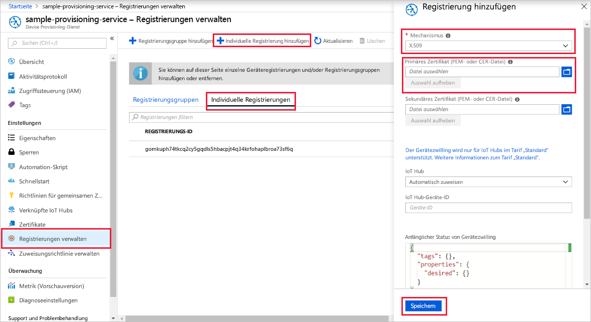
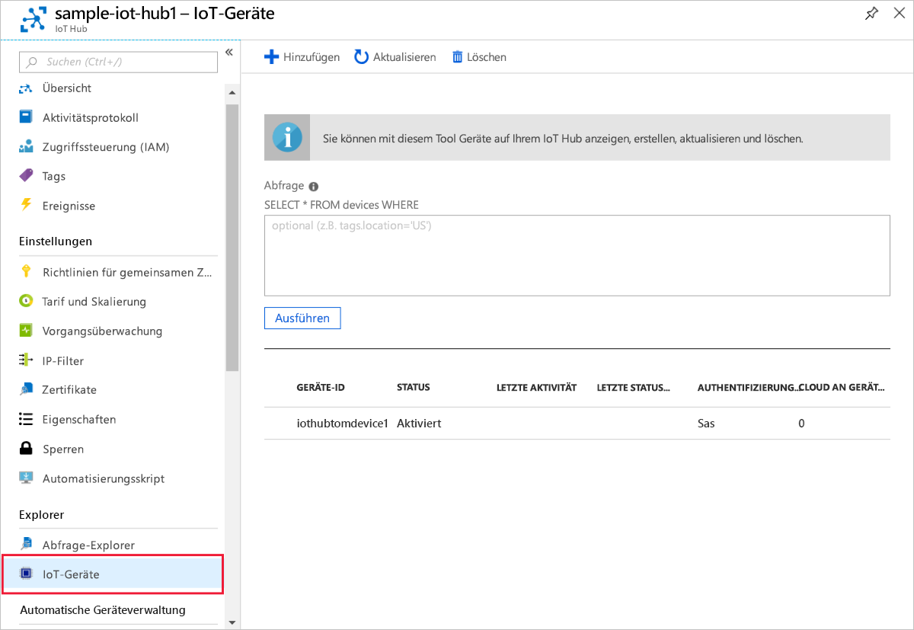

# <a name="create-and-provision-a-simulated-x509-device-using-c-device-sdk-for-iot-hub-device-provisioning-service"></a>Erstellen und Bereitstellen eines simulierten X.509-Geräts mithilfe des C#-Geräte-SDKs für den IoT Hub Device Provisioning-Dienst
[!INCLUDE [iot-dps-selector-quick-create-simulated-device-x509](../../includes/iot-dps-selector-quick-create-simulated-device-x509.md)]

Diese Schritte zeigen Ihnen, wie Sie mit den [Azure IoT Samples for C# (Azure IoT-Codebeispiele für C#)](https://github.com/Azure-Samples/azure-iot-samples-csharp) ein X.509-Gerät auf einem Entwicklungscomputer mit Windows-Betriebssystem simulieren. Das Beispiel stellt auch eine Verbindung des simulierten Geräts mit einem IoT Hub über den Device Provisioning Service her.

Sollten Sie mit der automatischen Bereitstellung nicht vertraut sein, lesen Sie auch die Informationen unter [Konzepte für die automatische Bereitstellung](concepts-auto-provisioning.md). Vergewissern Sie sich außerdem, dass Sie die Schritte unter [Einrichten des IoT Hub Device Provisioning-Diensts über das Azure-Portal](./quick-setup-auto-provision.md) ausgeführt haben, bevor Sie fortfahren. 

In Azure IoT Device Provisioning Service werden zwei Registrierungsarten unterstützt:
- [Registrierungsgruppen:](concepts-service.md#enrollment-group) Werden zum Registrieren mehrerer verwandter Geräte verwendet.
- [Individuelle Registrierungen](concepts-service.md#individual-enrollment): Werden zum Registrieren eines einzelnen Geräts verwendet.

In diesem Artikel werden individuelle Registrierungen veranschaulicht.

[!INCLUDE [IoT Device Provisioning Service basic](../../includes/iot-dps-basic.md)]

<a id="setupdevbox"></a>
## <a name="prepare-the-development-environment"></a>Vorbereiten der Entwicklungsumgebung 

1. Vergewissern Sie sich, dass auf Ihrem Computer das [.NET Core 2.1 SDK oder höher](https://www.microsoft.com/net/download/windows) installiert ist. 

1. Vergewissern Sie sich, dass `git` auf Ihrem Computer installiert ist und den Umgebungsvariablen hinzugefügt wurde, auf die das Befehlsfenster Zugriff hat. Unter [Git-Clienttools von Software Freedom Conservancy](https://git-scm.com/download/) finden Sie die neueste Version der zu installierenden `git`-Tools. Hierzu zählt auch die Befehlszeilen-App **Git Bash**, über die Sie mit Ihrem lokalen Git-Repository interagieren können. 

1. Öffnen Sie eine Eingabeaufforderung oder Git Bash. Klonen Sie die Azure IoT-Codebeispiele für das C#-GitHub-Repository:
    
    ```cmd
    git clone https://github.com/Azure-Samples/azure-iot-samples-csharp.git
    ```

## <a name="create-a-self-signed-x509-device-certificate-and-individual-enrollment-entry"></a>Erstellen eines selbstsignierten X.509-Gerätezertifikats und eines individuellen Registrierungseintrags

In diesem Abschnitt verwenden Sie ein selbstsigniertes X.509-Zertifikat, wobei Folgendes zu beachten ist:

* Selbstsignierte Zertifikate dienen nur zu Testzwecken und sollten nicht in der Produktion verwendet werden.
* Die Standardgültigkeitsdauer für ein selbstsigniertes Zertifikat beträgt ein Jahr.

Sie verwenden Beispielcode aus dem [Provisioning Device Client Sample – X.509 Attestation (Bereitstellungs-Geräteclientbeispiel – X.509-Nachweis)](https://github.com/Azure-Samples/azure-iot-samples-csharp/tree/master/provisioning/Samples/device/X509Sample), um das Zertifikat zu erstellen, das mit dem individuellen Registrierungseintrag für das simulierte Gerät verwendet werden soll.


1. Wechseln Sie an einer Eingabeaufforderung zum Projektverzeichnis für das X.509-Gerätebereitstellungsbeispiel.

    ```cmd
    cd .\azure-iot-samples-csharp\provisioning\Samples\device\X509Sample
    ```

2. Der Beispielcode ist für die Verwendung von X.509-Zertifikaten eingerichtet, die in einer kennwortgeschützten Datei im PKCS12-Format (certificate.pfx) gespeichert sind. Darüber hinaus benötigen Sie im weiteren Verlauf dieser Schnellstartanleitung eine Zertifikatdatei mit einem öffentlichen Schlüssel (certificate.cer), um eine individuelle Registrierung erstellen zu können. Führen Sie den folgenden Befehl aus, um ein selbstsigniertes Zertifikat und die dazugehörigen CER- und PFX-Dateien zu generieren:

    ```cmd
    powershell .\GenerateTestCertificate.ps1
    ```

3. Das Skript fordert Sie zur Eingabe eines PFX-Kennworts auf. Merken Sie sich dieses Kennwort gut. Es wird später zum Ausführen des Beispiels benötigt.

      


4. Melden Sie sich am Azure-Portal an, klicken Sie im Menü auf der linken Seite auf die Schaltfläche **Alle Ressourcen**, und öffnen Sie Ihren Provisioning-Dienst.

5. Wählen Sie auf dem Zusammenfassungsblatt des Device Provisioning-Diensts die Option **Registrierungen verwalten** aus. Wählen Sie die Registerkarte **Individuelle Registrierungen** aus, und klicken Sie oben auf die Schaltfläche **Individuelle Registrierung hinzufügen**. 

6. Geben Sie im Bereich **Registrierung hinzufügen** die folgenden Informationen ein:
    - Wählen Sie **X.509** als *Mechanismus* für den Nachweis der Identität.
    - Klicken Sie unter *Primary certificate .pem or .cer file* (PEM- oder CER-Datei des primären Zertifikats) auf *Datei auswählen*, und wählen Sie die in den vorherigen Schritten erstellte Zertifikatdatei **certificate.pem** aus.
    - Lassen Sie die **Geräte-ID** leer. Bei der Bereitstellung Ihres Geräts wird die Geräte-ID auf den allgemeinen Namen (Common Name, CN) aus dem X.509-Zertifikat festgelegt (in diesem Fall: **iothubx509device1**). Dieser Name wird auch für die Registrierungs-ID des Eintrags für die individuelle Registrierung verwendet. 
    - Optional können Sie die folgenden Informationen angeben:
        - Wählen Sie einen IoT Hub aus, der mit Ihrem Bereitstellungsdienst verknüpft ist.
        - Aktualisieren Sie **Initial device twin state** (Anfänglicher Gerätezwillingsstatus) mit der gewünschten Anfangskonfiguration für das Gerät.
    - Klicken Sie abschließend auf die Schaltfläche **Speichern**. 

    [](./media/quick-create-simulated-device-x509-csharp/device-enrollment.png#lightbox)
    
   Nach der Registrierung wird Ihr X.509-Registrierungseintrag auf der Registerkarte *Individuelle Registrierungen* in der Spalte *Registrierungs-ID* als **iothubx509device1** angezeigt. 

## <a name="provision-the-simulated-device"></a>Bereitstellen des simulierten Geräts

1. Notieren Sie sich den Wert für **_ID-Bereich_**, den Sie auf dem Blatt **Übersicht** für Ihren Bereitstellungsdienst finden.

     


2. Geben Sie den folgenden Befehl ein, um das X.509-Gerätebereitstellungsbeispiel zu erstellen und auszuführen. Ersetzen Sie den Wert `<IDScope>` durch den ID-Bereich für Ihren Bereitstellungsdienst. 

    ```cmd
    dotnet run <IDScope>
    ```

3. Geben Sie bei entsprechender Aufforderung das Kennwort für die zuvor erstellte PFX-Datei ein. Beachten Sie die Nachrichten, die den Start und die Verbindungsherstellung des Geräts mit dem Device Provisioning-Dienst simulieren, um Ihre IoT Hub-Informationen abzurufen. 

     

4. Vergewissern Sie sich, dass das Gerät bereitgestellt wurde. Nachdem das simulierte Gerät erfolgreich für die mit Ihrem Bereitstellungsdienst verknüpfte IoT Hub-Instanz bereitgestellt wurde, wird die Geräte-ID auf dem Blatt **IoT-Geräte** des Hubs angezeigt. 

     

    Wenn Sie den *anfänglichen Gerätezwillingsstatus* im Registrierungseintrag für Ihr Gerät gegenüber dem Standardwert geändert haben, kann der gewünschte Zwillingsstatus vom Hub abgerufen werden, und es können entsprechende Aktionen durchgeführt werden. Weitere Informationen finden Sie unter [Verstehen und Verwenden von Gerätezwillingen in IoT Hub](../iot-hub/iot-hub-devguide-device-twins.md).


## <a name="clean-up-resources"></a>Bereinigen von Ressourcen

Wenn Sie das Geräteclientbeispiel weiter verwenden und erkunden möchten, überspringen Sie die Bereinigung der in dieser Schnellstartanleitung erstellten Ressourcen. Falls Sie nicht fortfahren möchten, führen Sie die folgenden Schritte aus, um alle erstellten Ressourcen zu löschen, die im Rahmen dieser Schnellstartanleitung erstellt wurden:

1. Schließen Sie auf Ihrem Computer das Ausgabefenster des Geräteclientbeispiels.
1. Schließen Sie auf Ihrem Computer das TPM-Simulatorfenster.
1. Klicken Sie im Azure-Portal im Menü auf der linken Seite auf **Alle Ressourcen**, und wählen Sie Ihren Device Provisioning-Dienst aus. Klicken Sie im oberen Bereich des Blatts **Alle Ressourcen** auf **Löschen**.  
1. Klicken Sie im Azure-Portal im Menü auf der linken Seite auf **Alle Ressourcen**, und wählen Sie Ihre IoT Hub-Instanz aus. Klicken Sie im oberen Bereich des Blatts **Alle Ressourcen** auf **Löschen**.  

## <a name="next-steps"></a>Nächste Schritte

In dieser Schnellstartanleitung haben Sie auf Ihrem Windows-Computer ein simuliertes X.509-Gerät erstellt und es im Portal mithilfe des Azure IoT Hub Device Provisioning-Diensts für Ihre IoT Hub-Instanz bereitgestellt. Informationen zum programmgesteuerten Registrieren Ihres X.509-Geräts finden Sie in der Schnellstartanleitung für die programmgesteuerte Registrierung von X.509-Geräten. 

> [!div class="nextstepaction"]
> [Registrieren von X.509-Geräten für den Azure IoT Hub Device Provisioning-Dienst per Java-Dienst-SDK](quick-enroll-device-x509-csharp.md)
