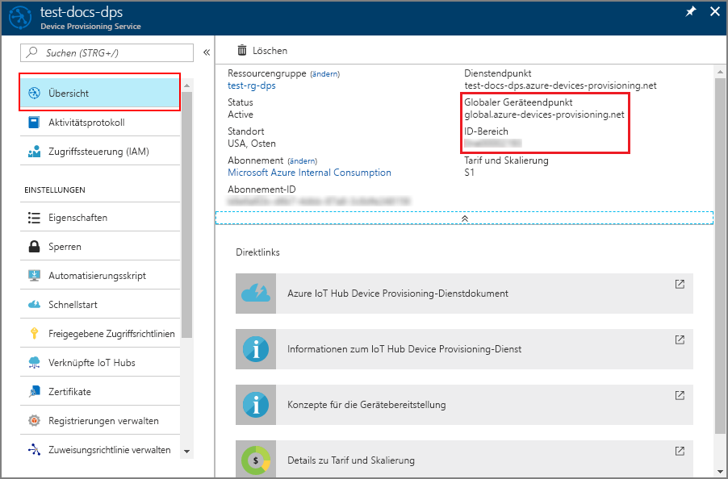
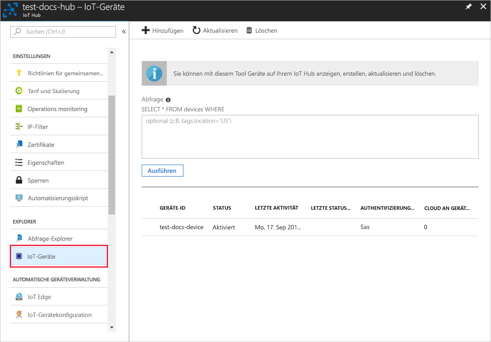

# <a name="create-and-provision-an-x509-simulated-device-using-nodejs-device-sdk-for-iot-hub-device-provisioning-service"></a>Erstellen und Bereitstellen eines simulierten X.509-Geräts mithilfe des Node.js-Geräte-SDK für den IoT Hub Device Provisioning-Dienst
[!INCLUDE [iot-dps-selector-quick-create-simulated-device-x509](../../includes/iot-dps-selector-quick-create-simulated-device-x509.md)]

Diese Schritte zeigen, wie Sie im Device Provisioning-Dienst einen Registrierungseintrag erstellen, auf Ihrem Entwicklungscomputer ein X.509-Gerät simulieren, das simulierte Gerät mit dem Device Provisioning-Dienst verbinden und das Gerät per [Azure IoT Hub-Node.js-Geräte-SDK](https://github.com/Azure/azure-iot-sdk-node) auf Ihrem IoT Hub registrieren.

Sollten Sie mit der automatischen Bereitstellung nicht vertraut sein, lesen Sie auch die Informationen unter [Konzepte für die automatische Bereitstellung](concepts-auto-provisioning.md). Vergewissern Sie sich außerdem, dass Sie die Schritte unter [Einrichten des IoT Hub Device Provisioning-Diensts über das Azure-Portal](./quick-setup-auto-provision.md) ausgeführt haben, bevor Sie fortfahren. 

In Azure IoT Device Provisioning Service werden zwei Registrierungsarten unterstützt:
- [Registrierungsgruppen:](concepts-service.md#enrollment-group) Werden zum Registrieren mehrerer verwandter Geräte verwendet.
- [Individuelle Registrierungen](concepts-service.md#individual-enrollment): Werden zum Registrieren eines einzelnen Geräts verwendet.

In diesem Artikel werden individuelle Registrierungen veranschaulicht.

[!INCLUDE [IoT Device Provisioning Service basic](../../includes/iot-dps-basic.md)]

## <a name="prepare-the-environment"></a>Vorbereiten der Umgebung 

1. Führen Sie zunächst die Schritte unter [Einrichten des IoT Hub Device Provisioning-Diensts über das Azure-Portal](./quick-setup-auto-provision.md) aus, bevor Sie mit dieser Anleitung fortfahren.

2. Stellen Sie sicher, dass auf Ihrem Computer [Node.js v4.0 oder höher](https://nodejs.org) installiert ist.

3. Vergewissern Sie sich, dass [Git](https://git-scm.com/download/) auf Ihrem Computer installiert ist und den Umgebungsvariablen hinzugefügt wurde, auf die das Befehlsfenster Zugriff hat. 

4. Vergewissern Sie sich, dass [OpenSSL](https://www.openssl.org/) auf Ihrem Computer installiert ist und den Umgebungsvariablen hinzugefügt wurde, auf die das Befehlsfenster Zugriff hat. Diese Bibliothek kann entweder über die Quelle erstellt und installiert oder über einen [Drittanbieter](https://wiki.openssl.org/index.php/Binaries) (z.B. [hier](https://sourceforge.net/projects/openssl/)) heruntergeladen und installiert werden. 

    > [!NOTE]
    > Wenn Sie Ihre X.509-Zertifikate vom Typ _Stammzertifikat_, _Zwischenzertifikat_ bzw. _Untergeordnetes Zertifikat_ bereits erstellt haben, können Sie diesen und alle weiteren Schritte zur Zertifikaterstellung überspringen.
    >

## <a name="create-a-self-signed-x509-device-certificate-and-individual-enrollment-entry"></a>Erstellen eines selbstsignierten X.509-Gerätezertifikats und eines individuellen Registrierungseintrags

In diesem Abschnitt verwenden Sie ein selbstsigniertes X.509-Zertifikat, wobei Folgendes zu beachten ist:

* Selbstsignierte Zertifikate dienen nur zu Testzwecken und sollten nicht in der Produktion verwendet werden.
* Die Standardgültigkeitsdauer für ein selbstsigniertes Zertifikat beträgt ein Jahr.

Sie verwenden Beispielcode aus dem [Azure IoT SDK für Node.js](https://github.com/Azure/azure-iot-sdk-node.git), um das Zertifikat zu erstellen, das mit dem individuellen Registrierungseintrag für das simulierte Gerät verwendet werden soll.


1. Öffnen Sie eine Eingabeaufforderung. Klonen Sie das GitHub-Repository für die Codebeispiele:
    
    ```cmd/sh
    git clone https://github.com/Azure/azure-iot-sdk-node.git --recursive
    ```

2. Navigieren Sie zum Zertifikatgeneratorskript, und erstellen Sie das Projekt. 

    ```cmd/sh
    cd azure-iot-sdk-node/provisioning/tools
    npm install
    ```

3. Erstellen Sie das _untergeordnete_ X.509-Zertifikat, indem Sie das Skript mit Ihrem eigenen Zertifikatnamen (_certificate-name_) ausführen. Der allgemeine Name des untergeordneten Zertifikats wird zur [Registrierungs-ID](https://docs.microsoft.com/azure/iot-dps/concepts-device#registration-id). Achten Sie daher darauf, dass Sie nur Kleinbuchstaben, Zahlen und Bindestriche verwenden.

    ```cmd/sh
    node create_test_cert.js device {certificate-name}
    ```

4. Melden Sie sich beim [Azure-Portal](https://portal.azure.com) an, klicken Sie im Menü auf der linken Seite auf die Schaltfläche **Alle Ressourcen**, und öffnen Sie Ihre Instanz des Device Provisioning-Diensts.

5. Wählen Sie auf dem Zusammenfassungsblatt des Device Provisioning-Diensts die Option **Registrierungen verwalten** aus. Wählen Sie die Registerkarte **Individuelle Registrierungen** aus, und klicken Sie oben auf die Schaltfläche **Individuelle Registrierung hinzufügen**. 

6. Geben Sie im Bereich **Registrierung hinzufügen** die folgenden Informationen ein:
   - Wählen Sie **X.509** als *Mechanismus* für den Nachweis der Identität.
   - Klicken Sie unter *Primary certificate .pem or .cer file* (PEM- oder CER-Datei des primären Zertifikats) auf *Datei auswählen*, und wählen Sie die in den vorherigen Schritten erstellte Zertifikatdatei **{Zertifikatname}_cert.pem** aus.  
   - Optional können Sie die folgenden Informationen angeben:
     - Wählen Sie einen IoT Hub aus, der mit Ihrem Bereitstellungsdienst verknüpft ist.
     - Geben Sie eine eindeutige Geräte-ID ein. Achten Sie darauf, dass Sie beim Benennen Ihres Geräts keine sensiblen Daten angeben. 
     - Aktualisieren Sie **Initial device twin state** (Anfänglicher Gerätezwillingsstatus) mit der gewünschten Anfangskonfiguration für das Gerät.
     - Klicken Sie abschließend auf die Schaltfläche **Speichern**. 

     [](./media/quick-create-simulated-device-x509-node/device-enrollment.png#lightbox)

     Nach der erfolgreichen Registrierung wird Ihr X.509-Gerät als **{certificatename}** auf der Registerkarte *Individuelle Registrierungen* in der Spalte *Registrierungs-ID* angezeigt. Notieren Sie sich diesen Wert zur späteren Verwendung.

## <a name="simulate-the-device"></a>Simulieren des Geräts

Die Verwendung des [Node.js-Geräte-SDK für Azure IoT Hub](https://github.com/Azure/azure-iot-sdk-node) ist eine einfache Möglichkeit zum Simulieren eines Geräts. Weitere Informationen finden Sie unter [Konzepte für Geräte mit dem IoT Hub Device Provisioning-Dienst](https://docs.microsoft.com/azure/iot-dps/concepts-device).

1. Navigieren Sie im Azure-Portal zum Blatt **Übersicht** für Ihren Device Provisioning-Dienst, und notieren Sie sich die Werte für **_Global device endpoint_** (Globaler Geräteendpunkt) und **_ID Scope_** (ID-Bereich).

     

2. Kopieren Sie Ihr _Zertifikat_ und den _Schlüssel_ in den Beispielordner.

    ```cmd/sh
    copy .\{certificate-name}_cert.pem ..\device\samples\{certificate-name}_cert.pem
    copy .\{certificate-name}_key.pem ..\device\samples\{certificate-name}_key.pem
    ```

3. Navigieren Sie zum Gerätetestskript, und erstellen Sie das Projekt. 

    ```cmd/sh
    cd ..\device\samples
    npm install
    ```

4. Bearbeiten Sie die Datei **register\_x509.js**. Speichern Sie die Datei, nachdem Sie die folgenden Änderungen vorgenommen haben.
    - Ersetzen Sie `provisioning host` durch den **_Globalen Geräteendpunkt_** aus **Schritt 1** oben.
    - Ersetzen Sie `id scope` durch den **_ID-Bereich_** aus **Schritt 1** oben. 
    - Ersetzen Sie `registration id` durch die **_Registrierungs-ID_** aus dem vorherigen Abschnitt.
    - Ersetzen Sie `cert filename` und `key filename` durch die Dateien, die Sie oben in **Schritt 2** kopiert haben. 

5. Führen Sie das Skript aus, und stellen Sie sicher, dass das Gerät erfolgreich bereitgestellt wurde.

    ```cmd/sh
    node register_x509.js
    ```   

6. Navigieren Sie im Portal zu der mit Ihrem Bereitstellungsdienst verknüpften IoT Hub-Instanz, und öffnen Sie das Blatt **IoT-Geräte**. Nach erfolgreicher Bereitstellung des simulierten X.509-Geräts auf dem Hub wird die dazugehörige Geräte-ID auf dem Blatt **IoT-Geräte** angezeigt, und der *STATUS* lautet **Aktiviert**. Falls das Blatt bereits vor dem Ausführen der Beispielgeräteanwendung geöffnet war, müssen Sie unter Umständen im oberen Bereich auf die Schaltfläche **Aktualisieren** klicken. 

     

    Wenn Sie den *anfänglichen Gerätezwillingsstatus* im Registrierungseintrag für Ihr Gerät gegenüber dem Standardwert geändert haben, kann der gewünschte Zwillingsstatus vom Hub abgerufen werden, und es können entsprechende Aktionen durchgeführt werden. Weitere Informationen finden Sie unter [Verstehen und Verwenden von Gerätezwillingen in IoT Hub](../iot-hub/iot-hub-devguide-device-twins.md).


## <a name="clean-up-resources"></a>Bereinigen von Ressourcen

Wenn Sie das Geräteclientbeispiel weiter verwenden und erkunden möchten, überspringen Sie die Bereinigung der in dieser Schnellstartanleitung erstellten Ressourcen. Falls Sie nicht fortfahren möchten, führen Sie die folgenden Schritte aus, um alle erstellten Ressourcen zu löschen, die im Rahmen dieser Schnellstartanleitung erstellt wurden:

1. Schließen Sie auf Ihrem Computer das Ausgabefenster des Geräteclientbeispiels.
2. Klicken Sie im Azure-Portal im Menü auf der linken Seite auf **Alle Ressourcen**, und wählen Sie Ihren Device Provisioning-Dienst aus. Öffnen Sie das Blatt **Registrierungen verwalten** für Ihren Dienst, und klicken Sie dann auf die Registerkarte **Individuelle Registrierungen**. Wählen Sie die *REGISTRIERUNGS-ID* des Geräts aus, das Sie mit dieser Schnellstartanleitung registriert haben, und klicken Sie im oberen Bereich auf die Schaltfläche **Löschen**. 
3. Klicken Sie im Azure-Portal im Menü auf der linken Seite auf **Alle Ressourcen**, und wählen Sie Ihre IoT Hub-Instanz aus. Öffnen Sie das Blatt **IoT-Geräte** für Ihren Hub, wählen Sie die *GERÄTE-ID* des Geräts aus, die Sie in dieser Schnellstartanleitung registriert haben, und klicken Sie dann im oberen Bereich auf **Löschen**.


## <a name="next-steps"></a>Nächste Schritte

In dieser Schnellstartanleitung haben Sie ein simuliertes X.509-Gerät erstellt und es mithilfe des Azure IoT Hub Device Provisioning-Diensts im Portal für Ihre IoT Hub-Instanz bereitgestellt. Informationen zum programmgesteuerten Registrieren Ihres X.509-Geräts finden Sie in der Schnellstartanleitung für die programmgesteuerte Registrierung von X.509-Geräten. 

> [!div class="nextstepaction"]
> [Registrieren von X.509-Geräten für den Azure IoT Hub Device Provisioning-Dienst per Java-Dienst-SDK](quick-enroll-device-x509-node.md)
