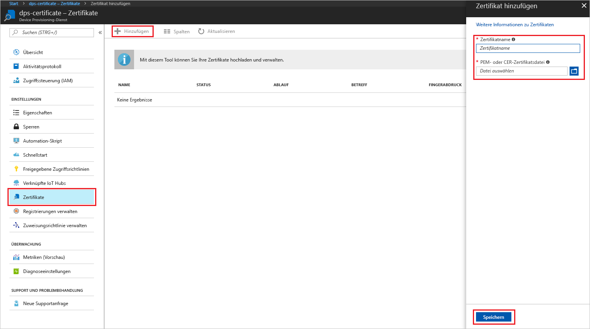
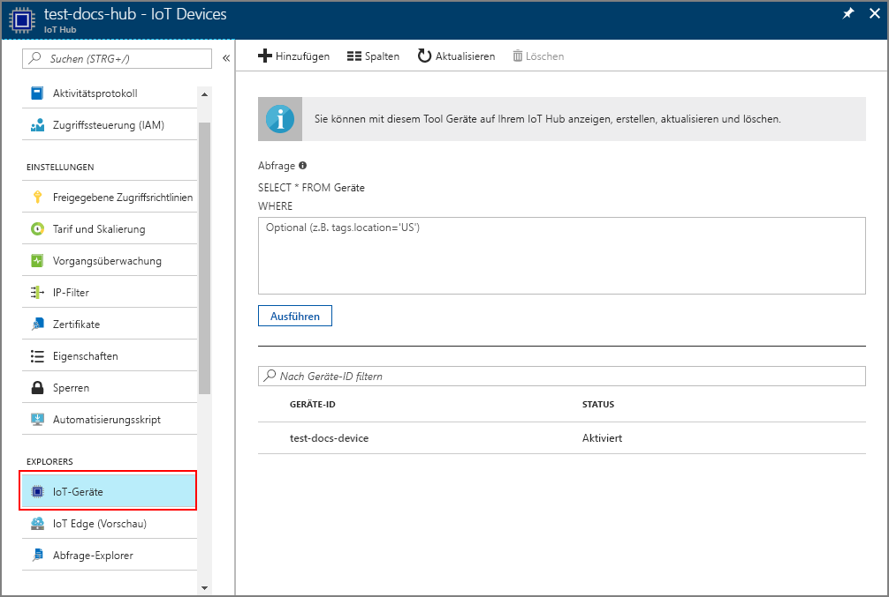

# <a name="create-and-provision-an-x509-simulated-device-using-nodejs-device-sdk-for-iot-hub-device-provisioning-service"></a>Erstellen und Bereitstellen eines simulierten X.509-Geräts mithilfe des Node.js-Geräte-SDK für den IoT Hub Device Provisioning-Dienst
[!INCLUDE [iot-dps-selector-quick-create-simulated-device-x509](../../includes/iot-dps-selector-quick-create-simulated-device-x509.md)]

Der IoT Hub Device Provisioning-Dienst ist ein Hilfsdienst für IoT Hub, mit dem Sie Geräte ohne manuelles Eingreifen auf dem IoT Hub bereitstellen können. Mit dem Device Provisioning-Dienst können Sie Millionen von Geräten auf sichere und skalierbare Weise bereitstellen.

Die Gerätebereitstellung umfasst zwei Schritte. Der erste Schritt ist das Erstellen des entsprechenden Registrierungseintrags im Device Provisioning-Dienst basierend auf den spezifischen Anforderungen der Lösung.  Der zweite Schritt ist das Herstellen einer Verbindung zwischen dem Gerät und dem Device Provisioning-Dienst und das Registrieren des Geräts beim IoT Hub. Nachdem beide Schritte abgeschlossen wurden, wird das Gerät als vollständig bereitgestellt angesehen. Mit dem Device Provisioning-Dienst werden beide Schritte automatisiert, sodass das Gerät nahtlos bereitgestellt wird. Weitere Informationen finden Sie unter [Konzepte beim IoT Hub Device Provisioning-Dienst](https://docs.microsoft.com/en-us/azure/iot-dps/concepts-service).

Diese Schritte zeigen, wie Sie im Device Provisioning-Dienst einen Registrierungseintrag erstellen, auf Ihrem Entwicklungscomputer ein X.509-Gerät simulieren, das simulierte Gerät mit dem Device Provisioning-Dienst verbinden und das Gerät per [Azure IoT Hub-Node.js-Geräte-SDK](https://github.com/Azure/azure-iot-sdk-node) auf Ihrem IoT Hub registrieren.

[!INCLUDE [IoT DPS basic](../../includes/iot-dps-basic.md)]

## <a name="prepare-the-environment"></a>Vorbereiten der Umgebung 

1. Führen Sie zunächst die Schritte unter [Einrichten des IoT Hub Device Provisioning-Diensts über das Azure-Portal](./quick-setup-auto-provision.md) aus, bevor Sie mit dieser Anleitung fortfahren.

1. Stellen Sie sicher, dass auf Ihrem Computer [Node.js v4.0 oder höher](https://nodejs.org) installiert ist.

1. Vergewissern Sie sich, dass [Git](https://git-scm.com/download/) auf Ihrem Computer installiert ist und den Umgebungsvariablen hinzugefügt wurde, auf die das Befehlsfenster Zugriff hat. 

1. Vergewissern Sie sich, dass [OpenSSL](https://www.openssl.org/) auf Ihrem Computer installiert ist und den Umgebungsvariablen hinzugefügt wurde, auf die das Befehlsfenster Zugriff hat. Diese Bibliothek kann entweder über die Quelle erstellt und installiert oder über einen [Drittanbieter](https://wiki.openssl.org/index.php/Binaries) (z.B. [hier](https://sourceforge.net/projects/openssl/)) heruntergeladen und installiert werden. 

    > [!NOTE]
    > Wenn Sie Ihre X.509-Zertifikate vom Typ _Stammzertifikat_, _Zwischenzertifikat_ bzw. _Untergeordnetes Zertifikat_ bereits erstellt haben, können Sie diesen und alle weiteren Schritte zur Zertifikaterstellung überspringen.
    >


## <a name="create-an-enrollment-entry"></a>Erstellen eines Registrierungseintrags

Bei einer Registrierung handelt es sich um den Datensatz der Geräte oder Gerätegruppen, die zu einem bestimmten Zeitpunkt im Device Provisioning-Dienst registriert und gespeichert werden können. Der Registrierungseintrag enthält die Informationen zum Gerät bzw. zur Gerätegruppe, z.B. Details zum X.509-Zertifikat, und zusätzliche Informationen zur Registrierung. Für den Device Provisioning-Dienst werden zwei Arten von Registrierungen unterstützt: _Individuelle Registrierung_ und _Registrierungsgruppe_. Weitere Informationen finden Sie unter [Registrierung](https://docs.microsoft.com/en-us/azure/iot-dps/concepts-service#enrollment).

Wenn Sie Ihre eigenen X.509-Testzertifikate erstellen, können Sie unter [Sicherheitskonzepte beim IoT Hub Device Provisioning-Dienst](https://docs.microsoft.com/en-us/azure/iot-dps/concepts-security#x509-certificates) nachsehen, welche Zertifikate Sie für Ihre Lösung benötigen. Ausführliche Informationen zur Implementierung finden Sie unter [Tools for the Azure IoT Device Provisioning Device SDK for Node.js](https://github.com/azure/azure-iot-sdk-node/tree/master/provisioning/tools) (Tools für das Azure IoT Device Provisioning-Geräte-SDK für Node.js).

1. Öffnen Sie eine Eingabeaufforderung. Klonen Sie das GitHub-Repository für die Codebeispiele:
    
    ```cmd/sh
    git clone https://github.com/Azure/azure-iot-sdk-node.git --recursive
    ```

1. Navigieren Sie zum Zertifikatgeneratorskript, und erstellen Sie das Projekt. 

    ```cmd/sh
    cd azure-iot-sdk-node/provisioning/tools
    npm install
    ```

1. Verwenden Sie abhängig von Ihrer Einrichtung eine der folgenden Methoden, um die Registrierungsinformationen zu erstellen:

    - **Individuelle Registrierung:**

        1. Erstellen Sie das untergeordnete Zertifikat (_leaf_), indem Sie das Skript mit Ihrem eigenen Zertifikatnamen (_certificate-name_) ausführen. Beachten Sie, dass der allgemeine Name des untergeordneten Zertifikats zur [Registrierungs-ID](https://docs.microsoft.com/en-us/azure/iot-dps/concepts-device#registration-id) wird. Achten Sie daher darauf, dass Sie nur Kleinbuchstaben, Zahlen und Bindestriche verwenden.

        ```cmd/sh
        node create_test_cert.js device {certificate-name}
        ```
         
        1. Öffnen Sie im **Azure**-Portal das Übersichtsblatt **Device Provisioning-Dienst**. Wählen Sie die Option **Registrierungen verwalten** und dann die Registerkarte **Individuelle Registrierungen**, und klicken Sie oben auf die Schaltfläche **Hinzufügen**. 

        1. Geben Sie unter **Add enrollment list entry** (Registrierungslisteneintrag hinzufügen) die folgenden Informationen ein:
            - Wählen Sie **X.509** als *Mechanismus* für den Nachweis der Identität.
            - Wählen Sie unter *PEM- oder CER-Zertifikatsdatei* die im vorherigen Schritt erstellte Zertifikatsdatei **_{certificate-name}\_cert.pem_** über das Widget *Datei-Explorer* aus.
            - Optional können Sie die folgenden Informationen angeben:
                - Wählen Sie einen IoT Hub aus, der mit Ihrem Bereitstellungsdienst verknüpft ist.
                - Geben Sie eine eindeutige Geräte-ID ein. Achten Sie darauf, dass Sie beim Benennen Ihres Geräts keine sensiblen Daten angeben. 
                - Aktualisieren Sie **Initial device twin state** (Anfänglicher Gerätezwillingsstatus) mit der gewünschten Anfangskonfiguration für das Gerät.
            - Klicken Sie abschließend auf die Schaltfläche **Speichern**. 

          

    Nach der erfolgreichen Registrierung wird Ihr X.509-Gerät als **{certificatename}** auf der Registerkarte *Individuelle Registrierungen* in der Spalte *Registrierungs-ID* angezeigt. Notieren Sie sich diesen Wert zur späteren Verwendung.

    - **Registrierungsgruppen:** 

        1. Erstellen Sie das Stammzertifikat (_root_), indem Sie das Skript mit Ihrem eigenen Stammnamen (_root-name_) ausführen.

        ```cmd/sh
        node create_test_cert.js root {root-name}
        ```

        1. Öffnen Sie im **Azure**-Portal das Übersichtsblatt **Device Provisioning-Dienst**. Wählen Sie die Option **Zertifikate**, und klicken Sie oben auf die Schaltfläche **Hinzufügen**.

        1. Geben Sie unter **Zertifikat hinzufügen** die folgenden Informationen ein:
            - Geben Sie einen eindeutigen Zertifikatnamen ein.
            - Wählen Sie die zuvor erstellte Datei **_{root-name}\_cert.pem_** aus.
            - Klicken Sie abschließend auf die Schaltfläche **Speichern**.

        

        1. Wählen Sie das neu erstellte Zertifikat aus:
            - Klicken Sie auf **Prüfcode generieren**. Kopieren Sie den generierten Code.
            - Erstellen Sie das Verifizierungszertifikat (_verification_). Geben Sie den _Prüfcode_ ein, oder klicken Sie mit der rechten Maustaste, um Ihr ausgeführtes Node-Skriptfenster mit dem folgenden Befehl einzufügen:

                ```cmd/sh
                node create_test_cert.js verification {rootname_cert} {verification code}
                ```

            - Wählen Sie unter *PEM- oder CER-Verifizierungszertifikatsdatei* die in den vorherigen Schritten erstellte Zertifikatsdatei **_verification_cert.pem_** über das Widget *Datei-Explorer* aus. Klicken Sie auf **Überprüfen**.

            

        1. Klicken Sie auf **Registrierungen verwalten**. Klicken Sie auf der Registerkarte **Registrierungsgruppen** im oberen Bereich auf die Schaltfläche **Hinzufügen**.
            - Geben Sie einen eindeutigen Gruppennamen ein.
            - Wählen Sie den eindeutigen Zertifikatnamen aus, den Sie zuvor erstellt haben.
            - Optional können Sie die folgenden Informationen angeben:
                - Wählen Sie einen IoT Hub aus, der mit Ihrem Bereitstellungsdienst verknüpft ist.
                - Aktualisieren Sie **Initial device twin state** (Anfänglicher Gerätezwillingsstatus) mit der gewünschten Anfangskonfiguration für das Gerät.

        

        Nach erfolgreicher Registrierung wird die X.509-Gerätegruppe auf der Registerkarte *Registrierungsgruppen* in der Spalte *Gruppenname* angezeigt. Notieren Sie sich diesen Wert zur späteren Verwendung.

        1. Erstellen Sie das untergeordnete Zertifikat (_leaf_), indem Sie das Skript mit Ihrem eigenen _certificate-name_ gefolgt vom zuvor verwendeten _root-name_ ausführen. Der allgemeine Name des untergeordneten Zertifikats wird zur [Registrierungs-ID](https://docs.microsoft.com/en-us/azure/iot-dps/concepts-device#registration-id). Achten Sie daher darauf, dass Sie nur Kleinbuchstaben, Zahlen und Bindestriche verwenden.

            ```cmd/sh
            node create_test_cert.js device {certificate-name} {root-name}
            ```

        > [!NOTE]
        > Sie können auch Zwischenzertifikate (_intermediate_) erstellen, indem Sie `node create_test_cert.js intermediate {certificate-name} {parent-name}` verwenden. Achten Sie lediglich darauf, dass Sie das untergeordnete Zertifikat (_leaf_) im letzten Schritt erstellen, indem Sie das letzte Zwischenzertifikat (_intermediate_) als Stamm bzw. übergeordnetes Element verwenden. Weitere Informationen finden Sie unter [Steuern des Gerätezugriffs auf den Bereitstellungsdienst mit X.509-Zertifikaten](https://docs.microsoft.com/en-us/azure/iot-dps/concepts-security#controlling-device-access-to-the-provisioning-service-with-x509-certificates).
        >


## <a name="simulate-the-device"></a>Simulieren des Geräts

Die Verwendung des [Node.js-Geräte-SDK für Azure IoT Hub](https://github.com/Azure/azure-iot-sdk-node) ist eine einfache Möglichkeit zum Simulieren eines Geräts. Weitere Informationen finden Sie unter [Konzepte für Geräte mit dem IoT Hub Device Provisioning-Dienst](https://docs.microsoft.com/en-us/azure/iot-dps/concepts-device).

1. Navigieren Sie im Azure-Portal zum Blatt **Übersicht** für Ihren Device Provisioning-Dienst, und notieren Sie sich die Werte für **_Global device endpoint_** (Globaler Geräteendpunkt) und **_ID Scope_** (ID-Bereich).

     

1. Kopieren Sie Ihr _Zertifikat_ und den _Schlüssel_ in den Beispielordner.

    ```cmd/sh
    copy .\{certificate-name}_cert.pem ..\device\samples\{certificate-name}_cert.pem
    copy .\{certificate-name}_key.pem ..\device\samples\{certificate-name}_key.pem
    ```

1. Navigieren Sie zum Gerätetestskript, und erstellen Sie das Projekt. 

    ```cmd/sh
    cd ..\device\samples
    npm install
    ```

1. Bearbeiten Sie die Datei **register\_x509.js**. Speichern Sie die Datei, nachdem Sie die folgenden Änderungen vorgenommen haben.
    - Ersetzen Sie `provisioning host` durch den **_Globalen Geräteendpunkt_** aus **Schritt 1** oben.
    - Ersetzen Sie `id scope` durch den **_ID-Bereich_** aus **Schritt 1** oben. 
    - Ersetzen Sie `reigstration id` durch die **_Registrierungs-ID_** oder den **_Gruppennamen_** aus dem vorherigen Abschnitt.
    - Ersetzen Sie `cert filename` und `key filename` durch die Dateien, die Sie oben in **Schritt 2** kopiert haben. 

1. Führen Sie das Skript aus, und stellen Sie sicher, dass das Gerät erfolgreich bereitgestellt wurde.

    ```cmd/sh
    node register_x509.js
    ```   

1. Navigieren Sie im Portal zu der mit Ihrem Bereitstellungsdienst verknüpften IoT Hub-Instanz, und öffnen Sie das Blatt **IoT-Geräte**. Nach erfolgreicher Bereitstellung des simulierten X.509-Geräts auf dem Hub wird die dazugehörige Geräte-ID auf dem Blatt **IoT-Geräte** angezeigt, und der *STATUS* lautet **Aktiviert**. Falls das Blatt bereits vor dem Ausführen der Beispielgeräteanwendung geöffnet war, müssen Sie unter Umständen im oberen Bereich auf die Schaltfläche **Aktualisieren** klicken. 

     

    Wenn Sie den *anfänglichen Gerätezwillingsstatus* im Registrierungseintrag für Ihr Gerät gegenüber dem Standardwert geändert haben, kann der gewünschte Zwillingsstatus vom Hub abgerufen werden, und es können entsprechende Aktionen durchgeführt werden. Weitere Informationen finden Sie unter [Verstehen und Verwenden von Gerätezwillingen in IoT Hub](../iot-hub/iot-hub-devguide-device-twins.md).


## <a name="clean-up-resources"></a>Bereinigen von Ressourcen

Wenn Sie das Geräteclientbeispiel weiter verwenden und erkunden möchten, überspringen Sie die Bereinigung der in dieser Schnellstartanleitung erstellten Ressourcen. Falls Sie nicht fortfahren möchten, führen Sie die folgenden Schritte aus, um alle erstellten Ressourcen zu löschen, die im Rahmen dieser Schnellstartanleitung erstellt wurden:

1. Schließen Sie auf Ihrem Computer das Ausgabefenster des Geräteclientbeispiels.
1. Klicken Sie im Azure-Portal im Menü auf der linken Seite auf **Alle Ressourcen**, und wählen Sie Ihren Device Provisioning-Dienst aus. Öffnen Sie das Blatt **Registrierungen verwalten** für Ihren Dienst, und klicken Sie dann auf die Registerkarte **Individuelle Registrierungen** oder **Registrierungsgruppen**. Wählen Sie die *REGISTRIERUNGS-ID* oder den *GRUPPENNAMEN* des Geräts aus, das Sie in dieser Schnellstartanleitung registriert haben, und klicken Sie im oberen Bereich auf die Schaltfläche **Löschen**. 
1. Klicken Sie im Azure-Portal im Menü auf der linken Seite auf **Alle Ressourcen**, und wählen Sie Ihre IoT Hub-Instanz aus. Öffnen Sie das Blatt **IoT-Geräte** für Ihren Hub, wählen Sie die *GERÄTE-ID* des Geräts aus, die Sie in dieser Schnellstartanleitung registriert haben, und klicken Sie dann im oberen Bereich auf **Löschen**.


## <a name="next-steps"></a>Nächste Schritte

In dieser Schnellstartanleitung haben Sie ein simuliertes X.509-Gerät erstellt und es mithilfe des Azure IoT Hub Device Provisioning-Diensts im Portal für Ihre IoT Hub-Instanz bereitgestellt. Informationen zum programmgesteuerten Registrieren Ihres X.509-Geräts finden Sie in der Schnellstartanleitung für die programmgesteuerte Registrierung von X.509-Geräten. 

> [!div class="nextstepaction"]
> [Registrieren von X.509-Geräten für den Azure IoT Hub Device Provisioning-Dienst per Java-Dienst-SDK](quick-enroll-device-x509-node.md)
