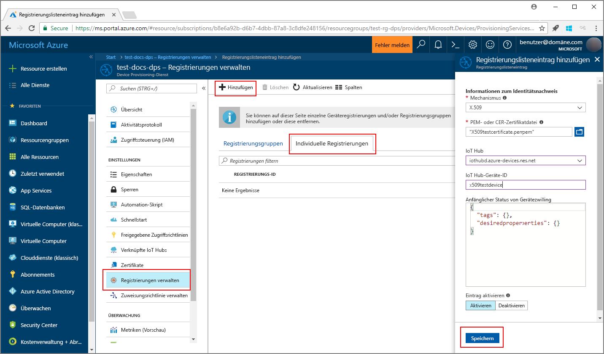
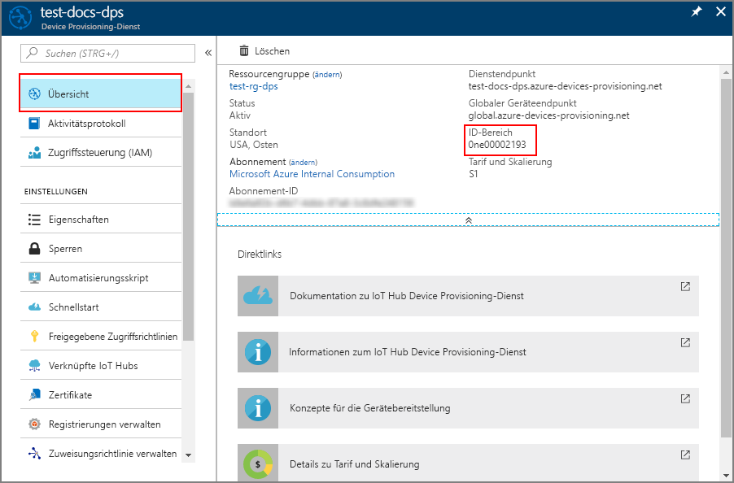
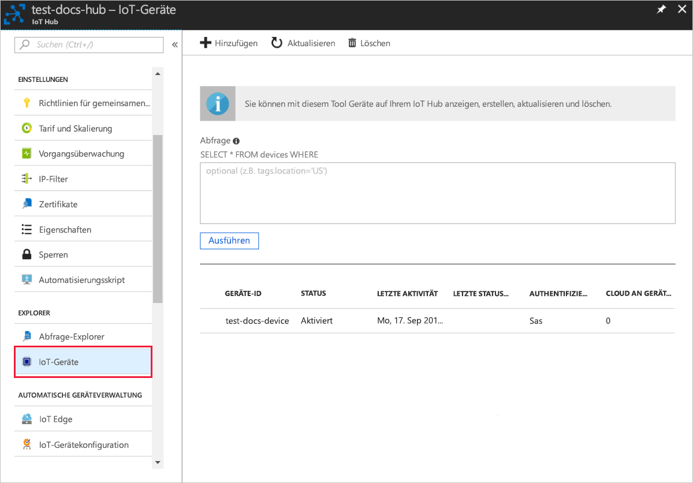

# <a name="create-and-provision-an-x509-simulated-device-using-iot-hub-device-provisioning-service-preview"></a>Erstellen und Bereitstellen eines simulierten X.509-Geräts mithilfe des IoT Hub Device Provisioning-Diensts (Vorschauversion)
> [!div class="op_single_selector"]
> * [TPM](quick-create-simulated-device.md)
> * [X.509](quick-create-simulated-device-x509.md)

Mit diesen Schritten wird veranschaulicht, wie Sie ein X.509-Gerät auf Ihrem Entwicklungscomputer mit Windows-Betriebssystem simulieren und ein Codebeispiel verwenden, um für dieses simulierte Gerät eine Verbindung mit dem Device Provisioning-Dienst und Ihrem IoT Hub herzustellen. 

Führen Sie zunächst die Schritte unter [Set up the IoT Hub Device Provisioning Service (preview) with the Azure portal](./quick-setup-auto-provision.md) (Einrichten des IoT Hub Device Provisioning-Diensts (Vorschauversion) über das Azure-Portal) aus, bevor Sie mit diesem Artikel fortfahren.

<a id="setupdevbox"></a>
## <a name="prepare-the-development-environment"></a>Vorbereiten der Entwicklungsumgebung 

1. Vergewissern Sie sich, dass auf Ihrem Computer entweder Visual Studio 2015 oder [Visual Studio 2017](https://www.visualstudio.com/vs/) installiert ist. Für die Visual Studio-Installation muss die Workload „Desktopentwicklung mit C++“ aktiviert sein.

2. Laden Sie das [CMake-Buildsystem](https://cmake.org/download/) herunter, und installieren Sie es.

3. Vergewissern Sie sich, dass `git` auf Ihrem Computer installiert ist und den Umgebungsvariablen hinzugefügt wurde, auf die das Befehlsfenster Zugriff hat. Unter [Git-Clienttools von Software Freedom Conservancy](https://git-scm.com/download/) finden Sie die neueste Version der zu installierenden `git`-Tools. Hierzu zählt auch die Befehlszeilen-App **Git Bash**, über die Sie mit Ihrem lokalen Git-Repository interagieren können. 

4. Öffnen Sie eine Eingabeaufforderung oder Git Bash. Klonen Sie das GitHub-Repository mit dem Codebeispiel für die Gerätesimulation:
    
    ```cmd/sh
    git clone https://github.com/Azure/azure-iot-sdk-c.git --recursive
    ```

5. Erstellen Sie in Ihrer lokalen Kopie des GitHub-Repositorys einen Ordner für den CMake-Buildprozess. 

    ```cmd/sh
    cd azure-iot-sdk-c
    mkdir cmake
    cd cmake
    ```

6. Führen Sie den folgenden Befehl aus, um die Visual Studio-Lösung für den Bereitstellungsclient zu erstellen.

    ```cmd/sh
    cmake -Duse_prov_client:BOOL=ON ..
    ```


## <a name="create-a-device-enrollment-entry-in-the-device-provisioning-service"></a>Erstellen eines Geräteregistrierungseintrags im Device Provisioning-Dienst

1. Öffnen Sie die im Ordner *cmake* generierte Projektmappe `azure_iot_sdks.sln`, und erstellen Sie sie in Visual Studio.

2. Klicken Sie mit der rechten Maustaste auf das Projekt **dice\_device\_enrollment** im Ordner **Provision\_Samples**, und wählen Sie die Option **Als Startprojekt festlegen**. Führen Sie die Lösung aus. Geben Sie im Ausgabefenster `i` für die individuelle Registrierung ein, wenn die Aufforderung angezeigt wird. Im Ausgabefenster wird ein lokal generiertes X.509-Zertifikat für Ihr simuliertes Gerät angezeigt. Kopieren Sie die Ausgabe zwischen *-----BEGIN CERTIFICATE-----* und *-----END PUBLIC KEY-----* in die Zwischenablage, und achten Sie darauf, dass auch diese Anfangs- bzw. Endzeile enthalten ist. 
 
3. Erstellen Sie eine Datei mit dem Namen **_X509testcertificate.pem_** auf Ihrem Windows-Computer, öffnen Sie sie in einem Editor Ihrer Wahl, und kopieren Sie den Inhalt der Zwischenablage in diese Datei. Speichern Sie die Datei. 

4. Melden Sie sich am Azure-Portal an, klicken Sie im Menü auf der linken Seite auf die Schaltfläche **Alle Ressourcen**, und öffnen Sie Ihren Provisioning-Dienst.

4. Wählen Sie auf dem Zusammenfassungsblatt des Device Provisioning-Diensts die Option **Registrierungen verwalten** aus. Klicken Sie auf der Registerkarte **Individual Enrollments** (Individuelle Registrierungen) im oberen Bereich auf die Schaltfläche **Hinzufügen**. 

5. Geben Sie unter **Add enrollment list entry** (Registrierungslisteneintrag hinzufügen) die folgenden Informationen ein:
    - Wählen Sie **X.509** als *Mechanismus* für den Nachweis der Identität.
    - Wählen Sie unter *PEM- oder CER-Zertifikatsdatei* die im vorherigen Schritt erstellte Zertifikatsdatei **_X509testcertificate.pem_** aus, indem Sie das Widget *Datei-Explorer* verwenden.
    - Optional können Sie die folgenden Informationen angeben:
        - Wählen Sie einen IoT Hub aus, der mit Ihrem Bereitstellungsdienst verknüpft ist.
        - Geben Sie eine eindeutige Geräte-ID ein. Achten Sie darauf, dass Sie beim Benennen Ihres Geräts keine sensiblen Daten angeben. 
        - Aktualisieren Sie **Initial device twin state** (Anfänglicher Gerätezwillingsstatus) mit der gewünschten Anfangskonfiguration für das Gerät.
    - Klicken Sie abschließend auf die Schaltfläche **Speichern**. 

      

   Nach der erfolgreichen Registrierung wird Ihr X.509-Gerät als **riot-device-cert**auf der Registerkarte *Individuelle Registrierungen* in der Spalte *Registrierungs-ID* angezeigt. 


<a id="firstbootsequence"></a>
## <a name="simulate-first-boot-sequence-for-the-device"></a>Simulieren der ersten Startsequenz für das Gerät

1. Navigieren Sie im Azure-Portal zum Blatt **Übersicht** für Ihren Device Provisioning-Dienst, und notieren Sie sich den Wert unter **_ID-Bereich_**.

     

2. Navigieren Sie in Visual Studio auf Ihrem Computer zum Beispielprojekt mit dem Namen **prov\_dev\_client\_sample** im Ordner **Provision\_Samples**, und öffnen Sie die Datei **prov\_dev\_client\_sample.c**.

3. Weisen Sie den Wert für _ID Scope_ (ID-Bereich) der Variablen `scope_id` zu. 

    ```c
    static const char* scope_id = "[ID Scope]";
    ```

4. Klicken Sie mit der rechten Maustaste auf das Projekt **prov\_dev\_client\_sample**, und wählen Sie **Als Startprojekt festlegen** aus. Führen Sie das Beispiel aus. Beachten Sie die Nachrichten, die den Start und die Verbindungsherstellung des Geräts mit dem Device Provisioning-Dienst simulieren, um Ihre IoT Hub-Informationen abzurufen. Suchen Sie nach einer Nachricht mit einem Hinweis zur erfolgreichen Registrierung beim Hub: *Registration Information received from service: yourhuburl!* (Registrierungsinformationen vom Dienst empfangen: ihre_hub-url!). Schließen Sie das Fenster, wenn die Aufforderung angezeigt wird.

5. Navigieren Sie im Portal zu dem IoT Hub, der mit Ihrem Provisioning-Dienst verknüpft ist, und öffnen Sie das Blatt **Device Explorer**. Nach der erfolgreichen Bereitstellung des simulierten X.509-Geräts auf dem Hub wird die dazugehörige Geräte-ID auf dem Blatt **Device Explorer** mit dem *STATUS* **Aktiviert** angezeigt. Beachten Sie, dass Sie unter Umständen oben auf die Schaltfläche **Aktualisieren** klicken müssen, wenn Sie das Blatt bereits vor dem Ausführen der Beispielgeräteanwendung geöffnet haben. 

     

> [!NOTE]
> Wenn Sie den *anfänglichen Gerätezwillingsstatus* im Registrierungseintrag für Ihr Gerät gegenüber dem Standardwert geändert haben, kann der gewünschte Zwillingsstatus vom Hub abgerufen werden, und es können entsprechende Aktionen durchgeführt werden. Weitere Informationen finden Sie unter [Verstehen und Verwenden von Gerätezwillingen in IoT Hub](../iot-hub/iot-hub-devguide-device-twins.md).
>


## <a name="clean-up-resources"></a>Bereinigen von Ressourcen

Wenn Sie das Geräteclientbeispiel weiter verwenden und erkunden möchten, überspringen Sie die Bereinigung der in dieser Schnellstartanleitung erstellten Ressourcen. Falls Sie nicht fortfahren möchten, führen Sie die folgenden Schritte aus, um alle erstellten Ressourcen zu löschen, die im Rahmen dieser Schnellstartanleitung erstellt wurden:

1. Schließen Sie auf Ihrem Computer das Ausgabefenster des Geräteclientbeispiels.
1. Klicken Sie im Azure-Portal im Menü auf der linken Seite auf **Alle Ressourcen**, und wählen Sie Ihren Device Provisioning-Dienst aus. Klicken Sie im oberen Bereich des Blatts **Alle Ressourcen** auf **Löschen**.  
1. Klicken Sie im Azure-Portal im Menü auf der linken Seite auf **Alle Ressourcen**, und wählen Sie Ihre IoT Hub-Instanz aus. Klicken Sie im oberen Bereich des Blatts **Alle Ressourcen** auf **Löschen**.  

## <a name="next-steps"></a>Nächste Schritte

In dieser Schnellstartanleitung haben Sie auf Ihrem Windows-Computer ein simuliertes X.509-Gerät erstellt und es mithilfe des Device Provisioning-Diensts von Azure IoT Hub für Ihre IoT Hub-Instanz bereitgestellt. Ausführlichere Informationen zur Gerätebereitstellung finden Sie im Tutorial zur Einrichtung des Device Provisioning-Diensts über das Azure-Portal. 

> [!div class="nextstepaction"]
> [Tutorials für den Azure IoT Hub Device Provisioning-Dienst](./tutorial-set-up-cloud.md)
