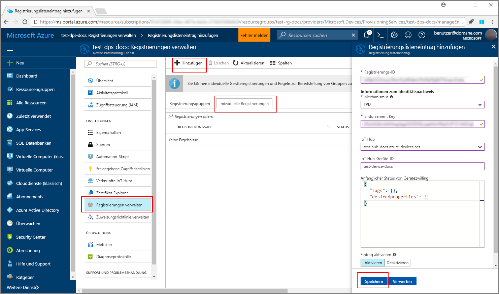
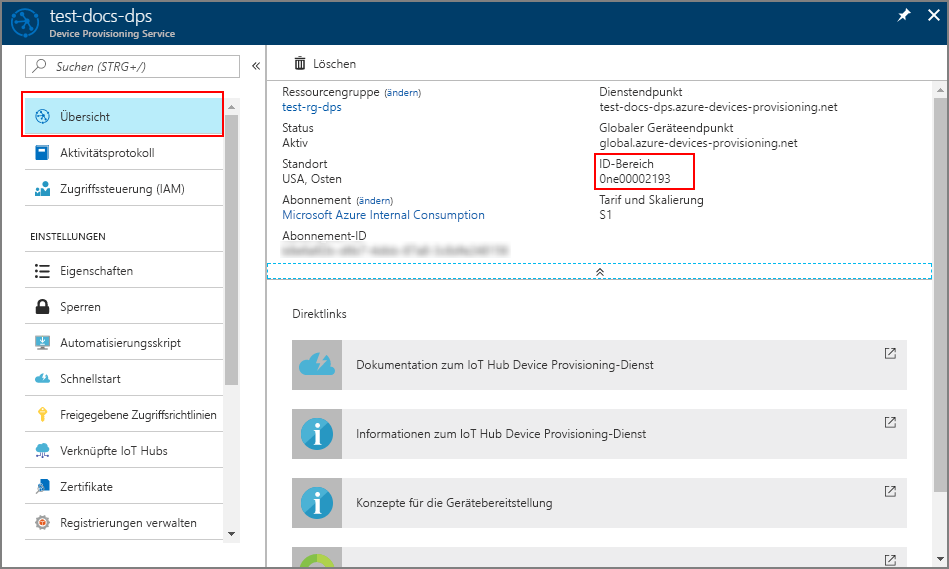

# <a name="quickstart-provision-a-simulated-tpm-device-using-the-azure-iot-c-sdk"></a>Schnellstart: Bereitstellen eines simulierten TPM-Geräts mithilfe des Azure IoT C SDK

[!INCLUDE [iot-dps-selector-quick-create-simulated-device-tpm](../../includes/iot-dps-selector-quick-create-simulated-device-tpm.md)]

In dieser Schnellstartanleitung erfahren Sie, wie Sie einen TPM-Gerätesimulator (Trusted Platform Module) auf einem Windows-Entwicklungscomputer erstellen und ausführen. Sie verbinden dieses simulierte Gerät mit einem IoT Hub über eine Instanz des Device Provisioning-Diensts. Zur Registrieren des Geräts bei einer Instanz des Device Provisioning-Diensts zum Simulieren einer Startsequenz für das Gerät wird Beispielcode aus dem [Azure IoT C SDK](https://github.com/Azure/azure-iot-sdk-c) verwendet.

Sollten Sie mit der automatischen Bereitstellung nicht vertraut sein, lesen Sie die Informationen unter [Konzepte für die automatische Bereitstellung](concepts-auto-provisioning.md). Vergewissern Sie sich außerdem, dass Sie die Schritte unter [Einrichten des IoT Hub Device Provisioning-Diensts über das Azure-Portal](./quick-setup-auto-provision.md) ausgeführt haben, bevor Sie mit dieser Schnellstartanleitung fortfahren. 

In Azure IoT Device Provisioning Service werden zwei Registrierungsarten unterstützt:
- [Registrierungsgruppen:](concepts-service.md#enrollment-group) Werden zum Registrieren mehrerer verwandter Geräte verwendet.
- [Individuelle Registrierungen](concepts-service.md#individual-enrollment): Werden zum Registrieren eines einzelnen Geräts verwendet.

In diesem Artikel werden individuelle Registrierungen veranschaulicht.

[!INCLUDE [quickstarts-free-trial-note](../../includes/quickstarts-free-trial-note.md)]

## <a name="prerequisites"></a>Voraussetzungen

* [Visual Studio](https://visualstudio.microsoft.com/vs/) 2015 oder höher mit aktivierter Workload [Desktopentwicklung mit C++](https://www.visualstudio.com/vs/support/selecting-workloads-visual-studio-2017/).
* Die neueste Version von [Git](https://git-scm.com/download/) ist installiert.


<a id="setupdevbox"></a>

## <a name="prepare-a-development-environment-for-the-azure-iot-c-sdk"></a>Vorbereiten einer Entwicklungsumgebung für das Azure IoT C SDK

In diesem Abschnitt bereiten Sie eine Entwicklungsumgebung vor, die zum Erstellen des [Azure IoT C SDK](https://github.com/Azure/azure-iot-sdk-c) und des [TPM](https://docs.microsoft.com/windows/device-security/tpm/trusted-platform-module-overview)-Beispiels verwendet wird.

1. Laden Sie das [CMake-Buildsystem](https://cmake.org/download/) herunter.

    Wichtig: Die Voraussetzungen für Visual Studio (Visual Studio und die Workload „Desktopentwicklung mit C++“) müssen **vor** Beginn der Installation von `CMake` auf dem Computer installiert sein. Sobald die Voraussetzungen erfüllt sind und der Download überprüft wurde, installieren Sie das CMake-Buildsystem.

2. Öffnen Sie eine Eingabeaufforderung oder die Git Bash-Shell. Führen Sie den folgenden Befehl zum Klonen des [Azure IoT C SDK](https://github.com/Azure/azure-iot-sdk-c)-GitHub-Repositorys aus:
    
    ```cmd/sh
    git clone https://github.com/Azure/azure-iot-sdk-c.git --recursive
    ```
    Sie sollten damit rechnen, dass die Ausführung dieses Vorgangs mehrere Minuten in Anspruch nimmt.


3. Erstellen Sie ein `cmake`-Unterverzeichnis im Stammverzeichnis des Git-Repositorys, und navigieren Sie zu diesem Ordner. 

    ```cmd/sh
    cd azure-iot-sdk-c
    mkdir cmake
    cd cmake
    ```

## <a name="build-the-sdk-and-run-the-tpm-device-simulator"></a>Erstellen des SDK und Ausführen des TPM-Gerätesimulators

In diesem Abschnitt erstellen Sie das Azure IoT C SDK, das den TPM-Gerätesimulator-Beispielcode enthält. Dieses Beispiel stellt einen TPM-[Nachweismechanismus](concepts-security.md#attestation-mechanism) über SAS-Tokenauthentifizierung (Shared Access Signature) bereit.

1. Führen Sie aus dem Unterverzeichnis `cmake`, das Sie im Git-Repository „azure-iot-sdk-c“ erstellt haben, den folgenden Befehl zum Erstellen des Beispiels aus. Von diesem Build-Befehl wird außerdem eine Visual Studio-Projektmappe für das simulierte Gerät generiert.

    ```cmd/sh
    cmake -Duse_prov_client:BOOL=ON -Duse_tpm_simulator:BOOL=ON ..
    ```

    Falls `cmake` Ihren C++-Compiler nicht findet, treten beim Ausführen des obigen Befehls unter Umständen Buildfehler auf. Führen Sie den Befehl in diesem Fall an der [Visual Studio-Eingabeaufforderung](https://docs.microsoft.com/dotnet/framework/tools/developer-command-prompt-for-vs) aus. 

    Nach erfolgreicher Erstellung ähneln die letzten Ausgabezeilen der folgenden Ausgabe:

    ```cmd/sh
    $ cmake -Duse_prov_client:BOOL=ON -Duse_tpm_simulator:BOOL=ON ..
    -- Building for: Visual Studio 15 2017
    -- Selecting Windows SDK version 10.0.16299.0 to target Windows 10.0.17134.
    -- The C compiler identification is MSVC 19.12.25835.0
    -- The CXX compiler identification is MSVC 19.12.25835.0

    ...

    -- Configuring done
    -- Generating done
    -- Build files have been written to: E:/IoT Testing/azure-iot-sdk-c/cmake
    ```

2. Navigieren Sie zum Stammordner des Git-Repositorys, das Sie geklont haben, und führen Sie den [TPM](https://docs.microsoft.com/windows/device-security/tpm/trusted-platform-module-overview)-Simulator mit dem unten gezeigten Pfad aus. Dieser Simulator lauscht über einen Socket an den Ports 2321 und 2322. Lassen Sie das Befehlsfenster geöffnet. Es wird benötigt, um den Simulator bis zum Ende dieser Schnellstartanleitung auszuführen. 

   Wenn Sie sich im Ordner *cmake* befinden, führen Sie die folgenden Befehle aus:

    ```cmd/sh
    cd ..
    .\provisioning_client\deps\utpm\tools\tpm_simulator\Simulator.exe
    ```

    Es wird keine Ausgabe des Simulators angezeigt. Lassen Sie Ihn mit der Ausführung der Simulation eines TPM-Geräts fortfahren.

<a id="simulatetpm"></a>

## <a name="read-cryptographic-keys-from-the-tpm-device"></a>Lesen kryptografischer Schlüssel vom TPM-Gerät

In diesem Abschnitt werden Sie ein Beispiel erstellen und ausführen, das den Endorsement Key und die Registrierungs-ID aus dem TPM-Simulator liest, der weiterhin ausgeführt wird und über die Ports 2321 und 2322 lauscht. Diese Werte werden für die Geräteregistrierung bei Ihrer Instanz des Device Provisioning-Diensts verwendet.

1. Starten Sie Visual Studio, und öffnen Sie die neue Projektmappendatei namens `azure_iot_sdks.sln`. Diese Projektmappendatei befindet sich im `cmake`-Ordner, den Sie zuvor im Stammverzeichnis des azure-iot-sdk-c-Git-Repositorys erstellt haben.

2. Wählen Sie im Visual Studio-Menü die Option **Erstellen** > **Projektmappe erstellen** aus, um alle Projekte in der Projektmappe zu erstellen.

3. Navigieren Sie im Visual Studio-Fenster *Projektmappen-Explorer* zum Ordner **Provision\_Tools**. Klicken Sie mit der rechten Maustaste auf das Projekt **tpm_device_provision**, und wählen Sie **Als Startprojekt festlegen** aus. 

4. Wählen Sie im Visual Studio-Menü die Option **Debuggen** > **Starten ohne Debugging** aus, um die Projektmappe auszuführen. Von der App wird eine **_Registrierungs-ID_** und ein **_Endorsement Key_** gelesen und angezeigt. Kopieren Sie diese Werte. Sie werden im nächsten Abschnitt für die Geräteregistrierung verwendet. 


<a id="portalenrollment"></a>

## <a name="create-a-device-enrollment-entry-in-the-portal"></a>Erstellen eines Geräteregistrierungseintrags im Portal

1. Melden Sie sich beim Azure-Portal an, klicken Sie im Menü auf der linken Seite auf die Schaltfläche **Alle Ressourcen**, und öffnen Sie Ihren Device Provisioning-Dienst.

2. Wählen Sie die Registerkarte **Registrierungen verwalten** aus, und klicken Sie dann oben auf die Schaltfläche **Individuelle Registrierung hinzufügen**. 

3. Geben Sie unter **Registrierung hinzufügen** die folgenden Informationen ein, und klicken Sie auf die Schaltfläche **Speichern**.

    - **Mechanismus**: Wählen Sie **TPM** als *Mechanismus* für den Nachweis der Identität.
    - **Endorsement Key:** Geben Sie den *Endorsement Key* ein, der für Ihr TPM-Gerät durch Ausführen des Projekts *tpm_device_provision* generiert wurde.
    - **Registrierungs-ID:** Geben Sie die *Registrierungs-ID* ein, die für Ihr TPM-Gerät durch Ausführen des Projekts *tpm_device_provision* generiert wurde.
    - **IoT Edge-Gerät:** Wählen Sie **Deaktivieren** aus.
    - **IoT Hub-Geräte-ID**: Geben Sie **test-docs-device** ein, um dem Gerät eine ID zuzuweisen.

        

      Nach erfolgreicher Registrierung wird die *Registrierungs-ID* Ihres Geräts in der Liste auf der Registerkarte *Individual Enrollments* (Individuelle Registrierungen) angezeigt. 


<a id="firstbootsequence"></a>

## <a name="simulate-first-boot-sequence-for-the-device"></a>Simulieren der ersten Startsequenz für das Gerät

In diesem Abschnitt Konfigurieren Sie Beispielcode zum Verwenden von [Advanced Message Queuing Protocol (AMQP)](https://wikipedia.org/wiki/Advanced_Message_Queuing_Protocol), um die Startsequenz des Geräts an Ihre Instanz des Device Provisioning-Diensts zu senden. Diese Startsequenz bewirkt, dass das Gerät, die erkannt und einem mit der Instanz des Device Provisioning-Diensts verknüpften IoT Hub zugewiesen wird.

1. Navigieren Sie im Azure-Portal zur Registerkarte **Übersicht** für Ihren Device Provisioning-Dienst, und kopieren Sie den Wert unter **_ID-Bereich_** .

     

2. Navigieren Sie im Visual Studio-Fenster *Projektmappen-Explorer* zum Ordner **Provision\_Samples**. Erweitern Sie das Beispielprojekt mit dem Namen **prov\_dev\_client\_sample**. Erweitern Sie **Quelldateien**, und öffnen Sie **prov\_dev\_client\_sample.c**.

3. Suchen Sie im oberen Bereich der Datei die `#define`-Anweisungen für jedes Geräteprotokoll, wie unten dargestellt. Stellen Sie sicher, dass nur `SAMPLE_AMQP` auskommentiert wurde.

    Derzeit wird das [MQTT-Protokoll nicht für die individuelle TPM-Registrierung unterstützt](https://github.com/Azure/azure-iot-sdk-c#provisioning-client-sdk).

    ```c
    //
    // The protocol you wish to use should be uncommented
    //
    //#define SAMPLE_MQTT
    //#define SAMPLE_MQTT_OVER_WEBSOCKETS
    #define SAMPLE_AMQP
    //#define SAMPLE_AMQP_OVER_WEBSOCKETS
    //#define SAMPLE_HTTP
    ```

4. Suchen Sie die Konstante `id_scope`, und ersetzen Sie den Wert durch Ihren **ID-Bereich**-Wert, den Sie zuvor kopiert haben. 

    ```c
    static const char* id_scope = "0ne00002193";
    ```

5. Suchen Sie die Definition für die Funktion `main()` in der gleichen Datei. Stellen Sie sicher, dass die Variable `hsm_type` wie unten dargestellt auf `SECURE_DEVICE_TYPE_TPM` anstelle von `SECURE_DEVICE_TYPE_X509` festgelegt ist.

    ```c
    SECURE_DEVICE_TYPE hsm_type;
    hsm_type = SECURE_DEVICE_TYPE_TPM;
    //hsm_type = SECURE_DEVICE_TYPE_X509;
    ```

6. Klicken Sie mit der rechten Maustaste auf das Projekt **prov\_dev\_client\_sample**, und wählen Sie **Als Startprojekt festlegen** aus. 

7. Wählen Sie im Visual Studio-Menü die Option **Debuggen** > **Starten ohne Debugging** aus, um die Projektmappe auszuführen. Klicken Sie in der Eingabeaufforderung zum Neuerstellen des Projekts auf **Ja**, um das Projekt vor der Ausführung neu zu erstellen.

    Die folgende Ausgabe ist ein Beispiel dafür, wie der Gerätebereitstellungsclient erfolgreich hochfährt und sich mit einer Instanz des Device Provisioning-Diensts verbindet, um IoT Hub-Informationen zu erhalten und sich zu registrieren:

    ```cmd
    Provisioning API Version: 1.2.7
    Provisioning Status: PROV_DEVICE_REG_STATUS_CONNECTED

    Registering... Press enter key to interrupt.

    Provisioning Status: PROV_DEVICE_REG_STATUS_CONNECTED
    Provisioning Status: PROV_DEVICE_REG_STATUS_ASSIGNING
    Provisioning Status: PROV_DEVICE_REG_STATUS_ASSIGNING

    Registration Information received from service:
    test-docs-hub.azure-devices.net, deviceId: test-docs-device
    ```

8. Nachdem das simulierte Gerät von Ihrem Bereitstellungsdienst dem IoT Hub bereitgestellt wurde, wird die Geräte-ID unter **IoT-Geräte** des Hubs angezeigt. 

     


## <a name="clean-up-resources"></a>Bereinigen von Ressourcen

Wenn Sie das Geräteclientbeispiel weiter verwenden und erkunden möchten, überspringen Sie die Bereinigung der in dieser Schnellstartanleitung erstellten Ressourcen. Falls Sie nicht fortfahren möchten, führen Sie die folgenden Schritte aus, um alle erstellten Ressourcen zu löschen, die im Rahmen dieser Schnellstartanleitung erstellt wurden:

1. Schließen Sie auf Ihrem Computer das Ausgabefenster des Geräteclientbeispiels.
2. Schließen Sie auf Ihrem Computer das TPM-Simulatorfenster.
3. Klicken Sie im Azure-Portal im Menü auf der linken Seite auf **Alle Ressourcen**, und wählen Sie Ihren Device Provisioning-Dienst aus. Öffnen Sie **Registrierungen verwalten** für Ihren Dienst, und klicken Sie dann auf die Registerkarte **Individuelle Registrierungen**. Wählen Sie die *REGISTRIERUNGS-ID* des Geräts aus, das Sie mit dieser Schnellstartanleitung registriert haben, und klicken Sie im oberen Bereich auf die Schaltfläche **Löschen**. 
4. Klicken Sie im Azure-Portal im Menü auf der linken Seite auf **Alle Ressourcen**, und wählen Sie Ihre IoT Hub-Instanz aus. Öffnen Sie **IoT-Geräte** für Ihren Hub, wählen Sie die *GERÄTE-ID* des Geräts aus, die Sie in diesem Schnellstart registriert haben, und klicken Sie dann im oberen Bereich auf **Löschen**.

## <a name="next-steps"></a>Nächste Schritte

In dieser Schnellstartanleitung haben Sie auf Ihrem Computer ein simuliertes TPM-Gerät erstellt und es mithilfe des IoT Hub Device Provisioning-Diensts für Ihre IoT Hub-Instanz bereitgestellt. Informationen zum programmgesteuerten Registrieren Ihres TPM-Geräts finden Sie in der Schnellstartanleitung für die programmgesteuerte Registrierung von TPM-Geräten. 

> [!div class="nextstepaction"]
> [Registrieren eines TPM-Geräts für den IoT Hub Device Provisioning-Dienst per Java-Dienst-SDK](quick-enroll-device-tpm-java.md)

