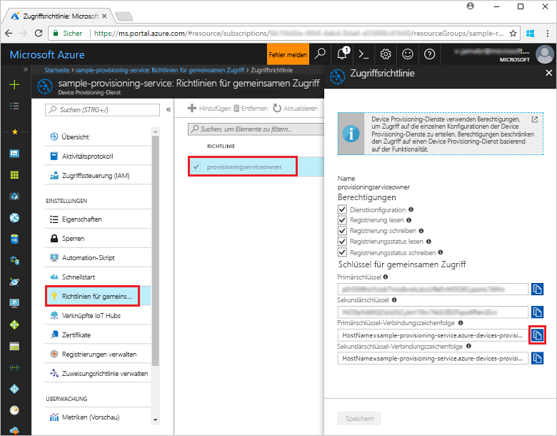
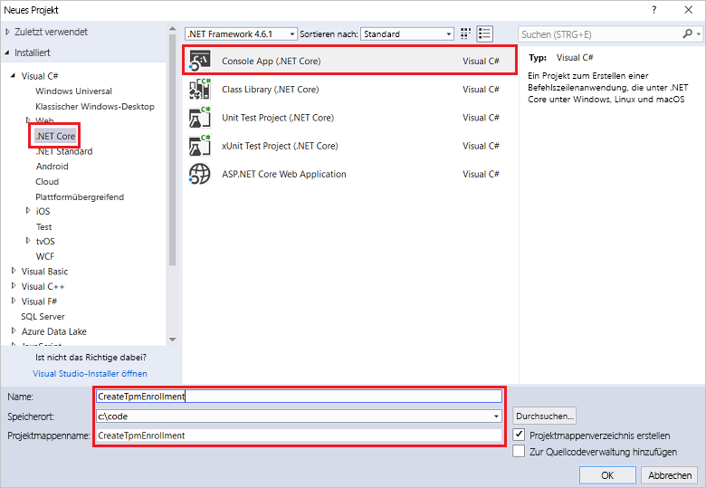
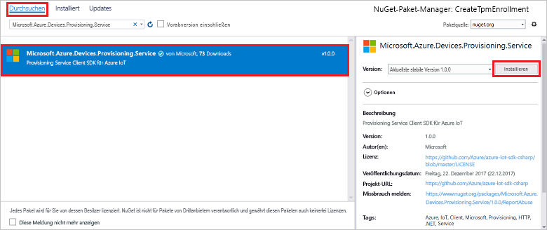
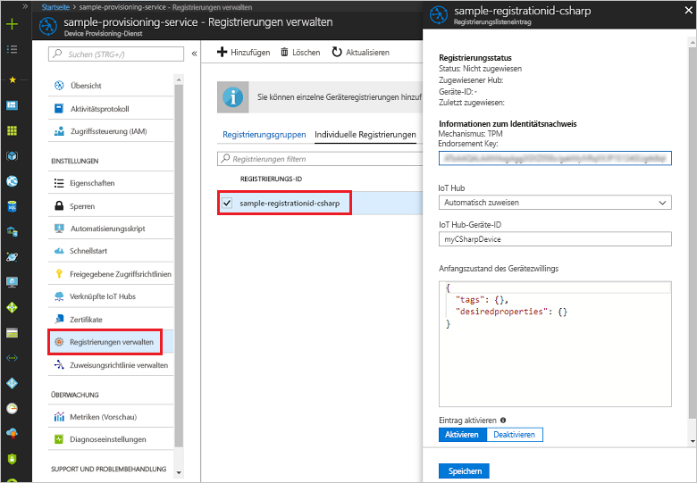

# <a name="enroll-tpm-device-to-iot-hub-device-provisioning-service-using-c-service-sdk"></a>Registrieren eines TPM-Geräts für den IoT Hub Device Provisioning-Dienst per C#-Dienst-SDK

[!INCLUDE [iot-dps-selector-quick-enroll-device-tpm](../../includes/iot-dps-selector-quick-enroll-device-tpm.md)]


Anhand dieser Schritte wird veranschaulicht, wie Sie programmgesteuert eine individuelle Registrierung für ein TPM-Gerät im Azure IoT Hub Device Provisioning-Dienst erstellen, indem Sie das [C#-Dienst-SDK](https://github.com/Azure/azure-iot-sdk-csharp) und eine C#-.NET Core-Beispielanwendung verwenden. Mit diesem Eintrag für die individuelle Registrierung können Sie ein simuliertes TPM-Gerät optional für den Provisioning-Dienst registrieren. Diese Schritte funktionieren für Windows- und Linux-Computer, aber in diesem Artikel wird nur ein Windows-Entwicklungscomputer verwendet.

## <a name="prepare-the-development-environment"></a>Vorbereiten der Entwicklungsumgebung

1. Stellen Sie sicher, dass [Visual Studio 2017](https://www.visualstudio.com/vs/) auf Ihrem Computer installiert ist. 
2. Vergewissern Sie sich, dass auf Ihrem Computer das [.NET Core SDK](https://www.microsoft.com/net/download/windows) installiert ist. 
3. Führen Sie vor dem Fortfahren zunächst die Schritte unter [Einrichten des IoT Hub Device Provisioning-Diensts über das Azure-Portal](./quick-setup-auto-provision.md) aus.
4. Optional: Wenn Sie am Ende dieser Schnellstartanleitung ein simuliertes Gerät registrieren möchten, können Sie die Schritte unter [Erstellen und Bereitstellen eines simulierten TPM-Geräts mithilfe des C#-Geräte-SDKs für den IoT Hub Device Provisioning-Dienst](quick-create-simulated-device-tpm-csharp.md) bis zu dem Schritt ausführen, in dem Sie einen Endorsement Key für das Gerät abrufen. Notieren Sie sich den Endorsement Key, die Registrierungs-ID und optional die Geräte-ID. Sie werden im weiteren Verlauf dieser Schnellstartanleitung benötigt. **Führen Sie nicht die Schritte zum Erstellen einer individuellen Registrierung mit dem Azure-Portal aus.**

## <a name="get-the-connection-string-for-your-provisioning-service"></a>Abrufen der Verbindungszeichenfolge für Ihren Bereitstellungsdienst

Für das Beispiel in dieser Schnellstartanleitung benötigen Sie die Verbindungszeichenfolge für Ihren Bereitstellungsdienst.
1. Melden Sie sich beim Azure-Portal an, klicken Sie im Menü auf der linken Seite auf die Schaltfläche **Alle Ressourcen**, und öffnen Sie Ihren Device Provisioning-Dienst. 
2. Klicken Sie auf **Freigegebene Zugriffsrichtlinien** und dann auf die gewünschte Zugriffsrichtlinie, um die dazugehörigen Eigenschaften zu öffnen. Kopieren Sie im Fenster **Zugriffsrichtlinie** die Primärschlüssel-Verbindungszeichenfolge, und notieren Sie sie. 

    

## <a name="create-the-individual-enrollment-sample"></a>Erstellen des Beispiels für die individuelle Registrierung 

Die Schritte in diesem Abschnitt zeigen, wie Sie eine .NET Core-Konsolen-App erstellen, die Ihrem Bereitstellungsdienst eine individuelle Registrierung für ein TPM-Gerät hinzufügt. Wenn Sie diese Schritte etwas abwandeln, können Sie damit auch eine [Windows IoT Core](https://developer.microsoft.com/en-us/windows/iot)-Konsolen-App zum Hinzufügen der individuellen Registrierung erstellen. Weitere Informationen zum Entwickeln mit IoT Core finden Sie in der [Windows IoT Core-Dokumentation für Entwickler](https://docs.microsoft.com/windows/iot-core/).
1. Fügen Sie in Visual Studio einer neuen Projektmappe mithilfe der Projektvorlage **Konsolenanwendung (.NET Core)** ein Visual C#-Projekt für eine .NET Core-Konsolen-App hinzu. Stellen Sie sicher, dass .NET-Framework-Version 4.5.1 oder höher verwendet wird. Geben Sie dem Projekt den Namen **CreateTpmEnrollment**.

    

2. Klicken Sie im Projektmappen-Explorer mit der rechten Maustaste auf das Projekt **CreateTpmEnrollment**, und klicken Sie dann auf **NuGet-Pakete verwalten**.
3. Klicken Sie im Fenster **NuGet-Paket-Manager** auf **Durchsuchen**, suchen Sie nach **Microsoft.Azure.Devices.Provisioning.Service**, und klicken Sie zum Installieren des Pakets **Microsoft.Azure.Devices.Provisioning.Service** auf **Installieren**. Akzeptieren Sie die Nutzungsbedingungen. Bei diesem Verfahren wird das NuGet-Paket mit dem [Client-SDK für den Azure IoT Provisioning-Dienst](https://www.nuget.org/packages/Microsoft.Azure.Devices.Provisioning.Service/) heruntergeladen und installiert und ein Verweis auf das Paket und seine Abhängigkeiten hinzugefügt.

    

4. Fügen Sie am Anfang der Datei **Program.cs** nach den anderen `using`-Anweisungen die folgenden `using`-Anweisungen hinzu:
   
   ```csharp
   using System.Threading.Tasks;
   using Microsoft.Azure.Devices.Provisioning.Service;
   ```
    
5. Fügen Sie der **Program** -Klasse die folgenden Felder hinzu.  
   - Ersetzen Sie den Platzhalterwert **ProvisioningConnectionString** durch die Verbindungszeichenfolge des Bereitstellungsdiensts, für den Sie die Registrierung erstellen möchten.
   - Sie können optional die Registrierungs-ID, den Endorsement Key, die Geräte-ID und den Bereitstellungsstatus ändern. 
   - Wenn Sie diese Schnellstartanleitung zusammen mit der Schnellstartanleitung [Erstellen und Bereitstellen eines simulierten TPM-Geräts mithilfe des C#-Geräte-SDKs für den IoT Hub Device Provisioning-Dienst](quick-create-simulated-device-tpm-csharp.md) verwenden, um ein simuliertes Gerät bereitzustellen, ersetzen Sie den Endorsement Key und die Registrierungs-ID durch die Werte, die Sie sich in dieser Schnellstartanleitung notiert haben. Die Geräte-ID können Sie durch den in der Schnellstartanleitung vorgeschlagenen Wert ersetzen, auf einen eigenen Wert festlegen oder den Standardwert in diesem Beispiel verwenden.
        
   ```csharp
   private static string ProvisioningConnectionString = "{Your provisioning service connection string}";
   private const string RegistrationId = "sample-registrationid-csharp";
   private const string TpmEndorsementKey =
       "AToAAQALAAMAsgAgg3GXZ0SEs/gakMyNRqXXJP1S124GUgtk8qHaGzMUaaoABgCAAEMAEAgAAAAAAAEAxsj2gUS" +
       "cTk1UjuioeTlfGYZrrimExB+bScH75adUMRIi2UOMxG1kw4y+9RW/IVoMl4e620VxZad0ARX2gUqVjYO7KPVt3d" +
       "yKhZS3dkcvfBisBhP1XH9B33VqHG9SHnbnQXdBUaCgKAfxome8UmBKfe+naTsE5fkvjb/do3/dD6l4sGBwFCnKR" +
       "dln4XpM03zLpoHFao8zOwt8l/uP3qUIxmCYv9A7m69Ms+5/pCkTu/rK4mRDsfhZ0QLfbzVI6zQFOKF/rwsfBtFe" +
       "WlWtcuJMKlXdD8TXWElTzgh7JS4qhFzreL0c1mI0GCj+Aws0usZh7dLIVPnlgZcBhgy1SSDQMQ==";
       
   // Optional parameters
   private const string OptionalDeviceId = "myCSharpDevice";
   private const ProvisioningStatus OptionalProvisioningStatus = ProvisioningStatus.Enabled;
   ```
    
6. Fügen Sie der **Program**-Klasse die folgende Methode hinzu.  Dieser Code erstellt einen individuellen Registrierungseintrag und ruft dann die Methode **CreateOrUpdateIndividualEnrollmentAsync** für **ProvisioningServiceClient** auf, um die individuelle Registrierung zum Bereitstellungsdienst hinzuzufügen.
   
   ```csharp
   public static async Task RunSample()
   {
       Console.WriteLine("Starting sample...");

       using (ProvisioningServiceClient provisioningServiceClient =
               ProvisioningServiceClient.CreateFromConnectionString(ProvisioningConnectionString))
       {
           #region Create a new individualEnrollment config
           Console.WriteLine("\nCreating a new individualEnrollment...");
           Attestation attestation = new TpmAttestation(TpmEndorsementKey);
           IndividualEnrollment individualEnrollment =
                   new IndividualEnrollment(
                           RegistrationId,
                           attestation);

           // The following parameters are optional. Remove them if you don't need them.
           individualEnrollment.DeviceId = OptionalDeviceId;
           individualEnrollment.ProvisioningStatus = OptionalProvisioningStatus;
           #endregion

           #region Create the individualEnrollment
           Console.WriteLine("\nAdding new individualEnrollment...");
           IndividualEnrollment individualEnrollmentResult =
               await provisioningServiceClient.CreateOrUpdateIndividualEnrollmentAsync(individualEnrollment).ConfigureAwait(false);
           Console.WriteLine("\nIndividualEnrollment created with success.");
           Console.WriteLine(individualEnrollmentResult);
           #endregion
        
       }
   }
   ```
       
7. Ersetzen Sie schließlich den Text der Methode **Main** durch die folgenden Zeilen:
   
   ```csharp
   RunSample().GetAwaiter().GetResult();
   Console.WriteLine("\nHit <Enter> to exit ...");
   Console.ReadLine();
   ```
        
8. Erstellen Sie die Projektmappe.

## <a name="run-the-individual-enrollment-sample"></a>Ausführen des Beispiels für die individuelle Registrierung
  
1. Führen Sie das Beispiel in Visual Studio aus, um die individuelle Registrierung für Ihr TPM-Gerät zu erstellen.
 
2. Bei einer erfolgreichen Erstellung werden im Befehlsfenster die Eigenschaften der neuen individuellen Registrierung angezeigt.

    

3. Um zu überprüfen, ob die individuelle Registrierung erstellt wurde, klicken Sie im Azure-Portal auf dem Blatt „Zusammenfassung“ des Device Provisioning-Diensts auf **Registrierungen verwalten** und dann auf die Registerkarte **Individuelle Registrierungen**. Daraufhin sollte ein neuer Registrierungseintrag mit der im Beispiel verwendeten Registrierungs-ID angezeigt werden. Klicken Sie auf den Eintrag, um den Endorsement Key und andere Eigenschaften für den Eintrag zu überprüfen.

    
 
4. Optional: Wenn Sie die Schritte aus der Schnellstartanleitung [Erstellen und Bereitstellen eines simulierten TPM-Geräts mithilfe des C#-Geräte-SDKs für den IoT Hub Device Provisioning-Dienst](quick-create-simulated-device-tpm-csharp.md) ausgeführt haben, können Sie mit den restlichen Schritten in dieser Schnellstartanleitung fortfahren, um Ihr simuliertes Gerät zu registrieren. Überspringen Sie dabei die Schritte zum Erstellen einer individuellen Registrierung mit dem Azure-Portal.

## <a name="clean-up-resources"></a>Bereinigen von Ressourcen
Wenn Sie planen, sich das C#-Dienstbeispiel näher anzusehen, sollten Sie die in dieser Schnellstartanleitung erstellten Ressourcen nicht bereinigen. Falls Sie nicht fortfahren möchten, führen Sie die folgenden Schritte aus, um alle erstellten Ressourcen zu löschen, die im Rahmen dieser Schnellstartanleitung erstellt wurden:

1. Schließen Sie das Ausgabefenster des C#-Beispiels auf Ihrem Computer.
2. Navigieren Sie im Azure-Portal zu Ihrem Device Provisioning-Dienst, klicken Sie auf **Registrierungen verwalten**, und klicken Sie anschließend auf die Registerkarte **Individuelle Registrierungen**. Wählen Sie die *Registrierungs-ID* für den Registrierungseintrag aus, den Sie mit dieser Schnellstartanleitung erstellt haben, und klicken Sie oben auf dem Blatt auf die Schaltfläche **Löschen**. 
3. Falls Sie die Schritte aus der Schnellstartanleitung [Erstellen und Bereitstellen eines simulierten TPM-Geräts mithilfe des C#-Geräte-SDKs für den IoT Hub Device Provisioning-Dienst](quick-create-simulated-device-tpm-csharp.md) ausgeführt haben, um ein simuliertes TPM-Gerät zu erstellen, gehen Sie wie folgt vor: 

    1. Schließen Sie das TPM-Simulatorfenster und das Beispielausgabefenster für das simulierte Gerät.
    2. Navigieren Sie im Azure-Portal zu der IoT Hub-Instanz, in der Ihr Gerät bereitgestellt wurde. Klicken Sie im linken Menü unter **Explorer** auf **IoT-Geräte**, aktivieren Sie das Kontrollkästchen neben Ihrem Gerät, und klicken Sie anschließend am oberen Rand des Fensters auf **Löschen**.
 
## <a name="next-steps"></a>Nächste Schritte
In dieser Schnellstartanleitung haben Sie programmgesteuert einen Eintrag für die individuelle Registrierung für ein TPM-Gerät erstellt und optional ein simuliertes TPM-Gerät auf Ihrem Computer erstellt und für Ihren IoT Hub bereitgestellt, indem Sie den Azure IoT Hub Device Provisioning-Dienst verwendet haben. Ausführlichere Informationen zur Gerätebereitstellung finden Sie im Tutorial zur Einrichtung des Device Provisioning-Diensts über das Azure-Portal. 
 
> [!div class="nextstepaction"]
> [Tutorials für den Azure IoT Hub Device Provisioning-Dienst](./tutorial-set-up-cloud.md)

