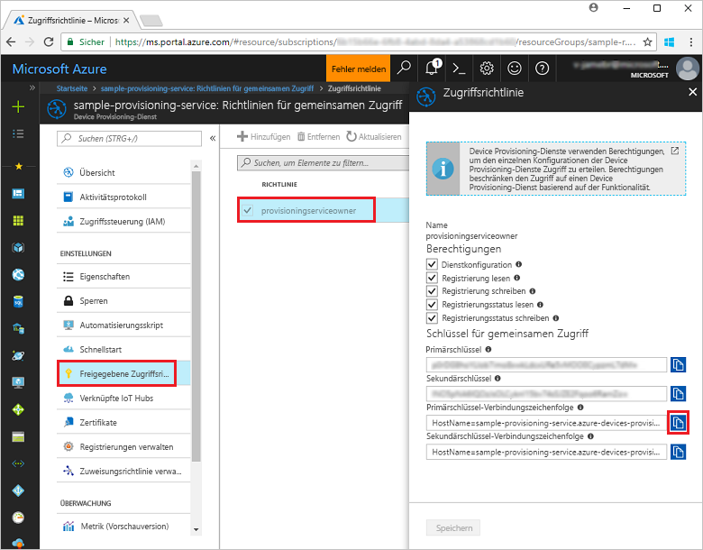
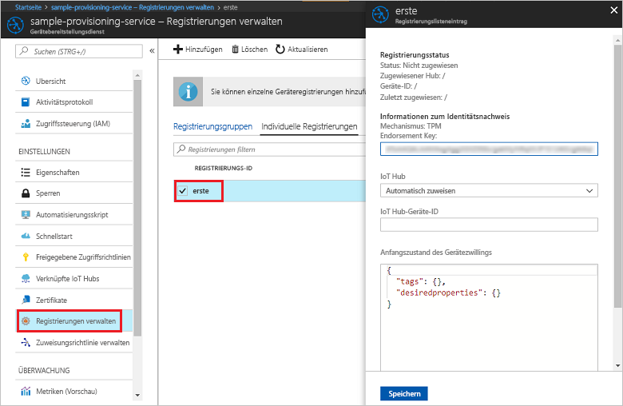

# <a name="enroll-tpm-device-to-iot-hub-device-provisioning-service-using-nodejs-service-sdk"></a>Registrieren eines TPM-Geräts für den IoT Hub Device Provisioning-Dienst per Node.js-Dienst-SDK
> [!div class="op_single_selector"]
> * [Java](quick-enroll-device-tpm-java.md)
> * [C#](quick-enroll-device-tpm-csharp.md)
> * [Node.js](quick-enroll-device-tpm-node.md)

Anhand dieser Schritte wird veranschaulicht, wie Sie programmgesteuert eine individuelle Registrierung für ein TPM-Gerät im Azure IoT Hub Device Provisioning-Dienst erstellen, indem Sie das [Node.js-Dienst-SDK](https://github.com/Azure/azure-iot-sdk-node) und eine Node.js-Beispielanwendung verwenden. Mit diesem Eintrag für die individuelle Registrierung können Sie ein simuliertes TPM-Gerät optional für den Provisioning-Dienst registrieren. Diese Schritte funktionieren auf Windows- und auf Linux-Computern, aber in diesem Artikel wird nur ein Windows-Entwicklungscomputer genutzt.

## <a name="prerequisites"></a>Voraussetzungen

- Führen Sie vor dem Fortfahren zunächst die Schritte unter [Einrichten des IoT Hub Device Provisioning-Diensts über das Azure-Portal](./quick-setup-auto-provision.md) aus. 
-  Stellen Sie sicher, dass auf Ihrem Computer [Node.js v4.0 oder höher](https://nodejs.org) installiert ist.
- Wenn Sie am Ende dieser Schnellstartanleitung ein simuliertes Gerät registrieren möchten, können Sie die Schritte unter [Erstellen und Bereitstellen eines simulierten Geräts mithilfe von IoT Hub Device Provisioning-Diensten](quick-create-simulated-device.md) bis zu dem Schritt befolgen, in dem Sie einen Endorsement Key für das Gerät abrufen. Notieren Sie sich den Endorsement Key, da sie ihn später in dieser Schnellstartanleitung benötigen. **Führen Sie nicht die Schritte zum Erstellen einer individuellen Registrierung mit dem Azure-Portal aus.**
 
## <a name="create-the-individual-enrollment-sample"></a>Erstellen des Beispiels für die individuelle Registrierung 

 
1. Führen Sie in einem Befehlsfenster in Ihrem Arbeitsordner Folgendes aus:
  
    ```cmd\sh
    npm install azure-iot-provisioning-service
    ```  

2. Erstellen Sie mit einem Text-Editor in Ihrem Arbeitsordner die Datei **create_individual_enrollment.js**. Fügen Sie der Datei den folgenden Code hinzu, und speichern Sie sie:

    ```
    'use strict';

    var provisioningServiceClient = require('azure-iot-provisioning-service').ProvisioningServiceClient;

    var serviceClient = provisioningServiceClient.fromConnectionString(process.argv[2]);
    var endorsementKey = process.argv[3];

    var enrollment = {
      registrationId: 'first',
      attestation: {
        type: 'tpm',
        tpm: {
          endorsementKey: endorsementKey
        }
      }
    };

    serviceClient.createOrUpdateIndividualEnrollment(enrollment, function(err, enrollmentResponse) {
      if (err) {
        console.log('error creating the individual enrollment: ' + err);
      } else {
        console.log("enrollment record returned: " + JSON.stringify(enrollmentResponse, null, 2));
      }
    });
    ````

## <a name="run-the-individual-enrollment-sample"></a>Ausführen des Beispiels für die individuelle Registrierung
  
1. Zum Ausführen des Beispiels benötigen Sie die Verbindungszeichenfolge für Ihren Provisioning-Dienst. 
    1. Melden Sie sich beim Azure-Portal an, klicken Sie im Menü auf der linken Seite auf die Schaltfläche **Alle Ressourcen**, und öffnen Sie Ihren Device Provisioning-Dienst. 
    2. Klicken Sie auf **Freigegebene Zugriffsrichtlinien** und dann auf die gewünschte Zugriffsrichtlinie, um die dazugehörigen Eigenschaften zu öffnen. Kopieren Sie im Fenster **Zugriffsrichtlinie** die Primärschlüssel-Verbindungszeichenfolge, und notieren Sie sie. 

     


2. Außerdem benötigen Sie den Endorsement Key für Ihr Gerät. Falls Sie die Schritte der Schnellstartanleitung unter [Erstellen und Bereitstellen eines simulierten Geräts mithilfe von IoT Hub Device Provisioning-Diensten](quick-create-simulated-device.md) befolgt haben, um ein simuliertes TPM-Gerät zu erstellen, können Sie den für dieses Gerät erstellten Schlüssel verwenden. Andernfalls können Sie zum Erstellen eines Beispiels für die individuelle Registrierung den folgenden Endorsement Key nutzen, der über das SDK bereitgestellt wird:

    ```
    AToAAQALAAMAsgAgg3GXZ0SEs/gakMyNRqXXJP1S124GUgtk8qHaGzMUaaoABgCAAEMAEAgAAAAAAAEAxsj2gUScTk1UjuioeTlfGYZrrimExB+bScH75adUMRIi2UOMxG1kw4y+9RW/IVoMl4e620VxZad0ARX2gUqVjYO7KPVt3dyKhZS3dkcvfBisBhP1XH9B33VqHG9SHnbnQXdBUaCgKAfxome8UmBKfe+naTsE5fkvjb/do3/dD6l4sGBwFCnKRdln4XpM03zLpoHFao8zOwt8l/uP3qUIxmCYv9A7m69Ms+5/pCkTu/rK4mRDsfhZ0QLfbzVI6zQFOKF/rwsfBtFeWlWtcuJMKlXdD8TXWElTzgh7JS4qhFzreL0c1mI0GCj+Aws0usZh7dLIVPnlgZcBhgy1SSDQMQ==
    ```

3. Führen Sie den folgenden Befehl aus (einschließlich der Anführungszeichen der Befehlsargumente), um eine individuelle Registrierung für Ihr TPM-Gerät zu erstellen:
 
     ```cmd\sh
     node create_individual_enrollment.js "<the connection string for your provisioning service>" "<endorsement key>"
     ```
 
3. Bei einer erfolgreichen Erstellung werden im Befehlsfenster die Eigenschaften der neuen individuellen Registrierung angezeigt.

     

4. Stellen Sie sicher, dass eine individuelle Registrierung erstellt wurde. Wählen Sie im Azure-Portal auf dem Zusammenfassungsblatt des Device Provisioning-Diensts die Option **Registrierungen verwalten**. Wählen Sie die Registerkarte **Individuelle Registrierungen**, und klicken Sie auf den neuen Registrierungseintrag (*first*), um den Endorsement Key und andere Eigenschaften für den Eintrag zu überprüfen.

     
 
Nachdem Sie nun eine individuelle Registrierung für ein TPM-Gerät erstellt haben, können Sie mit den restlichen Schritten unter [Erstellen und Bereitstellen eines simulierten Geräts mithilfe von IoT Hub Device Provisioning-Diensten](quick-create-simulated-device.md) fortfahren, falls Sie ein simuliertes Gerät registrieren möchten. Achten Sie darauf, dass Sie die Schritte zum Erstellen einer individuellen Registrierung mit dem Azure-Portal in dieser Schnellstartanleitung überspringen.

## <a name="clean-up-resources"></a>Bereinigen von Ressourcen
Wenn Sie planen, sich die Beispiele des Node.js-Diensts näher anzusehen, sollten Sie die in dieser Schnellstartanleitung erstellten Ressourcen nicht bereinigen. Falls Sie nicht fortfahren möchten, führen Sie die folgenden Schritte aus, um alle erstellten Ressourcen zu löschen, die im Rahmen dieser Schnellstartanleitung erstellt wurden:

1. Schließen Sie das Ausgabefenster des Node.js-Beispiels auf Ihrem Computer.
1. Falls Sie ein simuliertes TPM-Gerät erstellt haben, können Sie das TPM-Simulatorfenster schließen.
2. Navigieren Sie im Azure-Portal zu Ihrem Device Provisioning-Dienst, klicken Sie auf **Registrierungen verwalten**, und wählen Sie anschließend die Registerkarte **Individuelle Registrierungen**. Wählen Sie die *Registrierungs-ID* für den Registrierungseintrag aus, den Sie mit dieser Schnellstartanleitung erstellt haben, und klicken Sie oben auf dem Blatt auf die Schaltfläche **Löschen**. 
 
## <a name="next-steps"></a>Nächste Schritte
In dieser Schnellstartanleitung haben Sie programmgesteuert einen Eintrag für die individuelle Registrierung für ein TPM-Gerät erstellt und optional ein simuliertes TPM-Gerät auf Ihrem Computer erstellt und für Ihren IoT Hub bereitgestellt, indem Sie den Azure IoT Hub Device Provisioning-Dienst verwendet haben. Ausführlichere Informationen zur Gerätebereitstellung finden Sie im Tutorial zur Einrichtung des Device Provisioning-Diensts über das Azure-Portal. 
 
> [!div class="nextstepaction"]
> [Tutorials für den Azure IoT Hub Device Provisioning-Dienst](./tutorial-set-up-cloud.md)