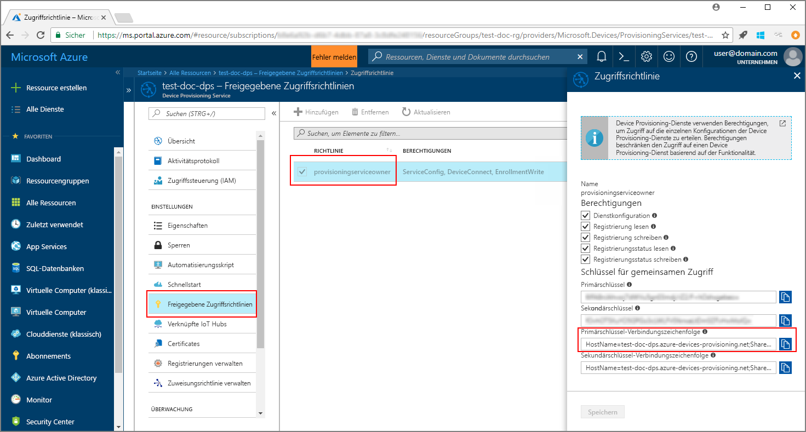
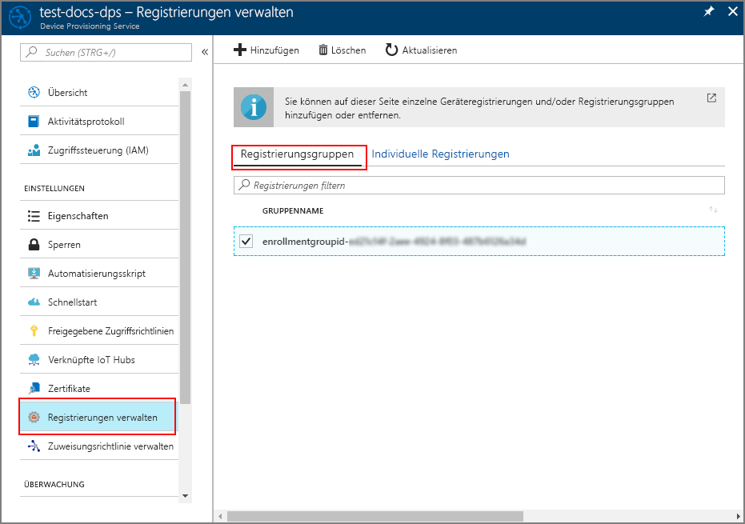

# <a name="enroll-x509-devices-to-iot-hub-device-provisioning-service-using-java-service-sdk"></a>Registrieren von X.509-Geräten für den IoT Hub Device Provisioning-Dienst per Java-Dienst-SDK

[!INCLUDE [iot-dps-selector-quick-enroll-device-x509](../../includes/iot-dps-selector-quick-enroll-device-x509.md)]

Diese Schritte veranschaulichen, wie Sie eine Gruppe mit simulierten X.509-Geräten programmgesteuert für den Azure IoT Hub Device Provisioning-Dienst registrieren, indem Sie das [Java-Dienst-SDK](https://azure.github.io/azure-iot-sdk-java/service/) zusammen mit einer Java-Beispielanwendung verwenden. Das Java-Dienst-SDK funktioniert auf Windows- und Linux-Computern, aber in diesem Artikel wird nur ein Windows-Entwicklungscomputer verwendet, um die einzelnen Schritte des Registrierungsprozesses zu veranschaulichen.

Führen Sie vor dem Fortfahren zunächst das [Einrichten des IoT Hub Device Provisioning-Diensts über das Azure-Portal](./quick-setup-auto-provision.md) durch.

<a id="setupdevbox"></a>

## <a name="prepare-the-development-environment"></a>Vorbereiten der Entwicklungsumgebung 

1. Vergewissern Sie sich, dass das [Java SE Development Kit 8](http://www.oracle.com/technetwork/java/javase/downloads/jdk8-downloads-2133151.html) auf Ihrem Computer installiert ist. 

2. Richten Sie Umgebungsvariablen für Ihre Java-Installation ein. Die Variable `PATH` sollte den vollständigen Pfad zum Verzeichnis *jdk1.8.x\bin* enthalten. Falls dies die erste Java-Installation Ihres Computers ist, sollten Sie eine neue Umgebungsvariable mit dem Namen `JAVA_HOME` erstellen und dafür auf den vollständigen Pfad zum Verzeichnis *jdk1.8.x* verweisen. Auf einem Windows-Computer befindet sich dieses Verzeichnis normalerweise im Ordner *C:\\Programme\\Java\\*. Sie können Umgebungsvariablen erstellen oder bearbeiten, indem Sie in der **Systemsteuerung** Ihres Windows-Computers nach **Systemumgebungsvariablen bearbeiten** suchen. 

  Sie können überprüfen, ob die Java-Einrichtung auf Ihrem Computer erfolgreich war, indem Sie im Befehlsfenster den folgenden Befehl ausführen:

    ```cmd\sh
    java -version
    ```

3. Laden Sie [Maven 3](https://maven.apache.org/download.cgi) auf Ihren Computer herunter, und extrahieren Sie die Datei. 

4. Bearbeiten Sie die Umgebungsvariable `PATH` so, dass sie auf den Ordner *apache-maven-3.x.x\\bin* in dem Ordner verweist, in den Sie Maven extrahiert haben. Sie können sicherstellen, dass die Installation von Maven erfolgreich war, indem Sie diesen Befehl in Ihrem Befehlsfenster ausführen:

    ```cmd\sh
    mvn --version
    ```

5. Stellen Sie sicher, dass [git](https://git-scm.com/download/) auf Ihrem Computer installiert ist und der Umgebungsvariablen `PATH` hinzugefügt wurde. 


<a id="javasample"></a>

## <a name="download-and-modify-the-java-sample-code"></a>Herunterladen und Ändern des Java-Beispielcodes

In diesem Abschnitt wird veranschaulicht, wie Sie die Bereitstellungsdetails Ihres X.509-Geräts dem Beispielcode hinzufügen. 

1. Öffnen Sie eine Eingabeaufforderung. Klonen Sie das GitHub-Repository für das Codebeispiel zur Geräteregistrierung, indem Sie das Java-Dienst-SDK verwenden:
    
    ```cmd\sh
    git clone https://github.com/Azure/azure-iot-sdk-java.git --recursive
    ```

2. Navigieren Sie im heruntergeladenen Quellcode zum Beispielordner **_azure-iot-sdk-java/provisioning/provisioning-samples/service-enrollment-group-sample_**. Öffnen Sie die Datei **_/src/main/java/samples/com/microsoft/azure/sdk/iot/ServiceEnrollmentGroupSample.java_** in einem Editor Ihrer Wahl, und fügen Sie die folgenden Details hinzu:

    1. Fügen Sie das Element `[Provisioning Connection String]` für Ihren Provisioning-Dienst wie folgt aus dem Portal hinzu:
        1. Navigieren Sie zu Ihrem Provisioning-Dienst im [Azure-Portal](https://portal.azure.com). 
        2. Öffnen Sie **Freigegebene Zugriffsrichtlinien**, und wählen Sie eine Richtlinie aus, die über die Berechtigung *EnrollmentWrite* verfügt.
        3. Kopieren Sie die **Primärschlüssel-Verbindungszeichenfolge**. 

              

        4. Ersetzen Sie in der Beispielcodedatei **_ServiceEnrollmentGroupSample.java_** das Element `[Provisioning Connection String]` durch die **Primärschlüssel-Verbindungszeichenfolge**.

            ```Java
            private static final String PROVISIONING_CONNECTION_STRING = "[Provisioning Connection String]";
            ```

    2. Fügen Sie das Stammzertifikat für die Gruppe mit den Geräten hinzu. Verwenden Sie das Tool _X.509 Certificate Generator_: Gehen Sie wie folgt vor, wenn Sie ein Beispielstammzertifikat benötigen:
        1. Navigieren Sie in einem Befehlsfenster zum Ordner **_azure-iot-sdk-java/provisioning/provisioning-tools/provisioning-x509-cert-generator_**.
        2. Erstellen Sie das Tool, indem Sie den folgenden Befehl ausführen:

                ```cmd\sh
                mvn clean install
                ```

        4. Führen Sie das Tool mit den folgenden Befehlen aus:

                ```cmd\sh
                cd target
                java -jar ./provisioning-x509-cert-generator-{version}-with-deps.jar
                ```

        5. Wenn die Aufforderung angezeigt wird, können Sie optional einen _allgemeinen Namen_ für Ihre Zertifikate eingeben.
        6. Das Tool erstellt lokal ein Clientzertifikat (**Client Cert**), den privaten Schlüssel für das Clientzertifikat (**Client Cert Private Key**) und das Stammzertifikat (**Root Cert**).
        7. Kopieren Sie das **Stammzertifikat**, einschließlich der Zeilen **_-----BEGIN CERTIFICATE-----_** und **_-----END CERTIFICATE-----_**. 
        8. Weisen Sie den Wert des **Stammzertifikats** wie hier dargestellt dem Parameter **PUBLIC_KEY_CERTIFICATE_STRING** zu:

                ```Java
                private static final String PUBLIC_KEY_CERTIFICATE_STRING =
                        "-----BEGIN CERTIFICATE-----\n" +
                        "XXXXXXXXXXXXXXXXXXXXXXXXXXXXXXXXXXXXXXXXXXXXXXXXXXXXXXXXXXXXXXXX\n" +
                        "XXXXXXXXXXXXXXXXXXXXXXXXXXXXXXXXXXXXXXXXXXXXXXXXXXXXXXXXXXXXXXXX\n" +
                        "XXXXXXXXXXXXXXXXXXXXXXXXXXXXXXXXXXXXXXXXXXXXXXXXXXXXXXXXXXXXXXXX\n" +
                        "XXXXXXXXXXXXXXXXXXXXXXXXXXXXXXXXXXXXXXXXXXXXXXXXXXXXXXXXXXXXXXXX\n" +
                        "XXXXXXXXXXXXXXXXXXXXXXXXXXXXXXXXXXXXXXXXXXXXXXXXXXXXXXXXXXXXXXXX\n" +
                        "XXXXXXXXXXXXXXXXXXXXXXXXXXXXXXXXXXXXXXXXXXXXXXXXXXXXXXXXXXXXXXXX\n" +
                        "XXXXXXXXXXXXXXXXXXXXXXXXXXXXXXXXXXXXXXXXXXXXXXXXXXXXXXXXXXXXXXXX\n" +
                        "XXXXXXXXXXXXXXXXXXXXXXXXXXXXXXXXXXXXXXXXXXXXXXXXXXXXXXXXXXXXXXXX\n" +
                        "XXXXXXXXXXXXXXXXXXXXXXXXXXXXXXXXXXXXXXXXXXXXXXXXXXXXXXXXXXXXXXXX\n" +
                        "XXXXXXXXXXXXXXXXXXXXXXXXXXXXXXXXXXXXXXXXXXXXXXXXXXXXXXXXXXXXXXXX\n" +
                        "-----END CERTIFICATE-----\n";
                ```

        9. Schließen Sie das Befehlsfenster, oder geben Sie **n** ein, wenn Sie zur Eingabe des *Verifizierungscodes* aufgefordert werden. 
 
    3. Optional können Sie Ihren Provisioning-Dienst über den Beispielcode konfigurieren:
        - Führen Sie diese Schritte aus, um diese Konfiguration dem Beispiel hinzuzufügen:
            1. Navigieren Sie im [Azure-Portal](https://portal.azure.com) zum IoT Hub, der mit Ihrem Provisioning-Dienst verknüpft ist. Öffnen Sie die Registerkarte **Übersicht** für den Hub, und kopieren Sie den **Hostnamen**. Weisen Sie diesen **Hostnamen** dem Parameter *IOTHUB_HOST_NAME* zu.

                ```Java
                private static final String IOTHUB_HOST_NAME = "[Host name].azure-devices.net";
                ```
            2. Weisen Sie dem Parameter *DEVICE_ID* einen Anzeigenamen zu, und behalten Sie für *PROVISIONING_STATUS* den Standardwert *ENABLED* bei. 

        - ODER: Falls Sie Ihren Provisioning-Dienst nicht konfigurieren möchten, sollten Sie die folgenden Anweisungen in der Datei _ServiceEnrollmentGroupSample.java_ auskommentieren oder löschen:

            ```Java
            enrollmentGroup.setIotHubHostName(IOTHUB_HOST_NAME);                // Optional parameter.
            enrollmentGroup.setProvisioningStatus(ProvisioningStatus.ENABLED);  // Optional parameter.
            ```

    4. Sehen Sie sich den Beispielcode näher an. Er bewirkt, dass eine Gruppenregistrierung für X.509-Geräte erstellt, aktualisiert, abgefragt und gelöscht wird. Um zu überprüfen, ob die Registrierung im Portal erfolgreich war, können Sie die folgenden Codezeilen am Ende der Datei _ServiceEnrollmentGroupSample.java_ vorübergehend auskommentieren:

        ```Java
        // ************************************** Delete info of enrollmentGroup ***************************************
        System.out.println("\nDelete the enrollmentGroup...");
        provisioningServiceClient.deleteEnrollmentGroup(enrollmentGroupId);
        ```

    5. Speichern Sie die Datei _ServiceEnrollmentGroupSample.java_. 
 

<a id="runjavasample"></a>

## <a name="build-and-run-sample-group-enrollment"></a>Erstellen und Ausführen der Beispielgruppenregistrierung

1. Öffnen Sie ein Befehlsfenster, und navigieren Sie zum Ordner **_azure-iot-sdk-java/provisioning/provisioning-samples/service-enrollment-group-sample_**.

2. Erstellen Sie den Beispielcode mit diesem Befehl:

    ```cmd\sh
    mvn install -DskipTests
    ```

   Mit diesem Befehl wird das Maven-Paket [`com.microsoft.azure.sdk.iot.provisioning.service`](https://www.mvnrepository.com/artifact/com.microsoft.azure.sdk.iot.provisioning/provisioning-service-client) auf Ihren Computer heruntergeladen. Das Paket enthält die Binärdateien für das Java-Dienst-SDK, das mit dem Code erstellt werden soll. Wenn Sie im vorherigen Abschnitt das Tool _X.509-Zertifikatgenerator_ ausgeführt haben, wurde dieses Paket bereits auf Ihren Computer heruntergeladen. 

3. Führen Sie das Beispiel aus, indem Sie im Befehlsfenster diese Befehle verwenden:

    ```cmd\sh
    cd target
    java -jar ./service-enrollment-group-sample-{version}-with-deps.jar
    ```

4. Verfolgen Sie im Ausgabefenster, ob die Registrierung erfolgreich ist.

5. Navigieren Sie im Azure-Portal zu Ihrem Provisioning-Dienst. Klicken Sie auf **Registrierungen verwalten**. Beachten Sie, dass Ihre Gruppe mit X.509-Geräten unter der Registerkarte **Registrierungsgruppen** mit einem automatisch generierten *GRUPPENNAMEN* angezeigt wird. 

      

## <a name="modifications-to-enroll-a-single-x509-device"></a>Änderungen zur Registrierung eines einzelnen X.509-Geräts

Ändern Sie zum Registrieren eines einzelnen X.509-Geräts den Beispielcode für die *individuelle Registrierung*, der unter [Registrieren eines TPM-Geräts für den IoT Hub Device Provisioning-Dienst per Java-Dienst-SDK](quick-enroll-device-tpm-java.md#javasample) verwendet wurde, wie folgt:

1. Kopieren Sie den *allgemeinen Namen* Ihres X.509-Clientzertifikats in die Zwischenablage. Wenn Sie das Tool _X.509 Certificate Generator_ wie im [vorherigen Codeabschnitt](#javasample) gezeigt verwenden möchten, können Sie entweder einen _allgemeinen Namen_ für Ihr Zertifikat eingeben oder den Standardwert **microsoftriotcore** verwenden. Verwenden Sie diesen **allgemeinen Namen** als Wert für die Variable *REGISTRATION_ID*. 

    ```Java
    // Use common name of your X.509 client certificate
    private static final String REGISTRATION_ID = "[RegistrationId]";
    ```

2. Benennen Sie die Variable *TPM_ENDORSEMENT_KEY* in *PUBLIC_KEY_CERTIFICATE_STRING* um. Kopieren Sie Ihr Clientzertifikat bzw. das **Client Cert** aus der Ausgabe des Tools _X.509 Certificate Generator_ als Wert für die Variable *PUBLIC_KEY_CERTIFICATE_STRING*. 

    ```Java
    // Rename the variable *TPM_ENDORSEMENT_KEY* as *PUBLIC_KEY_CERTIFICATE_STRING*
    private static final String PUBLIC_KEY_CERTIFICATE_STRING =
            "-----BEGIN CERTIFICATE-----\n" +
            "XXXXXXXXXXXXXXXXXXXXXXXXXXXXXXXXXXXXXXXXXXXXXXXXXXXXXXXXXXXXXXXX\n" +
            "XXXXXXXXXXXXXXXXXXXXXXXXXXXXXXXXXXXXXXXXXXXXXXXXXXXXXXXXXXXXXXXX\n" +
            "XXXXXXXXXXXXXXXXXXXXXXXXXXXXXXXXXXXXXXXXXXXXXXXXXXXXXXXXXXXXXXXX\n" +
            "XXXXXXXXXXXXXXXXXXXXXXXXXXXXXXXXXXXXXXXXXXXXXXXXXXXXXXXXXXXXXXXX\n" +
            "XXXXXXXXXXXXXXXXXXXXXXXXXXXXXXXXXXXXXXXXXXXXXXXXXXXXXXXXXXXXXXXX\n" +
            "XXXXXXXXXXXXXXXXXXXXXXXXXXXXXXXXXXXXXXXXXXXXXXXXXXXXXXXXXXXXXXXX\n" +
            "XXXXXXXXXXXXXXXXXXXXXXXXXXXXXXXXXXXXXXXXXXXXXXXXXXXXXXXXXXXXXXXX\n" +
            "XXXXXXXXXXXXXXXXXXXXXXXXXXXXXXXXXXXXXXXXXXXXXXXXXXXXXXXXXXXXXXXX\n" +
            "XXXXXXXXXXXXXXXXXXXXXXXXXXXXXXXXXXXXXXXXXXXXXXXXXXXXXXXXXXXXXXXX\n" +
            "XXXXXXXXXXXXXXXXXXXXXXXXXXXXXXXXXXXXXXXXXXXXXXXXXXXXXXXXXXXXXXXX\n" +
            "-----END CERTIFICATE-----\n";
    ```
3. Ersetzen Sie in der Funktion **main** die Zeile `Attestation attestation = new TpmAttestation(TPM_ENDORSEMENT_KEY);` durch Folgendes, um das X.509-Clientzertifikat zu verwenden:
    ```Java
    Attestation attestation = X509Attestation.createFromClientCertificates(PUBLIC_KEY_CERTIFICATE_STRING);
    ```

4. Führen Sie das Speichern, Erstellen und Ausführen der Beispieldatei für die *individuelle Registrierung* durch, indem Sie die Schritte im Abschnitt [Build and run the sample code for individual enrollment](quick-enroll-device-tpm-java.md#runjavasample) (Erstellen und Ausführen des Beispielcodes für die individuelle Registrierung) befolgen.


## <a name="clean-up-resources"></a>Bereinigen von Ressourcen
Wenn Sie planen, sich das Beispiel des Java-Diensts näher anzusehen, sollten Sie die in dieser Schnellstartanleitung erstellten Ressourcen nicht bereinigen. Falls Sie nicht fortfahren möchten, führen Sie die folgenden Schritte aus, um alle erstellten Ressourcen zu löschen, die im Rahmen dieser Schnellstartanleitung erstellt wurden:

1. Schließen Sie das Ausgabefenster des Java-Beispiels auf Ihrem Computer.
1. Schließen Sie das Fenster _X509 Cert Generator_ auf Ihrem Computer.
1. Navigieren Sie im Azure-Portal zu Ihrem Device Provisioning-Dienst, klicken Sie auf **Registrierungen verwalten**, und wählen Sie anschließend die Registerkarte **Registrierungsgruppen**. Wählen Sie den *GRUPPENNAMEN* für die X.509-Geräte aus, die Sie mit dieser Schnellstartanleitung registriert haben, und klicken Sie oben auf dem Blatt auf die Schaltfläche **Löschen**.  

## <a name="next-steps"></a>Nächste Schritte
In dieser Schnellstartanleitung haben Sie eine simulierte Gruppe mit X.509-Geräten für Ihren Device Provisioning-Dienst registriert. Ausführlichere Informationen zur Gerätebereitstellung finden Sie im Tutorial zur Einrichtung des Device Provisioning-Diensts über das Azure-Portal. 

> [!div class="nextstepaction"]
> [Tutorials für den Azure IoT Hub Device Provisioning-Dienst](./tutorial-set-up-cloud.md)
