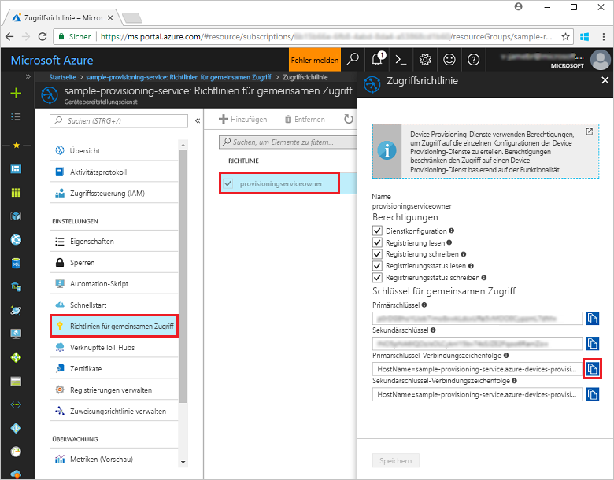
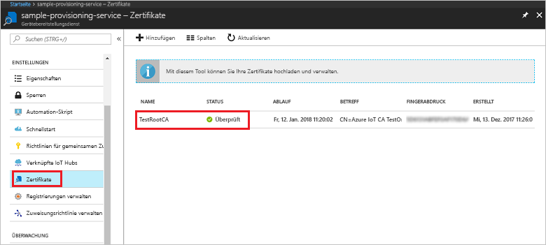
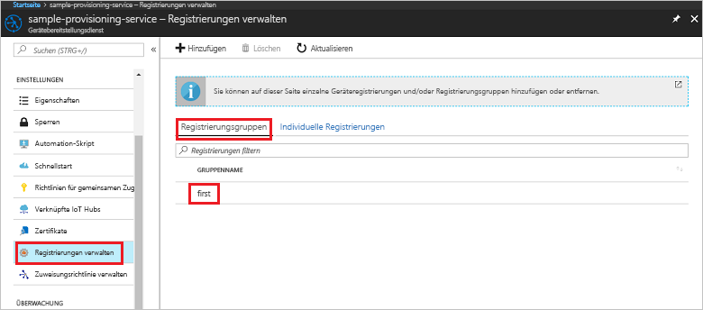

# <a name="enroll-x509-devices-to-iot-hub-device-provisioning-service-using-nodejs-service-sdk"></a>Registrieren von X.509-Geräten für den IoT Hub Device Provisioning-Dienst per Node.js-Dienst-SDK

[!INCLUDE [iot-dps-selector-quick-enroll-device-x509](../../includes/iot-dps-selector-quick-enroll-device-x509.md)]


Mit diesen Schritten wird veranschaulicht, wie Sie programmgesteuert eine Registrierungsgruppe für ein X.509-Zwischen- oder -Stammzertifikat einer Zertifizierungsstelle erstellen können, indem Sie das [Node.js-Dienst-SDK](https://github.com/Azure/azure-iot-sdk-node) und ein Node.js-Beispiel verwenden. Diese Schritte funktionieren für Windows- und Linux-Computer, aber in diesem Artikel wird nur ein Windows-Entwicklungscomputer verwendet.
 

## <a name="prerequisites"></a>Voraussetzungen

- Führen Sie die Schritte unter [Einrichten des IoT Hub Device Provisioning-Diensts über das Azure-Portal](./quick-setup-auto-provision.md) aus. 

 
- Stellen Sie sicher, dass auf Ihrem Computer [Node.js v4.0 oder höher](https://nodejs.org) installiert ist.


- Sie benötigen eine PEM-Datei mit einem X.509-Zwischen- oder -Stammzertifikat einer Zertifizierungsstelle, das für Ihren Provisioning-Dienst hochgeladen und überprüft wurde. Das **Azure IoT c-SDK** enthält Tools zum Erstellen einer X.509-Zertifikatkette, Hochladen eines Stamm- oder Zwischenzertifikats aus dieser Kette und Durchführen eines Eigentumsnachweises über den Dienst, um das Zertifikat zu überprüfen. Klonen Sie für die Nutzung dieser Tools das [Azure IoT c-SDK](https://github.com/Azure/azure-iot-sdk-c), und führen Sie die Schritte unter [azure-iot-sdk-c\tools\CACertificates\CACertificateOverview.md](https://github.com/Azure/azure-iot-sdk-c/blob/master/tools/CACertificates/CACertificateOverview.md) auf Ihrem Computer aus.

## <a name="create-the-enrollment-group-sample"></a>Erstellen des Registrierungsgruppenbeispiels 

 
1. Führen Sie in einem Befehlsfenster in Ihrem Arbeitsordner Folgendes aus:
  
     ```cmd\sh
     npm install azure-iot-provisioning-service
     ```  

2. Erstellen Sie mit einem Text-Editor in Ihrem Arbeitsordner die Datei **create_enrollment_group.js**. Fügen Sie der Datei den folgenden Code hinzu, und speichern Sie sie:

    ```
    'use strict';
    var fs = require('fs');

    var provisioningServiceClient = require('azure-iot-provisioning-service').ProvisioningServiceClient;

    var serviceClient = provisioningServiceClient.fromConnectionString(process.argv[2]);

    var enrollment = {
      enrollmentGroupId: 'first',
      attestation: {
        type: 'x509',
        x509: {
          signingCertificates: {
            primary: {
              certificate: fs.readFileSync(process.argv[3], 'utf-8').toString()
            }
          }
        }
      },
      provisioningStatus: 'disabled'
    };

    serviceClient.createOrUpdateEnrollmentGroup(enrollment, function(err, enrollmentResponse) {
      if (err) {
        console.log('error creating the group enrollment: ' + err);
      } else {
        console.log("enrollment record returned: " + JSON.stringify(enrollmentResponse, null, 2));
        enrollmentResponse.provisioningStatus = 'enabled';
        serviceClient.createOrUpdateEnrollmentGroup(enrollmentResponse, function(err, enrollmentResponse) {
          if (err) {
            console.log('error updating the group enrollment: ' + err);
          } else {
            console.log("updated enrollment record returned: " + JSON.stringify(enrollmentResponse, null, 2));
          }
        });
      }
    });
    ````

## <a name="run-the-enrollment-group-sample"></a>Ausführen des Registrierungsgruppenbeispiels
 
1. Zum Ausführen des Beispiels benötigen Sie die Verbindungszeichenfolge für Ihren Provisioning-Dienst. 
    1. Melden Sie sich beim Azure-Portal an, klicken Sie im Menü auf der linken Seite auf die Schaltfläche **Alle Ressourcen**, und öffnen Sie Ihren Device Provisioning-Dienst. 
    2. Klicken Sie auf **Freigegebene Zugriffsrichtlinien** und dann auf die gewünschte Zugriffsrichtlinie, um die dazugehörigen Eigenschaften zu öffnen. Kopieren Sie im Fenster **Zugriffsrichtlinie** die Primärschlüssel-Verbindungszeichenfolge, und notieren Sie sie. 

     


3. Wie unter [Voraussetzungen](#prerequisites) angegeben, benötigen Sie auch eine PEM-Datei mit einem X.509-Zwischen- oder -Stammzertifikat einer Zertifizierungsstelle, das für Ihren Provisioning-Dienst hochgeladen und überprüft wurde. Sie können überprüfen, ob Ihr Zertifikat hochgeladen und überprüft wurde, indem Sie auf der Zusammenfassungsseite des Device Provisioning-Diensts im Azure-Portal auf **Zertifikate** klicken. Suchen Sie nach dem Zertifikat, das Sie für die Gruppenregistrierung verwenden möchten, und stellen Sie sicher, dass der Statuswert *verified* (Überprüft) lautet.

     

1. Führen Sie den folgenden Befehl aus (einschließlich der Anführungszeichen der Befehlsargumente), um eine Registrierungsgruppe für Ihr Zertifikat zu erstellen:
 
     ```cmd\sh
     node create_enrollment_group.js "<the connection string for your provisioning service>" "<your certificate's .pem file>"
     ```
 
3. Bei einer erfolgreichen Erstellung werden im Befehlsfenster die Eigenschaften der neuen Registrierungsgruppe angezeigt.

     

4. Stellen Sie sicher, dass die Registrierungsgruppe erstellt wurde. Wählen Sie im Azure-Portal auf dem Zusammenfassungsblatt des Device Provisioning-Diensts die Option **Registrierungen verwalten**. Wählen Sie die Registerkarte **Registrierungsgruppen** aus, und vergewissern Sie sich, dass der neue Registrierungseintrag (*first*) vorhanden ist.

     
 
## <a name="clean-up-resources"></a>Bereinigen von Ressourcen
Wenn Sie planen, sich die Beispiele des Node.js-Diensts näher anzusehen, sollten Sie die in dieser Schnellstartanleitung erstellten Ressourcen nicht bereinigen. Falls Sie nicht fortfahren möchten, führen Sie die folgenden Schritte aus, um alle erstellten Azure-Ressourcen zu löschen, die im Rahmen dieser Schnellstartanleitung erstellt wurden:
 
1. Schließen Sie das Ausgabefenster des Node.js-Beispiels auf Ihrem Computer.
2. Navigieren Sie im Azure-Portal zu Ihrem Device Provisioning-Dienst, klicken Sie auf **Registrierungen verwalten**, und wählen Sie anschließend die Registerkarte **Registrierungsgruppen**. Wählen Sie die *Registrierungs-ID* für den Registrierungseintrag aus, den Sie mit dieser Schnellstartanleitung erstellt haben, und klicken Sie oben auf dem Blatt auf die Schaltfläche **Löschen**.  
3. Klicken Sie im Azure-Portal für Ihren Device Provisioning-Dienst auf **Zertifikate**, auf das Zertifikat, das Sie für diesen Schnellstart hochgeladen haben, und dann oben im Fenster **Zertifikatdetails** auf die Schaltfläche **Löschen**.  
 
## <a name="next-steps"></a>Nächste Schritte
In dieser Schnellstartanleitung haben Sie eine Gruppenregistrierung für ein X.509-Zwischen- oder -Stammzertifikat einer Zertifizierungsstelle erstellt, indem Sie den Azure IoT Hub Device Provisioning-Dienst verwendet haben. Ausführlichere Informationen zur Gerätebereitstellung finden Sie im Tutorial zur Einrichtung des Device Provisioning-Diensts über das Azure-Portal. 
 
> [!div class="nextstepaction"]
> [Tutorials für den Azure IoT Hub Device Provisioning-Dienst](./tutorial-set-up-cloud.md)