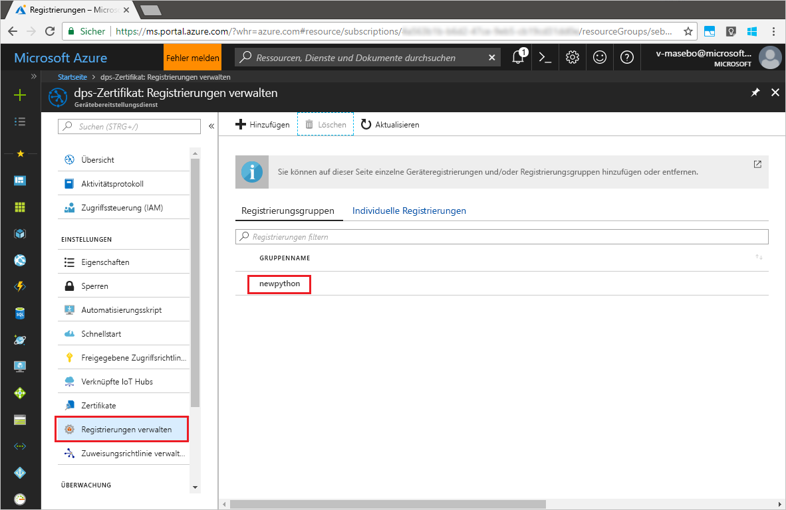

# <a name="enroll-x509-devices-to-iot-hub-device-provisioning-service-using-python-provisioning-service-sdk"></a>Registrieren von X.509-Geräten für den IoT Hub Device Provisioning-Dienst per Python Provisioning-Dienst-SDK
[!INCLUDE [iot-dps-selector-quick-enroll-device-x509](../../includes/iot-dps-selector-quick-enroll-device-x509.md)]

Diese Schritte veranschaulichen, wie Sie eine Gruppe mit simulierten X.509-Geräten programmgesteuert für den Azure IoT Hub Device Provisioning-Dienst registrieren, indem Sie das [Python Provisioning-Dienst-SDK](https://github.com/Azure/azure-iot-sdk-python/tree/master/provisioning_service_client) zusammen mit einer Python-Beispielanwendung verwenden. Das Java-Dienst-SDK funktioniert auf Windows- und Linux-Computern, aber in diesem Artikel wird nur ein Windows-Entwicklungscomputer verwendet, um die einzelnen Schritte des Registrierungsprozesses zu veranschaulichen.

Führen Sie vor dem Fortfahren zunächst das [Einrichten des IoT Hub Device Provisioning-Diensts über das Azure-Portal](./quick-setup-auto-provision.md) durch.

> [!NOTE]
> Dieser Schnellstart unterstützt nur die Option **Registrierungsgruppe**. Es wird daran gearbeitet, die Option **Individuelle Registrierung** über das _Python Provisioning-Dienst-SDK_ zu ermöglichen.
> 

<a id="prepareenvironment"></a>

## <a name="prepare-the-environment"></a>Vorbereiten der Umgebung 

1. Laden Sie [Python 2.x oder 3.x](https://www.python.org/downloads/) herunter, und installieren Sie es. Stellen Sie je nach Einrichtung sicher, dass die 32-Bit- bzw. die 64-Bit-Installation verwendet wird. Fügen Sie Python Ihren plattformspezifischen Umgebungsvariablen hinzu, wenn Sie während der Installation dazu aufgefordert werden. 

1. Wählen Sie eine der folgenden Optionen:

    - Erstellen und kompilieren Sie das **Azure IoT Python SDK**. Eine Anleitung für die Erstellung der Python-Pakete finden Sie [hier](https://github.com/Azure/azure-iot-sdk-python/blob/master/doc/python-devbox-setup.md). Installieren Sie bei Verwendung des Windows-Betriebssystems auch das [Visual C++ Redistributable Package](http://www.microsoft.com/download/confirmation.aspx?id=48145), um die Verwendung nativer DLLs aus Python zu ermöglichen.

    - [Installieren oder aktualisieren Sie *pip*, das Python-Paketverwaltungssystem](https://pip.pypa.io/en/stable/installing/), und installieren Sie das Paket mit dem folgenden Befehl:

        ```cmd/sh
        pip install azure-iothub-provisioningserviceclient
        ```

1. Sie benötigen eine PEM-Datei mit einem X.509-Zwischen- oder -Stammzertifikat einer Zertifizierungsstelle, das für Ihren Provisioning-Dienst hochgeladen und überprüft wurde. Das **Azure IoT C SDK** enthält Tools zum Erstellen einer X.509-Zertifikatkette, Hochladen eines Stamm- oder Zwischenzertifikats aus dieser Kette und Durchführen eines Eigentumsnachweises über den Dienst, um das Zertifikat zu überprüfen. Klonen Sie für die Nutzung dieser Tools das [Azure IoT C-SDK](https://github.com/Azure/azure-iot-sdk-c), und führen Sie die Schritte unter [azure-iot-sdk-c\tools\CACertificates\CACertificateOverview.md](https://github.com/Azure/azure-iot-sdk-c/blob/master/tools/CACertificates/CACertificateOverview.md) auf Ihrem Computer aus.


## <a name="modify-the-python-sample-code"></a>Ändern des Python-Beispielcodes

In diesem Abschnitt wird veranschaulicht, wie Sie die Bereitstellungsdetails Ihres X.509-Geräts dem Beispielcode hinzufügen. 

1. Erstellen Sie mit einem Text-Editor die neue Datei **EnrollmentGroup.py**.

1. Fügen Sie am Anfang der Datei **EnrollmentGroup.py** die folgenden `import`-Anweisungen und Variablen hinzu: Ersetzen Sie anschließend `dpsConnectionString` durch Ihre Verbindungszeichenfolge, die sich im **Azure-Portal** unter dem **Device Provisioning-Dienst** unter **Freigegebene Zugriffsrichtlinien** befindet. Ersetzen Sie den Zertifikatplatzhalter durch das Zertifikat, das Sie zuvor unter [Vorbereiten der Umgebung](quick-enroll-device-x509-python.md#prepareenvironment) erstellt haben. Erstellen Sie abschließend eine eindeutige `registrationid`, und achten Sie darauf, dass sie nur Kleinbuchstaben, Zahlen und Bindestriche enthält.  
   
    ```python
    from provisioningserviceclient import ProvisioningServiceClient
    from provisioningserviceclient.models import EnrollmentGroup, AttestationMechanism

    CONNECTION_STRING = "{dpsConnectionString}"

    SIGNING_CERT = """-----BEGIN CERTIFICATE-----
    XXXXXXXXXXXXXXXXXXXXXXXXXXXXXXXXXXXXXXXXXXXXXXXXXXXXXXXXXXXXXXXX
    XXXXXXXXXXXXXXXXXXXXXXXXXXXXXXXXXXXXXXXXXXXXXXXXXXXXXXXXXXXXXXXX
    XXXXXXXXXXXXXXXXXXXXXXXXXXXXXXXXXXXXXXXXXXXXXXXXXXXXXXXXXXXXXXXX
    XXXXXXXXXXXXXXXXXXXXXXXXXXXXXXXXXXXXXXXXXXXXXXXXXXXXXXXXXXXXXXXX
    XXXXXXXXXXXXXXXXXXXXXXXXXXXXXXXXXXXXXXXXXXXXXXXXXXXXXXXXXXXXXXXX
    XXXXXXXXXXXXXXXXXXXXXXXXXXXXXXXXXXXXXXXXXXXXXXXXXXXXXXXXXXXXXXXX
    XXXXXXXXXXXXXXXXXXXXXXXXXXXXXXXXXXXXXXXXXXXXXXXXXXXXXXXXXXXXXXXX
    XXXXXXXXXXXXXXXXXXXXXXXXXXXXXXXXXXXXXXXXXXXXXXXXXXXXXXXXXXXXXXXX
    XXXXXXXXXXXXXXXXXXXXXXXXXXXXXXXXXXXXXXXXXXXXXXXXXXXXXXXXXXXXXXXX
    XXXXXXXXXXXXXXXXXXXXXXXXXXXXXXXXXXXXXXXXXXXXXXXXXXXXXXXXXXXXXXXX
    XXXXXXXXXXXXXXXXXXXXXXXXXXXXXXXXXXXXXXXXXXXXXXXXXXXXXXXXXXXXXXXX
    XXXXXXXXXXXXXXXXXXXXXXXXXXXXXXXXXXXXXXXXXXXXXXXXXXXXXXXXXXXXXXXX
    XXXXXXXXXXXXXXXXXXXXXXXXXXXXXXXXXXXXXXXXXXXXXXXXXXXXXXXXXXXXXXXX
    XXXXXXXXXXXXXXXXXXXXXXXXXXXXXXXXXXXXXXXXXXXXXXXXXXXXXXXXXXXXXXXX
    XXXXXXXXXXXXXXXXXXXXXXXXXXXXXXXXXXXXXXXXXXXXXXXXXXXXXXXX
    -----END CERTIFICATE-----"""

    GROUP_ID = "{registrationid}"
    ```

1. Fügen Sie die folgende Funktion und den Funktionsaufruf hinzu, um die Erstellung der Gruppenregistrierung zu implementieren:
   
    ```python
    def main():
        print ( "Initiating enrollment group creation..." )

        psc = ProvisioningServiceClient.create_from_connection_string(CONNECTION_STRING)
        att = AttestationMechanism.create_with_x509_signing_certs(SIGNING_CERT)
        eg = EnrollmentGroup.create(GROUP_ID, att)

        eg = psc.create_or_update(eg)
    
        print ( "Enrollment group created." )

    if __name__ == '__main__':
        main()
    ```

1. Speichern und schließen Sie die Datei **EnrollmentGroup.py**.
 

## <a name="run-the-sample-group-enrollment"></a>Ausführen der Beispielgruppenregistrierung

1. Öffnen Sie eine Eingabeaufforderung, und führen Sie das Skript aus.

    ```cmd/sh
    python EnrollmentGroup.py
    ```

1. Überprüfen Sie die Ausgabe darauf, ob die Registrierung erfolgreich ist.

1. Navigieren Sie im Azure-Portal zu Ihrem Provisioning-Dienst. Klicken Sie auf **Registrierungen verwalten**. Beachten Sie, dass Ihre Gruppe mit X.509-Geräten unter der Registerkarte **Registrierungsgruppen** mit dem zuvor erstellten Namen `registrationid` angezeigt wird. 

      


## <a name="clean-up-resources"></a>Bereinigen von Ressourcen
Wenn Sie planen, sich das Beispiel des Java-Diensts näher anzusehen, sollten Sie die in dieser Schnellstartanleitung erstellten Ressourcen nicht bereinigen. Falls Sie nicht fortfahren möchten, führen Sie die folgenden Schritte aus, um alle erstellten Ressourcen zu löschen, die im Rahmen dieser Schnellstartanleitung erstellt wurden:

1. Schließen Sie das Ausgabefenster des Java-Beispiels auf Ihrem Computer.
1. Schließen Sie das Fenster _X509 Cert Generator_ auf Ihrem Computer.
1. Navigieren Sie im Azure-Portal zu Ihrem Device Provisioning-Dienst, klicken Sie auf **Registrierungen verwalten**, und wählen Sie anschließend die Registerkarte **Registrierungsgruppen**. Wählen Sie den *GRUPPENNAMEN* für die X.509-Geräte aus, die Sie mit dieser Schnellstartanleitung registriert haben, und klicken Sie oben auf dem Blatt auf die Schaltfläche **Löschen**.  


## <a name="next-steps"></a>Nächste Schritte
In dieser Schnellstartanleitung haben Sie eine simulierte Gruppe mit X.509-Geräten für Ihren Device Provisioning-Dienst registriert. Ausführlichere Informationen zur Gerätebereitstellung finden Sie im Tutorial zur Einrichtung des Device Provisioning-Diensts über das Azure-Portal. 

> [!div class="nextstepaction"]
> [Tutorials für den Azure IoT Hub Device Provisioning-Dienst](./tutorial-set-up-cloud.md)
