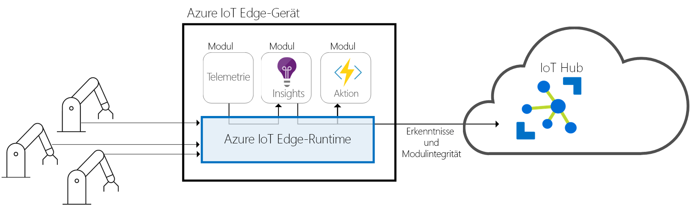
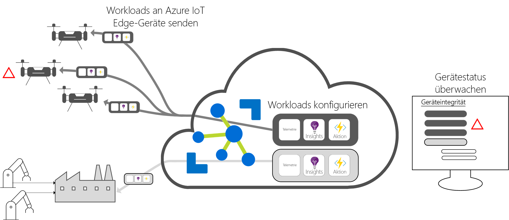

# Was ist Azure IoT Edge?

Azure IoT Edge verschiebt Cloudanalysen und benutzerdefinierte Geschäftslogik auf Geräte, damit sich Ihre Organisation auf geschäftliche Erkenntnisse konzentrieren kann und sich nicht mit der Datenverwaltung befassen muss. Konfigurieren Sie Ihre IoT-Software, stellen Sie sie über Standardcontainer auf Geräten bereit, und überwachen Sie alles über die Cloud.

>[!NOTE]
>Azure IoT Edge ist im Free- und Standard-Tarif von IoT Hub verfügbar. Der Free-Tarif ist ausschließlich für Tests und Bewertungen vorgesehen. Weitere Informationen zu den Tarifen „Basic“ und „Standard“ finden Sie unter [Choose the right IoT Hub tier for your solution](../iot-hub/iot-hub-scaling.md) (Wählen des passenden IoT Hub-Tarifs für Ihre Lösung).

Analysen (Analytics) sind die Grundlage des geschäftlichen Nutzens von IoT-Lösungen, aber nicht alle Analysen müssen sich in der Cloud befinden. Wenn Sie möchten, dass ein Gerät so schnell wie möglich auf Notfälle reagiert, können Sie die Anomalieerkennung auf dem Gerät selbst durchführen. Ebenso können Sie die Datenbereinigung und -aggregierung lokal durchführen, falls Sie die Bandbreitenkosten reduzieren und die Übertragung von Rohdaten im Terabyte-Bereich vermeiden möchten. Senden Sie die Erkenntnisse anschließend zur Analyse an die Cloud. 

Azure IoT Edge besteht aus drei Komponenten:
* IoT Edge-Module sind Container, die Azure-Dienste, Drittanbieterdienste oder Ihren eigenen Code ausführen. Module werden auf IoT Edge-Geräten bereitgestellt und lokal auf diesen Geräten ausgeführt. 
* Die IoT Edge-Laufzeit wird auf jedem IoT Edge-Gerät ausgeführt und dient zum Verwalten der Module, die auf einem Gerät jeweils bereitgestellt wurden. 
* Mit einer cloudbasierten Schnittstelle können Sie für IoT Edge-Geräte die Remoteüberwachung und -verwaltung durchführen.

## IoT Edge-Module

IoT Edge-Module sind Ausführungseinheiten, die als Docker-kompatible Container implementiert werden und Ihre Geschäftslogik im Edge-Bereich ausführen. Es können mehrere Module konfiguriert werden, die miteinander kommunizieren und eine Pipeline für die Datenverarbeitung bilden. Sie können benutzerdefinierte Module entwickeln oder bestimmte Azure-Dienste in Modulen verpacken, die offline und im Edge-Bereich Erkenntnisse liefern. 

### Künstliche Intelligenz im Edge-Bereich

Mit Azure IoT Edge können Sie eine komplexe Ereignisverarbeitung, Machine Learning, Bilderkennung und andere KI-Komponenten mit hohem Nutzen bereitstellen, ohne diese intern schreiben zu müssen. Azure-Dienste wie Azure Functions, Azure Stream Analytics und Azure Machine Learning können allesamt lokal per Azure IoT Edge ausgeführt werden, aber Sie sind nicht auf Azure-Dienste beschränkt. Alle Benutzer können KI-Module erstellen und über den Azure Marketplace für die Community verfügbar machen. 

### Verwenden von eigenem Code

Wenn Sie Ihren eigenen Code auf Ihren Geräten bereitstellen möchten, wird dies von Azure IoT Edge ebenfalls unterstützt. Azure IoT Edge enthält das gleiche Programmiermodell wie die anderen Azure IoT-Dienste. Derselbe Code kann auf einem Gerät oder in der Cloud ausgeführt werden. Azure IoT Edge unterstützt sowohl Linux als auch Windows, damit Sie für die Codierung die Plattform Ihrer Wahl nutzen können. Java, .NET Core 2.0, Node.js, C und Python werden unterstützt, damit Ihre Entwickler das Codieren in einer vertrauten Sprache durchführen und vorhandene Geschäftslogik verwenden können.

## IoT Edge-Laufzeit

Mit der Azure IoT Edge-Laufzeit wird die benutzerdefinierte Logik und Cloudlogik auf IoT Edge-Geräten aktiviert. Sie befindet sich auf dem IoT Edge-Gerät und ist für die Durchführung von Verwaltungs- und Kommunikationsvorgängen bestimmt. Mit der Laufzeit werden mehrere Funktionen durchgeführt:

* Installieren und Aktualisieren von Workloads auf dem Gerät
* Aufrechterhalten von Azure IoT Edge-Sicherheitsstandards auf dem Gerät
* Sicherstellen, dass die IoT Edge-Module immer ausgeführt werden
* Melden der Modulintegrität an die Cloud für die Remoteüberwachung
* Verwalten der Kommunikation zwischen nachgeschalteten Blattknotengeräten und einem IoT Edge-Gerät, zwischen Modulen auf einem IoT Edge-Gerät sowie zwischen einem IoT Edge-Gerät und der Cloud.

Sie können frei entscheiden, wie Sie ein Azure IoT Edge-Gerät einsetzen. Die Runtime wird häufig zum Bereitstellen von KI-Komponenten für Gateways verwendet, mit denen Daten anderer lokaler Geräte aggregiert und verarbeitet werden. Dieses Bereitstellungsmodell ist jedoch nur eine der möglichen Optionen. Bei Blattknotengeräten kann es sich auch um Azure IoT Edge-Geräte handeln. Dabei spielt es keine Rolle, ob sie mit einem Gateway oder direkt mit der Cloud verbunden sind.

Die Azure IoT Edge-Laufzeit kann auf einem umfangreichen IoT-Gerätesatz ausgeführt werden, damit die Laufzeit auf viele verschiedene Arten genutzt werden kann. Es werden sowohl Linux- als auch Windows-Betriebssysteme unterstützt, und Hardwaredetails werden abstrahiert. Verwenden Sie ein kleineres Gerät als einen Raspberry Pi 3, wenn Sie nicht viele Daten verarbeiten oder einen Industrieserver verwenden, um ressourcenintensive Workloads auszuführen.

## IoT Edge-Cloudschnittstelle

Das Verwalten des Softwarelebenszyklus für Unternehmensgeräte ist kompliziert. Die Verwaltung des Softwarelebenszyklus für Millionen von heterogenen IoT-Geräten ist sogar noch schwieriger. Workloads müssen für einen bestimmten Typ von Gerät erstellt und konfiguriert, bedarfsabhängig auf Millionen von Geräten Ihrer Lösung bereitgestellt und dann überwacht werden, um Geräte mit Fehlfunktionen zu ermitteln. Diese Aktivitäten können nicht pro Gerät durchgeführt werden und müssen bedarfsabhängig erfolgen.

Azure IoT Edge kann nahtlos in Azure IoT Solution Accelerators integriert werden, um als Steuerungsebene für die Anforderungen Ihrer Lösung zu dienen. Mit Clouddiensten haben Sie folgende Möglichkeiten:

* Erstellen und konfigurieren Sie eine Workload, die auf einem bestimmten Typ von Gerät ausgeführt wird.
* Senden Sie eine Workload an eine Gruppe von Geräten.
* Überwachen Sie Workloads, die auf Geräten im Feld ausgeführt werden.

## Nächste Schritte

Probieren Sie diese Konzepte aus, indem Sie [IoT Edge auf einem simulierten Gerät bereitstellen](quickstart.md).