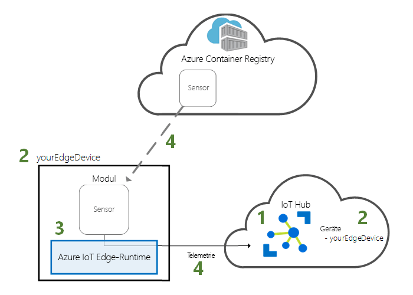
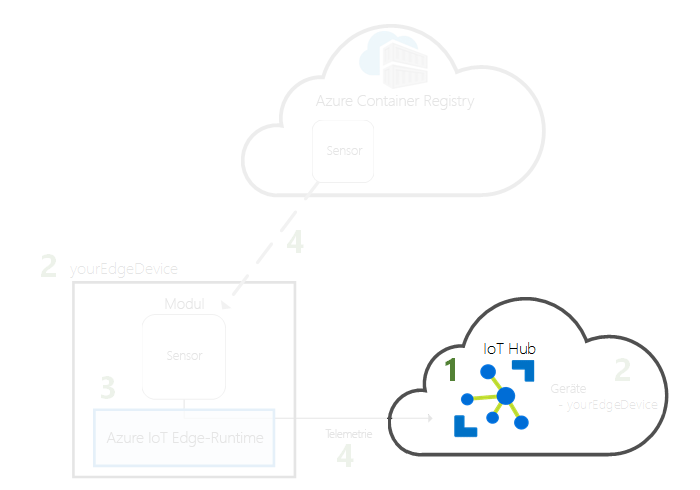
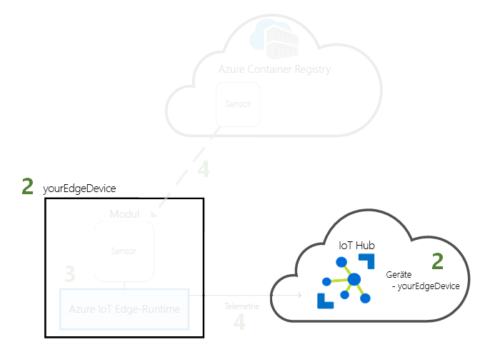
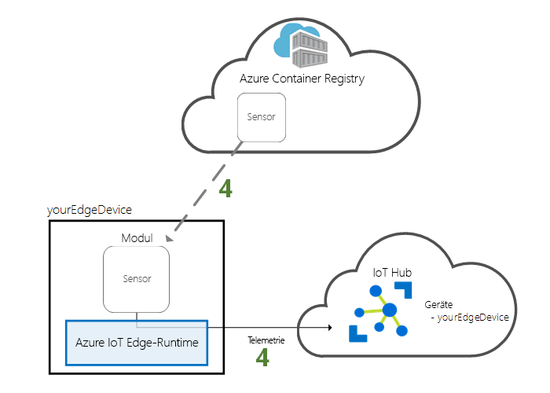

# <a name="quickstart-deploy-your-first-iot-edge-module-from-the-azure-portal-to-a-windows-device"></a>Schnellstart: Bereitstellen des ersten IoT Edge-Moduls aus dem Azure-Portal auf einem Windows-Gerät

Bei dieser Schnellstartanleitung verwenden Sie die Azure IoT Edge-Cloudschnittstelle zur Remotebereitstellung von vorgefertigtem Code auf einem IoT Edge-Gerät. Für diese Aufgabe erstellen und konfigurieren Sie zuerst einen virtuellen Windows-Computer, der als IoT Edge-Gerät fungieren soll. Anschließend können Sie darauf ein Modul bereitstellen.

In dieser Schnellstartanleitung wird Folgendes vermittelt:

1. Erstellen Sie einen IoT Hub.
2. Registrieren eines IoT Edge-Geräts für Ihren IoT Hub
3. Installieren und Starten der IoT Edge-Runtime auf Ihrem Gerät
4. Durchführen der Remotebereitstellung eines Moduls für ein IoT Edge-Gerät und Senden von Telemetriedaten an den IoT Hub



Das Modul, das Sie in dieser Schnellstartanleitung bereitstellen, ist ein simulierter Sensor, mit dem Daten zu Temperatur, Luftfeuchtigkeit und Luftdruck generiert werden. Die anderen Tutorials zu Azure IoT Edge bauen darauf auf und erläutern die Bereitstellung von Modulen, mit denen die simulierten Daten analysiert werden, um geschäftsrelevante Erkenntnisse zu gewinnen.

Wenn Sie über kein aktives Azure-Abonnement verfügen, können Sie ein [kostenloses Konto](https://azure.microsoft.com/free) erstellen, bevor Sie beginnen.

[!INCLUDE [cloud-shell-try-it.md](../../includes/cloud-shell-try-it.md)]

Sie verwenden die Azure CLI für viele Schritte in dieser Schnellstartanleitung, und Azure IoT verfügt über eine Erweiterung zur Aktivierung der zusätzlichen Funktionalität.

Fügen Sie die Azure IoT-Erweiterung der Cloud Shell-Instanz hinzu.

   ```azurecli-interactive
   az extension add --name azure-cli-iot-ext
   ```

## <a name="prerequisites"></a>Voraussetzungen

Cloudressourcen:

* Eine Ressourcengruppe zum Verwalten aller Ressourcen, die Sie in dieser Schnellstartanleitung verwenden.

   ```azurecli-interactive
   az group create --name IoTEdgeResources --location westus2
   ```

IoT Edge-Gerät:

* Ein virtueller Windows-Computer, der als IoT Edge-Gerät fungiert. Sie können diesen virtuellen Computer mit dem folgenden Befehl erstellen, wobei Sie *{password}* durch ein sicheres Kennwort ersetzen:

  ```azurecli-interactive
  az vm create --resource-group IoTEdgeResources --name EdgeVM --image MicrosoftWindowsDesktop:Windows-10:rs5-pro:latest --admin-username azureuser --admin-password {password} --size Standard_DS1_v2
  ```

  Das Erstellen und Starten des neuen virtuellen Computers kann ein paar Minuten in Anspruch nehmen. Sie können dann eine RDP-Datei herunterladen, die Sie verwenden, wenn Sie eine Verbindung mit Ihrem virtuellen Computer herstellen:

  1. Navigieren Sie zu Ihrem neuen virtuellen Windows-Computer im Azure-Portal.
  1. Wählen Sie **Verbinden**aus.
  1. Wählen Sie auf der Registerkarte **RDP** **RDP-Datei herunterladen** aus.

  Öffnen Sie diese Datei mit der Remotedesktopverbindung, um eine Verbindung mit Ihrem virtuellen Windows-Computer unter Verwendung des Administratornamens und Kennworts herzustellen, die Sie mit dem Befehl `az vm create` angegeben haben.


> [!NOTE]
> In dieser Schnellstartanleitung wird aus Gründen der Einfachheit ein virtueller Windows-Desktopcomputer verwendet. Weitere Informationen darüber, welche Windows-Betriebssysteme für Produktionsszenarien allgemein verfügbar sind, finden Sie unter [Von Azure IoT Edge unterstützte Systeme](support.md).

## <a name="create-an-iot-hub"></a>Erstellen eines IoT Hubs

Beginnen Sie den Schnellstart, indem Sie an der Azure-Befehlszeilenschnittstelle einen IoT-Hub erstellen.



Der kostenlose IoT Hub kann für diesen Schnellstart verwendet werden. Wenn Sie den IoT Hub schon einmal genutzt und bereits einen kostenlosen Hub erstellt haben, können Sie diesen IoT Hub verwenden. Jedes Abonnement kann nur über einen kostenlosen IoT Hub verfügen.

Mit dem folgenden Code wird ein kostenloser **F1**-Hub in der Ressourcengruppe **IoTEdgeResources** erstellt. Ersetzen Sie *{hub_name}* durch einen eindeutigen Namen für Ihren IoT Hub.

   ```azurecli-interactive
   az iot hub create --resource-group IoTEdgeResources --name {hub_name} --sku F1
   ```

   Wenn Sie eine Fehlermeldung erhalten, da bereits ein kostenloser Hub in Ihrem Abonnement vorhanden ist, ändern Sie die SKU auf **S1**. Sollten Sie eine Fehlermeldung mit dem Hinweis erhalten, dass der IoT Hub-Name nicht verfügbar ist, ist bereits ein Hub mit diesem Namen vorhanden. Probieren Sie einen neuen Namen aus.

## <a name="register-an-iot-edge-device"></a>Registrieren eines IoT Edge-Geräts

Registrieren Sie ein IoT Edge-Gerät bei Ihrem neu erstellten IoT Hub.


Erstellen Sie eine Geräteidentität für das simulierte Gerät, sodass es mit dem IoT Hub kommunizieren kann. Die Geräteidentität befindet sich in der Cloud, und Sie verwenden eine eindeutige Geräte-Verbindungszeichenfolge, um einem physischen Gerät eine Geräteidentität zuzuordnen.

Da IoT Edge-Geräte sich von typischen IoT-Geräten unterscheiden und auf unterschiedliche Weise verwaltet werden können, deklarieren Sie diese Identität mit dem Flag `--edge-enabled` für ein IoT Edge-Gerät.

1. Geben Sie in Azure Cloud Shell den folgenden Befehl ein, um in Ihrem Hub ein Gerät mit dem Namen **myEdgeDevice** zu erstellen.

   ```azurecli-interactive
   az iot hub device-identity create --device-id myEdgeDevice --hub-name {hub_name} --edge-enabled
   ```

   Falls Sie eine Fehlermeldung zu iothubowner-Richtlinienschlüsseln erhalten, überprüfen Sie, ob in Ihrer Cloud Shell-Instanz die aktuelle Version der Erweiterung „azure-cli-iot-ext“ ausgeführt wird.

2. Rufen Sie die Verbindungszeichenfolge für Ihr Gerät ab, über die Ihr physisches Gerät mit seiner Identität auf dem IoT Hub verknüpft wird.

   ```azurecli-interactive
   az iot hub device-identity show-connection-string --device-id myEdgeDevice --hub-name {hub_name}
   ```

3. Kopieren Sie den Wert des Schlüssels `connectionString` aus der JSON-Ausgabe, und speichern Sie ihn. Dieser Wert ist die Verbindungszeichenfolge des Geräts. Sie verwenden ihn im nächsten Abschnitt zum Konfigurieren der IoT Edge-Runtime.

   

## <a name="install-and-start-the-iot-edge-runtime"></a>Installieren und Starten der IoT Edge-Runtime

Installieren Sie die Azure IoT Edge-Runtime auf Ihrem IoT Edge-Gerät, und konfigurieren Sie es mit einer Geräte-Verbindungszeichenfolge.


Die IoT Edge-Runtime wird auf allen IoT Edge-Geräten bereitgestellt. Sie besteht aus drei Komponenten. Der **Daemon für die IoT Edge-Sicherheit** wird jedes Mal gestartet, wenn ein IoT Edge-Gerät gestartet wird. Hierbei wird der IoT Edge-Agent gestartet, um einen Bootstrapvorgang durchzuführen. Mit dem **IoT Edge-Agent** wird die Bereitstellung und Überwachung von Modulen auf dem IoT Edge-Gerät, einschließlich des IoT Edge-Hubs, verwaltet. Der **IoT Edge-Hub** verarbeitet die Kommunikation zwischen Modulen auf dem IoT Edge-Gerät sowie zwischen dem Gerät und IoT Hub.

Das Installationsskript beinhaltet auch ein Containermodul namens Moby, das die Containerimages auf Ihrem IoT Edge-Gerät verwaltet.

Bei der Installation der Runtime werden Sie zur Eingabe der Geräte-Verbindungszeichenfolge aufgefordert. Verwenden Sie die Zeichenfolge, die Sie über die Azure CLI abgerufen haben. Diese Zeichenfolge ordnet Ihr physisches Gerät der IoT Edge-Geräteidentität in Azure zu.

### <a name="connect-to-your-iot-edge-device"></a>Herstellen einer Verbindung mit Ihrem IoT Edge-Gerät

Die Schritte in diesem Abschnitt erfolgen alle auf Ihrem IoT Edge-Gerät, weshalb Sie eine Verbindung mit diesem virtuellen Computer über den Remotedesktop herstellen sollten.

### <a name="install-and-configure-the-iot-edge-service"></a>Installieren und Konfigurieren des IoT Edge-Diensts

Verwenden Sie PowerShell zum Herunterladen und Installieren der IoT Edge-Runtime. Verwenden Sie die aus IoT Hub abgerufene Geräte-Verbindungszeichenfolge zum Konfigurieren Ihres Geräts.

1. Falls noch nicht geschehen, führen Sie die unter [Registrieren eines neuen Azure IoT Edge-Geräts](how-to-register-device-portal.md) aufgeführten Schritte aus, um Ihr Gerät zu registrieren und die Geräteverbindungszeichenfolge abzurufen. 

2. Führen Sie PowerShell als Administrator aus.

   >[!NOTE]
   >Verwenden Sie eine AMD64-PowerShell-Sitzung, um IoT Edge zu installieren, nicht PowerShell (x86). Wenn Sie nicht sicher sind, welchen Sitzungstyp Sie verwenden, führen Sie den folgenden Befehl aus:
   >
   >```powershell
   >(Get-Process -Id $PID).StartInfo.EnvironmentVariables["PROCESSOR_ARCHITECTURE"]
   >```

3. Durch den Befehl **Deploy-IoTEdge** wird überprüft, ob Ihr Windows-Computer über eine unterstützte Version verfügt. Außerdem aktiviert der Befehl das Containerfeature und lädt die Moby-Runtime und danach die IoT Edge-Runtime herunter.

   ```powershell
   . {Invoke-WebRequest -useb aka.ms/iotedge-win} | Invoke-Expression; `
   Deploy-IoTEdge -ContainerOs Windows
   ```

4. Ihr Computer wird möglicherweise automatisch neu gestartet. Sobald Sie vom Befehl „Deploy-IoTEdge“ zum Neustart aufgefordert werden, führen Sie diesen Schritt aus. 

5. Führen Sie PowerShell erneut als Administrator aus.

6. Durch den Befehl **Initialize-IoTEdge** wird die IoT Edge-Runtime auf Ihrem Computer konfiguriert. Standardmäßig wird für den Befehl die manuelle Bereitstellung mit Windows-Containern verwendet. 

   ```powershell
   . {Invoke-WebRequest -useb aka.ms/iotedge-win} | Invoke-Expression; `
   Initialize-IoTEdge -ContainerOs Windows
   ```

7. Wenn Sie zur Eingabe von **DeviceConnectionString** aufgefordert werden, geben Sie die Zeichenfolge ein, die Sie im vorherigen Abschnitt kopiert haben. Nehmen Sie die Anführungszeichen um die Verbindungszeichenfolge nicht mit auf.

### <a name="view-the-iot-edge-runtime-status"></a>Anzeigen des Status der IoT Edge-Runtime

Vergewissern Sie sich, dass die Runtime erfolgreich installiert und konfiguriert wurde.

1. Überprüfen Sie den Status des IoT Edge-Diensts.

   ```powershell
   Get-Service iotedge
   ```

2. Sollte eine Problembehandlung für den Dienst erforderlich sein, rufen Sie die Dienstprotokolle ab.

   ```powershell
   . {Invoke-WebRequest -useb aka.ms/iotedge-win} | Invoke-Expression; Get-IoTEdgeLog
   ```

3. Zeigen Sie alle Module an, die auf Ihrem IoT Edge-Gerät ausgeführt werden. Da der Dienst gerade zum ersten Mal gestartet wurde, sollte nur das Modul **edgeAgent** ausgeführt werden. Das Modul „edgeAgent“ wird standardmäßig ausgeführt und unterstützt Sie beim Installieren und Starten von zusätzlichen Modulen, die Sie auf Ihrem Gerät bereitstellen.

   ```powershell
   iotedge list
   ```

   

Es dauert einige Minuten, bis die Installation abgeschlossen ist und das IoT Edge-Agent-Modul gestartet wird.

Ihr IoT Edge-Gerät ist jetzt konfiguriert. Es kann nun zum Ausführen von in der Cloud bereitgestellten Modulen verwendet werden.

## <a name="deploy-a-module"></a>Bereitstellen eines Moduls

Verwalten Sie Ihr Azure IoT Edge-Gerät über die Cloud, um ein Modul bereitzustellen, das Telemetriedaten an die IoT Hub-Instanz sendet.


[!INCLUDE [iot-edge-deploy-module](../../includes/iot-edge-deploy-module.md)]

## <a name="view-generated-data"></a>Anzeigen generierter Daten

In dieser Schnellstartanleitung haben Sie ein IoT Edge-Gerät registriert und die IoT Edge-Runtime darauf installiert. Anschließend haben Sie das Azure-Portal verwendet, um ein IoT Edge-Modul zur Ausführung auf dem Gerät bereitzustellen, ohne Änderungen am Gerät selbst vornehmen zu müssen.

In diesem Fall erstellt das per Pushvorgang übertragene Modul Beispieldaten, die Sie für das Testen verwenden können. Mit dem simulierten Temperatursensormodul werden Umgebungsdaten generiert, die Sie später zum Testen verwenden können. Der simulierte Sensor überwacht sowohl einen Computer als auch seine Umgebung. Beispielsweise kann sich dieser Sensor in einem Serverraum, in einer Fabrik oder in einer Windturbine befinden. Er meldet die Umgebungstemperatur und Luftfeuchtigkeit, die Computertemperatur und den Druck sowie einen Zeitstempel. In den IoT Edge-Tutorials werden diese vom Modul erstellten Daten als Testdaten für die Analyse verwendet.

Vergewissern Sie sich, dass das über die Cloud bereitgestellte Modul auf dem IoT Edge-Gerät ausgeführt wird.

```powershell
iotedge list
```

   

Zeigen Sie die vom Temperatursensormodul an die Cloud gesendeten Nachrichten an.

```powershell
iotedge logs SimulatedTemperatureSensor -f
```

   >[!TIP]
   >Bei IoT Edge-Befehlen werden beim Verweis auf Modulnamen Groß- und Kleinschreibung unterschieden.

   

Sie können die bei Ihrem IoT-Hub eingehenden Nachrichten auch mit der [Azure IoT Hub-Toolkit-Erweiterung für Visual Studio Code](https://marketplace.visualstudio.com/items?itemName=vsciot-vscode.azure-iot-toolkit) (bisher als Azure IoT-Toolkit-Erweiterung bekannt) anzeigen.

## <a name="clean-up-resources"></a>Bereinigen von Ressourcen

Wenn Sie mit den IoT Edge-Tutorials fortfahren möchten, können Sie das Gerät verwenden, das Sie in dieser Schnellstartanleitung registriert und eingerichtet haben. Andernfalls können Sie die erstellten Azure-Ressourcen löschen, um Kosten zu vermeiden.

Wenn Sie Ihren virtuellen Computer und Azure IoT Hub in einer neuen Ressourcengruppe erstellt haben, können Sie diese Gruppe und alle zugehörigen Ressourcen löschen. Überprüfen Sie den Inhalt der Ressourcengruppe, um sicherzustellen, dass sie keine Elemente enthält, die Sie behalten möchten. Wenn Sie nicht die gesamte Gruppe löschen möchten, können Sie stattdessen einzelne Ressourcen löschen.

Entfernen Sie die Gruppe **IoTEdgeResources**.

```azurecli-interactive
az group delete --name IoTEdgeResources
```

## <a name="next-steps"></a>Nächste Schritte

In dieser Schnellstartanleitung haben Sie ein IoT Edge-Gerät erstellt und die Azure IoT Edge-Cloudschnittstelle zum Bereitstellen von Code auf dem Gerät verwendet. Sie verfügen nun über ein Testgerät, das Rohdaten zu seiner Umgebung generiert.

Im nächsten Schritt richten Sie Ihre lokale Entwicklungsumgebung ein, damit Sie mit der Entwicklung von IoT Edge-Modulen für Ihre Geschäftslogik beginnen können. 

> [!div class="nextstepaction"]
> [Einstieg in die Entwicklung von IoT Edge-Modulen für Windows-Geräte](tutorial-develop-for-windows.md)
