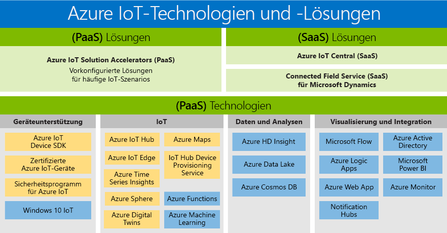

# IoT-Technologien und -Lösungen (Internet of Things, Internet der Dinge): PaaS und SaaS

Microsoft hat eine Produktpalette entwickelt, die die Bedürfnisse aller Kunden unterstützt und jedem ermöglicht, die Vorteile digitaler Transformation zu nutzen. Das Azure IoT-Produktportfolio gibt einen Überblick über die verfügbaren PaaS-/SaaS-Technologien und -Lösungen. Es stellt die beiden Wege vor, die für den Aufbau einer eigenen Lösung zur Verfügung stehen:

- Platform-as-a-Service (PaaS): Erstellen Sie Ihre Anwendung mithilfe eines der folgenden Dienste:
    - [Azure IoT Solution Accelerators:](https://www.azureiotsolutions.com/) Eine Sammlung professioneller vorkonfigurierter Lösungen, mit denen Sie die Entwicklung von benutzerdefinierten IoT-Lösungen beschleunigen können. 
    - [Azure Digital Twins:](https://azure.microsoft.com/services/digital-twins/) Ermöglicht die Modellierung der physischen Umgebung zur Erstellung kontextorientierter IoT-Lösungen mit einem Raumintelligenzgraphen und domänenspezifischen Objektmodellen.

- Software-as-a-Service (SaaS): Steigen Sie mit [Azure IoT Central](https://azure.microsoft.com/services/iot-central/), der neuen SaaS-Lösung zur Entwicklung von IoT-Anwendungen, schnell ein, ohne sich mit der Komplexität von IoT-Lösungen auseinandersetzen zu müssen. Falls Ihrem Unternehmen die Ressourcen zum Erstellen einer eigenen IoT-Lösung fehlen, bietet Azure IoT Central eine codelose IoT-Lösung, mit der Sie in wenigen Minuten Gerätemodelle, Dashboards und Regeln erstellen können.

## Lösungen

Nutzen Sie Solution Accelerators und SaaS-Angebote, um schnell einsatzbereit zu sein. Treffen Sie in vorkonfigurierten Lösungen eine Wahl, die gängige IoT-Szenarien ermöglichen, z.B. Remoteüberwachung, Predictive Maintenance und verbundene Factory, um eine umfassend anpassbare Lösung zu entwickeln. Oder nutzen Sie Azure IoT Central, eine vollständig verwaltete Komplettlösung, die leistungsfähige IoT-Szenarien unterstützt, ohne dass Sie Experte für Cloudlösungen sein müssen.

### Azure IoT Solution Accelerators (PaaS)

Azure IoT Solution Accelerators sind anpassbare PaaS-Lösungen, die ein hohes Maß an Kontrolle über Ihre IoT-Lösung bieten. Wenn Ihr Unternehmen IoT für vernetzte Prozesse implementiert oder spezifische Anpassungsanforderungen für vernetzte Produkte hat, bieten Azure IoT Solution Accelerators die benötigten Steuerungsmöglichkeiten. 

Organisationen mit einer großen Anzahl von Geräten oder Gerätemodellen und Hersteller, die nach vernetzten Werkslösungen suchen, sind Beispiele für Unternehmen, die von Azure IoT Solution Accelerators profitieren können. Für die Erstellung äußerst anpassbarer Lösungen, die auf komplexe Anforderungen zugeschnitten sind, bieten Azure IoT Solution Accelerators Folgendes: 

- Vorgefertigte Lösungen
    - Remoteüberwachung
    - Verbundene Factory
    - Predictive Maintenance
    - Gerätesimulation
- Möglichkeit der Bereitstellung in Minutenschnelle
- Beschleunigte Amortisation
- Lösungen für eine allumfassende Steuerung 
 
### Azure IoT Central (SaaS)

Azure IoT Central ist eine vollständig verwaltete SaaS-Lösung, die Ihnen bei minimaler IoT-Erfahrung einen schnellen Einstieg ermöglicht. Wenn Ihr Unternehmen Tempo gegenüber Anpassungsmöglichkeiten den Vorzug gibt, könnten SaaS-Modelle die perfekte Lösung für Ihre IoT-Implementierungsanforderungen sein. 

Unternehmen mit weniger Gerätemodellen, besser vorhersehbaren Szenarien und eingeschränkten IoT-/IT-Fähigkeiten können jetzt die Vorteile von IoT mithilfe eines SaaS-Ansatzes nutzen. Unternehmen, denen es bisher an Zeit, Geld und Know-how für die Entwicklung vernetzter Produkte gefehlt hat, können jetzt schnell mit Azure IoT Central loslegen. Microsoft ist branchenführend bei der Bereitstellung einer ausgereiften SaaS-Lösung, die die gängigen IoT-Implementierungsanforderungen erfüllt. 

- Vollständig verwaltete IoT SaaS-Lösung
- Keine Erfahrung mit der Entwicklung von Cloudlösungen erforderlich
- Konfigurierbarkeit entsprechend Ihren Anforderungen
- Ideal für einfache IoT-Anforderungen

### Vergleich von Azure IoT Solution Accelerators und Azure IoT Central

Zum Implementieren einer typischen [IoT-Lösungsarchitektur](/azure/iot-fundamentals/iot-introduction) bietet Azure IoT mehrere Optionen ([Azure IoT Solution Accelerators](/azure/iot-suite) und [Azure IoT Central](https://www.microsoft.com/internet-of-things/iot-central-saas-solutions)), die jeweils für verschiedene Gruppen von Kundenanforderungen geeignet sind.

[Azure IoT Hub](https://azure.microsoft.com/services/iot-hub/) ist die Azure-PaaS-Kernanwendung, die sowohl von Azure IoT Central als auch von Azure IoT Solution Accelerators genutzt wird. IoT Hub ermöglicht die zuverlässige und sichere bidirektionale Kommunikation zwischen Millionen von IoT-Geräten und einer Cloudlösung. Mit IoT Hub können Sie beispielsweise folgende Anforderungen der IoT-Implementierung erfüllen:

* Gerätekonnektivität und -verwaltung mit hohem Volumen
* Telemetriedatenerfassung mit hohem Volumen
* Steuerung von Geräten mit Befehlen
* Durchsetzung der Gerätesicherheit

Die Auswahl Ihres Azure IoT-Produkts ist ein wichtiger Teil der Planung Ihrer IoT-Lösung. IoT Hub ist ein individueller Azure-Dienst, von dem nicht selbst eine End-to-End-IoT-Lösung bereitgestellt wird. IoT Hub kann als Ausgangspunkt für jede IoT-Lösung verwendet werden, und Sie müssen nicht Azure IoT Solution Accelerators oder Azure IoT Central verwenden, um IoT Hub zu nutzen. Sowohl für Azure IoT Solution Accelerators als auch für Azure IoT Central wird IoT Hub zusammen mit anderen Azure-Diensten eingesetzt. In der folgenden Tabelle sind die wichtigsten Unterschiede zwischen Azure IoT Solution Accelerators und Azure IoT Central zusammengefasst, damit Sie die richtige Auswahl für Ihre Anforderungen treffen können:

|                        | Azure IoT Solution Accelerators | Azure IoT Central |
| ---------------------- | --------- | ----------- |
| Primäre Nutzung | Beschleunigen der Entwicklung einer benutzerdefinierten IoT-Lösung, für die eine maximale Flexibilität erforderlich ist. | Verkürzen des Zeitraums bis zur Markteinführung für einfach aufgebaute IoT-Lösungen, für die keine eingehende Dienstanpassung erforderlich ist. |
| Zugriff auf zugrunde liegende PaaS-Dienste          | Sie haben Zugriff auf die zugrunde liegenden Azure-Dienste, um diese zu verwalten oder je nach Bedarf zu ersetzen. | SaaS: Vollständig verwaltete Lösung, und die zugrunde liegenden Dienste werden nicht verfügbar gemacht. |
| Flexibilität            | Hoch. Der Code für die Microservices ist Open Source-Code, den Sie auf beliebige Weise ändern können. Außerdem können Sie die Bereitstellungsinfrastruktur anpassen.| Mittel. Sie können die integrierte browserbasierte Benutzeroberfläche verwenden, um das Lösungsmodell und die Aspekte der Benutzeroberfläche anzupassen. Die Infrastruktur kann nicht angepasst werden, da die unterschiedlichen Komponenten nicht verfügbar gemacht werden.|
| Kenntnisstand                 | Mittelhoch. Sie benötigen Java- oder .NET-Kenntnisse, um das Lösungs-Back-End anzupassen. Sie benötigen JavaScript-Kenntnisse, um die Visualisierung anzupassen. | Niedrig. Sie benötigen Modellierungskenntnisse, um die Lösung anzupassen. Es sind keine Codierungskenntnisse erforderlich. |
| Einstieg | Solution Accelerators ermöglichen die Implementierung von häufigen IoT-Szenarien. Die Bereitstellung dauert nur wenige Minuten. | Mit Anwendungsvorlagen und Gerätevorlagen werden vorgefertigte Modelle bereitgestellt. Die Bereitstellung dauert nur wenige Minuten. |
| Preise                | Sie können die Dienste optimieren, um die Kosten zu kontrollieren. | Einfache vorhersagbare Preisstruktur. |

Die Entscheidung, welches Produkt zum Erstellen Ihrer IoT-Lösung gewählt werden sollte, richtet sich letztendlich nach den folgenden Faktoren:

* Den Anforderungen Ihres Unternehmens
* Dem Typ der zu erstellenden Lösung
* Der Fähigkeit Ihrer Organisation, die Lösung zu erstellen und langfristig zu warten

## Technologien (PaaS)

Mit dem umfassendsten IoT-Portfolio an Plattformdiensten ermöglichen Ihnen die PaaS-Technologien (Platform-as-a-Service), die zur Azure-Plattform gehören, die einfache Erstellung, Anpassung und Kontrolle aller Aspekte Ihrer IoT-Lösung. Richten Sie die bidirektionale Kommunikation mit Milliarden von IoT-Geräten ein, und verwalten Sie Ihre IoT-Geräte nach Maß. Integrieren Sie anschließend Ihre IoT-Gerätedaten mit anderen Plattformdiensten wie Azure Cosmos DB und Azure Time Series Insights, um mithilfe Ihrer Lösung bessere Einblicke zu erhalten. 

### Unterstützung für Geräte

Starten Sie Ihr IoT-Projekt mit Zuversicht, indem Sie unsere [Azure IoT Starter Kits](https://catalog.azureiotsolutions.com/kits) nutzen, oder treffen Sie in unserem [Gerätekatalog](https://catalog.azureiotsolutions.com/) aus Hunderten von IoT-zertifizierten Geräten eine Wahl. Alle Geräte sind plattformagnostisch und im Hinblick auf eine problemlose Verbindung mit IoT Hub geprüft.
Verbinden Sie all Ihre Geräte mithilfe unserer Open-Source-[Geräte-SDKs](/azure/iot-hub/iot-hub-devguide-sdks) mit Azure IoT. Die SDKs unterstützen verschiedene Betriebssysteme wie Linux, Windows und Echtzeitbetriebssysteme sowie mehrere Programmiersprachen wie [C](https://github.com/Azure/azure-iot-sdk-c), [Node.js](https://github.com/Azure/azure-iot-sdk-node), [Java](https://github.com/Azure/azure-iot-sdk-java), [.NET](https://github.com/Azure/azure-iot-sdk-csharp) und [Python](https://github.com/Azure/azure-iot-sdk-python).

### IoT 
[Azure IoT Hub](https://azure.microsoft.com/services/iot-hub/) ist ein vollständig verwalteter Dienst, der eine zuverlässige und sichere bidirektionale Kommunikation zwischen Millionen von IoT-Geräten und einem Lösungs-Back-End ermöglicht. Der Azure IoT Hub Device Provisioning-Dienst ist ein Hilfsdienst für IoT Hub, der die JIT-Bereitstellung im richtigen IoT-Hub ohne manuelles Eingreifen ermöglicht, sodass Kunden Millionen von Geräten sicher und skalierbar bereitstellen können.

### Microsoft Edge
[Azure IoT Edge](https://azure.microsoft.com/services/iot-edge/) ist ein IoT-Dienst. Dieser Dienst ist für Kunden bestimmt, die Daten auf Geräten im Edge-Bereich des Netzwerks analysieren möchten. Indem Teile Ihrer Workload in den Edge-Bereich verschoben werden, wird die Wartezeit verkürzt. Außerdem ergibt sich die Möglichkeit von Offlineszenarien.

### Raumintelligenz
[Azure Digital Twins](https://azure.microsoft.com/services/digital-twins/) ist ein IoT-Dienst, mit dem Sie ein Modell einer physischen Umgebung erstellen können. Mit dem bereitgestellten Raumintelligenzgraphen können Sie die Beziehungen zwischen Personen, Bereichen und Geräten modellieren. Das Korrellieren von Daten aus der digitalen und physischen Welt ermöglicht die Erstellung kontextbezogener Lösungen.  

### Daten und Analysen
Nutzen Sie die Vorteile einer Vielzahl von Azure-Daten- und -Analyselösungen auf PaaS-Basis in Ihrer IoT-Lösung – von der optimalen Nutzung von Cloudintelligenz mit Azure Machine Learning über die kostengünstige Speicherung von IoT-Gerätedaten mit Azure Data Lake bis hin zur Visualisierung großer Datenmengen von IoT-Geräten mit [Azure Time Series Insights](https://azure.microsoft.com/services/time-series-insights/).

### Visualisierung und Integration
Microsoft Azure bietet eine vollständige Cloudlösung, bei der eine ständig wachsende Zusammenstellung von integrierten Clouddiensten mit einer branchenführenden Verpflichtung zum Schutz Ihrer Daten kombiniert wird. Erfahren Sie mehr über [Microsoft Azure](https://azure.microsoft.com/).

## Nächste Schritte

Sehen Sie sich den Abschnitt [„Erste Schritte“ der IoT Hub-Dokumentation](/azure/iot-hub/iot-hub-get-started) an, um sich schnell und einfach mit IoT-Features vertraut zu machen. Oder gehen Sie eines der [IoT Edge-Tutorials](/azure/iot-edge/tutorial-simulate-device-windows) durch, um praktischere Erfahrungen zu sammeln.
