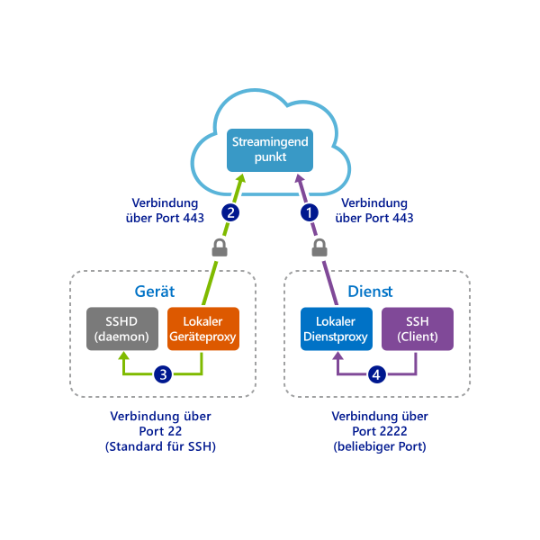

# <a name="quickstart-sshrdp-over-an-iot-hub-device-stream-using-a-c-proxy-application-preview"></a>Schnellstart: SSH/RDP über einen IoT Hub-Gerätestream unter Verwendung einer C-Proxyanwendung (Vorschauversion)

[!INCLUDE [iot-hub-quickstarts-4-selector](../../includes/iot-hub-quickstarts-4-selector.md)]

Microsoft Azure IoT Hub unterstützt derzeit Gerätestreams als [Previewfunktion](https://azure.microsoft.com/support/legal/preview-supplemental-terms/).

Über [IoT Hub-Gerätestreams](./iot-hub-device-streams-overview.md) können Dienst- und Geräteanwendungen sicher und firewallfreundlich kommunizieren. Eine Übersicht über das Setup finden Sie auf der [Seite mit Beispielen für lokale Proxys](./iot-hub-device-streams-overview.md#local-proxy-sample-for-ssh-or-rdp).

In diesem Dokument wird das Setup zum Tunneln von SSH-Datenverkehr (unter Verwendung von Port 22) über Gerätestreams beschrieben. Das Setup für RDP-Datenverkehr ist ähnlich und bedarf lediglich einer einfachen Konfigurationsänderung. Gerätestreams sind anwendungs- und protokollunabhängig. Die vorliegende Schnellstartanleitung kann daher durch Ändern der Kommunikationsports für andere Arten von Anwendungsdatenverkehr angepasst werden.

## <a name="how-it-works"></a>So funktioniert's

Die folgende Abbildung zeigt, wie die lokalen Geräte- und Dienstproxyprogramme eine End-to-End-Konnektivität zwischen den SSH-Client- und SSH-Daemonprozessen ermöglichen. Während der Public Preview-Phase unterstützt das C SDK nur geräteseitige Gerätestreams. Aus diesem Grund wird in dieser Schnellstartanleitung nur das Ausführen der lokalen Geräteproxyanwendung erläutert. Sie sollten einen der folgenden dienstseitigen Schnellstarts ausführen:

* [SSH/RDP über IoT Hub-Gerätestreams unter Verwendung einer C#-Proxyanwendung](./quickstart-device-streams-proxy-csharp.md)

* [SSH/RDP über IoT Hub-Gerätestreams unter Verwendung einer Node.js-Proxyanwendung](./quickstart-device-streams-proxy-nodejs.md)



1. Der lokale Dienstproxy stellt eine Verbindung mit IoT Hub her und initiiert einen Gerätestream an das Zielgerät.

2. Der lokale Geräteproxy schließt den Handshake für die Streaminitiierung ab und richtet über den IoT Hub-Streamingendpunkt einen End-to-End-Streamingtunnel mit der Dienstseite ein.

3. Der lokale Geräteproxy stellt eine Verbindung mit dem SSH-Daemon (SSHD) her, der auf dem Gerät am Port 22 lauscht. Dies ist konfigurierbar, wie im Abschnitt [*Ausführen der lokalen Geräteproxyanwendung*](#run-the device-local-proxy-application) beschrieben.

4. Der lokale Dienstproxy wartet auf neue SSH-Verbindungen des Benutzers, indem er am angegebenen Port (in diesem Fall: Port 2222) lauscht. Dies ist ebenfalls konfigurierbar, wie im Abschnitt [Ausführen der lokalen Geräteproxyanwendung](#run-the-device-local-proxy-application) beschrieben. Wenn der Benutzer eine Verbindung über den SSH-Client herstellt, ermöglicht der Tunnel die Übertragung von SSH-Anwendungsdatenverkehr zwischen SSH-Client und Serverprogrammen.

> [!NOTE]
> Über einen Gerätestream gesendeter SSH-Datenverkehr wird nicht direkt zwischen Dienst und Gerät gesendet, sondern über den IoT Hub-Streamingendpunkt getunnelt. Weitere Informationen finden Sie in der Beschreibung der [Vorteile der Verwendung von Iot Hub-Gerätestreams](iot-hub-device-streams-overview.md#benefits). Die Abbildung zeigt außerdem, dass der SSH-Daemon auf dem gleichen Gerät (oder Computer) ausgeführt wird wie der lokale Geräteproxy. Wenn Sie in dieser Schnellstartanleitung die IP-Adresse des SSH-Daemons angeben, können der lokale Geräteproxy und der Daemon auch auf unterschiedlichen Geräten ausgeführt werden.

[!INCLUDE [cloud-shell-try-it.md](../../includes/cloud-shell-try-it.md)]

Wenn Sie kein Azure-Abonnement besitzen, können Sie ein [kostenloses Konto](https://azure.microsoft.com/free/?WT.mc_id=A261C142F) erstellen, bevor Sie beginnen.

## <a name="prerequisites"></a>Voraussetzungen

* Die Vorschau der Gerätestreams wird derzeit nur für IoT Hubs unterstützt, die in folgenden Regionen erstellt werden:

   * **USA (Mitte)**

   * **USA, Mitte (EUAP)**

* Installieren Sie [Visual Studio 2019](https://www.visualstudio.com/vs/) mit der aktivierten Workload [Desktopentwicklung mit C++](https://www.visualstudio.com/vs/support/selecting-workloads-visual-studio-2017/).
* Installieren Sie die aktuelle Version von [Git](https://git-scm.com/download/).

* Führen Sie den folgenden Befehl aus, um Ihrer Cloud Shell-Instanz die Microsoft Azure IoT-Erweiterung für die Azure-Befehlszeilenschnittstelle hinzuzufügen. Die IoT-Erweiterung fügt der Azure-Befehlszeilenschnittstelle spezifische Befehle für IoT Hub, IoT Edge und IoT Device Provisioning Service (DPS) hinzu.

   ```azurecli-interactive
   az extension add --name azure-cli-iot-ext
   ```

## <a name="prepare-the-development-environment"></a>Vorbereiten der Entwicklungsumgebung

Für diesen Schnellstart verwenden Sie das [Azure IoT-Geräte-SDK für C](iot-hub-device-sdk-c-intro.md). Sie bereiten eine Entwicklungsumgebung vor, die zum Klonen und Erstellen des [Azure IoT C SDK](https://github.com/Azure/azure-iot-sdk-c) aus GitHub verwendet wird. Das SDK auf GitHub enthält den in dieser Schnellstartanleitung verwendeten Beispielcode. 


1. Laden Sie das [CMake-Buildsystem](https://cmake.org/download/) herunter.

    Wichtig: Die Voraussetzungen für Visual Studio (Visual Studio und die Workload „Desktopentwicklung mit C++“) müssen **vor** Beginn der Installation von `CMake` auf dem Computer installiert sein. Sobald die Voraussetzungen erfüllt sind und der Download überprüft wurde, installieren Sie das CMake-Buildsystem.

2. Öffnen Sie eine Eingabeaufforderung oder die Git Bash-Shell. Führen Sie den folgenden Befehl zum Klonen des [Azure IoT C SDK](https://github.com/Azure/azure-iot-sdk-c)-GitHub-Repositorys aus:

    
   ```
   git clone https://github.com/Azure/azure-iot-sdk-c.git --recursive -b public-preview
   ```

   Sie sollten damit rechnen, dass die Ausführung dieses Vorgangs mehrere Minuten in Anspruch nimmt.

3. Erstellen Sie ein `cmake`-Unterverzeichnis im Stammverzeichnis des Git-Repositorys, und navigieren Sie zu diesem Ordner. 

   ```
   cd azure-iot-sdk-c
   mkdir cmake
   cd cmake
   ```

4. Erstellen Sie mithilfe der folgenden Befehle aus dem Verzeichnis `cmake` eine spezifische SDK-Version für Ihre Entwicklungsclientplattform.

   * Linux:

      ```bash
      cmake ..
      make -j
      ```

   * Führen Sie unter Windows an der Developer-Eingabeaufforderung für Visual Studio 2015 oder 2017 die folgenden Befehle aus. Im `cmake`-Verzeichnis wird eine Visual Studio-Projektmappe für das simulierte Gerät generiert.

      ```cmd
      rem For VS2015
      cmake .. -G "Visual Studio 14 2015"

      rem Or for VS2017
      cmake .. -G "Visual Studio 15 2017"

      rem Then build the project
      cmake --build . -- /m /p:Configuration=Release
      ```

## <a name="create-an-iot-hub"></a>Erstellen eines IoT Hubs

[!INCLUDE [iot-hub-include-create-hub-device-streams](../../includes/iot-hub-include-create-hub-device-streams.md)]

## <a name="register-a-device"></a>Registrieren eines Geräts

Ein Gerät muss bei Ihrer IoT Hub-Instanz registriert sein, um eine Verbindung herstellen zu können. In diesem Abschnitt verwenden Sie Azure Cloud Shell mit der [IoT-Erweiterung](https://docs.microsoft.com/cli/azure/ext/azure-cli-iot-ext/iot?view=azure-cli-latest), um ein simuliertes Gerät zu registrieren.

1. Führen Sie in Azure Cloud Shell den folgenden Befehl aus, um die Geräteidentität zu erstellen.

   **YourIoTHubName**: Ersetzen Sie diesen Platzhalter unten durch den Namen, den Sie für Ihren IoT-Hub wählen.

   **MyDevice**: Der für das registrierte Gerät angegebene Name. Verwenden Sie „MyDevice“ wie gezeigt. Wenn Sie für Ihr Gerät einen anderen Namen auswählen, müssen Sie diesen innerhalb des gesamten Artikels verwenden und den Gerätenamen in den Beispielanwendungen aktualisieren, bevor Sie sie ausführen.

    ```azurecli-interactive
    az iot hub device-identity create --hub-name YourIoTHubName --device-id MyDevice
    ```

2. Führen Sie die folgenden Befehle in Azure Cloud Shell aus, um die _Geräteverbindungszeichenfolge_ für das registrierte Gerät abzurufen:

   **YourIoTHubName**: Ersetzen Sie diesen Platzhalter unten durch den Namen, den Sie für Ihren IoT-Hub wählen.

    ```azurecli-interactive
    az iot hub device-identity show-connection-string --hub-name YourIoTHubName --device-id MyDevice --output table
    ```

    Notieren Sie sich die Geräteverbindungszeichenfolge. Diese sieht wie im folgenden Beispiel aus:

   `HostName={YourIoTHubName}.azure-devices.net;DeviceId=MyDevice;SharedAccessKey={YourSharedAccessKey}`

    Dieser Wert wird später in der Schnellstartanleitung benötigt.

## <a name="ssh-to-a-device-via-device-streams"></a>Herstellen einer SSH-Verbindung mit einem Gerät über Gerätestreams

In diesem Abschnitt richten Sie einen End-to-End-Stream ein, um SSH-Datenverkehr zu tunneln.

### <a name="run-the-device-local-proxy-application"></a>Ausführen der lokalen Geräteproxyanwendung

1. Bearbeiten Sie die Quelldatei `iothub_client_c2d_streaming_proxy_sample.c` im Ordner `iothub_client/samples/iothub_client_c2d_streaming_proxy_sample/`, und geben Sie die Geräteverbindungszeichenfolge, die IP-Adresse oder den Hostnamen des Zielgeräts sowie den SSH-Port 22 an:

   ```C
   /* Paste in the your iothub connection string  */
   static const char* connectionString = "[Connection string of IoT Hub]";
   static const char* localHost = "[IP/Host of your target machine]"; // Address of the local server to connect to.
   static const size_t localPort = 22; // Port of the local server to connect to.
   ```

2. Kompilieren Sie das Beispiel:

   ```bash
   # In Linux
   # Go to the sample's folder cmake/iothub_client/samples/iothub_client_c2d_streaming_proxy_sample
   make -j
   ```

   ```cmd
   rem In Windows
   rem Go to cmake at root of repository
   cmake --build . -- /m /p:Configuration=Release
   ```

3. Führen Sie das kompilierte Programm auf dem Gerät aus:

   ```bash
   # In Linux
   # Go to the sample's folder cmake/iothub_client/samples/iothub_client_c2d_streaming_proxy_sample
   ./iothub_client_c2d_streaming_proxy_sample
   ```

   ```cmd
   rem In Windows
   rem Go to the sample's release folder cmake\iothub_client\samples\iothub_client_c2d_streaming_proxy_sample\Release
   iothub_client_c2d_streaming_proxy_sample.exe
   ```

### <a name="run-the-service-local-proxy-application"></a>Ausführen der lokalen Dienstproxyanwendung

Wie im Abschnitt [Funktionsweise](#how-it-works) bereits beschrieben, wird zur Einrichtung eines End-to-End-Streams für das Tunneln von SSH-Datenverkehr ein lokaler Proxy an jedem Ende (im Dienst und am Gerät) benötigt. Während der Public Preview-Phase unterstützt das IoT Hub C SDK nur geräteseitige Gerätestreams. Führen Sie zum Erstellen und Ausführen des lokalen Dienstproxys die verfügbaren Schritte zum Ausführen des lokalen Dienstproxys in einem der folgenden Schnellstarts aus:

   * [SSH/RDP über IoT Hub-Gerätestreams unter Verwendung von C#-Proxy-Apps](./quickstart-device-streams-proxy-csharp.md)

   * [SSH/RDP über IoT Hub-Gerätestreams unter Verwendung von Node.js-Proxy-Apps](./quickstart-device-streams-proxy-nodejs.md)

### <a name="establish-an-ssh-session"></a>Einrichten einer SSH-Sitzung

Nachdem sowohl der lokale Geräteproxy als auch der lokale Dienstproxy ausgeführt wird, können Sie über Ihr SSH-Clientprogramm eine Verbindung mit dem lokalen Dienstproxy am Port 2222 herstellen (anstatt eine Direktverbindung mit dem SSH-Daemon herzustellen).

```cmd/sh
ssh <username>@localhost -p 2222
```

Daraufhin wird die SSH-Anmeldeaufforderung für die Eingabe Ihrer Anmeldeinformationen angezeigt.

Im Anschluss sehen Sie die Konsolenausgabe des lokalen Geräteproxys, der unter `IP_address:22` eine Verbindung mit dem SSH-Daemon herstellt: 

Konsolenausgabe des SSH-Clientprogramms (Der SSH-Client kommuniziert mit dem SSH-Daemon, indem er eine Verbindung mit dem Port 22 herstellt, an dem der lokale Dienstproxy lauscht.): 

## <a name="clean-up-resources"></a>Bereinigen von Ressourcen

[!INCLUDE [iot-hub-quickstarts-clean-up-resources](../../includes/iot-hub-quickstarts-clean-up-resources-device-streams.md)]

## <a name="next-steps"></a>Nächste Schritte

In dieser Schnellstartanleitung haben Sie einen IoT-Hub eingerichtet, ein Gerät registriert, ein lokales Geräteproxyprogramm und ein lokales Dienstproxyprogramm bereitgestellt, um einen Gerätestream über IoT Hub einzurichten, sowie die Proxys zum Tunneln von SSH-Datenverkehr verwendet.

Weitere Informationen zu Gerätestreams finden Sie hier:

> [!div class="nextstepaction"]
> [IoT Hub-Gerätestreams (Vorschau)](./iot-hub-device-streams-overview.md)
