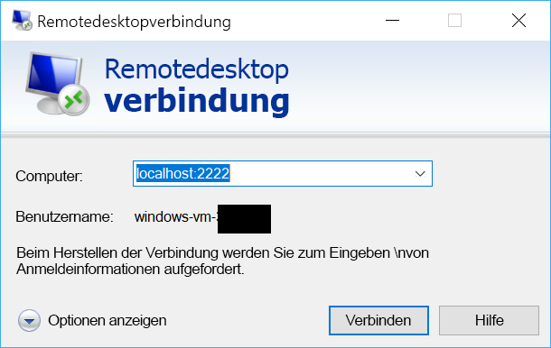

# <a name="quickstart-sshrdp-over-iot-hub-device-streams-using-c-proxy-applications-preview"></a>Schnellstart: SSH/RDP über IoT Hub-Gerätestreams unter Verwendung von C#-Proxyanwendungen (Vorschauversion)

[!INCLUDE [iot-hub-quickstarts-4-selector](../../includes/iot-hub-quickstarts-4-selector.md)]

Über [IoT Hub-Gerätestreams](./iot-hub-device-streams-overview.md) können Dienst- und Geräteanwendungen sicher und firewallfreundlich kommunizieren. In dieser Schnellstartanleitung werden zwei C#-Programme verwendet, die es ermöglichen, SSH- und RDP-Datenverkehr über einen per IoT Hub eingerichteten Gerätestream zu senden. Eine entsprechende Übersicht finden Sie auf [dieser Seite](./iot-hub-device-streams-overview.md#local-proxy-sample-for-ssh-or-rdp).

Als Erstes wird die Einrichtung für SSH (unter Verwendung des Ports 22) beschrieben. Danach erfahren Sie, wie Sie den konfigurierten Port für RDP ändern. Gerätestreams sind anwendungs- und protokollunabhängig. Das gleiche Beispiel kann daher für andere Arten von Anwendungsdatenverkehr angepasst werden (in der Regel durch Ändern der Kommunikationsports).

## <a name="how-it-works"></a>So funktioniert's

Die folgende Abbildung zeigt, wie die lokalen Geräte- und Dienstproxyprogramme in diesem Beispiel eine End-to-End-Konnektivität zwischen SSH-Client und SSH-Daemon ermöglichen. Hierbei wird davon ausgegangen, dass der Daemon auf dem gleichen Gerät ausgeführt wird wie der lokale Geräteproxy.


1. Der lokale Dienstproxy stellt eine Verbindung mit IoT Hub her und initiiert einen Gerätestream an das Zielgerät.

2. Der lokale Geräteproxy schließt den Handshake für die Streaminitiierung ab und richtet über den IoT Hub-Streamingendpunkt einen End-to-End-Streamingtunnel mit der Dienstseite ein.

3. Der lokale Geräteproxy stellt eine Verbindung mit dem SSH-Daemon (SSHD) her, der auf dem Gerät am Port 22 lauscht. Dies ist konfigurierbar, wie [weiter unten](#run-the-device-side-application) beschrieben.

4. Der lokale Dienstproxy wartet auf neue SSH-Verbindungen des Benutzers, indem er am angegebenen Port (in diesem Fall: Port `2222`) lauscht. Dies ist ebenfalls konfigurierbar, wie [weiter unten](#run-the-service-side-application) beschrieben. Wenn der Benutzer eine Verbindung über den SSH-Client herstellt, ermöglicht der Tunnel den Austausch von Anwendungsdatenverkehr zwischen SSH-Client und Serverprogrammen.

> [!NOTE]
> Über den Stream gesendeter SSH-Datenverkehr wird nicht direkt zwischen Dienst und Gerät gesendet, sondern über den IoT Hub-Streamingendpunkt getunnelt. Die dadurch entstehenden Vorteile werden [hier](./iot-hub-device-streams-overview.md#benefits) erläutert.

[!INCLUDE [cloud-shell-try-it.md](../../includes/cloud-shell-try-it.md)]

Wenn Sie kein Azure-Abonnement besitzen, können Sie ein [kostenloses Konto](https://azure.microsoft.com/free/?WT.mc_id=A261C142F) erstellen, bevor Sie beginnen.

## <a name="prerequisites"></a>Voraussetzungen

Die beiden in dieser Schnellstartanleitung ausgeführten Beispielanwendungen sind in C# geschrieben. Sie benötigen auf Ihrem Entwicklungscomputer das .NET Core SDK 2.1.0 oder höher.

Sie können das .NET Core SDK für mehrere Plattformen von [.NET](https://www.microsoft.com/net/download/all) herunterladen.

Mit dem folgenden Befehl können Sie die aktuelle C#-Version auf Ihrem Entwicklungscomputer überprüfen:

```
dotnet --version
```

Laden Sie das C#-Beispielprojekt von https://github.com/Azure-Samples/azure-iot-samples-csharp/archive/master.zip herunter, und extrahieren Sie das ZIP-Archiv.


## <a name="create-an-iot-hub"></a>Erstellen eines IoT Hubs

[!INCLUDE [iot-hub-include-create-hub](../../includes/iot-hub-include-create-hub-device-streams.md)]

## <a name="register-a-device"></a>Registrieren eines Geräts

Ein Gerät muss bei Ihrer IoT Hub-Instanz registriert sein, um eine Verbindung herstellen zu können. In dieser Schnellstartanleitung verwenden Sie Azure Cloud Shell, um ein simuliertes Gerät zu registrieren.

1. Führen Sie die folgenden Befehle in Azure Cloud Shell aus, um die IoT Hub-CLI-Erweiterung hinzuzufügen und die Geräteidentität zu erstellen. 

   **YourIoTHubName**: Ersetzen Sie diesen Platzhalter unten durch den Namen, den Sie für Ihren IoT-Hub wählen.

   **MyDevice**: Der für das registrierte Gerät angegebene Name. Verwenden Sie „MyDevice“ wie gezeigt. Wenn Sie für Ihr Gerät einen anderen Namen wählen, müssen Sie diesen innerhalb des gesamten Artikels verwenden und den Gerätenamen in den Beispielanwendungen aktualisieren, bevor Sie sie ausführen.

    ```azurecli-interactive
    az extension add --name azure-cli-iot-ext
    az iot hub device-identity create --hub-name YourIoTHubName --device-id MyDevice
    ```

2. Führen Sie die folgenden Befehle in Azure Cloud Shell aus, um die _Geräteverbindungszeichenfolge_ für das soeben registrierte Gerät abzurufen:

   **YourIoTHubName**: Ersetzen Sie diesen Platzhalter unten durch den Namen, den Sie für Ihren IoT-Hub wählen.

    ```azurecli-interactive
    az iot hub device-identity show-connection-string --hub-name YourIoTHubName --device-id MyDevice --output table
    ```

    Notieren Sie sich die Geräteverbindungszeichenfolge. Diese sieht wie im folgenden Beispiel aus:

   `HostName={YourIoTHubName}.azure-devices.net;DeviceId=MyDevice;SharedAccessKey={YourSharedAccessKey}`

    Dieser Wert wird später in der Schnellstartanleitung benötigt.

3. Darüber hinaus benötigen Sie die _Dienstverbindungszeichenfolge_ aus Ihrem IoT-Hub, damit die dienstseitige Anwendung eine Verbindung mit Ihrem IoT-Hub herstellen und einen Gerätestream einrichten kann. Der folgende Befehl ruft diesen Wert für Ihren IoT-Hub ab:

   **YourIoTHubName**: Ersetzen Sie diesen Platzhalter unten durch den Namen, den Sie für Ihren IoT-Hub wählen.

    ```azurecli-interactive
    az iot hub show-connection-string --policy-name service --hub-name YourIoTHubName
    ```

    Notieren Sie sich den zurückgegebenen Wert, der in etwa wie folgt aussieht:

   `"HostName={YourIoTHubName}.azure-devices.net;SharedAccessKeyName=service;SharedAccessKey={YourSharedAccessKey}"`
    

## <a name="ssh-to-a-device-via-device-streams"></a>Herstellen einer SSH-Verbindung mit einem Gerät über Gerätestreams

### <a name="run-the-service-side-proxy"></a>Ausführen des dienstseitigen Proxys

Navigieren Sie in Ihrem entzippten Projektordner zu `device-streams-proxy/service`. Halten Sie folgende Informationen bereit:

| Parametername | Parameterwert |
|----------------|-----------------|
| `IotHubConnectionString` | Die Dienstverbindungszeichenfolge Ihres IoT-Hubs. |
| `DeviceId` | Die zuvor erstellte Geräte-ID. |
| `Port` | Ein lokaler Port für die Verbindung mit Ihrem SSH-Client. In diesem Beispiel wird der Port `2222` verwendet, er kann jedoch auf einen beliebigen anderen Wert festgelegt werden. |

Kompilieren Sie den Code, und führen Sie ihn aus:

```
cd ./iot-hub/Quickstarts/device-streams-proxy/service/

# Build the application
dotnet build

# Run the application
# In Linux/MacOS
dotnet run $serviceConnectionString MyDevice 2222

# In Windows
dotnet run %serviceConnectionString% MyDevice 2222
```

### <a name="run-the-device-local-proxy"></a>Ausführen des lokalen Geräteproxys

Navigieren Sie in Ihrem entzippten Projektordner zu `device-streams-proxy/device`. Halten Sie folgende Informationen bereit:

| Parametername | Parameterwert |
|----------------|-----------------|
| `DeviceConnectionString` | Die zuvor erstellte Geräteverbindungszeichenfolge. |
| `RemoteHostName` | Die IP-Adresse für die SSH-Serververbindung. (`localhost`, wenn die gleiche IP-Adresse verwendet wird, unter der auch der lokale Geräteproxy ausgeführt wird.) |
| `RemotePort` | Der von Ihrem Anwendungsprotokoll verwendete Port. (Für SSH ist das standardmäßig der Port 22.)  |

Kompilieren Sie den Code, und führen Sie ihn aus:

```
cd ./iot-hub/Quickstarts/device-streams-proxy/device/

# Build the application
dotnet build

# Run the application
# In Linux/MacOS
dotnet run $DeviceConnectionString localhost 22

# In Windows
dotnet run %DeviceConnectionString% localhost 22
```

Stellen Sie nun über Ihr SSH-Clientprogramm eine Verbindung mit dem lokalen Dienstproxy am Port `2222` her (anstatt eine Direktverbindung mit dem SSH-Daemon). 

```
ssh <username>@localhost -p 2222
```

Daraufhin wird die SSH-Anmeldeaufforderung für die Eingabe Ihrer Anmeldeinformationen angezeigt.

Im Anschluss sehen Sie die dienstseitige Konsolenausgabe. (Der lokale Dienstproxy lauscht am Port 2222.) 

Im Anschluss sehen Sie die Konsolenausgabe des lokalen Geräteproxys, der unter <code>IP_address:22</code> eine Verbindung mit dem SSH-Daemon herstellt: 

Im Anschluss sehen Sie die Konsolenausgabe des SSH-Clientprogramms. (Der SSH-Client kommuniziert mit dem SSH-Daemon, indem er eine Verbindung mit dem Port 22 herstellt, an dem der lokale Dienstproxy lauscht.) 

## <a name="rdp-to-a-device-via-device-streams"></a>Herstellen einer RDP-Verbindung mit einem Gerät über Gerätestreams

Das Setup für RDP unterscheidet sich nur minimal vom weiter oben beschriebenen Setup für SSH. Wir müssen im Grunde nur die RDP-Ziel-IP-Adresse und den Port 3389 sowie einen RDP-Client (anstelle eines SSH-Clients) verwenden.

### <a name="run-the-service-side-application"></a>Ausführen der dienstseitigen Anwendung

Navigieren Sie in Ihrem entzippten Projektordner zu `device-streams-proxy/service`. Halten Sie folgende Informationen bereit:

| Parametername | Parameterwert |
|----------------|-----------------|
| `IotHubConnectionString` | Die Dienstverbindungszeichenfolge Ihres IoT-Hubs. |
| `DeviceId` | Die zuvor erstellte Geräte-ID. |
| `Port` | Ein lokaler Port für die Verbindung mit Ihrem SSH-Client. In diesem Beispiel wird der Port `2222` verwendet, er kann jedoch auf einen beliebigen anderen Wert festgelegt werden. |

Kompilieren Sie den Code, und führen Sie ihn aus:

```
cd ./iot-hub/Quickstarts/device-streams-proxy/service/

# Build the application
dotnet build

# Run the application
# In Linux/MacOS
dotnet run $serviceConnectionString MyDevice 2222

# In Windows
dotnet run %serviceConnectionString% MyDevice 2222
```

### <a name="run-the-device-side-application"></a>Ausführen der geräteseitigen Anwendung

Navigieren Sie in Ihrem entzippten Projektordner zu `device-streams-proxy/device`. Halten Sie folgende Informationen bereit:

| Parametername | Parameterwert |
|----------------|-----------------|
| `DeviceConnectionString` | Die zuvor erstellte Geräteverbindungszeichenfolge. |
| `RemoteHostName` | Die IP-Adresse für die RDP-Serververbindung. (`localhost`, wenn die gleiche IP-Adresse verwendet wird, unter der auch der lokale Geräteproxy ausgeführt wird.) |
| `RemotePort` | Der von Ihrem Anwendungsprotokoll verwendete Port. (Für RDP ist das standardmäßig der Port 3389.)  |

Kompilieren Sie den Code, und führen Sie ihn aus:

```
cd ./iot-hub/Quickstarts/device-streams-proxy/device

# Run the application
# In Linux/MacOS
dotnet run $DeviceConnectionString localhost 3389

# In Windows
dotnet run %DeviceConnectionString% localhost 3389
```

Stellen Sie nun mithilfe Ihres RDP-Clientprogramms eine Verbindung mit dem lokalen Dienstproxy am Port `2222` her. (Hierbei handelt es sich um einen verfügbaren Port, den Sie zuvor willkürlich ausgewählt haben.)



## <a name="clean-up-resources"></a>Bereinigen von Ressourcen

[!INCLUDE [iot-hub-quickstarts-clean-up-resources](../../includes/iot-hub-quickstarts-clean-up-resources-device-streams.md)]

## <a name="next-steps"></a>Nächste Schritte

In dieser Schnellstartanleitung haben Sie einen IoT-Hub eingerichtet, ein Gerät registriert, ein lokales Geräteproxyprogramm und ein lokales Dienstproxyprogramm bereitgestellt, um einen Gerätestream über IoT Hub einzurichten, sowie die Proxys zum Tunneln von SSH oder RDP-Datenverkehr verwendet. Das gleiche Muster kann auch für andere Client-/Serverprotokolle verwendet werden, bei denen der Server auf dem Gerät ausgeführt wird (beispielsweise ein SSH-Daemon).

Weitere Informationen zu Gerätestreams finden Sie hier:

> [!div class="nextstepaction"]
> [IoT Hub-Gerätestreams (Vorschau)](./iot-hub-device-streams-overview.md)
