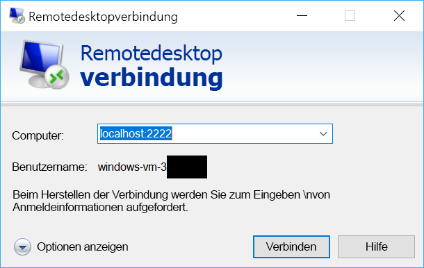

# <a name="quickstart-sshrdp-over-iot-hub-device-streams-using-nodejs-proxy-application-preview"></a>Schnellstart: SSH/RDP über IoT Hub-Gerätestreams unter Verwendung einer Node.js-Proxyanwendung (Vorschauversion)

[!INCLUDE [iot-hub-quickstarts-4-selector](../../includes/iot-hub-quickstarts-4-selector.md)]

Über [IoT Hub-Gerätestreams](./iot-hub-device-streams-overview.md) können Dienst- und Geräteanwendungen sicher und firewallfreundlich kommunizieren. In dieser Schnellstartanleitung erfahren Sie, wie Sie eine serverseitig ausgeführte Node.js-Proxyanwendung ausführen, sodass SSH- und RDP-Datenverkehr über einen Gerätestream an das Gerät gesendet werden kann. Eine entsprechende Übersicht finden Sie auf [dieser Seite](./iot-hub-device-streams-overview.md#local-proxy-sample-for-ssh-or-rdp). Während der Public Preview-Phase unterstützt das Node.js SDK nur dienstseitige Gerätestreams. Aus diesem Grund wird in dieser Schnellstartanleitung nur das Ausführen des dienstseitigen Proxys erläutert. Es empfiehlt sich, auch einen entsprechenden geräteseitigen Proxy auszuführen (verfügbar in der Schnellstartanleitung für [C](./quickstart-device-streams-proxy-c.md) oder [C#](./quickstart-device-streams-proxy-csharp.md)).

Als Erstes wird die Einrichtung für SSH (unter Verwendung des Ports `22`) beschrieben. Danach erfahren Sie, wie Sie das Setup für RDP (Port 3389) ändern. Gerätestreams sind anwendungs- und protokollunabhängig. Das gleiche Beispiel kann daher für andere Arten von Anwendungsdatenverkehr angepasst werden (in der Regel durch Ändern der Kommunikationsports).

Der Code veranschaulicht die Initiierung und Verwendung eines Gerätestreams und kann auch für anderen Anwendungsdatenverkehr (nicht RDP oder SSH) genutzt werden.

[!INCLUDE [cloud-shell-try-it.md](../../includes/cloud-shell-try-it.md)]

Wenn Sie kein Azure-Abonnement besitzen, können Sie ein [kostenloses Konto](https://azure.microsoft.com/free/?WT.mc_id=A261C142F) erstellen, bevor Sie beginnen.


## <a name="prerequisites"></a>Voraussetzungen

Auf Ihrem Entwicklungscomputer muss sich mindestens Node.js v4.x.x befinden, um die dienstseitige Anwendung in dieser Schnellstartanleitung ausführen zu können.

Sie können Node.js für mehrere Plattformen von [nodejs.org](https://nodejs.org) herunterladen.

Mit dem folgenden Befehl können Sie die aktuelle Node.js-Version auf Ihrem Entwicklungscomputer überprüfen:

```
node --version
```

Laden Sie das Node.js-Beispielprojekt von https://github.com/Azure-Samples/azure-iot-samples-node/archive/streams-preview.zip herunter, und extrahieren Sie das ZIP-Archiv (falls Sie dies nicht bereits getan haben).


## <a name="create-an-iot-hub"></a>Erstellen eines IoT Hubs

Wenn Sie das vorherige Tutorial [Schnellstart: Senden von Telemetriedaten von einem Gerät an eine IoT Hub-Instanz und Lesen der Telemetriedaten aus der IoT Hub-Instanz mit einer Back-End-Anwendung (Node.js)](quickstart-send-telemetry-node.md) absolviert haben, können Sie diesen Schritt überspringen.

[!INCLUDE [iot-hub-include-create-hub](../../includes/iot-hub-include-create-hub-device-streams.md)]


## <a name="register-a-device"></a>Registrieren eines Geräts

Wenn Sie das vorherige Tutorial [Schnellstart: Senden von Telemetriedaten von einem Gerät an eine IoT Hub-Instanz und Lesen der Telemetriedaten aus der IoT Hub-Instanz mit einer Back-End-Anwendung (Node.js)](quickstart-send-telemetry-node.md) absolviert haben, können Sie diesen Schritt überspringen.

Ein Gerät muss bei Ihrer IoT Hub-Instanz registriert sein, um eine Verbindung herstellen zu können. In dieser Schnellstartanleitung verwenden Sie Azure Cloud Shell, um ein simuliertes Gerät zu registrieren.

1. Führen Sie die folgenden Befehle in Azure Cloud Shell aus, um die IoT Hub-CLI-Erweiterung hinzuzufügen und die Geräteidentität zu erstellen. 

   **YourIoTHubName**: Ersetzen Sie diesen Platzhalter unten durch den Namen, den Sie für Ihren IoT-Hub ausgewählt haben.

   **MyDevice**: Der für das registrierte Gerät angegebene Name. Verwenden Sie „MyDevice“ wie gezeigt. Wenn Sie für Ihr Gerät einen anderen Namen wählen, müssen Sie diesen innerhalb des gesamten Artikels verwenden und den Gerätenamen in den Beispielanwendungen aktualisieren, bevor Sie sie ausführen.

    ```azurecli-interactive
    az extension add --name azure-cli-iot-ext
    az iot hub device-identity create --hub-name YourIoTHubName --device-id MyDevice
    ```

2. Darüber hinaus benötigen Sie eine _Dienstverbindungszeichenfolge_, damit die Back-End-Anwendung eine Verbindung mit Ihrer IoT Hub-Instanz herstellen und die Nachrichten abrufen kann. Der folgende Befehl ruft die Dienstverbindungszeichenfolge für Ihre IoT Hub-Instanz ab:

    **YourIoTHubName**: Ersetzen Sie diesen Platzhalter unten durch den Namen, den Sie für Ihren IoT-Hub ausgewählt haben.

    ```azurecli-interactive
    az iot hub show-connection-string --policy-name service --hub-name YourIoTHubName
    ```

    Notieren Sie sich den zurückgegebenen Wert, der in etwa wie folgt aussieht:

   `"HostName={YourIoTHubName}.azure-devices.net;SharedAccessKeyName=service;SharedAccessKey={YourSharedAccessKey}"`


## <a name="ssh-to-a-device-via-device-streams"></a>Herstellen einer SSH-Verbindung mit einem Gerät über Gerätestreams

### <a name="run-the-device-side-proxy"></a>Ausführen des geräteseitigen Proxys

Wie bereits erwähnt, unterstützt das IoT Hub Node.js SDK während der Public Preview-Phase nur dienstseitige Gerätestreams. Verwenden Sie als geräteseitige Anwendung die entsprechenden Geräteproxyprogramme aus der Anleitung für [C](./quickstart-device-streams-proxy-c.md) oder [C#](./quickstart-device-streams-proxy-csharp.md). Vergewissern Sie sich, dass der geräteseitige Proxy ausgeführt wird, bevor Sie mit dem nächsten Schritt fortfahren.


### <a name="run-the-service-side-proxy"></a>Ausführen des dienstseitigen Proxys

Nachdem Sie sich vergewissert haben, dass der geräteseitige Proxy ausgeführt wird, gehen Sie wie folgt vor, um den dienstseitigen, in Node.js geschriebenen Proxy auszuführen:

- Geben Sie Ihre Dienstanmeldeinformationen, die ID des Zielgeräts, auf dem der SSH-Daemon ausgeführt wird, und die Portnummer für den auf dem Gerät ausgeführten Proxy als Umgebungsvariablen ein.
```
  # In Linux
  export IOTHUB_CONNECTION_STRING="<provide_your_service_connection_string>"
  export STREAMING_TARGET_DEVICE="MyDevice"
  export PROXY_PORT=2222

  # In Windows
  SET IOTHUB_CONNECTION_STRING=<provide_your_service_connection_string>
  SET STREAMING_TARGET_DEVICE=MyDevice
  SET PROXY_PORT=2222
```
Ändern Sie `MyDevice` in die Geräte-ID, die Sie für Ihr Gerät gewählt haben.

- Navigieren Sie in Ihrem entzippten Projektordner zu `Quickstarts/device-streams-service`, und führen Sie den lokalen Dienstproxy aus.
```
  cd azure-iot-samples-node-streams-preview/iot-hub/Quickstarts/device-streams-service

  # Install the preview service SDK, and other dependencies
  npm install azure-iothub@streams-preview
  npm install

  # Run the service-local proxy application
  node proxy.js
```

### <a name="ssh-to-your-device-via-device-streams"></a>Herstellen einer SSH-Verbindung mit Ihrem Gerät über Gerätestreams
Verwenden Sie unter Linux `ssh $USER@localhost -p 2222` in einem Terminal, um SSH auszuführen. Verwenden Sie unter Windows Ihren bevorzugten SSH-Client (beispielsweise PuTTY).

Im Anschluss sehen Sie die dienstseitige Konsolenausgabe nach Einrichtung der SSH-Sitzung. (Der lokale Dienstproxy lauscht am Port 2222.) 


Im Anschluss sehen Sie die Konsolenausgabe des SSH-Clientprogramms. (Der SSH-Client kommuniziert mit dem SSH-Daemon, indem er eine Verbindung mit dem Port <code>22</code> herstellt, an dem der lokale Dienstproxy lauscht.) 


### <a name="rdp-to-your-device-via-device-streams"></a>Herstellen einer RDP-Verbindung mit Ihrem Gerät über Gerätestreams

Stellen Sie nun mithilfe Ihres RDP-Clientprogramms eine Verbindung mit dem Dienstproxy am Port 2222 her. (Hierbei handelt es sich um einen verfügbaren Port, den Sie zuvor willkürlich ausgewählt haben.)

> [!NOTE]
> Vergewissern Sie sich, dass Ihr Geräteproxy ordnungsgemäß für RDP sowie mit dem RDP-Port 3389 konfiguriert ist.




## <a name="clean-up-resources"></a>Bereinigen von Ressourcen

[!INCLUDE [iot-hub-quickstarts-clean-up-resources](../../includes/iot-hub-quickstarts-clean-up-resources-device-streams.md)]

## <a name="next-steps"></a>Nächste Schritte

In dieser Schnellstartanleitung haben Sie einen IoT-Hub eingerichtet, ein Gerät registriert und ein Dienstproxyprogramm bereitgestellt, um RDP- und SSH-Verbindungen mit einem IoT-Gerät zu ermöglichen. RDP- und SSH-Datenverkehr wird über einen Gerätestream über IoT Hub getunnelt. Dadurch ist keine direkte Verbindung mit dem Gerät erforderlich.

Weitere Informationen zu Gerätestreams finden Sie hier:

> [!div class="nextstepaction"]
> [IoT Hub-Gerätestreams (Vorschau)](./iot-hub-device-streams-overview.md)
