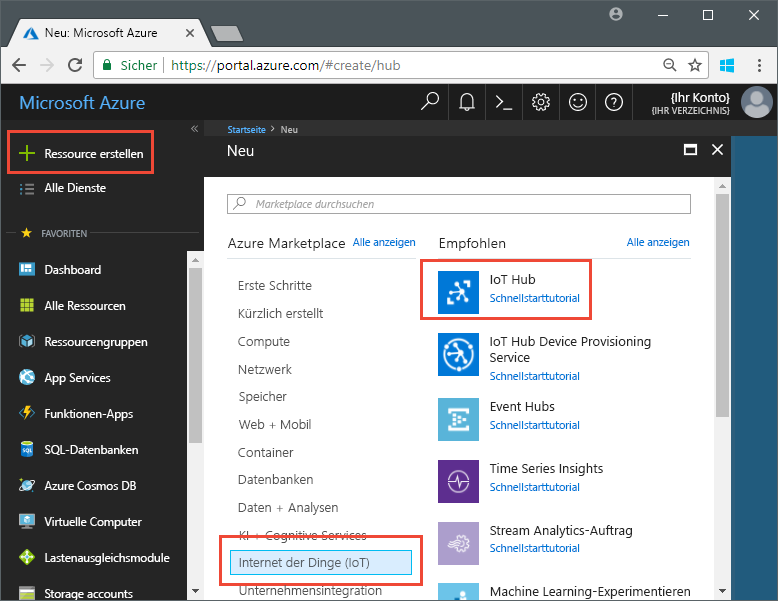
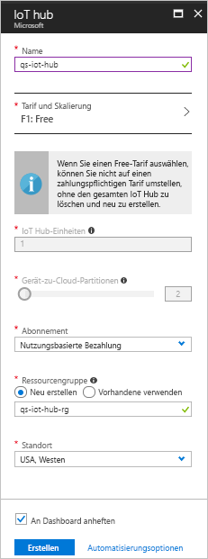

# <a name="send-telemetry-from-a-device-to-an-iot-hub-swift"></a>Senden von Telemetriedaten von einem Gerät an eine IoT Hub-Instanz (Swift)

IoT Hub ist ein Azure-Dienst, mit dem Sie umfangreiche Telemetriedaten von Ihren Geräten in der Cloud erfassen können, um sie zu speichern oder zu verarbeiten. In diesem Artikel senden Sie Telemetriedaten von einer simulierten Geräteanwendung an IoT Hub. Die Daten können dann über eine Back-End-Anwendung angezeigt werden. 

In diesem Artikel wird eine vorgefertigte Swift-Anwendung verwendet, um die Telemetriedaten zu senden. Zum Lesen aus IoT Hub wird ein CLI-Programm verwendet. 

[!INCLUDE [cloud-shell-try-it.md](../../includes/cloud-shell-try-it.md)]

Wenn Sie kein Azure-Abonnement besitzen, können Sie ein [kostenloses Konto](https://azure.microsoft.com/free/?WT.mc_id=A261C142F) erstellen, bevor Sie beginnen.

## <a name="prerequisites"></a>Voraussetzungen

- Laden Sie das Codebeispiel aus den [Azure-Beispielen](https://github.com/Azure-Samples/azure-iot-samples-ios/archive/master.zip) herunter. 
- Die neueste Version von [XCode](https://developer.apple.com/xcode/) mit der neuesten Version des iOS SDKs. Diese Schnellstartanleitung wurde mit Xcode 9.3 und iOS 11.3 getestet.
- Die neueste Version von [CocoaPods](https://guides.cocoapods.org/using/getting-started.html).
- Das CLI-Hilfsprogramm „iothub-explorer“ zum Lesen von Telemetriedaten aus IoT Hub. Installieren Sie zunächst [Node.js](https://nodejs.org) (mindestens Version 4.x.x), und führen Sie dann den folgenden Befehl aus: 

   ```sh
   sudo npm install -g iothub-explorer
   ```

## <a name="create-an-iot-hub"></a>Erstellen eines IoT Hubs

Im ersten Schritt wird über das Azure-Portal eine IoT Hub-Instanz in Ihrem Abonnement erstellt. Mit der IoT Hub-Instanz können umfangreiche Telemetriedaten von zahlreichen Geräten in der Cloud erfasst werden. Diese Telemetriedaten können dann von in der Cloud ausgeführten Back-End-Diensten gelesen und verarbeitet werden.

1. Melden Sie sich beim [Azure-Portal](http://portal.azure.com)an.

1. Wählen Sie **Ressource erstellen** > **Internet der Dinge (IoT)** > **IoT Hub** aus. 

   

1. Erstellen Sie Ihre IoT Hub-Instanz mit den Werten aus der folgenden Tabelle:

    | Einstellung | Wert |
    | ------- | ----- |
    | NAME | Ein eindeutiger Name für Ihren Hub. |
    | Tarif und Skalierung | F1 Free |
    | IoT Hub-Einheiten | 1 |
    | Gerät-zu-Cloud-Partitionen | Zwei Partitionen |
    | Abonnement | Ihr Azure-Abonnement. |
    | Ressourcengruppe | Erstellen Sie eine neue Ressourcengruppe. Geben Sie einen Namen für Ihre Ressourcengruppe ein. |
    | Speicherort | Der Standort, der Ihnen am nächsten ist. |
    | An Dashboard anheften | Ja |

1. Klicken Sie auf **Create**.  

   

1. Notieren Sie sich den IoT Hub-Namen und den Ressourcengruppennamen. Diese Werte werden später noch benötigt.

## <a name="register-a-device"></a>Registrieren eines Geräts

Ein Gerät muss bei Ihrer IoT Hub-Instanz registriert sein, um eine Verbindung herstellen zu können. In dieser Schnellstartanleitung verwenden Sie die Azure-Befehlszeilenschnittstelle, um ein simuliertes Gerät zu registrieren.

1. Fügen Sie die IoT Hub-CLI-Erweiterung hinzu, und erstellen Sie die Geräteidentität. Ersetzen Sie `{YourIoTHubName}` durch einen Namen für Ihre IoT Hub-Instanz:

   ```azurecli-interactive
   az extension add --name azure-cli-iot-ext
   az iot hub device-identity create --hub-name {YourIoTHubName} --device-id myiOSdevice
   ```

    Wenn Sie einen anderen Namen für Ihr Gerät auswählen, aktualisieren Sie den Gerätenamen in den Beispielanwendungen, bevor sie ausgeführt werden.

1. Führen Sie den folgenden Befehl aus, um die _Geräteverbindungszeichenfolge_ für das soeben registrierte Gerät abzurufen:

   ```azurecli-interactive
   az iot hub device-identity show-connection-string --hub-name {YourIoTHubName} --device-id myiOSdevice --output table
   ```

   Notieren Sie sich die Geräteverbindungszeichenfolge (`Hostname=...=`). Dieser Wert wird später noch benötigt.

1. Darüber hinaus benötigen Sie eine _Dienstverbindungszeichenfolge_, damit Back-End-Anwendungen eine Verbindung mit Ihrer IoT Hub-Instanz herstellen und Gerät-zu-Cloud-Nachrichten abrufen können. Der folgende Befehl ruft die Dienstverbindungszeichenfolge für Ihre IoT Hub-Instanz ab:

   ```azurecli-interactive
   az iot hub show-connection-string --hub-name {YourIoTHubName} --output table
   ```

   Notieren Sie sich die Dienstverbindungszeichenfolge (`Hostname=...=`). Dieser Wert wird später noch benötigt.

## <a name="send-simulated-telemetry"></a>Senden simulierter Telemetriedaten

Die Beispielanwendung wird auf einem iOS-Gerät ausgeführt, das eine Verbindung mit einem gerätespezifischen Endpunkt in Ihrer IoT Hub-Instanz herstellt und simulierte Telemetriedaten für Temperatur und Luftfeuchtigkeit sendet. 

### <a name="install-cocoapods"></a>Installieren von CocoaPods

CocoaPods verwalten Abhängigkeiten für iOS-Projekte, die Bibliotheken von Drittanbietern verwenden.

Navigieren Sie in einem Terminalfenster zum Ordner „Azure-IoT-Samples-iOS“, den Sie im Rahmen der Vorbereitung heruntergeladen haben. Navigieren Sie dann zum Beispielprojekt:

```sh
cd quickstart/sample-device
```

Vergewissern Sie sich, dass Xcode geschlossen ist, und führen Sie den folgenden Befehl aus, um die in der Datei **Podfile** deklarierten CocoaPods zu installieren:

```sh
pod install
```

Der Installationsbefehl installiert nicht nur die erforderlichen Pods für Ihr Projekt, sondern erstellt auch eine Xcode-Arbeitsbereichsdatei, die bereits zur Verwendung der Pods für Abhängigkeiten konfiguriert ist. 

### <a name="run-the-sample-application"></a>Ausführen der Beispielanwendung 

1. Öffnen Sie den Beispielarbeitsbereich in Xcode.

   ```sh
   open "MQTT Client Sample.xcworkspace"
   ```

2. Erweitern Sie das Projekt **MQTT Client Sample** und anschließend den Ordner mit dem gleichen Namen.  
3. Öffnen Sie **ViewController.swift** zur Bearbeitung in XCode. 
4. Suchen Sie nach der Variablen **connectionString**, und aktualisieren Sie den Wert mit der zuvor notierten Geräteverbindungszeichenfolge.
5. Speichern Sie die Änderungen. 
6. Klicken Sie auf die Schaltfläche **Erstellen und Ausführen**, oder drücken Sie die Tastenkombination **BEFEHL+R**, um das Projekt im Geräteemulator auszuführen. 

   

7. Klicken Sie in der im Emulator geöffneten Beispiel-App auf **Starten**.

Der folgende Screenshot zeigt einige Beispielausgaben, während die Anwendung simulierte Telemetriedaten an Ihre IoT Hub-Instanz sendet:

   

## <a name="read-the-telemetry-from-your-hub"></a>Lesen der Telemetriedaten aus Ihrem Hub

Die Beispiel-App, die Sie im XCode-Emulator ausgeführt haben, zeigt Daten zu Nachrichten, die vom Gerät gesendet wurden. Die eingehenden Daten können auch über die IoT Hub-Instanz angezeigt werden. Das CLI-Hilfsprogramm `iothub-explorer` stellt eine Verbindung mit dem dienstseitigen Endpunkt **Events** in Ihrer IoT Hub-Instanz her. 

Öffnen Sie ein neues Terminalfenster. Führen Sie den folgenden Befehl aus, und ersetzen Sie dabei „{your hub service connection string}“ durch die Dienstverbindungszeichenfolge, die Sie am Anfang dieses Artikels abgerufen haben:

```sh
iothub-explorer monitor-events myiOSdevice --login "{your hub service connection string}"
```

Der folgende Screenshot zeigt die Art von Telemetriedaten, die in Ihrem Terminalfenster angezeigt werden:


Sollte beim Ausführen des Befehls „iothub-explorer“ ein Fehler auftreten, vergewissern Sie sich, dass Sie die *Dienstverbindungszeichenfolge* für Ihre IoT Hub-Instanz verwenden und nicht die *Geräteverbindungszeichenfolge* für Ihr IoT-Gerät. Beide Verbindungszeichenfolgen beginnen zwar mit **Hostname={iothubname}**, die Dienstverbindungszeichenfolge enthält jedoch die Eigenschaft **SharedAccessKeyName**, während die Geräteverbindungszeichenfolge **DeviceID** enthält. 

## <a name="clean-up-resources"></a>Bereinigen von Ressourcen

Wenn Sie IoT Hub im Rahmen weiterer Artikel testen möchten, behalten Sie die Ressourcengruppe und die IoT Hub-Instanz zur weiteren Verwendung.

Falls Sie die IoT Hub-Instanz nicht mehr benötigen, löschen Sie die Ressourcengruppe über das Portal. Wählen Sie hierzu die Ressourcengruppe mit Ihrer IoT Hub-Instanz aus, und klicken Sie auf **Löschen**.

## <a name="next-steps"></a>Nächste Schritte

In diesem Artikel haben Sie eine IoT Hub-Instanz eingerichtet sowie simulierte Telemetriedaten eines iOS-Geräts an den Hub gesendet und vom Hub gelesen. 

Weitere Informationen zur Verwendung von IoT Hub durch iOS-Geräte finden Sie unter [Send cloud-to-device messages with IoT Hub (iOS)](iot-hub-ios-swift-c2d.md) (Senden von Cloud-zu-Gerät-Nachrichten mit IoT Hub (iOS)).

<!-- Links -->
[lnk-process-d2c-tutorial]: iot-hub-csharp-csharp-process-d2c.md
[lnk-device-management]: iot-hub-node-node-device-management-get-started.md
[lnk-iot-edge]: ../iot-edge/tutorial-simulate-device-linux.md
[lnk-connect-device]: https://azure.microsoft.com/develop/iot/
